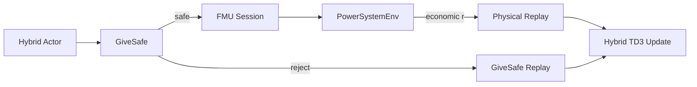

# 风光火储综合能源系统 · FMU + RL 优化 Demo

基于 **Modelica/FMU 物理仿真** 与 **Hybrid-GiveSafe-TD3** 的电力系统调度强化学习示例仓库。  
FMU 负责火电、电池、CAES（压缩空气储能）与风光荷的一小时步物理演化；Python 侧负责混合动作空间、动态可行域、GiveSafe 安全过滤与经济奖励。

> CAES 合法指令是非凸集合（放电 / 待机 / 充电三段），普通连续 Box + 标准 SB3 TD3 **不能**作为正式训练路径；正式算法见 `src/training/hybrid_td3/`。

---

## 功能概览

- **物理层**：FMI 3.0 Co-Simulation（`fmpy`），固定步长默认 3600 s
- **环境**：Gymnasium，`PowerSystemEnv`，Dict 混合动作 + 可选 24 h 日前 forecast 观测
- **安全**：GiveSafe（一级 FeasibilityOracle + 可选 Shadow FMU），禁止规则 fallback
- **训练**：Hybrid-TD3，Physical / GiveSafe 分区 replay 混合采样
- **基线**：规则控制器（高火电 + 储能 IDLE）与随机可行采样

---

## 目录结构

```text
demo_optimization/
├── data/                      # FMU、风光负荷/环境 CSV
├── docs/                      # 输入边界、奖励、数据等说明
├── scripts/                   # CLI：训练、评估、标定、探查
├── src/
│   ├── actions/               # 混合动作、解码、可行域 Oracle
│   ├── config/                # YAML：环境 / 奖励 / GiveSafe / 设备参数
│   ├── controllers/           # 规则基线
│   ├── envs/                  # PowerSystemEnv、reward、forecast
│   ├── fmu/                   # FMI 会话、校验、变量注册
│   ├── replay/                # Physical + GiveSafe 分区 buffer
│   ├── safety/                # GiveSafe 控制器与 Shadow FMU
│   └── training/              # Hybrid-TD3、评估（legacy Box TD3 已禁用）
├── tests/                     # pytest
├── requirements.txt
└── README.md
```

本地运行产物默认落在 `runs/`（已在 `.gitignore`）。

---

## 环境与依赖

- **Python**：建议 3.10+
- **平台**：仓库自带的 `.fmu` 需包含当前 OS 原生二进制（Windows 为 `.dll`）。在无对应二进制的机器上会直接报错。
- **安装**（仓库根目录）：

```bash
python -m venv .venv
# Windows
.venv\Scripts\activate
# Linux/macOS
# source .venv/bin/activate

pip install -r requirements.txt
```

多数脚本会把 `src/` 加入 `sys.path`；交互调试时可设置：

```bash
# Windows PowerShell
$env:PYTHONPATH = "src"
# Linux/macOS
export PYTHONPATH=src
```

---

## 快速开始

以下命令均在**仓库根目录**执行。

### 1. 检查 FMU 接口

```bash
python scripts/inspect_fmu.py
```

### 2. 环境 smoke（reset + 规则一步）

```bash
# 需能 import envs（脚本未插 path 时请先设 PYTHONPATH=src）
$env:PYTHONPATH = "src"   # PowerShell
python scripts/smoke_test_env.py
```

### 3. 规则基线滚一周

```bash
python scripts/rollout_rule_controller.py
```

轨迹与摘要写入 `runs/rule_controller/`。

### 4. 基线对比（规则 vs 随机可行）

```bash
python scripts/evaluate_baselines.py
```

### 5. Hybrid-GiveSafe-TD3 训练

```bash
# smoke：短跑通路径（默认约 5k valid steps）
python scripts/train_hybrid_td3.py --mode smoke

# short / formal：加长训练；可选全年评估（较慢）
python scripts/train_hybrid_td3.py --mode short --seed 0
python scripts/train_hybrid_td3.py --mode formal --annual-eval

# 关闭 Shadow FMU（仅保留 Oracle 一级检查）
python scripts/train_hybrid_td3.py --mode smoke --no-shadow

# 关闭 CSV 前瞻观测（便于消融）
python scripts/train_hybrid_td3.py --mode smoke --no-forecast
```

常用参数：`--steps`、`--run-dir`、`--seed`。结果默认在 `runs/`。

### 6. 测试

```bash
$env:PYTHONPATH = "src"
pytest tests/ -q
```

---

## 配置指针

| 文件 | 作用 |
|------|------|
| [`src/config/env_config.yaml`](src/config/env_config.yaml) | FMU 路径、步长、episode 长度、动作/观测清单、forecast CSV |
| [`src/config/reward_config.yaml`](src/config/reward_config.yaml) | 电价、火电成本、`C_ref`、终端 SOC bonus |
| [`src/config/givesafe_config.yaml`](src/config/givesafe_config.yaml) | GiveSafe 重采样次数、约束奖励、replay 混合比例（约 70/30） |
| [`src/config/device_params.yaml`](src/config/device_params.yaml) | 设备物理参数（Oracle / 预测） |
| [`src/config/feasibility_margins.yaml`](src/config/feasibility_margins.yaml) | 可行域裕度（可标定） |

更细的文档：

- [docs/FMU输入上下限.md](docs/FMU输入上下限.md) — `u_tp` / `u_battery` / `u_caes` 边界
- [docs/RL奖励于成本配置.md](docs/RL奖励于成本配置.md) — 经济奖励与 GiveSafe 约束奖励路径
- [docs/风光负荷数据说明.md](docs/风光负荷数据说明.md) — `data/*.csv` 字段与单位
- [docs/修改modelica模型.md](docs/修改modelica模型.md) — 改 Modelica / 重导 FMU 时注意点

---

## 架构与数据流

```text
策略 HybridAction (u_tp, u_battery, caes_mode, magnitude)
        │
        ▼
   Decoder ──► PhysicalFmuAction {u_tp, u_battery, u_caes}
        │
        ▼
 GiveSafeController ──► Oracle 预检 (+ 可选 Shadow FMU)
        │ 安全
        ▼
   FmuAdapter / FmuSession ── doStep(3600s) ──► 物理输出
        │
        ├── 合法物理步 → RewardCalculator → PhysicalReplay（经济）
        └── 拒绝 / 硬失败 → 约束奖励或 truncated，不进经济 buffer
```

要点：

1. **FMU 是真值**：风光荷边界由模型内嵌时序驱动；`data/*.csv` 只扩展策略观测（完美日前），不是替代物理源。
2. **动作不静默投影**：越界或禁模态直接失败；Decoder 只做模式→区间的显式映射。
3. **奖励三条路径**：物理经济步 / GiveSafe 拒绝自环 / 环境硬失败（详见奖励文档）。



---

## 注意事项

- **FMU 路径**：默认 `data/TypicalScensrio_Example_TypicalScene_PowerSystem_8760h.fmu`（文件名拼写沿用现有产物）。更换模型需同步 `env_config` 变量名与边界文档。
- **Windows**：需 FMU 内含 Windows 二进制；解压目录由 `fmpy.extract` 管理，`close()` 时清理。
- **遗留 TD3**：`src/training/train_td3.py` 故意 fail-fast，勿再接入正式流程。
- **时长**：`episode_steps: 168`（一周）；`--annual-eval` 覆盖 8760 h，耗时显著增加。
- **标定脚本**：`scripts/calibrate_reward*.py`、`calibrate_feasibility_margins.py` 会改写配置或生成报告，正式训练前请确认 `reward_config` 中 `cost_reference` / `terminal_soc` 已就绪。

---

## 许可与归属

本仓库为综合能源调度 RL 演示与研究代码。Modelica 源与 FMU 导出流程以 `docs/` 为准。
