# A market feedback framework for improved estimates of the arbitrage value of energy storage using price-taker models

Michael Ikechi Emmanuel , Paul Denholm

National Renewable Energy Laboratory, Golden, CO, United States

## H I G H L I G H T S

• A modified price-taker (PT) model with a market feedback function is presented.

• A data-driven predictive analytic is integrated with a PT model to assess the value of energy storage.

• A tuned gradient boosting regressor is used to predict prices from the previous net load as storage ratio increases.

• Causes of the suppression of electricity price differentials with increasing storage ratio are investigated

## A R T I C L E I N F O

Keywords: Arbitrage Price-taker model Gradient boosting regressor Electricity price suppression Energy storage

## A B S T R A C T

Price-taker (PT) models are often used to assess the potential value or revenue of energy arbitrage opportunities for energy storage in wholesale markets. But as greater amounts of energy storage are deployed on the grid, current PT models fail to predict the effects that energy storage itself can have on market prices. This can lead to an overestimation of the economic value of storage and an inability to capture price suppression. In this paper, we propose the use of a modified PT model to simulate the impact of increased storage deployment on energy prices and the resulting impact on revenue. Our method uses a gradient-boosting regressor to estimate the impact on prices, and we apply our method on historical price data from the PJM and California Independent System Operator wholesale markets. We use this approach to explore possible causes of electricity price suppression that occur from storage capacity additions, which is generally not possible with PT models.

## 1. Introduction

The declining costs of storage technologies and the emergence of wholesale electricity prices, among other factors, have contributed to increasing deployments of storage technologies on power systems around the world. Energy storage can provide several grid benefits, including the provision of firm capacity, load leveling, and ancillary services. The value of load leveling/energy arbitrage in particular is driven by the differences in energy prices and the ability of energy storage to charge (buy) during periods of low electricity prices and discharge (sell) when prices are high [1,2,3,4].

The economic value of energy storage and its respective modeling approach depend on the stakeholder and type of application. Tradi tionally, there are two main approaches used to estimate the performance and value of energy storage systems. One approach is the pricetaker (PT) model, which can model some aspects of storage in great detail [5] but cannot capture system-level details, such as transmission and other grid constraints. Further, PT models assume that any energy storage installation is marginal compared to the entire power system capacity and therefore cannot affect market prices [6]. As a result, PT models do not capture the impact of storage dispatch on electricity prices, and they ignore market elasticity and price suppression caused by storage deployment. PT models take electricity prices as exogenous inputs and typically do not modify them. An alternative approach is the production cost model (PCM), which can model large power systems but is very computationally complex and expensive. Despite their complexity, PCMs have shortcomings in their ability to model the detailed performance of individual plants or to examine the impact of relatively small changes in a large system [7].

The extant literature has used PT models to estimate the arbitrage value of storage, often without considering the impact of storage dispatch on market prices. For example, Walawalkar et al. [8] used a PT model to investigate the economics of energy storage technologies for arbitrage and regulation, demonstrating that charging efficiency and regional differences in value impact the economics of energy storage in a competitive electricity market. Bradbury et al. [9] used a linear opti mization to find the energy storage power and energy capacities that can maximize the internal rate of return when used to arbitrage electricity prices and considered factors including round-trip efficiency and self discharge.

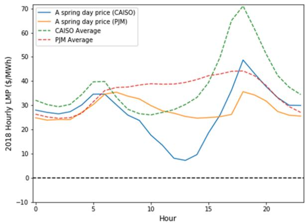

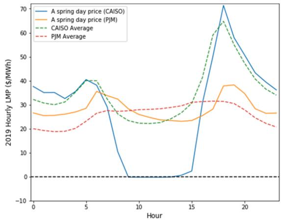  
Fig. 1. Hourly prices (annual average and a spring day, March 17) for PJM and CAISO in 2018 and 2019.

There are many other examples of the application of PT models to storage in different parts of the United States, including PJM [10,11] and California [12,13], and in other regions, such as Iberia [14] and Poland [15]. PT models have also been used to examine differences in value between day-ahead and real-time markets [11,12], and more recently they have been applied to hybrid energy systems, such as photovoltaics with battery storge [16]. Although this combined research has advanced the literature on the value of storage, it does not overcome the main limitations of PT models. The assumption that such storage deployment is marginal and therefore cannot affect electricity prices can lead to an overestimation of storage’s value.

Very few studies have attempted to account for the impact of storage operation on electricity prices. For example, He et al. [17] introduced a “market resilience” factor, which indicates the price change because of an increase in supply or demand offered on the market; however, market resilience or price elasticity deteriorates with negative prices caused by overgeneration and low consumption patterns, as seen in markets such as the California Independent System Operator (CAISO). Sioshansi et al. [18] analyzed the impact of a large-scale storage operation on prices assuming a linear, nondecreasing price-load relationship; however, price relationships are not always linear. Because most PT models do not consider the impacts of energy storage dispatch on market prices, analyses that use these models could overestimate the arbitrage value of storage, particularly for increased deployment.

This paper proposes a novel approach to estimate the change in the value of energy storage with increased deployment. We first develop a data-driven predictive model to estimate the relationship between prices and net loads1. We then modify a PT model to estimate the impact on net loads and the changes in electricity prices resulting from storage deployment. This includes the suppression of on-peak prices due to discharging and increases in off-peak prices due to charging. This combined model is then iteratively solved to estimate changes in prices, storage dispatch patterns, and, ultimately, changes in the economic value of storage as a function of deployment. By enhancing the capabilities of traditional PT models, this approach could allow developers and grid planners to gain greater insights into the impacts of storage deployment on value in the evolving grid without requiring far more computationally complex PCMs.

The remainder of this paper is organized as follows: Section 2 provides background on regional price-load relationships, which forms the basis of the opportunities for energy arbitrage and provides the data source for this study. Section 3 introduces our proposed approach, which involves a machine learning-based predictive analytics method to establish price-load relationships, which we use to predict prices based on net load from storage dispatch operations and system load. Section 4 then uses this approach in a case study to examine changes in electricity price differentials that can occur when storage capacity is added to the system, which is generally not possible with traditional PT models. Section 5 summarizes our method and results and suggests refinements that could improve estimations of storage value using PT-based methods.

## 2. Background on regional electricity markets and energy prices

In the United States, approximately two-thirds of electricity demand is served in regions with wholesale electricity markets, operated by regional transmission organizations (RTOs) and independent system operators (ISOs) [19]. This article considers the PJM and CAISO markets in the Eastern and Western interconnections, respectively. PJM is the largest electricity market in North America [20], whereas CAISO has the largest solar deployment and significant storage deployment [21].

In this work, we evaluate the value of storage in an energy arbitrage application using day-ahead energy market prices. Energy arbitrage or time-shifting applications attempt to obtain net revenue by buying energy (charging) during periods with low energy prices and selling (discharging) the stored energy during intervals with high prices. Positive net revenue will occur if the price difference is high enough to offset the variable costs associated with the charge/discharge cycle, including round-trip efficiency losses [22].

Note that energy time shifting (arbitrage) is only one value stream produced by storage, and in some cases, it might be less than the value of capacity. Electricity markets in the United States have a variety of mechanisms to incentivize investment in new capacity [19,23]. PJM operates a capacity market with periodic auctions—typically on an annual basis. California does not use a capacity market but instead requires load-serving entities to demonstrate they have sufficient capacity to meet peak demand under a resource adequacy market. Alternatively, the Electric Reliability Council of Texas relies entirely on an energy-only market to incentivize new capacity via scarcity pricing. The degree to which scarcity pricing is allowed by market operators and regulators strongly influences peak energy prices and therefore arbitrage oppor tunities. Thus, the results of any arbitrage analysis are inherently incomplete; however, they do provide insight into this important revenue stream.

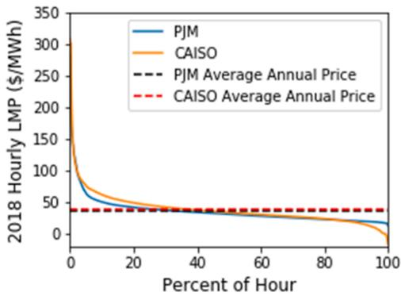

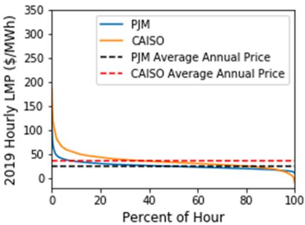  
Fig. 2. Price duration curves and average annual prices for PJM and CAISO in 2018 and 2019.

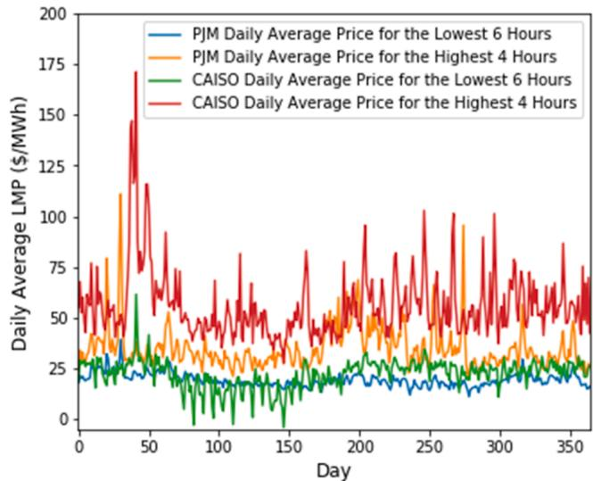  
Fig. 3. Daily average LMP for the highest 4 h and the lowest 6 h in 2019.

All U.S. ISO/RTO regions report historical marginal price data, defined as locational marginal prices (LMPs), which consist of energy, loss, and congestion components. These prices vary as a function of time of day and season, driven largely by the demand for electricity, fuel prices, and system resources [24]. These prices have been impacted in some locations by the increasing deployment of variable renewable energy (VRE), such as solar and wind, leading to changes in the time-of day and seasonal price patterns. Because VRE has near zero variable costs, it tends to reduce prices during periods of significant generation. This can lead to negative prices caused by negative bidding by wind to take advantage of the investment tax credit or by solar because of regional policies or other incentives [25]. Fig. 1 shows the hourly average prices for PJM and CAISO in 2018 and 2019 as well as a spring day, March 17, 2018 and 2019, for both markets [26,27]. The overall average in the CAISO plots for both years shows the impact of solar deployment reducing prices during the middle of the day, with a spring day shown as an example of the significant price suppression effect that can occur. The more limited contribution of VRE in PJM shows less impact than in CAISO.

The price duration curves and average annual prices for PJM and CAISO are shown in Fig. 2. The annual average price is higher in CAISO, \$38.4/MWh and \$35.4/MWh, than in PJM, \$35.4/MWh and \$25.9/ MWh, in 2018 and 2019, respectively.

More important than annual trends are the shorter-term trends and volatility that drive the value of energy arbitrage. Fig. 3 shows the daily average prices for the highest-priced 4 h and lowest-priced 6 h of the day across the entire year. While used only to illustrate price volatility, we use a longer low-price period to reflect that charging requires more hours than discharging to account for storage losses. The daily average price during the highest-priced 4 h is consistently higher in CAISO than in PJM, whereas for the lowest-priced 6 h, PJM prices are higher than CAISO prices during the spring days, likely caused by high VRE relative to load in CAISO.

Prices are strongly correlated with load. Fig. 4 and Fig. 5 show the hourly price and load relationship profiles for PJM and CAISO, respectively, during 3-day periods in the winter and summer seasons in 2019. Loads and prices in the winter have a bimodal shape, with price-load spikes in the morning and evening, as shown in Fig. 4. During the summer, as shown in Fig. 5, price and load profiles follow a sinusoidal pattern and peak in the late afternoon, mostly caused by heating, ventilating, and air-conditioning load.

The price variations illustrated in Fig. 4 and Fig. 5 are the basis for energy arbitrage applications, and they illustrate the type of data often used for PT-based analysis of energy storage providing this service.

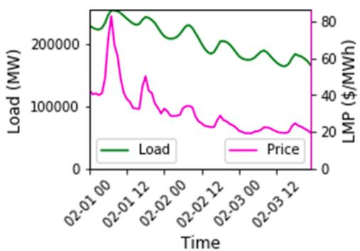

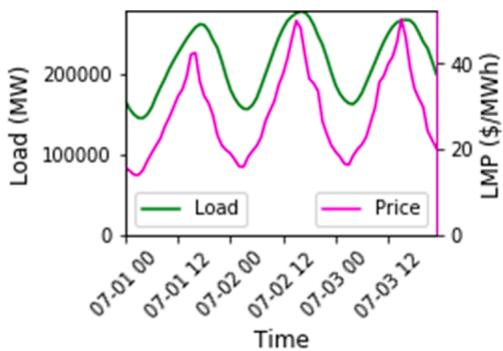  
Fig. 4. System load and corresponding marginal price for a 3-day period during winter (left) and summer (right) in PJM in 2019.

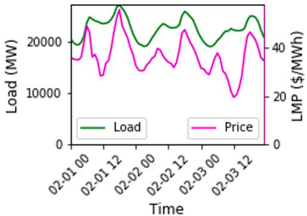

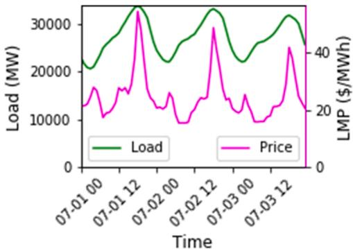  
Fig. 5. System load and corresponding marginal price for a 3-day period during winter (left) and summer (right) in CAISO in 2019.

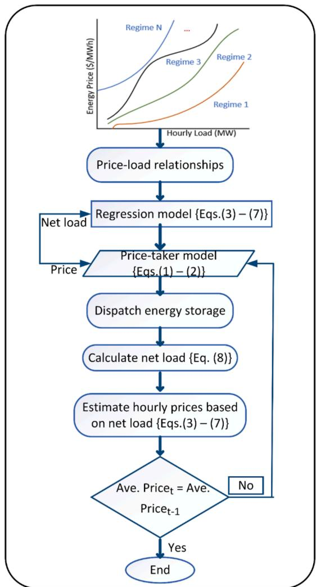  
Fig. 6. Proposed methodology for capturing the impacts of storage dispatch on wholesale energy prices.

## 3. Materials and methods

Our approach is based on the standard PT approach that has been used in many studies, as discussed in Section 1. We started with the Revenue, Operation, and Device Optimization (RODeO) model [28], which maximizes the revenue of a storage device, summarized in Eqs. (1)–(2) [11].

$$
M A X _ {C, D, S O C} \sum_ {t} ^ {T} E _ {t} ^ {p} (D _ {t}\tag{\(C_t\}
$$

(1)

$$
\begin{array}{l} S O C _ {t} = S O C _ {t - 1} + \rho C _ {t} - D _ {t} \\ D _ {t}, C _ {t} \in [ 0, J ] \\ S O C _ {t} \in [ 0, J k ] \end{array}\tag{2}
$$

where $E _ { t } ^ { p }$ is the LMP at time t, T represents the number of hours in the dispatched horizon, J is the storage unit power capacity, k is the storage duration at rated power, $S O C _ { t }$ is the storage state of charge at time $\mathrm { t } , \rho$ is the storage round-trip efficiency, and $D _ { t }$ and $C _ { t }$ represent the storage discharge and charge power at time t, respectively.

This basic formulation assummes that energy storage installation is marginal and therefore cannot impact electricity prices [29]. This paper adds to the optimistic PT model by incorporating data-driven predictive analytics as a market feedback function to assess the impact of nonmarginal storage deployments, which will, in turn, vary prices. The proposed approach, as shown in Fig. 6, captures price-suppression impacts caused by storage dispatch operations with increasing energy storage deployment.

The first step is developing a model to establish price-load relationships using historical price-load data sets. Usually, there are various market regimes that could be present in price-load relationship curves, as shown in Fig. 6.

This paper uses a machine learning technique to train and test the price-load data sets that are used to predict prices from the net load after a storage dispatch. The train-test procedure is applied on the price-load data set to train the data set and evaluate the performance of the model. This procedure is particularly useful for large data sets and scenarios that require a rapid estimate of model performance.

Several authors have used different methods for time-series forecasting; a review of these methods can be found in [30].

In general, regression-based predictive models are based on the theorized relationship between a dependent variable, such as energy prices, and a number of independent variables, such as load. In general, price-load relationships can be considered a regression problem [31]. Kian et al. [32] used a regression-based model to predict energy prices with the assumption that demand and electricity prices are stochastic processes. Conejo et al. [33] used a dynamic regression-based model to forecast electricity prices for a day-ahead, pool-based energy market. The model was used to establish price-load relationships with uncorrelated errors. Further, Vucetic et al. [31] used regression models on different price-load market regimes to predict corresponding energy prices for each regime. Although applied in a real estate market scenario, with price fluctuations and demand, Baldominos et al. [34] investigated four different predictive models, including ensembles of regression trees, k-nearest neighbors, support vector machines for regression, and multilayer perceptrons. Baldominos et al. showed that regression tree ensembles predicted prices with the highest accuracy. Based on the reviewed papers on predictive models for energy price prediction, this article uses a regressor-based model, referred to as the gradient-booting regressor (GBR) ensemble, for energy price time-series prediction. Ensemble methods are usually used to aggregate the predictions of several base estimators to enhance robustness over a single estimator.

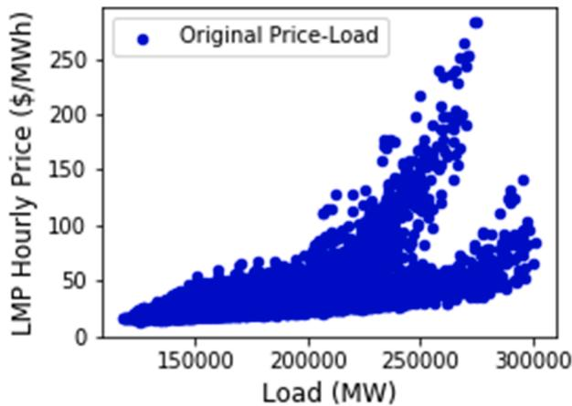

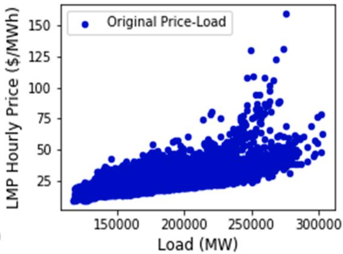

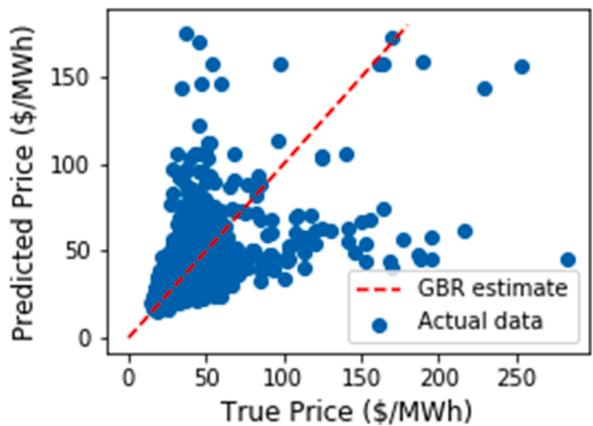  
(a) 2018

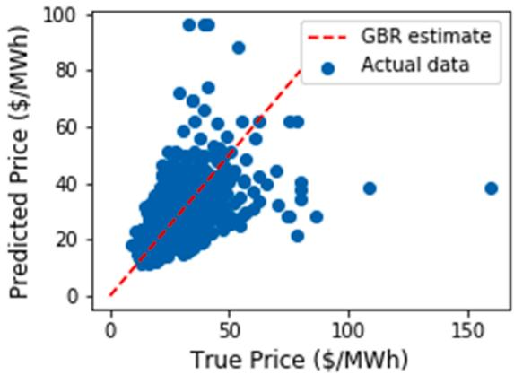  
(b) 2019  
Fig. 7. Annual hourly price-load relationships and true price as a function of predicted price with GBR estimate for PJM in 2018 (a) and 2019 (b).

The GBR represents an additive model whose prediction, $Y _ { j } ,$ for a given net load input, $\mathbf { X _ { j } } ,$ is given as follows [35]2:

$$
Y _ {j} = G _ {N} \left(x _ {j}\right) = \sum_ {n = 1} ^ {N} K _ {n} \left(x _ {j}\right)\tag{3}
$$

where $K _ { n }$ represents the estimators or weak learners, and N is the number of estimators:

$$
G _ {n} (x) = G _ {n - 1} (x) + K _ {n} (x)\tag{4}
$$

where $G _ { n - 1 } ( x )$ is the previous ensemble.

The newly added estimator, $K _ { n } ,$ is fitted to minimize a sum of losses, $L _ { n } ,$ with the given $G _ { n - 1 } ( \mathbf { x } ) _ { : }$ , as follows:

$$
K _ {n} = \underset {K} {\operatorname{argmin}} L _ {n} = \underset {K} {\operatorname{argmin}} \sum_ {j = 1} ^ {m} l \left(y _ {j}, G _ {n - 1} (x) + K _ {n} (x)\right)\tag{5}
$$

where $l ( y _ { j } , G ( \mathbf { x } _ { \mathrm { j } } ) )$ is the loss parameter, which, when approximated by first-order Taylor approximation, can be denoted in the following derivative as the gradient $\Delta _ { j } \colon$

$$
\Delta_ {j} = \frac {\partial l (y _ {j} , G (x _ {j}))}{\partial G (x _ {j})}\tag{6}
$$

Removing the constant term from Taylor’s approximation, the esti mator $K _ { n }$ is given as follows:

$K _ { n }$ ≈ arg min $\Delta _ { j }$ K

(7)

At every iteration, $K _ { n }$ is fitted to estimate the negative gradients of the samples and updated at each iteration. This is referred to as a form of gradient descent in a functional space.

The net load (represented by $\mathbf { x } _ { \mathrm { j } } )$ is calculated as follows given the energy storage (ES) charge and discharge power:

$$
x _ {j} = x _ {j - 1} + E S _ {j} ^ {\text { chargepower }} - E S _ {j} ^ {\text { dischargepower }}\tag{8}
$$

Fig. 7 a and 7b show the 2018 (upper left) and 2019 (upper right) hourly price-load relationship for the PJM interconnection, and Fig. 7 (lower plots) illustrates the respective GBR estimates of the predicted price against the true price. The GBR plot shows a strong fit between the predicted and true price.

Fig. 8a and 8b shows the 2018 (upper left) and 2019 (upper right) hourly price-load relationships for CAISO. The GBR parametrization for the price-load relationship in CAISO must be tuned differently from that of PJM. The tree size for CAISO is controlled by increasing the number of leaf nodes, and this implies that trees will be grown first with a best-first search, where nodes with the highest enhancement in impurity are expanded first [35]. Fig. 8 (lower plots) illustrates CAISO’s GBR estimate of the predicted price against the true price, with a strong fit between the predicted and true price for both the 2018 and 2019 cases.

Fig. 9a and 9b show the actual and predicted hourly price-load relationships in PJM and CAISO, respectively. The upper and lower plots represent the 2018 and 2019 price-load relationships, respectively. The predicted price-load relationship aligns well for both markets and years;

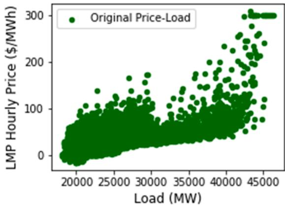

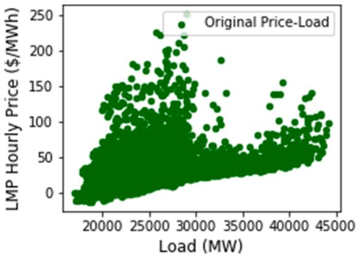

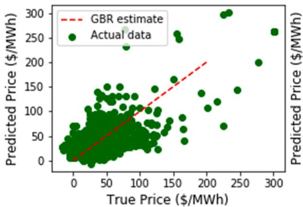  
(a) 2018

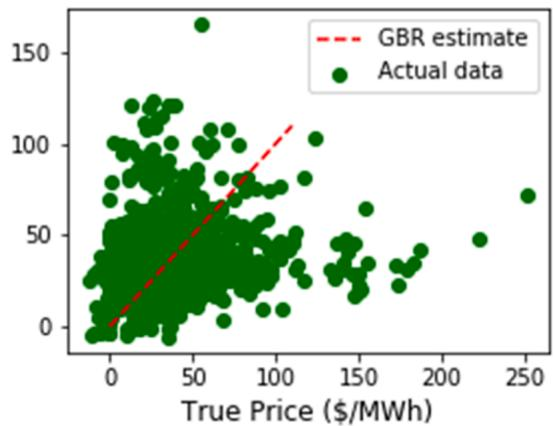  
(b) 2019  
Fig. 8. Annual hourly price-load relationship and true price as a function of predicted price with GBR estimate for CAISO in 2018 (a) and 2019 (b).

however, there are more outliers in CAISO than PJM.

Table 1 summarizes the GBR tuned parameters for the PJM and CAISO price predictions.

As shown in Fig. 6, the predicted prices from the GBR regression based on the previous net load are passed on to the PT model to estimate the optimal storage dispatch and corresponding arbitrage value for each storage power capacity. The new net load is then estimated and used to predict the new hourly prices using the GBR predictive model.

## 4. Case study: energy arbitrage in regional wholesale energy markets

To evaluate this approach, we perform a case study of an energy arbitrage application using the PJM and CAISO price data discussed in the previous sections. In each location, we add up to 1,000 MW in 100- MW blocks, assuming 80% round-trip efficiency and 4-hour-duration energy storage, dispatched against the predicted market price.

## 4.1. Impact of deployment on arbitrage value

Fig. 10 provides a characterization of the marginal arbitrage value of storage as deployment increases in both the PJM and CAISO markets. The initial values of storage in PJM, \$27.4/kW-year and \$15.9/kW-year, are much less than in CAISO, \$51.03/ and 47.5\$/kW-year, in 2018 and 2019, respectively, based on smaller price differences. The curves show an overall decline in value as a function of deployment, following general trends previously reported [36]. CAISO demonstrates much greater value resulting from greater price differences, as illustrated previously. The decline in value in CAISO is greater based largely on the relative size of the systems. For instance, the average demand in PJM in 2019 was seven times greater than in CAISO, and 1,000 MW of storage represents approximately 4.0% of average demand in CAISO and 0.6% of average demand in PJM.

Following previous analysis [37], the revenue from arbitrage-only applications is less than the annualized cost of many storage systems. For example, using 2020 cost estimates from [37] produces an annualized capital cost of approximately \$93.2/kW-year. This is higher than the range of values shown in Fig. 10. However, adding other revenue streams (particularly capacity) can result in net revenues that exceed costs. Yet as more storage is added, the diminishing value of the revenue from the arbitrage application could impact project viability. It is therefore important to understand drivers of the changes in arbitrage values, and the following subsections explore the decline in arbitrage value in more detail, including the contribution of higher off-peak purchase prices, lower on-peak sale prices, and changes in the overall number of hours with sufficient price differences.

## 4.2. Impact of storage dispatch on prices

Fig. 11 and Fig. 12 illustrate the simulated impact of storage deployment on system average prices using 2019 data. Because both the 2018 and 2019 cases show similar patterns, we show only 2019 results for the remainder of the analysis. Fig. 11 provides the annual average prices and shows both the greater spread in prices in CAISO relative to PJM and the greater impact of storage deployment in CAISO because of its smaller size relative to the amount of storage deployed in our test case. (Note the change in the y-axis scale.) The overall impact is to increase off-peak prices because of storage charging and decrease them during on-peak prices caused by discharging.

Fig. 12 illustrates cases for specific periods in each region.

The change in arbitrage value can result from both higher off-peak purchase prices and lower on-peak sale prices. Fig. 13 shows the weighted average price at which the model charges and discharges. Both locations show a decline in sale prices as more storage units are added to the system, although it is more obvious in CAISO than in PJM. The increase in purchase price is also more obvious in the CAISO simulations.

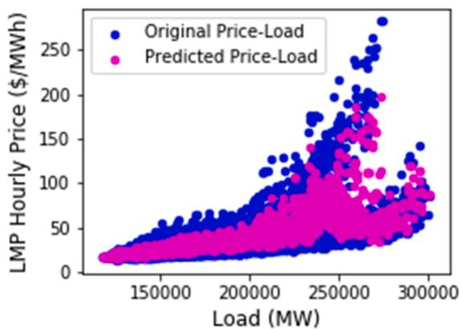

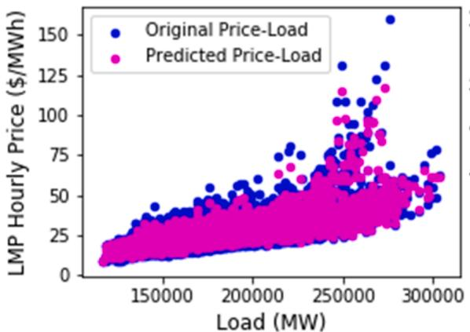  
(a) PJM

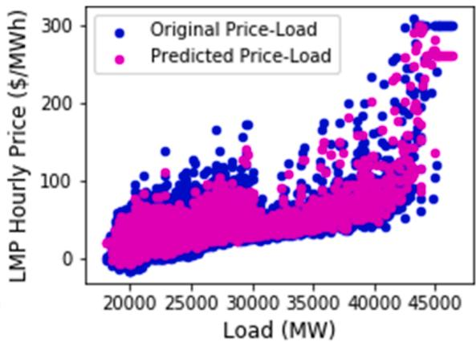

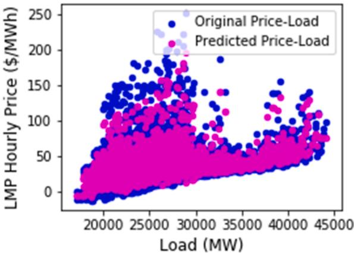  
(b) CAISO  
Fig. 9. Actual and predicted hourly price-load relationships from the GBR regression in PJM (left) and CAISO (right).

Table 1  
GBR configuration for price prediction.

<table><tr><td>Parameter</td><td>Description</td><td>PJM (2018)</td><td>CAISO (2018)</td><td>PJM (2019)</td><td>CAISO (2019)</td></tr><tr><td>max_depth</td><td>Maximum depth of the individual regression estimators and limits the number of nodes in the tree</td><td>15</td><td>250</td><td>40</td><td>200</td></tr><tr><td>n_estimators</td><td>Number of boosting stages to perform</td><td>50</td><td>340</td><td>100</td><td>250</td></tr><tr><td>min_samples_leaf</td><td>The least number of samples required to become a leaf node</td><td>2</td><td>6</td><td>2</td><td>6</td></tr></table>

The impact of storage on arbitrage opportunity can also be illustrated via the change in volatility, measured by the standard deviation of prices (indicating how widely dispersed prices are from the average price) [13]. Annual estimation of the standard deviation tends to obscure some key details, such as the effects of contingencies or congestion, and it includes low weekend prices, which could bias the volatility index; however, annualized daily standard deviation is the logarithmical dif ference of the daily average prices of 2 consecutive trading days, with a total of 252 trading days in a year, excluding weekends.

Fig. 14 provides the standard deviation for both locations under increased storage deployment.

These curves demonstrate both the higher initial standard deviation in CAISO and the decline in both regions that results with increased storage deployment.

## 4.3. Storage plant operation

The decline in storage value as its deployment increases results from both the absolute decrease in price differences and a decrease in the number of hours of price differential.

Fig. 15 provides the number of cycles of charge and discharge operations. Higher price differences can result in more hours when a storage device can receive net revenue (where the discharge price is more than the charge price divided by the charge efficiency). There are more opportunities in CAISO relative to PJM, with the number of hours of operation decreasing with increased deployment.

The overall operation can also be measured in terms of storage plant capacity factor for both charging and discharging.

The charge capacity factor is defined as the total annual charging energy (MWh) divided by 876,000 (100 MW times 8,760 h per year). The discharge capacity factor uses the total discharging energy, and this measure factor would correspond to the typical capacity factor metric used for a power plant. Although we considered generic energy storage in this study, note that battery energy storage has a relatively low capacity factor because of economic reasons, charging duration, and cycling limitation for optimal performance. Based on our assumption of an 80% round-trip efficiency, the theoretical upper limit for the discharge capacity factor for energy storage would be 44%, assuming a device with an equal charge/discharge power capacity. This upper bound would require an unrealistic price pattern, and under realistic conditions, a storage unit for energy-only arbitrage application often sits idle until market prices are favorable for either dispatch or charging operations.

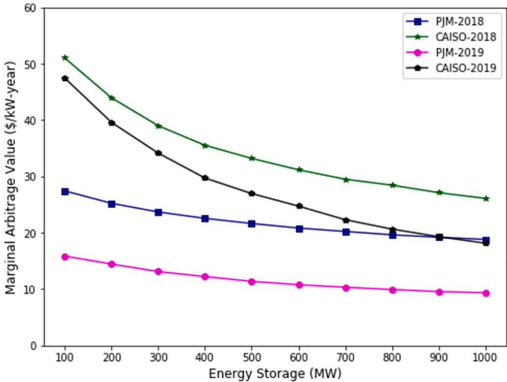  
Fig. 10. Storage marginal value as a function of energy storage deployment in PJM and CAISO.

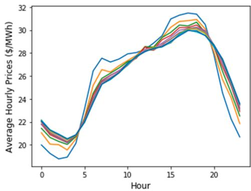  
a) CAISO

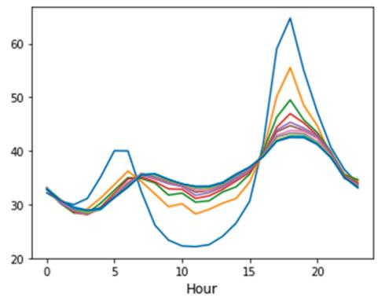  
b) PJM  
Fig. 11. Annual average change in prices in PJM (left) and CAISO (right) as storage deployment increases (2019 data).

Fig. 16 shows the storage charge and discharge capacity factors in CAISO and PJM. For reference, a single charge/discharge operation would result in a discharge capacity factor of approximately 17%, so the results over the range of deployments represent an average of 0.8 to 1.5 cycles per day. Understanding daily cycling operations is important to understanding how changes in storage operation impact storage degradation associated with cycling.

There are other potential revenues streams not captured in this article, such as the network upgrade deferral and the provision of ancillary services, including contingency, regulation, and flexibility reserves; therefore, evaluating the profitability of storage investments will require estimating its value streams across a range of applications within favorable electricity markets.

## 5. Conclusions and discussion

This paper presents a novel framework of a modified PT model capable of incorporating a market feedback function using a data-driven approach to more accurately assess the potential economic value of gridlevel energy storage deployment. The goal of this work is to demonstrate the possible application of a tool that bridges the gap between conventional PT approaches and more expensive PCM approaches.

The proposed methodology reduces the required system knowledge to a price effect that is derived from correlations between historic load and power prices. This type of market feedback can help address the limitation of the existing optimistic PT model and support rapid analysis of new storage deployments without the costs associated with PCMs.

In our example study, we show how this tool can be used to demonstrate the potential decline in value that results from increased storage deployment. Results show that the greatest marginal value of storage is obtained from the initial investment in small storage power capacity and decreases as increasing amounts of storage are added to a

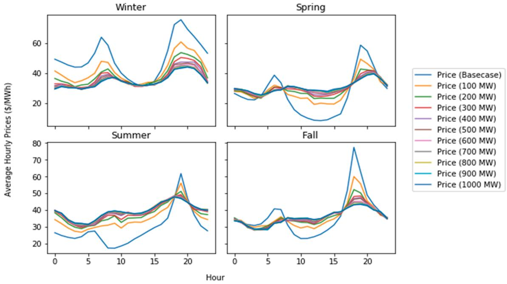  
(a) CAISO

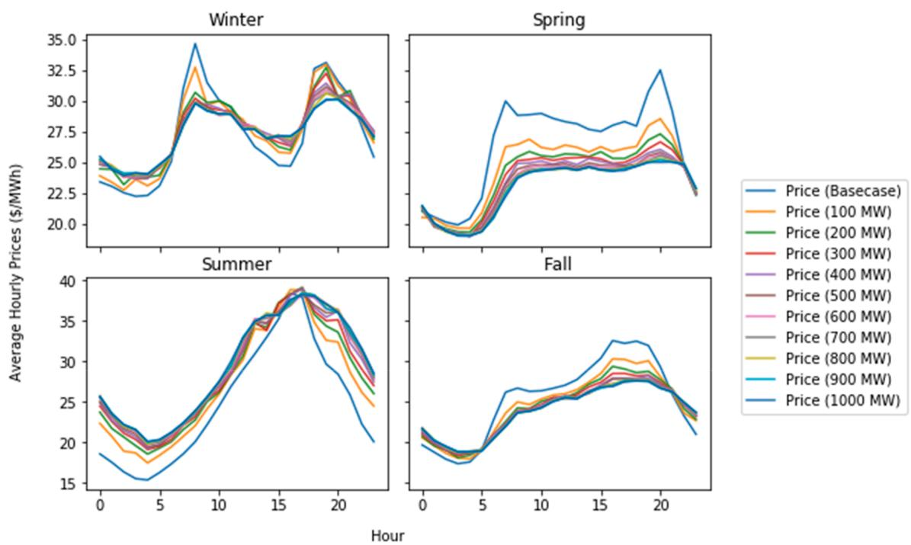  
(b) PJM  
Fig. 12. Seasonal change in prices as storage deployment increases (2019 data).

system.

There are a number of limitations to the proposed approach. The proposed framework uses the GBR, which is susceptible to outliers and could be difficult to scale up because the correctness of each estimator depends on previous predictors. As shown in Fig. 9, the outliers in the electricity prices—which can be caused by several factors, such as extreme weather conditions or the loss of a transmission line or power plant—could skew the accuracy of the price prediction. There is a need to incorporate models to detect outliers, such as the moving average and autoregressive methods.

Further, the proposed framework can incorporate other machine learning techniques for price prediction—such as support vector regression, k-nearest neighbors, and multilayer perceptrons—to determine which model would perform best while also considering their computation times.

In addition, the identification of possible regimes that inform power and market characteristic behaviors in the price-load relationship is another important feature that can be incorporated in the proposed modified PT model. Additional research is required to develop and integrate an algorithm capable of clustering unique regimes in the price load relationship model to enhance the accuracy of price prediction.

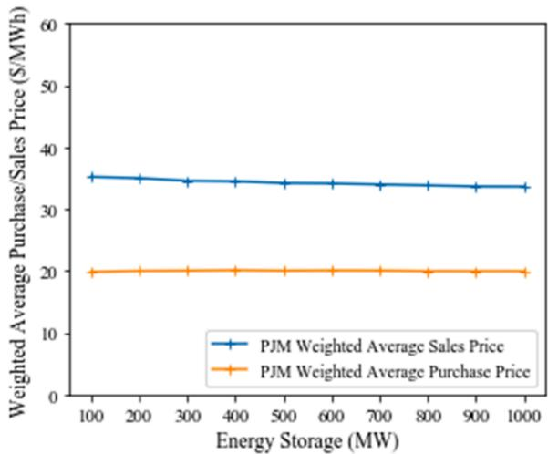

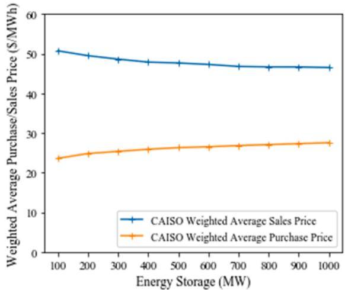  
Fig. 13. Weighted average purchase and sales energy price.

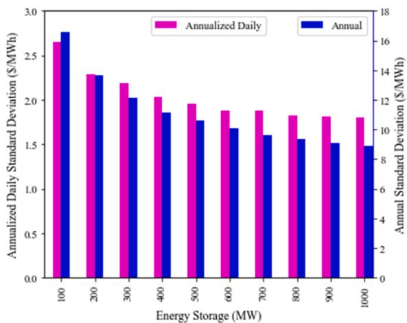

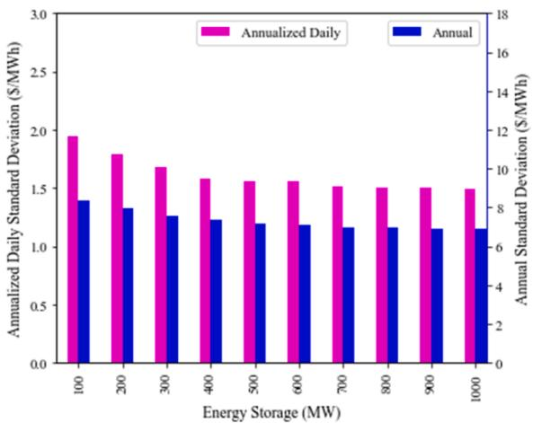  
Fig. 14. Annualized daily and annual standard deviation of predicted LMP for CAISO (left) and PJM (right).

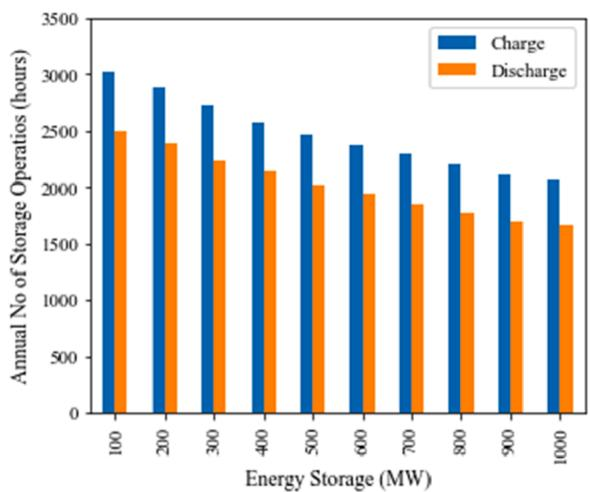

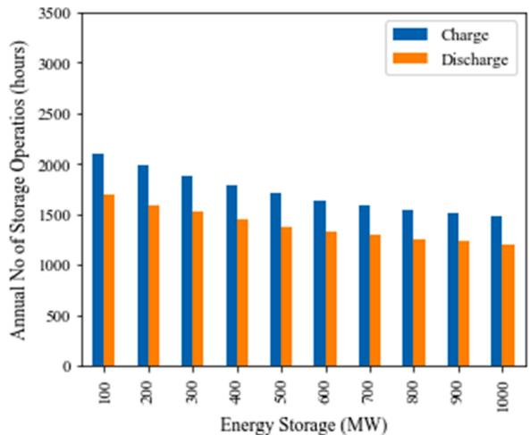  
Fig. 15. Annual number of discharge and charge energy storage operations for CAISO (left) and PJM (right)

Finally, note that this approach, like all PT approaches, is tied to historical price-load relationships that could be fundamentally altered in an evolving grid with new patterns of electricity demand and deployments of VRE. Evaluation of these impacts would require the generation of new price patterns, typically using a PCM; however, it might be possible to use a hybrid approach, first generating prices with a PCM, and then applying a modified PT model, as suggested here, to evaluate an array of storage deployments. This approach could be applied more generally to evaluate technologies other than energy storage, providing the advantages of both PCM and PT models for a more flexible analysis of different generation mixes in more comprehensive scenario analyses.

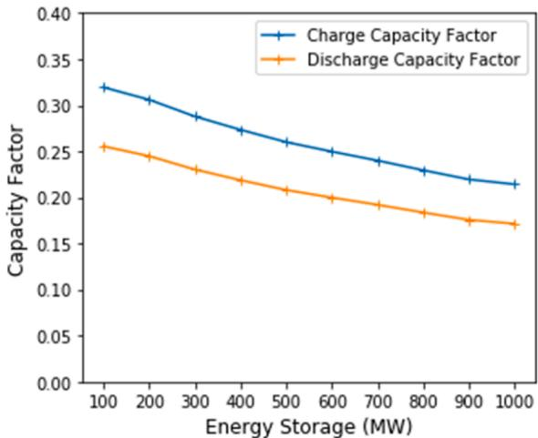

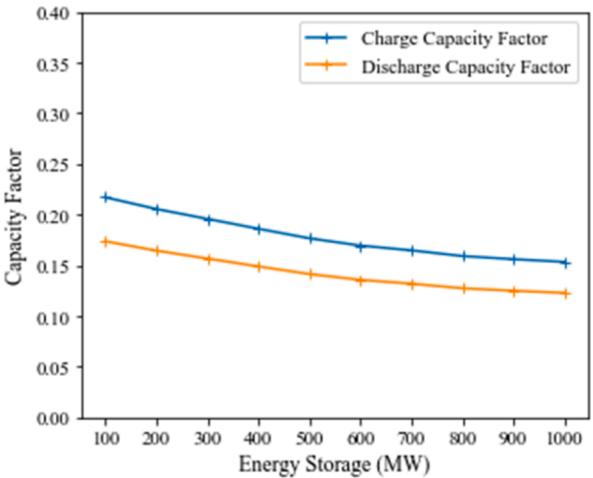  
Fig. 16. Energy storage charge and discharge capacity factors for CAISO (left) and PJM (right).

CRediT authorship contribution statement

Michael Ikechi Emmanuel: Conceptualization, Methodology, Software, Writing – original draft, Visualization, Investigation. Paul Denholm: Conceptualization, Methodology, Writing – review & editing, Investigation, Supervision, Funding acquisition.

## Declaration of Competing Interest

The authors declare that they have no known competing financial interests or personal relationships that could have appeared to influence the work reported in this paper.

## Acknowledgements

The authors thank Katie Wensuc (NREL) for editing. This work was authored by the National Renewable Energy Laboratory, operated by Alliance for Sustainable Energy, LLC, for the U.S. Department of Energy (DOE) under contract number DE-AC36-08GO28308. Funding provided by U.S. Department of Energy Office of Energy Efficiency and Renewable Energy Solar Energy Technologies Office. A portion of this research was performed by using computational resources sponsored by the Depart ment of Energy’s Office of Energy Efficiency and Renewable Energy and located at the National Renewable Energy Laboratory. The views expressed in the article do not necessarily represent the views of the DOE or the U.S. government. The U.S. government retains and the publisher, by accepting the article for publication, acknowledges that the U.S. government retains a nonexclusive, paid-up, irrevocable, worldwide license to publish or reproduce the published form of this work or allow others to do so, for U.S. government purposes.

## References

[1] Staffell I, Rustomji M. Maximising the value of electricity storage. J Storage Mater 2016;8:212 25.

[2] Bassett K, Carriveau R, Ting D-K. Energy arbitrage and market opportunities for energy storage facilities in Ontario. J Storage Mater 2018;20:478–84.

[3] McConnell D, Forcey T, Sandiford M. Estimating the value of electricity storage in an energy-only wholesale market. Appl Energy 2015;159:422–32.

[4] Shafiee S, Zamani-Dehkordi P, Zareipour H, Knight AM. Economic assessment of a price-maker energy storage facility in the Alberta electricity market. Economi assessment of a price-maker energy storage facility in the Alberta electricity market 2016;111:537 47.

[5] DiOrio N, Dobos A, Janzou S, Nelson A, Lundstrom B. Technoeconomic modeling of battery energy storage in SAM. National Renewable Energy Lab.(NREL), Golden, CO (United States); 2015.

[6] Ekman CK, Jensen SH. Prospects for large scale electricity storage in Denmark. Energy Convers Manage, 51(6), pp. 1140-1147, 2010/06/01/ 2010.

[7] Martinek J, Jorgenson J, Mehos M, Denholm P. A comparison of price-taker and production cost models for determining system value, revenue, and scheduling of concentrating solar power plants. Appl Energy 2018;231:854–65.

[8] Walawalkar R, Apt J, Mancini R. Economics of electric energy storage for energy arbitrage and regulation in New York. Energy Policy 2007/04/01/ 2007;35(4): 2558–68.

[9] Bradbury K, Pratson L, Patino-Echeverri ˜ D. Economic viability of energy storage systems based on price arbitrage potential in real-time U.S. electricity markets. Appl Energy 2014;114:512–9.

[10] Salles M, Aziz MJ, Hogan WW. Potential arbitrage revenue of energy storage systems in PJM during 2014. In: 2016 IEEE Power and Energy Society Genera Meeting (PESGM). IEEE; 2016, pp. 1-5.

[11] Salles MB, Huang J, Aziz MJ, Hogan WWJE. Potential arbitrage revenue of energy storage systems in PJM, 10(8): 2017; 1100.

[12] Byrne RH, Nguyen TA, Copp DA, Concepcion RJ, Chalamala BR, Gyuk I. Opportunities for energy storage in CAISO: Day-ahead and real-time market arbitrage. In: 2018 International Symposium on Power Electronics, Electrical Drives, Automation and Motion (SPEEDAM), IEEE. 2018. p. 63 8.

[13] Arteaga J, Zareipour HJIToSG. A price-maker/price-taker model for the operation of battery storage systems in electricity markets, 10(6): 2019; 6912–20.

[14] Arcos-Vargas A, ´ Canca D, Núnez ˜ FJAE. Impact of battery technological progress on electricity arbitrage: An application to the Iberian market. Appl Energy 2020;260: 114273.

[15] Lepszy SJE. Analysis of the storage capacity and charging and discharging power in energy storage systems based on historical data on the day-ahead energy market in Poland. Energy 2020;213:118815.

[16] Schleifer AH, Murphy CA, Cole WJ, Denholm PLJAiAE. The evolving energy and capacity values of utility-scale PV-plus-battery hybrid system architectures. App Energy, 2: 2021;100015.

[17] He X, Delarue E, D Haeseleer W, Glachant J-M. A novel business model for aggregating the values of electricity storage. Energy Policy 2011/03/01/ 2011;39 (3):1575–85.

[18] Sioshansi R, Denholm P, Jenkin T, Weiss J. Estimating the value of electricity storage in PJM: Arbitrage and some welfare effects. Energy Econ 2009;31(2): 269–77.

[19] A.P.P. Association. Wholesale Electricity Markets and Regional Transmission Organizations [Online]. Available: https://www.publicpower.org/policy/ wholesale-electricity-markets-and-regional-transmission-organizations.

[20] L.J.M.A.N. Monitoring Analytics, PA, USA, “State of the Market Report for PJM,” 2015.

[21] C. Department of Market Monitoring, “Q1 2021 Report on Market Issues and Performance, 2021, Available: http://www.caiso.com/Documents/2021-First Quarter-Report-on-Market-Issues-and-Performance-Jun-9-2021.pdf

[22] E.P.R.I. (EPRI), “StorageVET 2.0 User Guide: End User and Technical Documentation for the Storage Value Estimation Tool in Python.,” EPRI, Palo Alto, CA2018, vol. 1.0.2.

[23] U.S. EIA, “Battery Storage in the United States: An Update on Market Trends,” U.S Energy Information Administration (EIA); 2020.

[24] Kirby B, Ma O, O’Malley MJNRELMhwngdfop. The value of energy storage for grid applications. National Renewable Energy Laboratory. May. http://www. nrel. gov/ docs/fy13osti/58465. pdf, 2013

[25] Mills AD, et al. Solar-to-grid: trends in system impacts, reliability, and market value in the United States with data through 2019. Lawrence Berkeley National Lab. (LBNL), Berkeley, CA (United States); 2021.

[26] P. Interconnection, Daily day-ahead LMP, [Online]. Available: http://oasis.caiso com/mrioasis/logon.do

[27] C.I. oasis, “Daily day-ahead LMP,” [Online]. Available: http://dataminer2.pjm. com/list.

[28] RODeO. Revenue Operation and Device Optimization (RODeO); 2020. Available: https://github.com/NREL/RODeO.

[29] Zucker A, Hinchliffe T, Spisto AJJS, reports P. Assessing storage value in electricity markets, a literature review. European Commission, Joint Research Centre; 2013.

[30] Weron RJIjof. Electricity price forecasting: A review of the state-of-the-art with a look into the future. Int J Forecasting, 30(4): 2014; 1030–81.

[31] Vucetic S, Tomsovic K, Obradovic ZJITops. Discovering price-load relationships in California’s electricity market. IEEE Trans Power Syst 16(2): 2001; 280–6.

[32] Kian A, Keyhani A. Stochastic price modeling of electricity in deregulated energy markets. In: Proceedings of the 34th Annual Hawaii International Conference on System Sciences, 2001, p. 7 pp.: IEEE.

[33] Conejo AJ, Contreras J, Espínola R, Plazas MAJIjof. Forecasting electricity prices for a day-ahead pool-based electric energy market. Int J Forecasting 21(3): 2005; 435–62.

[34] Baldominos A, Blanco I, Moreno AJ, Iturrarte R, Bernardez ´ O, ´ Afonso CJAs. Identifying real estate opportunities using machine learning. Appl Sci 8(11): 2018; 2321.

[35] Pedregosa F, et al. Scikit-learn: Machine learning in Python. J Mach Learning Re 2011;12:2825 30.

[36] Bitar E, Khargonekar P, Poolla KJS, Letters C. On the marginal value of electricity storage, 123: 2019; 151–9.

[37] Augustine C, Blair N. Storage futures study: storage technology modeling input data report. National Renewable Energy Lab.(NREL), Golden, CO (United States); 2021.