# Collaborative scheduling optimization of hydrogen-enhanced integrated energy system via goal-conditioned hierarchical reinforcement learning

Feifei Cui a, Dou An a ,∗, Huan Xi b, Zhigang Ren a

a Faculty of Electronics and Information, Xi’an Jiaotong University, Xi’an, 710049, China b Key Laboratory of Thermo-Fluid Science and Engineering of Ministry of Education, School of Energy and Power Engineering, Xi’an Jiaotong University, Xi’an, 710049, China

## A R T I C L E I N F O

Keywords: Hydrogen-enhanced integrated energy system Collaborative optimization Energy scheduling Hierarchical reinforcement learning

## A B S T R A C T

Under carbon peak and carbon neutrality targets, energy systems are evolving toward diversified architectures that integrate various energy forms. However, the involvement of multiple energy carriers poses challenges to coordinated optimal scheduling, including temporal heterogeneity, a contracted feasible decision space, and a trade-off between volatility and robustness. To overcome these challenges, a hydrogen-enhanced integrated energy system (H-IES) is introduced, in which a hydrogen storage system (HSS) and a battery energy storage system (BESS) jointly coordinate scheduling to balance short-term load response and long-term energy f f li h h d li k d k d i i ( ) d l are established, with a semi-MDP (SMDP) for high-level planning and a goal-augmented MDP (GAMDP) for low-level sequential control, mitigating the ‘‘short-sightedness’’ of single time-scale models. To address the above models, a goal-conditioned hierarchical reinforcement learning approach (GHTD3) with twin delayed deep deterministic policy gradient as internal controllers is proposed, to achieve coordinated energy allocation through high-level long-horizon planning and low-level short-horizon response. To improve the stability ot algorithm, a historical goal relabeling mechanism is incorporated to correct distributional drift in high-leve replayed experiences. Simulations across three seasonal scenarios reveal that, compared with mathematical programming method and heuristic algorithm, reinforcement learning demonstrates a stronger ability to exploit the value of the hydrogen pathway and to learn stable energy storage dispatch strategies. Compared with the single-level TD3, GHTD3 delivers higher cumulative rewards and, by flexibly staggering fuel cell (FC) operation during cooling or heat peaks, reduces cost by 22.6% and cuts renewable energy curtailment by 85.9%. These findings confirm GHTD3’s superior coordination, robustness, and cost-effectiveness in multi-energy scheduling.

## 1. Introduction

In pursuit of carbon peak and neutrality goals [1], global energy systems are transitioning to decentralized, low-carbon renewable in frastructures. In its 2025 report, the International Renewable Energy Agency (IRENA) projects that 585 GW of renewable capacity was added in 2024, accounting for over 90% of global power capacity growth [2]. Although this expansion is vital for decarbonization, the in herent intermittency and variability of renewable energy sources (RES) threaten system reliability and stability. IES [3] have thus emerged as a key enabler, coordinating the dispatch of electricity, heat, cooling and hydrogen [4]. However, the coupling and dynamic interactions among these energy carriers, combined with RES output and demand fluctuations, pose formidable challenges for IES scheduling.

Hydrogen, as a key secondary energy carrier, offers high energy density and multi-mode conversion capabilities that can mitigate the uncertainty of RES variability [5]. Prior studies in [6–8] have shown that hydrogen enables multi-period energy transfer and complementarity via electrolyzers (EL) production, storage, and reforming or fuel-cell (FC) conversion. However, these features introduce new requirements for H-IES scheduling [9]: (1) deep coupling: integrating hydrogen intensifies the interdependence among electricity, heat, cooling, and hydrogen, raising coordination requirements; (2) collaborative optimization: multiple energy conversion modes and storage devices must be scheduled simultaneously under safety and economic constraints, increasing decision complexity.

In recent years, model-driven optimization approaches have been widely applied to the scheduling of H-IES. These include mathematical programming methods solved by commercial solvers such as Gurobi [10] and CPLEX [11], as well as heuristic algorithms [12] (e.g., Genetic algorithm, particle swarm optimization) and stochastic programming techniques [13]. For example, Ma et al. [14] proposed a resilient scheduling strategy for electricity-gas-hydrogen systems by formulating a unified model incorporating normal and emergency operation constraints, solved using a distributed progressive hedging algorithm. However, these traditional methods are typically built upon precise model formulations, and often struggle to cope with the large-scale nonlinear couplings, dynamic uncertainties, and real-time operational constraints commonly present in multi-energy systems [15].

<table><tr><td colspan="2">Nomenclature</td></tr><tr><td colspan="2">Abbreviation</td></tr><tr><td>AC</td><td>Absorption chiller</td></tr><tr><td>BESS</td><td>Battery energy storage system</td></tr><tr><td>DRL</td><td>Deep reinforcement learning</td></tr><tr><td>EC</td><td>Electric chiller</td></tr><tr><td>EL</td><td>Electrolyzer</td></tr><tr><td>FC</td><td>Fuel cell</td></tr><tr><td>GHTD3</td><td>Goal-conditioned hierarchical twin delayed deep deterministic policy gradient</td></tr><tr><td>H-IES</td><td>Hydrogen-enhanced integrated energy system</td></tr><tr><td>HGT</td><td>Hydrogen gas storage</td></tr><tr><td>HRL</td><td>Hierarchical reinforcement learning</td></tr><tr><td>HSS</td><td>Hydrogen storage system</td></tr><tr><td>IES</td><td>Integrated energy system</td></tr><tr><td>IRENA</td><td>International renewable energy agency</td></tr><tr><td>MDP</td><td>Markov decision process</td></tr><tr><td>PSO</td><td>Particle swarm optimization</td></tr><tr><td>PV</td><td>Photovoltaic</td></tr><tr><td>RES</td><td>Renewable energy sources</td></tr><tr><td>SoC</td><td>State of charge</td></tr><tr><td>TD3</td><td>Twin delayed deep deterministic policy gradient</td></tr><tr><td>WT</td><td>Wind turbines</td></tr><tr><td colspan="2">Symbols</td></tr><tr><td> $P_{PV,stc}$ </td><td>Photovoltaic nominal power (kW)</td></tr><tr><td> $C_i$ </td><td>Capacity of device i (kWh)</td></tr><tr><td>LHV</td><td>Lower heating value of hydrogen (kJ/kg)</td></tr><tr><td> $P_{t}^{el,DD}$ </td><td>Electricity demand (kW)</td></tr><tr><td> $P_{max}^{grid,res}$ </td><td>Maximum renewable power absorption capacity of grid (kW)</td></tr><tr><td> $Q_t^{co,DD}$ </td><td>Cooling demand (kW)</td></tr><tr><td> $Q_t^{he,DD}$ </td><td>Heat demand (kW)</td></tr><tr><td> $SoC_t^i$ </td><td>State of charge of storage component i</td></tr><tr><td> $COP_i$ </td><td>Coefficient of performance for component i</td></tr><tr><td> $A_{PV}$ </td><td>Photovoltaic surface area ( $m^2$ )</td></tr><tr><td> $C_t^{CO2}$ </td><td>Carbon emission cost ($)</td></tr><tr><td> $C_t^{CUT}$ </td><td>Curtailment cost ($)</td></tr><tr><td> $C_t^{ET}$ </td><td>Electricity trading cost ($)</td></tr><tr><td> $C_t^{IES}$ </td><td>IES operational cost ($)</td></tr><tr><td>CC</td><td>Comprehensive cost ($)</td></tr><tr><td> $D_t^{BESS}$ </td><td>BESS degradation cost ($)</td></tr><tr><td> $I_{stc}$ </td><td>Photovoltaic standard irradiance ( $W/m^2$ )</td></tr><tr><td> $I_t$ </td><td>Irradiance at time t ( $W/m^2$ )</td></tr><tr><td> $m_t^{Hy,EL}$ </td><td> $H_2$  mass flow rate produced by EL (kg/h)</td></tr><tr><td> $m_t^{Hy,FC}$ </td><td> $H_2$  mass flow rate produced by FC (kg/h)</td></tr><tr><td> $P_t^i$ </td><td>Instantaneous power of component i (kW)</td></tr><tr><td> $P_{WT,max}$ </td><td>Rated power of WT (kW)</td></tr><tr><td> $Q_t^i$ </td><td>Cooling or heat power of component i (kW)</td></tr><tr><td>S</td><td>Components set</td></tr><tr><td> $T_a$ </td><td>Ambient temperature (°C)</td></tr><tr><td> $T_{NOCT}$ </td><td>Nominal operating cell temperature (°C)</td></tr><tr><td> $T_{PV,stc}$ </td><td>Photovoltaic nominal temperature (°C)</td></tr></table>

<table><tr><td> $v_{\text{in}}$ </td><td>Cut-in wind speed (m/s)</td></tr><tr><td> $v_{\text{out}}$ </td><td>Cut-out wind speed (m/s)</td></tr><tr><td> $v_{\text{r}}$ </td><td>Rated wind speed (m/s)</td></tr><tr><td colspan="2">Greek letters</td></tr><tr><td> $\eta^{h,FC}$ </td><td>FC heat efficiency</td></tr><tr><td> $\eta^{sl}_{i}$ </td><td>Self-loss efficiency</td></tr><tr><td> $\gamma_{AC}$ </td><td>Proportion of waste heat utilized by AC</td></tr><tr><td> $\bar{\phi}$ </td><td>Parameter of target actor networks</td></tr><tr><td> $\bar{\theta}$ </td><td>Parameter of target critic networks</td></tr><tr><td> $\eta^{EL}$ </td><td>Electrolyzer efficiency</td></tr><tr><td> $\eta^{FC}$ </td><td>FC efficiency</td></tr><tr><td> $\eta_{e}$ </td><td>Photovoltaic efficiency</td></tr><tr><td> $\eta_{i}^{ch}$ </td><td>Charging efficiency of device i</td></tr><tr><td> $\eta_{i}^{dis}$ </td><td>Discharging efficiency of device i</td></tr><tr><td> $\eta_{T}$ </td><td>Photovoltaic temperature coefficient</td></tr><tr><td> $\eta_{PV,stc}$ </td><td>Photovoltaic standard efficiency</td></tr><tr><td> $\kappa_{i}$ </td><td>Operating cost coefficient ($/kW)</td></tr><tr><td> $\lambda_{CO2}$ </td><td>Carbon emissions price ($/t)</td></tr><tr><td> $\nu_{res}$ </td><td>Unutilized renewable energy cost coeffi-cient ($/kW)</td></tr><tr><td> $\phi$ </td><td>Parameter of actor networks</td></tr><tr><td> $\phi_{grid}$ </td><td>Carbon emissions factor (t/kWh)</td></tr><tr><td> $\tau_{s}$ </td><td>Time interval</td></tr><tr><td> $\theta$ </td><td>Parameter of critic networks</td></tr><tr><td> $\varepsilon$ </td><td> $\varepsilon$ -greedy exploration coefficient</td></tr><tr><td> $\lambda_{p}$ </td><td>Electricity price ($)</td></tr></table>

Data-driven deep reinforcement learning (DRL) [16] achieves policies learning through agent-environment interaction and trial-and-error mechanisms, making it suited for addressing scheduling problems in highly uncertain environments. Yi et al. [17] proposed a DRL-based scheduling framework for multi-energy collaborative economic optimization in a nuclear RES H-IES and demonstrated the superiority of DRL over conventional particle swarm optimization (PSO) in handling complex scheduling problems. Liang et al. [18] formulated the scheduling uncertainty of an H-IES coupled with carbon capture and power-to-gas as a Markov decision process (MDP), and applied the twin delayed deep deterministic policy gradient (TD3) algorithm to address the continuous space control problem, optimizing operational costs and carbon emissions. Liang et al. [19] introduced thermal and HSS into the H-IES and proposed a real-time scheduling method based on the soft actor-critic DRL algorithm, aiming to address the curtailment of RES and improve the economic performance of the system. Dong et al. [20] presented a campus multi-energy complementary H-IES integrating a multi-objective optimization framework based on rolling hybrid forecasting and DRL, effectively extending renewable utilization periods and enhancing decision accuracy. Li et al. [21] partitions HSS centric scheduling into two layers. The upper layer uses model-free DRL to predict loads under demand response and renewable outputs, guiding long-term dispatch. The lower layer applies model predictive control (MPC) with a rolling horizon to optimize HSS charging and discharging.

Table 1  
Comparison and summary of literature on optimal scheduling for H-IES.

<table><tr><td>Literature</td><td>Year</td><td>Energy coupling type</td><td>Cross-temporal model</td><td>Hierarchical decision making</td><td>Optimization algorithm</td></tr><tr><td>[6]</td><td>2024</td><td>Electricity-cold-heat-hydrogen-gas</td><td>×</td><td>×</td><td>Traditional</td></tr><tr><td>[7]</td><td>2022</td><td>Electricity-cold-heat-hydrogen</td><td>×</td><td>×</td><td>Traditional</td></tr><tr><td>[8]</td><td>2023</td><td>Electricity-cold-heat-hydrogen</td><td>×</td><td>×</td><td>Traditional</td></tr><tr><td>[14]</td><td>2025</td><td>Electricity-gas-hydrogen</td><td>×</td><td>×</td><td>Traditional</td></tr><tr><td>[17]</td><td>2022</td><td>Nuclear-electricity-hydrogen</td><td>×(MDP)</td><td>×</td><td>Single-layer DRL</td></tr><tr><td>[18]</td><td>2024</td><td>Electricity-hydrogen-gas</td><td>×(MDP)</td><td>×</td><td>Single-layer DRL</td></tr><tr><td>[19]</td><td>2024</td><td>Electricity-heat-hydrogen</td><td>×(MDP)</td><td>×</td><td>Single-layer DRL</td></tr><tr><td>[20]</td><td>2024</td><td>Electricity-cold-heat-hydrogen</td><td>×(MDP)</td><td>×</td><td>Single-layer DRL</td></tr><tr><td>[21]</td><td>2024</td><td>Electricity-hydrogen</td><td>×(MDP)</td><td>√</td><td>DRL+MPC</td></tr><tr><td>Proposed</td><td>2025</td><td>Electricity-cold-heat-hydrogen</td><td>√(SMDP+GAMDP)</td><td>√</td><td>GHTD3 under HRL framework</td></tr></table>

Table 1 highlights that existing works on H-IES scheduling fall into three categories: traditional optimization, single-layer DRL with a standard MDP formulation, and the few that introduces conceptual hierarchical frameworks based on conventional DRL. From this overview three critical gaps emerge: (1) Lack of cross-horizon planning: Traditional single-layer DRL methods focus on short-term control and lack foresight for long-horizon planning, limiting their ability to coordi nate cross-horizon scheduling and the capabilities of hydrogen’s energy transfer and complementary. (2) Absence of an integrated hierarchical decision framework: Existing single-layer DRL and conceptual two-level structures struggle to handle the reduced feasible decision space caused by energy coupling, lacking a unified framework to coordinate macro level planning with short-term dynamic responses. (3) Conflict between performance and training stability: Introducing an hierarchy to boost scheduling performance complicates high-level and low-level policy interactions, often undermining training stability.

To address the above research gaps, this study focuses on the scheduling optimization of a multi-energy coupled H-IES encompassing electricity, heat, cooling, and hydrogen. To formalize scheduling tasks, two augmented MDPs are modeled to describe the cross-temporal decision process, mitigating the ‘‘shortsightedness’’ of single-time-scale models. To solve these models, a goal-conditioned hierarchical reinforcement learning (HRL) approach GHTD3 is proposed to perform macroscopic energy planning and microscopic adjustment via coordi nated high-level and low-level controllers. To enhance learning stability, a historical goal relabeling mechanism is incorporated to correct distributional drift in the high-level replay buffer. Three seasonal scenarios are devised to validate the effectiveness of GHTD3 through comparison with single-layer TD3, heuristic algorithm PSO and Gurobi-based quadratic programming (QP) algorithm baselines. The main contributions are as follows:

1. Two augmented MDP models are established to formalize the H-IES scheduling task. The high-level SMDP captures the temporal abstraction in hydrogen and battery storage planning, while the lowlevel GAMDP characterizes the single-step control behaviors of electricity, heat, cooling, and hydrogen devices, thereby decoupling and coordinating the overall task.

2. To address the MDP models, the GHTD3 algorithm based on a two-layer HRL architecture is proposed. The high-level controlle generates storage goals and passes them to the low level, where an intrinsic reward function continuously guides the agent to track these goals, coordinating long-horizon planning with short-horizon control to maximize cost-effectiveness.

3. A historical goal relabeling mechanism is introduced to correct distributional drift in high-level replay experiences by replacing each original goal with the one that maximizes the log-likelihood of the historical action sequence under the current low-level policy, thereby h h b l

4. Extensive seasonal simulations demonstrate that GHTD3 consistently outperforms the single-layer TD3, the traditional heuristic PSO algorithm, and the commercial solver-based QP approach. It achieves up to a 56.6% reduction in total cost and an 85.9% decrease in renewable energy curtailment, highlighting its superior coordination capability and strong operational stability.

The remainder of this paper is organized as follows. Section 2 describes the architecture of H-IES. Section 3 describes the component models and constraints. Section 4 introduces the two augmented MDPs and GHTD3 algorithm. Section 5 presents simulation results under different scenarios. Finally, Section 6 concludes the paper and outlines future research directions.

## 2. System description

In this study, a multi-energy H-IES integrating electricity, heat, cooling, and hydrogen is introduced. Fig. 1 illustrates the energy flows and components in H-IES across four layers: supply, conversion, stor age, and demand. The energy supply layer integrates distributed PV, wind turbines (WT), and public grid for power import or export. The energy conversion layer coordinates energies conversion via EL, absorption chillers (AC), electric chillers (EC), and FC. The energy storage layer employs hydrogen gas tanks (HGT) and BESS for both short-term response and long-term buffering. Energy demand layer represents user loads for electricity, heating, and cooling. Multiple HGTs are connected in parallel via control valves, enabling simultaneous charging and discharging. The HSS, composed of EL, HGT, and FC, serves as the coupling node for multi-energies. Surplus RES generation is converted to hydrogen for storage or reconverted to electricity via FC, while FC waste heat is recovered for heating or to drive AC for cooling, achieving multi-energy complementarity. The control center integrates a goal-conditioned HRL algorithm to optimize energy flows and resource distribution by monitoring the status of each component, and generating scheduling commands.

## 3. Problem formulation

In this section, mathematical models, security constraints, and optimization objectives are formulated for the key components of H-IES. For clarity and concise representation, these components are denoted using the set notation �, as follows:

$$
\begin{array}{l} I _ {1} = \{i | \mathrm{PV}, \mathrm{WT} \}, \\ I _ {2} = \{i | \mathrm{EC}, \mathrm{HP}, \mathrm{AC} \}, \\ I _ {3} = \{i | \mathrm{FC}, \mathrm{EL} \}, \\ I _ {4} = \{i | \mathrm{BESS}, \mathrm{HGT} \}, \\ I = I _ {1} \cup I _ {2} \cup I _ {3} \cup I _ {4}. \end{array}\tag{1}
$$

## 3.1. Energy generation units

## 3.1.1. Photovoltaics

The PV array converts solar irradiance into electrical power, and its instantaneous output at time � can be calculated by [22]:

$$
P _ {t} ^ {P V} = \eta_ {e} P _ {P V, s t c} \left[ 1 - \eta_ {T} (T _ {t} ^ {P V} - T _ {P V, s t c}) \right] \frac {I _ {t}}{I _ {s t c}},\tag{2}
$$

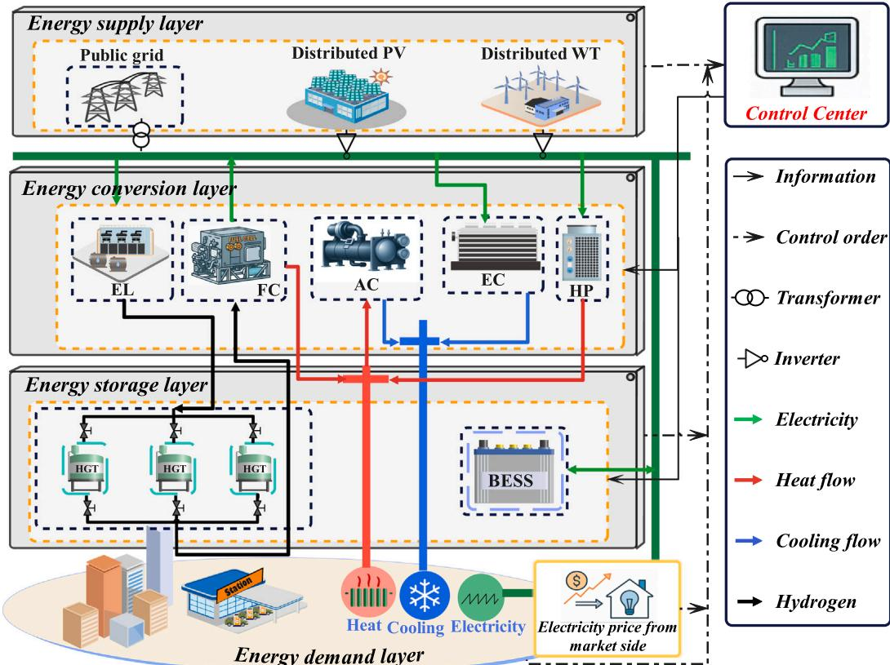  
Fig. 1. Schematic of the energy flows and components in H-IES.

where $\eta _ { e }$ is the energy conversion efficiency. $\eta _ { T }$ is the temperature coefficient. $T _ { P V , s t c }$ and $I _ { s t c }$ represent the standard temperature and the irradiance. The nominal power $P _ { P V , s t c }$ and operating temperature $T _ { t } ^ { P V }$ are respectively defined as:

$$
P _ {P V, s t c} = \eta_ {P V, s t c} A _ {P V} I _ {s t c},\tag{3}
$$

$$
T _ {t} ^ {P V} = T _ {a} + (T _ {N O C T} - T _ {a}) \frac {I _ {t}}{I _ {s t c}},\tag{4}
$$

where $A _ { P V }$ is the surface area. $\eta _ { P V , s t c }$ denotes the efficiency under standard conditions. $T _ { a }$ is the ambient temperature. $T _ { N O C T }$ is the nominal operating temperature.

## 3.1.2. Wind turbines

The WT generation depends on the wind speed, which determines its ability to capture wind energy. At time �, the instantaneous power can be expressed as [23]:

$$
P _ {t} ^ {W T} = \left\{ \begin{array}{l l} P _ {W T, \max} \frac {v _ {t} ^ {3} - v _ {i n} ^ {3}}{v _ {r} ^ {3} - v _ {i n} ^ {3}} & , \quad v _ {i n} \leq v _ {t} \leq v _ {r} \\ P _ {W T, m a x} & , \quad v _ {r} \leq v _ {t} \leq v _ {o u t} \\ 0 & , \quad O t h e r w i s e, \end{array} \right.\tag{5}
$$

where $v _ { \mathrm { i n } } , v _ { \mathrm { o u t } } ,$ and $v _ { \mathrm { r } }$ represent the wind speeds at cut-in, cut-out, and rated conditions, respectively. $P _ { W T , m a x }$ , denotes the rated power of WT.

## 3.2. Energy conversion units

## 3.2.1. Electric chillers, heat pumps and absorption chillers

Vapor compression EC, air source HP, and AC are key components for electricity, heat, and cooling conversion which can be uniformly molded as: [24]:

$$
P _ {t} ^ {i} = \frac {Q _ {t} ^ {i}}{\mathrm{COP} _ {i}}, \quad \forall i \in \{H P, E L, A C \},\tag{6}
$$

where $P _ { t } ^ { i }$ is the consumption power of component �. $\boldsymbol { Q } _ { t } ^ { i }$ denotes the generation power. $\mathrm { C O P } _ { i }$ is the coefficient of performance for component �.

## 3.2.2. Electrolyzers and fuel cells

In this study, proton exchange membrane EL and FC are applied. The mass flow rate produced by the $\mathbf { E L } ,$ which converts electricity into hydrogen gas via water electrolysis, can be calculated as [25]:

$$
m _ {t} ^ {H y, E L} = \frac {\eta^ {E L} P _ {t} ^ {E L}}{L H V},\tag{7}
$$

where $\eta ^ { E L }$ is the EL efficiency. $P _ { t } ^ { E L }$ is the consumption power by EL. ��� is the lower heating value of hydrogen.

During the operation of FC, hydrogen $\left( \mathrm { H } _ { 2 } \right)$ is split into protons and electrons at the anode. The protons pass through the electrolyte to the cathode, while the electrons flow through the external circuit, generating electrical power, which can be calculated as:

$$
P _ {t} ^ {F C} = \eta^ {F C} m _ {t} ^ {H y, F C} L H V,\tag{8}
$$

where $m _ { t } ^ { H y , F C }$ is the mass flow rate of hydrogen consumed by the FC at time �. $\eta ^ { F C }$ denotes the FC efficiency.

The excess heat from the FC is utilized for heating or cooling. A portion of the waste heat is used for heating, while another portion is used to power the AC system, converting the heat into cooling energy. The heating and cooling outputs from FC can be calculated as:

$$
Q _ {t} ^ {A C} = \gamma_ {A C} \cdot \eta^ {h, F C} m _ {t} ^ {H y, F C} L H V \cdot C O P _ {A C},\tag{9}
$$

$$
Q _ {t} ^ {H e a t} = (1 - \gamma_ {A C}) \eta^ {h, F C} m _ {t} ^ {H y, F C} L H V,\tag{10}
$$

where $\gamma _ { A C }$ represents the ratio of the heat used for driving the AC system. $\eta ^ { h , F C }$ is the FC heat efficiency. $C O P _ { A C }$ is the coefficient of performance of the AC.

## 3.3. Energy storage units

State of Charge (SoC) quantifies the ratio of a storage unit’s cur rently available energy to its rated capacity. The continuous-time evo lution of BESS and HGT can be described by [26]:

$$
\begin{array}{l} S o C _ {t} ^ {i} = (1 - \eta_ {i} ^ {s l}) S o C _ {t + 1} ^ {i} + \tau_ {s}. \\ \frac {\left(\eta_ {i} ^ {c h} U _ {t} ^ {i , c h} E _ {t} ^ {i , c h} - \frac {1}{\eta_ {i} ^ {d i s}} U _ {t} ^ {i , d i s} E _ {t} ^ {i , d i s}\right)}{C _ {i}}, \quad \forall i \in I _ {4}, \end{array}\tag{11}
$$

where $S o C _ { t } ^ { i }$ represents the SoC of component � at time �. $\eta _ { i } ^ { s l }$ denotes the self-loss efficiency. $\eta _ { i } ^ { c h }$ and $\eta _ { i } ^ { d i s }$ are the charging and discharging effi ciency of the device �. $E _ { t } ^ { i , c h }$ and $E _ { t } ^ { i , d i s }$ denotes charging and discharging energy rates, electrical power for BESS and hydrogen mass flow rate for HGT, respectively. $C _ { i }$ is the capacity of device $i ,$ and $\tau _ { s }$ represents the time interval. $U _ { t } ^ { i , c h }$ and $U _ { t } ^ { i , d i s }$ are binary variables indicating whether the device � is charging or discharging at time $t ,$ respectively.

## 3.4. System operation constraints

To ensure safe and stable transfer, conversion, and storage across all components during dynamic scheduling, the system must satisfy power, heat, cooling, and hydrogen balance constraints, as expressed by (12)–(15).

$$
P _ {t} ^ {\text { Grid }} + \sum_ {i \in I _ {1}} P _ {t} ^ {i} + P _ {t} ^ {F C} - \left(\Delta S o C _ {t} ^ {B E S S} C _ {B E S S} \right.
$$

$$
\left. + P _ {t} ^ {E C} + P _ {t} ^ {H P} + P _ {t} ^ {E L}\right) = P _ {t} ^ {e l, D D},\tag{12}
$$

$$
Q _ {t} ^ {H e a t} + Q _ {t} ^ {H P} = Q _ {t} ^ {h e, D D},\tag{13}
$$

$$
Q _ {t} ^ {A C} + Q _ {t} ^ {E C} = Q _ {t} ^ {c o, D D},\tag{14}
$$

$$
m _ {t} ^ {H y, E L} - m _ {t} ^ {H y, F C} - \Delta S o C _ {t} ^ {H G T} C _ {H G T} = 0,\tag{15}
$$

where $P _ { t } ^ { G r i d }$ represents the power exchange with the grid at time � (positive for import, negative for export). �����(� ∈ $I _ { 4 } )$ represents the change in SoC of device �. $P _ { t } ^ { e l , D D } , \hat { Q _ { t } ^ { h e , D D } }$ and $\dot { Q } _ { t } ^ { c o , D D }$ are the demands of electricity, heat and cooling power, respectively.

To ensure safety and economic operation during dynamic schedul ing, the threshold for power exchange between the grid and system is constrained by $\operatorname { E q . }$ (16). For components $I _ { 1 } , I _ { 2 }$ and FC, their maximum operational power limits are uniformly expressed by Eq. (17). For energy storage devices $I _ { 4 } ,$ the charging and discharging energy rates are limited by their maximum values, as expressed by Eqs. (18) and (19). To avoid overcharging or over-discharging, devices $I _ { 4 }$ are restricted to operate within an allowable SoC range, as expressed by Eq. (20). To ensure accuracy of scheduling, the SoC of BESS is subject to state regression constraint (21). Charging and discharging operations of the BESS are mutually exclusive, as constrained by Eq. (22).

$$
P _ {g r i d, m i n} \leq P _ {t} ^ {G r i d} \leq P _ {g r i d, m a x},\tag{16}
$$

$$
P _ {t} ^ {i} \leq P _ {i, m a x}, \quad \forall i \in I _ {1} \cup I _ {2} \cup \{F C \},\tag{17}
$$

$$
- P _ {i, m a x} \leq P _ {t} ^ {i} \leq P _ {i, m a x}, \quad \forall i \in \{B E S S \},
$$

$$
- m _ {i, m a x} \leq m _ {t} ^ {i} \leq m _ {i, m a x}, \quad \forall i \in \{H G T \},\tag{18}
$$

(19)

$$
S o C _ {i, m i n} \leq S o C _ {t} ^ {i} \leq S o C _ {i, m a x}, \quad \forall i \in I _ {4},\tag{20}
$$

$$
S o C _ {t = 1} ^ {B E S S} = S o C _ {t = T} ^ {B E S S},\tag{21}
$$

$$
U _ {t} ^ {B E S S, c h} \cdot U _ {t} ^ {B E S S, d i s} = 0.\tag{22}
$$

## 3.5. Optimization objectives

In this study, carbon emissions and renewable energy penetration are incorporated into the comprehensive cost to ensure a balanced trade-off among economic performance, environmental impact, and renewable utilization efficiency. The optimization objective can be expressed as:

$$
\text {   min   } C C = \sum_ {t} \left(C _ {t} ^ {E T} + C _ {t} ^ {I E S} + C _ {t} ^ {C U T} + C _ {t} ^ {C O 2}\right)\tag{23}
$$

�.�. Eqs. (16)-(22)

where $C _ { t } ^ { E T } , \ C _ { t } ^ { I E S } , \ C _ { t } ^ { C U T }$ and $C _ { t } ^ { C O 2 }$ represent the electricity trading cost, IES operational cost, curtailment cost and carbon emission cost at time $t ,$ respectively.

The electricity trading cost $C _ { t } ^ { E T }$ results from the necessity to import or export energy in response to demand fluctuations or intermittent RES generation, and is formulated in Eq. (24). $C _ { t } ^ { I E S }$ encompasses the operational and maintenance costs of all components, with the aim of optimizing equipment utilization and economic efficiency, as formulated in Eq. (25).

$$
C _ {t} ^ {E T} = P _ {t} ^ {G r i d},\tag{24}
$$

$$
\begin{array}{c} C _ {t} ^ {I E S} = \sum_ {i \in I _ {1} \cup I _ {3}} \kappa_ {i} P _ {t} ^ {i} + \sum_ {i \in I _ {2}} \kappa_ {i} Q _ {t} ^ {i} + \\ D _ {t} ^ {B E S S} + \kappa_ {g r i d} (P _ {t} ^ {G r i d} - P _ {m a x} ^ {g r i d}) \end{array} ,\tag{25}
$$

where $\lambda _ { p }$ is the electricity price. $\kappa _ { i }$ denotes the operating cost coefficient. $D _ { t } ^ { ^ { P } E S S }$ is the BESS degradation cost, calculated in accordance with the method described in Ref. [27]. $\kappa _ { g r i d }$ is the service fee incurred from exceeding the power purchase limit.

The capacity of the grid to absorb the renewable energy injected by the system is limited. The resulting economic loss due to energy curtailment is given by:

$$
C _ {t} ^ {C U T} = \nu_ {r e s} (m i n (P _ {t} ^ {G r i d}, P _ {t} ^ {W T} + P _ {t} ^ {P V}) - \left| P _ {g r i d, m i n} \right|),\tag{26}
$$

where $\nu _ { r e s }$ is the cost coefficient for unutilized renewable energy.

In the proposed H-IES, carbon emissions arise from electricity ob tained from the main grid. The corresponding carbon emission cost can be expressed as follows:

$$
C _ {t} ^ {C O 2} = \left\{ \begin{array}{l l} \lambda_ {C O 2}   \phi_ {g r i d}   P _ {t} ^ {G r i d}, & P _ {t} ^ {G r i d} > 0 \\ 0, & P _ {t} ^ {G r i d} \leq 0, \end{array} \right.\tag{27}
$$

where $\lambda _ { C O 2 }$ is the carbon emissions price per ton of CO2. $\phi _ { g r i d }$ denotes the emission per kilowatt of electricity.

## 4. Solution methodology

In this section, the H-IES scheduling task is modeled as two augmented MDPs to capture sequential decision-making features. The GHTD3 algorithm is proposed to realize coordinated decision-making across multiple time horizons.

## 4.1. Two augmented MDPs

The standard MDP framework treats each action as a one-step event, rendering it inadequate for problems requiring temporally extended decisions. To simultaneously capture long-term and short-term features in H-IES scheduling, this work employs two augmented MDPs: a SMDP to generate goals over multiple time steps, and a GAMDP to translate goals into per-step control actions, enabling the hierarchical policy to coordinate long-horizon planning with short-horizon execution.

SMDP allows a single agent action � to span � time steps and can be formalized as $\langle S , A , P , R , \gamma \rangle$ , where state space � includes all possible observations at decision times. � is the action space, with each action � ∈ � persisting for � steps. $P \left( { { s } _ { t + c } } \mid { { s } _ { t } } , a \right)$ is the state-transition probability, characterizing the stochastic evolution from state $s _ { t }$ at time � to $s _ { t + c }$ at time �+� under action �. The cumulative reward $\sum R _ { t : t + c - 1 }$ quantifies the long-term return contributed by action � over its �-step execution. $\gamma \in [ 0 , 1 )$ is the discount factor, which attenuates rewards further in the future. Based on the SMDP, the GAMDP introduces a subgoal space $G ,$ and is defined as $\langle S , A , G , P , R , \gamma \rangle \cdot \ g \in G$ represents the desired state-increment over a �-step horizon. In the H-IES scheduling tasks, the specific designs of �, �, � and � are as follows.

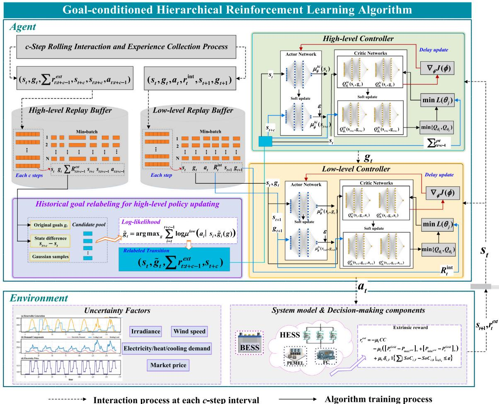  
Fig. 2. Illustration of the proposed GHTD3 algorithm architecture and policy learning procedure.

State space �: At time �, the global state vector is defined as Eq. (28), which includes market prices, supply-side information, demand-side information, and the status of storage components.

$$
\begin{array}{c} s _ {t} = [ \lambda_ {t}, P _ {t} ^ {P V}, P _ {t} ^ {W T}, P _ {t} ^ {e l, D D}, Q _ {t} ^ {h e, D D}, \\ Q _ {t} ^ {c o, D D}, S o C _ {t} ^ {B E S S}, S o C _ {t} ^ {H G T} ] \end{array} .\tag{28}
$$

Action space A: At time �, the high-level action is the subgoal $g _ { t ^ { \star } }$ The low-level action vector is defined as $a _ { t } = [ P _ { t } ^ { B E S S } , m _ { t } ^ { H y , E L } , m _ { t } ^ { H y , F \ddot { C } } ] ,$ enabling coordination of HSS and BESS.

Goal set G: At time �, the goals are specified as the desired SoC in crement for both the BESS and HGT, expressed as $g _ { t } = [ A S o C _ { t } ^ { B E S S } , A S o C _ { t } ^ { H G T } ] ,$

Reward R: Rewards comprise extrinsic and intrinsic components, guiding the high-level agent in subgoal generation and the low-level agent in subgoal tracking, respectively. Considering the system’s com prehensive cost, the grid exchange power limits, and the SoC regression constraint, the extrinsic reward $r _ { t } ^ { e x t }$ is defined as follows:

$$
\begin{array}{r l} & {r _ {t} ^ {e x t} = - \mu_ {1} \widetilde {C C}} \\ & {- \mu_ {2} \Big (\big [ P _ {t} ^ {G r i d} - P _ {\max} ^ {g r i d} \big ] _ {+} + \big [ P _ {\min} ^ {g r i d} - P _ {t} ^ {G r i d} \big ] _ {+} \Big)} \\ & {+ \mu_ {3} \delta_ {t, T} \mathbf {1} \big \{\sum | S o C _ {i, T} - S o C _ {i, 0} | _ {i \in I _ {4}} \leq \xi \big \},} \end{array}\tag{29}
$$

where $\mu _ { 1 } , \mu _ { 2 }$ and $\mu _ { 3 }$ are the weighting coefficient. $\widetilde { C C }$ is the normalized comprehensive cost at time $t . \ [ x ] _ { + } ~ = ~ \operatorname* { m a x } ( 0 , x )$ is the positive-part operator, which is nonzero only when $x > 0 . \delta _ { t , T }$ denotes the Kronecker delta, and is equal to 1 if $t = T$ , and 0 otherwise. �{⋅} is the indicator function, and is equal to 1 when its argument is true, and 0 otherwise. $S o C _ { i , T }$ and $S o C _ { i , 0 }$ are the SoC of the storage system � at the final time � and initial time 0, respectively. � is the tolerance threshold for acceptable SoC deviation at $t = T ,$

The intrinsic reward combines a subgoal-tracking penalty with a scaled extrinsic component. The former ensures the low-level policy adheres to high-level directives, while the latter aligns local objectives h h ll l h d f l d

$$
r _ {t} ^ {i n t} = - \left\| [ s _ {t} ] _ {S o C} + g _ {t} - [ s _ {t + 1} ] _ {S o C} \right\| _ {2} + \alpha r _ {t} ^ {e x t},\tag{30}
$$

where $[ s _ { t } ] _ { S o C } \in \mathbb { R } ^ { 2 }$ is the subvector of the last two components of $s _ { t } .$ . � is the reward scaling factor to balance intrinsic and extrinsic rewards.

## 4.2. The proposed GHTD3 algorithm

In this section. a detailed exposition of the GHTD3 algorithm's design principles and policy-learning workflow is provided. As shown in Fig. 2, its core components can be divided into four parts: (1) the hierarchical decision structure, which integrates long-horizon macrogoal planning with short-horizon fine-grained action execution; (2) the internal controller design, which employs TD3 to support both high-level and low-level policy optimization; (3) the historical goal relabeling, which corrects distributional drift in high-level learning; and (4) the layered policy-learning process, covering experience collection, goal generation and propagation, action selection, replay-buffer up dates, and soft target updates. The following subsections will presents each of these four parts in detail.

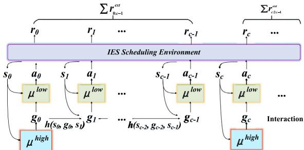  
Fig. 3. Illustration of the �-step interaction between the high-level and low level policies in the hierarchical framework.

## 4.2.1. Hierarchy of decision making

To address the challenges of multi-horizon decision-making prob lems, this study proposes a hierarchical framework composed of two levels of policies: a high-level policy $\mu ^ { h i }$ and a low-level policy $\mu ^ { l o } .$

Fig. 3 illustrates the interaction and coordination process between the two layers within a typical �-step decision cycle. At the beginning of each cycle, the high-level policy $\mu ^ { h i }$ observes the current environment state $s _ { t }$ and generates a macro goal $g _ { t } ,$ which reflects the preferred scheduling direction or operational tendency over the next � steps. This goal remains fixed throughout the cycle and is passed as a conditional input to the low-level policy $\mu ^ { l o }$ for decision-making. At each time step $i \in [ t , t + c - 1 ] ,$ , the low-level policy $\mu ^ { l o }$ takes both the current state $s _ { i }$ and goal $g _ { i }$ as inputs to produce a control action $a _ { i } .$ . To enhance the effectiveness of goal guidance, the goal is dynamically updated using a transition function when step � ∈ [�, � + � − 1]:

$$
g _ {i + 1} = h (s _ {i}, g _ {i}, s _ {i + 1}) = s _ {i} + g _ {i} - s _ {i + 1}.\tag{31}
$$

This update reflects the remaining deviation between the original goal and the actual state progression, providing step-wise directional adjustment for the low-level controller. During this process, the environment returns an extrinsic reward $r _ { i } ^ { e x t }$ at each time step. After completing the �-step interval, the high-level policy $\mu ^ { h i }$ aggregates the accumulated reward $\sum { r _ { t : t + c - 1 } ^ { e x t } }$ to evaluate the effectiveness of the goal and updates its parameters accordingly. Meanwhile, the low-level policy $\mu ^ { l o }$ is trained using both the extrinsic reward and an intrinsic d h h ll h b d l h the intended goal trajectory (as defined in Eq. (30)).

The interaction and coordination between the two layers are primarily realized through three tightly coupled parts. First, the goal $g _ { t }$ issued by the high-level policy explicitly conveys long-horizon scheduling intent and serves as a conditional input for the low-level control policy. Second, the goal transition function $h ( s _ { i } , g _ { i } , s _ { i + 1 } )$ recursively updates the residual subgoal at each step, providing continuous directional guidance for low-level decision-making. Third, a two-level reward structure is adopted: the high-level policy receives the cumulative extrinsic reward to evaluate the effectiveness of goals, while the low-level policy leverages both extrinsic and intrinsic rewards to improve execution quality. These components jointly establish a dynamic feedback loop between planning and control, enabling the hierarchical structure to achieve robust scheduling in complex multi-energy environments.

## 4.2.2. Internal controllers design

As shown in Fig. 2, the high-level and low-level controllers adopt TD3 [28], ensuring stable and efficient regulation within continuous action domains. For unified notation, the high-level state and action are defined as $x _ { t } ^ { \mathrm { { h i } } } = s _ { t } , a _ { t } ^ { \mathrm { { h i } } } = g _ { t } ;$ , and the low-level state and action as $x _ { t } ^ { \mathrm { l o } } \ = \ [ s _ { t } , g _ { t } ] , a _ { t } ^ { \mathrm { l o } } \ = \ a _ { t } .$ . Each controller maintains two critic networks $Q _ { \theta _ { 1 } } , Q _ { \theta _ { 2 } }$ and one actor network $\mu _ { \phi } { \mathrm { : } }$ , along with corresponding target networks $\{ Q _ { \bar { \theta } _ { 1 } } , Q _ { \bar { \theta } _ { 7 } } , \mu _ { \bar { \phi } } \}$ that softly track the online parameters.

The critic networks are trained to approximate the optimal actionvalue function by minimizing the Bellman error, defined as the expected squared difference between the current Q-estimate and its Bellman target. Formally, the critic the loss is:

$$
L (\theta_ {j}) = \mathbb {E} _ {(x, a, r, x ^ {\prime})} \Big [ \big (Q _ {\theta_ {j}} (x, a) - y \big) ^ {2} \Big ], \quad j = 1, 2,\tag{32}
$$

where the target � is computed using the target networks and the observed reward:

$$
y = r + \gamma \min _ {k = 1, 2} Q _ {\bar {\theta} _ {k}} \left(x ^ {\prime}, \tilde {a} ^ {\prime}\right).\tag{33}
$$

To reduce overestimation bias and improve stability, TD3 adds clipped Gaussian noise to the target action:

$$
\tilde {a} ^ {\prime} = \mu_ {\bar {\phi}} (x ^ {\prime}) + \mathrm{clip} (\mathcal {N} (0, \sigma), - \epsilon , \epsilon),\tag{34}
$$

where $\mathcal { N } ( 0 , \sigma )$ denotes zero-mean Gaussian noise and � bounds its magnitude.

The actor is trained to maximize the estimated Q-value by following the deterministic policy gradient. Its parameter update is given by:

$$
\nabla_ {\phi} J = \mathbb {E} _ {x \sim D} \bigg [ \nabla_ {a} Q _ {\theta_ {1}} (x, a) \Big | _ {a = \mu_ {\phi} (x)} \nabla_ {\phi} \mu_ {\phi} (x) \bigg ],\tag{35}
$$

where $_ D$ denotes the replay buffer. To further improve stability, TD3 uses delayed policy updates and soft-target tracking. While both critic networks are updated at every time step, the actor and all target networks are only updated once every � steps. Target parameters � are tracked toward the online parameters � via:

$$
\bar {\psi} \leftarrow \tau \psi + (1 - \tau) \bar {\psi}, \qquad 0 <   \tau \ll 1,\tag{36}
$$

where � controls the update rate, smoothing the evolution of the target networks and mitigating training oscillations.

## 4.2.3. Historical goal relabeling for high-level learning

High-level policy updates suffer from stale goals in stored transitions, since the low-level behavior that originally generated those trajectories has since evolved. Consequently, using these uncorrected transitions introduces distributional bias and destabilizes learning. To address this, retrospective goal relabeling inspired by [29] is applied. For each stored tuple $( s _ { t } , g _ { t } , r _ { t : t + c - 1 } ^ { e x t } , s _ { t + c } ) ,$ , the original goals $g _ { t }$ is replaced by the relabeled goals $\tilde { g } _ { t } ,$ chosen to maximize the log-likelihood of the historical low-level action sequence under the current low-level policy $\mu ^ { l o }$ . Under Gaussian noise, $\tilde { g } _ { t }$ can be approximated by:

$$
\begin{array}{l} \tilde {g} _ {t} = \arg \max _ {g} \sum_ {i = t} ^ {t + c - 1} \log \mu^ {l o} (a _ {i} \mid s _ {i}, \tilde {g} _ {i}) \\ \approx \arg \max _ {g} (- \frac {1}{2} \sum_ {i = t} ^ {t + c - 1} \left\| a _ {i} - \mu^ {l o} (s _ {i}, \tilde {g} _ {i}) \right\| _ {2} ^ {2} + c o n s t) \end{array} ,\tag{37}
$$

where subsequent goals $\tilde { g } _ { t + 1 : t + c - 1 }$ are propagated by $\widetilde { g } _ { i + 1 } = h \big ( s _ { i } , \widetilde { g } _ { i } , s _ { i + 1 } \big )$

As shown in $\mathrm { F i g . ~ } 2 , \tilde { g } _ { t }$ is drawn from a candidate pool by selecting the one with highest log-likelihood. The candidates include the original goals, the state increment difference $s _ { t + c } - s _ { t } ,$ and Gaussian-perturbed variants. This correction realigns high-level transitions with the current low-level dynamics, significantly reducing bias and accelerating convergence.

## 4.2.4. Policies learning

Algorithm 1 outlines the GHTD3 training loop, and Algorithm 2 specifies the internal TD3 update steps, as summarized in Fig. 2.

Over $E _ { \mathrm { m a x } }$ episodes, hierarchical policy Learning, an �-greedy exploration (decaying by ��) is introduced to balance exploration and exploitation. Every � steps, $g _ { t }$ is generated either randomly or from $\mu _ { \phi } ^ { h i } ( s _ { t } ) .$ , and on other steps propagated by transition function $h .$ At each time step, the chosen low-level action $a _ { t }$ is applied to the environment, which returns the next state and immediate rewards $r _ { t } ^ { e x t }$ and $r _ { t } ^ { i n t }$ . Lowlevel transitions are stored in $\mathcal { D } ^ { l o }$ . Every � steps, high-level transitions are stored in $\pmb { D } ^ { h i }$ . Policy updates proceed as follows: the low-level TD3 critic and actor are updated each step using a mini-batch $N _ { 1 }$ from $D ^ { \mathrm { l o } }$ The high-level TD3 is updated every � steps by sampling $N _ { 1 }$ from $\smash { \mathcal { D } ^ { \mathrm { { h i } } } , }$ relabeling goals to form $\tilde { N } _ { 2 } ,$ and applying TD3 with learning rates $\alpha _ { Q }$ (critics) and $\alpha _ { \mu }$ (actor) per, as shown in (32) and (35). Finally, all target networks are softly updated with coefficient � and the actor/target updates are delayed by � steps to enhance stability.

Algorithm 1 GHTD3 hierarchical policy learning.

1: Input: Initialize network parameters $\phi^{\mathrm{hi}}$, $\theta_j^{\mathrm{hi}}$, $\phi^{\mathrm{lo}}$, $\theta_j^{\mathrm{lo}}$, target network parameters $\bar{\phi}^{\mathrm{hi}}$, $\bar{\theta}_j^{\mathrm{hi}}$, $\bar{\phi}^{\mathrm{lo}}$, $\bar{\theta}_j^{\mathrm{lo}}(j = 1,2)$, replay buffers $D^{\mathrm{hi}}$ and $D^{\mathrm{lo}}$, exploration coefficient $\varepsilon \leftarrow 1$

2: Output: Two learned policies $\mu_\phi^{\mathrm{hi}}$ and $\mu_\phi^{\mathrm{lo}}$

3: for episode = 1 to $E_{\max}$ do

4:    $s \leftarrow s_0$

5:    for $t = 0$ to $T - 1$ do

6:    if $t$ mod $c = 0$ then

7:    $g_t \sim \mu_\phi^{hi}(s_t)$ with probability $1 - \varepsilon$

8:    else

9:    $g_t \leftarrow h(s_{t-1}, g_{t-1}, s_t)$

10:    end if

11:    $a_t \sim \mu_\phi^{lo}(s_t, g_t)$ with probability $1 - \varepsilon$

12:    Execute $a_t$ and obtain $s_{t+1}$, $r_t^{ext}$ and $r_t^{int}$

13:    Store $(s_t, g_t, a_t, r_t^{int}, s_{t+1}, g_{t+1})$ in $D^{lo}$

14:    if $t$ mod $c = c - 1$ then

15:    Store $(s_t, g_t, r_{t:t+c-1}^{ext}, s_{t+c}, s_{t:t+c}, a_{t:t+c-1})$ in $D^{hi}$

16:    end if

17:    Sample $N_1$ from $D^{lo}$

18:    Update low-level controller

19:    if $t$ mod $c = 0$ then

20:    Sample $N_2$ from $D^{hi}$

21:    Relabel goal as $\tilde{g}_t$ by Eq.(37) and obtain $\tilde{N}_2$

22:    Update high-level controller

23:    end if

24:    end for

25:    $\varepsilon \leftarrow \max(\varepsilon_{\min}, \varepsilon - \Delta\varepsilon)$

26: end for

Algorithm 2 Internal TD3 controllers updates.

1: Input: Mini-batch  $N_{1}$  or  $\tilde{N}_{2}$ , networks  $(\mu_{\phi}, Q_{\theta_{1}}, Q_{\theta_{2}})$ , target networks  $(\mu_{\bar{\phi}}, Q_{\bar{\theta}_{1}}, Q_{\bar{\theta}_{2}})$ 

2: Output: The updated policy  $\mu_{\phi}(x)$ 

3: for i = 1 to N do

4:  $\tilde{a}_{i}^{\prime} = \mu_{\bar{\phi}}(x_{i}^{\prime}) + \text{clip}(\mathcal{N}(0, \sigma), -\epsilon, \epsilon)$ 

5:  $y_{i} = r_{i} + \gamma \min_{k=1,2} Q_{\bar{\theta}_{k}}(x_{i}^{\prime}, \tilde{a}_{i}^{\prime})$ 

6: end for

7:  $\theta_{j} \leftarrow \theta_{j} - \alpha_{Q} L(\theta_{j}), \quad j = 1, 2$ 

8: if update step % d == 0 then

9:  $\phi \leftarrow \phi + \alpha_{\mu} \nabla_{\phi} J$ 

10:  $\bar{\theta}_{j} \leftarrow \tau \theta_{j} + (1 - \tau) \bar{\theta}_{j}, \quad j = 1, 2$ 

11:  $\bar{\phi} \leftarrow \tau \phi + (1 - \tau) \bar{\phi}$ 

12: end if

## 5. Simulation results

In this section, the proposed GHTD3 is validated by comparing with two benchmark algorithms across three seasonal scenarios. Finally, the sensitivity analysis of key algorithm parameters is performed.

Table 2  
Key design and operational parameters for H-IES components.

<table><tr><td>Components</td><td>Parameters</td><td>Values</td></tr><tr><td rowspan="6">PV</td><td> $\eta_e$ </td><td>0.9</td></tr><tr><td> $\eta_T$ </td><td>-0.381%/°C</td></tr><tr><td> $\eta_{PV,stc}$ </td><td>0.87</td></tr><tr><td> $A_{PV}$ </td><td>5500 m2</td></tr><tr><td> $T_{NOCT}$ </td><td>45.4 °C</td></tr><tr><td> $I_{stc}$ </td><td>800 W/m2</td></tr><tr><td rowspan="4">WT</td><td> $P_{WT,max}$ </td><td>5000 kW</td></tr><tr><td> $v_i n$ </td><td>2 m/s</td></tr><tr><td> $v_r$ </td><td>10 m/s</td></tr><tr><td> $v_{out}$ </td><td>30 m/s</td></tr><tr><td rowspan="6">Energy conversion units</td><td> $COP_{EC}$ </td><td>4.2</td></tr><tr><td> $COP_{HP}$ </td><td>2.8</td></tr><tr><td> $COP_{AC}$ </td><td>0.8</td></tr><tr><td> $\eta^{EL}$ </td><td>0.65</td></tr><tr><td> $\eta^{FC}$ </td><td>0.47</td></tr><tr><td> $\eta^{h,FC}$ </td><td>0.39</td></tr><tr><td rowspan="10">Energy storage units</td><td> $\eta_B^{sl} ESS$ </td><td>0.002</td></tr><tr><td> $\eta^{dis}_{BESS}$ </td><td>0.97</td></tr><tr><td> $\eta^{ch}_{BESS}$ </td><td>0.92</td></tr><tr><td> $\eta^{dis}_{HGT}$ </td><td>0.98</td></tr><tr><td> $\eta^{ch}_{HGT}$ </td><td>0.98</td></tr><tr><td> $C_{BESS}$ </td><td>5000 kWh</td></tr><tr><td> $C_{HGT}$ </td><td>800 kg</td></tr><tr><td> $P_{BESS,max}$ </td><td>2000 kW</td></tr><tr><td> $SoC_{i,min}, i \in I_4$ </td><td>0.1</td></tr><tr><td> $SoC_{i,max}, i \in I_4$ </td><td>0.9</td></tr><tr><td rowspan="8">Grid and price</td><td> $P_{grid,min}$ </td><td>-500 kW</td></tr><tr><td> $P_{grid,max}$ </td><td>1500 kW</td></tr><tr><td> $\phi_{grid}$ </td><td>0.832 kg/kW</td></tr><tr><td> $\kappa_{grid}$ </td><td>1500 kW</td></tr><tr><td> $\kappa_i, i \in I_1 \cup I_3$ </td><td>0.03 $/kWh</td></tr><tr><td> $\kappa_i, i \in I_2$ </td><td>0.008 $/kWh</td></tr><tr><td> $\nu_{res}$ </td><td>0.041 $/kWh</td></tr><tr><td> $\lambda_{CO2}$ </td><td>0.012 $/kg</td></tr></table>

Hyperparameter configuration for the proposed GHTD3 approach.

<table><tr><td>Parameters</td><td>Values</td></tr><tr><td>Maximum number of episodes  $E_{max}$ </td><td>5000</td></tr><tr><td>Episode horizon length  $T$ </td><td>168</td></tr><tr><td>Subgoal update interval  $c$ </td><td>8</td></tr><tr><td>Exploration decay rate  $\Delta \epsilon$ </td><td> $1.5 \times 10^{-6}$ </td></tr><tr><td>Actor learning rate  $\alpha_{\mu}$   $\alpha$ </td><td> $3 \times 10^{-4}$ </td></tr><tr><td>Critic learning rate  $\alpha_{Q}$ </td><td> $3 \times 10^{-4}$ </td></tr><tr><td>Soft update coefficient  $\tau$ </td><td>0.005</td></tr><tr><td>Discount factor  $\gamma$ </td><td>0.99</td></tr><tr><td>policy noise  $\sigma$ </td><td>0.2</td></tr><tr><td>Noise clip  $\epsilon$ </td><td>0.5</td></tr><tr><td>Policy update delay  $d$ </td><td>2</td></tr><tr><td>High-level batch size  $N_{1}$ </td><td>32</td></tr><tr><td>Low-level batch size  $N_{1}$ </td><td>32</td></tr><tr><td>High-level buffer  $D^{\text{hi}}$  size</td><td>10000</td></tr><tr><td>Low-level buffer  $D^{\text{lo}}$  size</td><td>10000</td></tr><tr><td>Reward scaling factor  $\alpha$ </td><td>0.3</td></tr></table>

## 5.1. Simulation settings

In this study, the simulation scenario is based on an H-IES serving a residential community in Hailar, Inner Mongolia. The experiments were conducted on a system running the Ubuntu 20.04.4 LTS operating system, powered by an AMD Ryzen 9 7950X 16-core processor and an NVIDIA GeForce RTX 4090 GPU, using the PyTorch 2.6.0+cu118 deep learning framework.

(1) Parameters and data: Key design and operational parameters for H-IES components, sourced from [16,22,23,26,30–36], are summarized in Table 2. Fig. 4 shows the data for three representative seasons, summer, winter and the transition period. In Fig. 4(a), wind speed, ambient temperature, and solar irradiance profiles are drawn from the U.S. National Renewable Energy Laboratory observations, alongside the adopted time-of-use electricity tariffs. Fig. 4(b) shows the community’s electric, heat, and cooling load curves, with the electric load drawn from [37], while heat and cooling load profiles from [23].

(a)  
(b)  
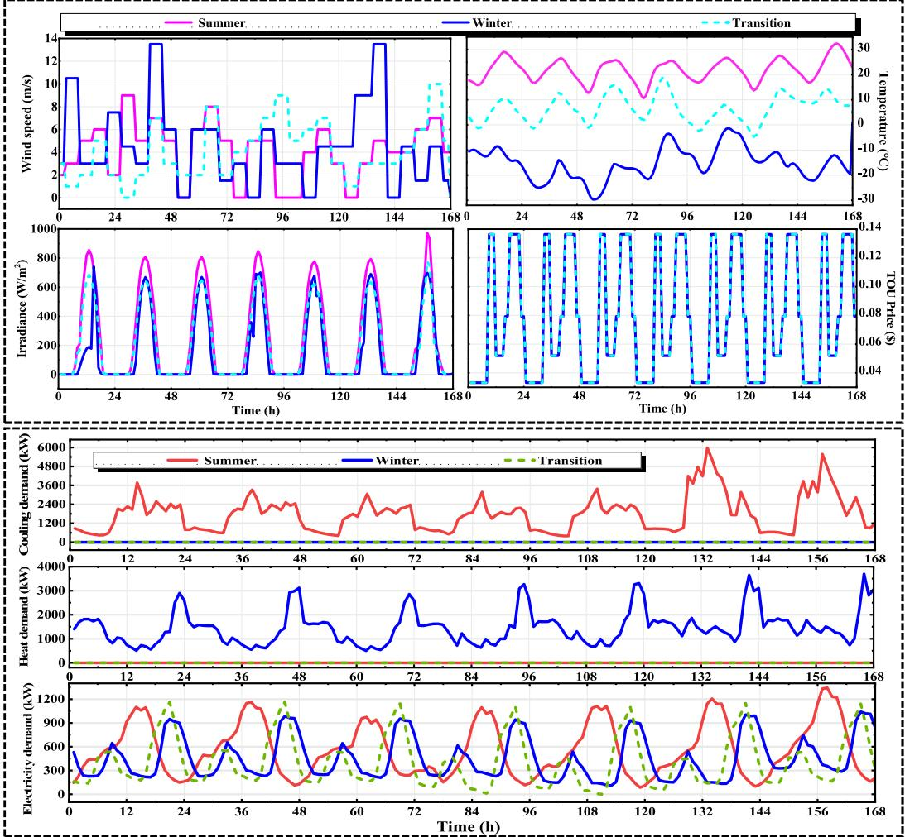  
Fig. 4. Hourly distribution of energy demands, energy supplies and market price under three seasonal scenarios: (a) Irradiance,temperature, wind speed and TOU price. (b) Energy demands: cooling demand, heat demand and electricity demand.

(2) Scenarios and benchmark algorithms:

Scenario 1 (summer): high ambient temperature and irradiance, elevated electric demand, centralized cooling only $( \gamma _ { A C } = 1$ in Eq. (9)).

Scenario 2 (winter): low temperature and irradiance, reduced electric demand, centralized heating only $\left( \gamma _ { A C } = 0 \mathrm { i n E q . \ ( 9 ) } \right)$ ).

Scenario 3 (transition): moderate climate with neither centralized heating nor cooling.

To validate the approach, this paper configures and evaluates the following four algorithms under three representative operating scenar ios:

GHTD3: the proposed hierarchical DRL algorithm. Parameter settings are given in Table 3.

TD3: a single-layer DRL algorithm. It employs the same network architecture and parameters as GHTD3 to isolate the performance gains attributable to the hierarchical design.

PSO: a traditional heuristic optimization baseline method. PSO assumes that the PV output, wind power, the three types of load, and electricity price information over the next 168 h are fully known and free of error. Its parameters are set as follows: population size � = 50; maximum number of iterations � = 500; inertia weight linearly decreasing from $w _ { m a x } = 0 . 9 \mathrm { t o } w _ { m m i n } = 0 . 4 ;$ and acceleration coefficients $c _ { 1 } = c _ { 2 } = 1 . 5$

Gurobi (QP): A continuous convex QP baseline using the commercial solver Gurobi 10.0.1 [10]. To ensure model tractability and computational efficiency, approximations are applied to the nonconvex and nonlinear components of the original model. In Eq. (29), the battery degradation term $\psi ( \delta _ { t } ) ~ = ~ a _ { 0 } \delta _ { t } ^ { 2 . 0 3 }$ (adapted from [27]) is linearized using a two-step method: the first step solves with a constant coefficient, and the second refines time-varying coefficients based on the cumulative discharge $\delta _ { t } .$ . The second term $[ x ] _ { + }$ is reformulated using linear slack variables and upper envelope constraints to preserve convexity. The third term is incorporated into the objective as a convex quadratic penalt $\begin{array} { r } { \sum _ { i \in I _ { 4 } } \left( S o C _ { i , T } - S o C _ { i , 0 } \right) ^ { 2 } } \end{array}$ . The QP model is solved with a time limit 3600�, using solver tolerances $\varepsilon _ { f e a s } \ = \ 1 0 ^ { - 4 }$ and $\varepsilon _ { o p t } = 1 0 ^ { - 5 }$ for feasibility and optimality, respectively.

## 5.2. Optimization results and comparative analysis

In this section, the optimization results of GHTD3 and four benchmark algorithms under three scenarios are presented. Training, scheduling, and cost performance are evaluated to comprehensively assess their effectiveness.

## 5.2.1. Training performance

In this section, the traditional PSO and Gurobi method do not rely on neural network-based policy training, and therefore its convergence is not compared in this section. Fig. 5(a)-(c) compares cumulative training rewards for GHTD3 (red) and single-level TD3 (yellow) across three scenarios. In terms of convergence speed, both GHTD3 and TD3 converge to stable performance after roughly 170 × 20 episodes in Scenarios 1 and 2. In Scenario 3, GHTD3 reaches its reward inflection point about 12% earlier than TD3. Notably, the reward curves of GHTD3 in Scenarios 1 and 2 exhibit a distinctive ‘double-peak’ rise. Early in training (� remains high), the low-level controller’s exten sive random exploration rapidly discovers short-term subgoal-satisfying actions, driving a sharp external reward increase. Once � decays to its minimum value, the high-level actor’s subgoal proposals dominate, coordinating both policy tiers for global optimization. GHTD3 achieves cumulative rewards of −17.59, −58.59, and −0.16 in the three sce narios, versus TD3’s −28.26, −81.25, and −37.88. These correspond to relative improvements of approximately 37.8%, 27.9%, and 99.6%, confirming GHTD3’s superior policy quality. For training stability, GHTD3 shows reduced oscillation compared to TD3 in Scenario 2, but exhibits slightly larger fluctuations in Scenarios 1 and 3 due to more frequent subgoal switches. Overall, GHTD3 delivers faster convergence and higher-quality policies than TD3 across all scenarios. Its hierarchical design consistently enhances learning, although the increased subgoal-switching rate can introduce additional volatility in certain conditions.

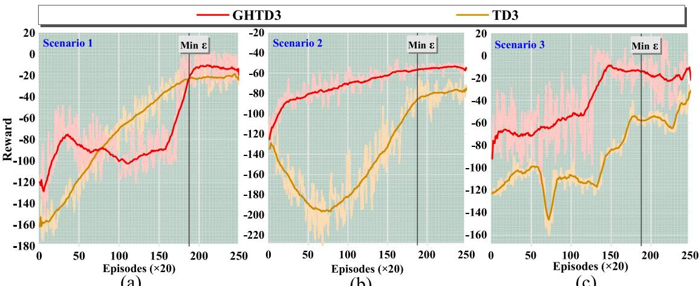  
(a)  
(b)  
(c)  
Fig. 5. Cumulative training rewards for GHTD3 and TD3 across three scenarios: (a) Scenario 1; (b) Scenario 2; (c) Scenario 3.

## 5.2.2. Scheduling performance

GHTD3 and two benchmark algorithms across three scenarios by ex amining the energy-balance profiles and storage-SoC trajectories shown in Figs. 6 to 9 are compared.

(1) Scenario 1 (summer): The energy balance results are shown in Fig. 6. In Fig. 6(a), GHTD3 exploits peak–valley price arbitrage (e.g., near hours 12) and leverages BESS and FC discharges to cover load peaks and RES shortfalls (e.g., near hours 36 and 72). On the cooling side, GHTD3 captures FC waste heat to drive the AC and partners it with EC cooling. AC compensates during low-load periods to avoid costly EC startups, producing a complementary peak-shifting pattern between FC output and cooling demand. By contrast, TD3 (Fig. 6(b)) shows larger fluctuations in grid exchange power, with occasionally breaching safety limits. Under PSO (Fig. 6(c)), the grid power exhibits large positive and negative jumps with no clear peak-to valley shifting, and cooling is heavily dependent on the electric chiller directly tracking the load. In Fig. 9 (a-c), the SoC curves show that under GHTD3, the HGT SoC varies by approximately 70%, wherea under TD3 it varies by only about 20%. GHTD3 is able to coordinate the BESS and HGT to balance instantaneous loads and store surplus energy. In contrast, under TD3 the BESS remains idle for extended periods (hours 48–96), undermining the system’s load-balancing and tracking capabilities. Although PSO can induce large SoC swings, the storage units’ irregular, frequent switching introduces potential system risks. As shown in Figs. 6(d) and Fig. 9(d), the QP strategy exhibits inter-day energy-shifting capability through battery storage. However, both hydrogen production and consumption remain low in magnitude and infrequent in operation, resulting in the underutilization of FCbased cooling. Consequently, the hydrogen pathway is largely inactive, and the model tends to export surplus electricity to the main grid, leading to substantial renewable curtailment, approximately 23.5 times higher than that of the GHTD3 method. This behavior reflects the QP solver’s preference for closing the energy balance through linear, fast-responding, and decoupled pathways that minimize the objective function, while forgoing the use of hydrogen-based links that offer dynamic storage potential but involve nonlinear coupling.

In summary, GHTD3 outperforms baseline methods in two key aspects: (1) GHTD3 enables smooth and safe grid interaction, maintaining exchange power within limits and avoiding the occasional limit breaches of TD3, the drastic swings of PSO, and the grid-over reliance seen in QP; (2) GHTD3 achieves reliable peak–valley shifting through staggered FC operation and cross-time coordination of BESS and HGT, whereas TD3 and PSO either leave storage idle or switch erratically, and QP underutilizes the hydrogen path, relying primarily on direct grid export.

(2) Scenario 2 (winter): Figs. 7 and 9 (e-h) shows the energybalance profiles and storage-SoC trajectories of four methods in winter conditions. As in summer, GHTD3 holds grid exchange within safety bounds, using excess RES to drive the EL and store hydrogen. It then staggers FC operation to decouple heat peaks from RES peaks. During the RES surges at hours 36–48 and 120–144, GHTD3’s SoC trajectories show proactive HGT discharge on day 5 to make room for the larger energy inflow on day 6, which demonstrates true cross-day energy transfer and flexible charge or discharge coordination. By contrast, TD3 continues to discharge FC heavily during these surges, causing substantial RES curtailment. PSO’s results exhibit high-frequency SoC switching and bidirectional jumps in grid power, reflecting its lack of temporal coherence. It cannot sequence storage actions to anticipate multi-day patterns. QP exhibits similar patterns to its summer behavior: despite visible inter-day energy shifting through BESS, the hydrogen pathway remains largely inactive, resulting in significant RES curtailment due to underutilized flexibility. Overall, GHTD3’s hierarchical, goal-conditioned policy delivers flexibility and robustness in responding to sudden RES surges in winter.

(3) Scenario 3 (transition): Figs. 8 and 9 (i-l) shows the energy balance profiles and SoC trajectories of four methods in transitional season. In this power-only scenario, RES output exceeds demand. GHTD3 responds by toggling BESS and HGT to respect grid safety limits and absorb as much renewable energy as possible. At RES peaks it then selectively curtails surplus generation to avoid wasteful storage cycling, trading off storage costs against grid interaction. TD3 shuns storage activity to cut cycling costs, resulting in large wind and solar curtailment. In this scenario, PSO again exhibits the same behavior as in the previous two scenarios, namely high-frequency switching of storage actions and drastic oscillations in grid exchange power. According to statistics, GHTD3 curtailed 5724 kWh of electricity over one week, compared to 40684 kWh under TD3, representing an 85.9% reduction. QP behaves similarly to its summer strategy, relying solely on BESS while leaving the hydrogen pathway unused, which limits its renewable absorption capability. Overall, GHTD3’s measured storage and curtailment strategy achieves strict compliance with grid limits and higher RES utilization.

Scenario 1: Energy balance results in summer  
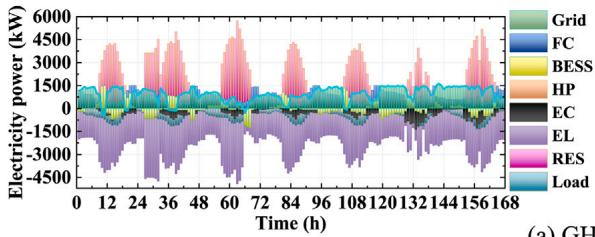  
(a) GHTD3

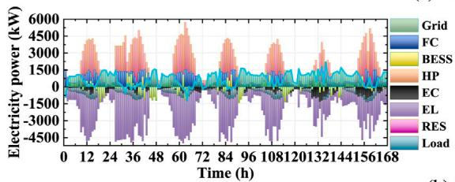

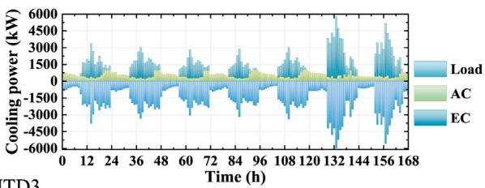

(b) TD3  
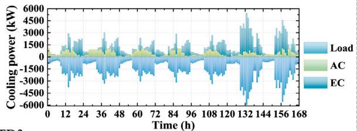

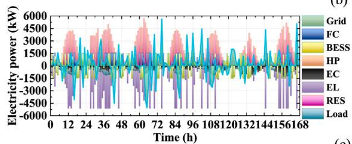

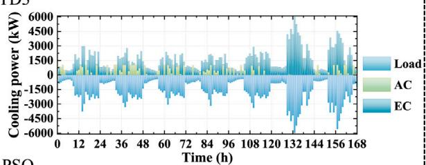  
(c) PSO

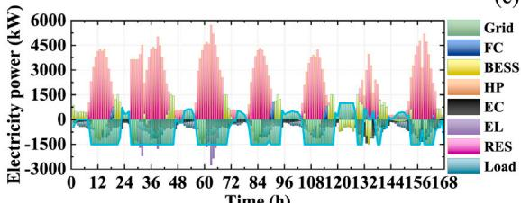

(d) Gurobi (QP)  
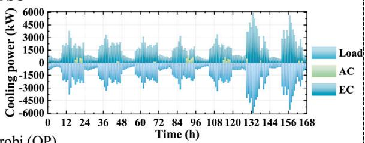  
Fig. 6. Scenario 1: Electricity power and cooling power balance optimization results of a typical summer week: (a) GHTD3; (b) TD3; (c) PSO; (d) Gurobi (QP).

## 5.2.3. Cost performance

Table 4 presents average daily costs for GHTD3 and three baselines in three scenarios. In the summer scenario, compared with TD3 and PSO, GHTD3 reduces the comprehensive cost �� by 22.6% and 56.6%, respectively, primarily by accepting a moderate increase in electricity trading cost $C ^ { E T }$ to achieve a substantial reduction in operational cost $\bar { C } ^ { I E S }$ . The cost patterns in the winter scenario mirror those of summer: GHTD3 cuts �� by 9.4% relative to TD3 and by 45.7% relative to PSO. TD3’s higher cost stems from its lack of optimized internal scheduling, leading to elevated $C ^ { I E S }$ , while PSO’s frequent storage cycling incurs heavy BESS and HGT losses and severe RES curtailment (with $C ^ { C U T }$ reaching 46.7\$). In the transitional scenario, GHTD3’s average daily cost of 411.9\$ is about 1.09 times that of

TD3. However, TD3 attains its lower cost through ‘‘inaction’’ in storage management, which results in extensive wind and solar curtailment. Because the reward function $\left( \operatorname { E q . } \right.$ (29)) applies only sparse penalties for grid-limit violations, TD3 temporarily avoids penalties by sacrificing renewable utilization. By contrast, PSO generates negative electricity trading cost $( C ^ { E T } = - 3 6 . 7 \ S )$ through aggressive power sales, but this also dramatically increases its operational cost. QP achieves the lowest �� across all three scenarios (e.g., 91.6\$ in summer), primarily due to its conservative strategy that minimizes device usage. It even generates negative $C ^ { E T }$ through aggressive power exports, while keeping $C ^ { I E S }$ and $C ^ { C O 2 }$ extremely low. However, this apparent cost efficiency is accompanied by substantial renewable curtailment. The corresponding $C ^ { C U T }$ values under QP exceed those of GHTD3 by approximately 23.5, 5.0, and 4.9 times, respectively. This is because QP avoids activating the hydrogen pathway, resulting in low flexibility and heavy reliance on direct grid export. Across all three scenarios, GHTD3 consistently respects grid constraints while maximizing RES utilization, delivering the most economically and operationally balanced scheduling strategy.

## 5.3. Sensitivity analysis

In this section, a sensitivity analysis is conducted on the two key parameters, subgoal update frequency � and reward scaling factor �, using the summer scenario as a testbed. These parameters govern the trade-off between short-term subgoal tracking and long-term policy planning.

Scenario 2: Energy balance results in winter  
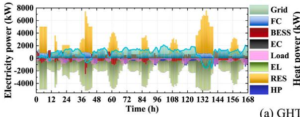  
(a) GHTD3

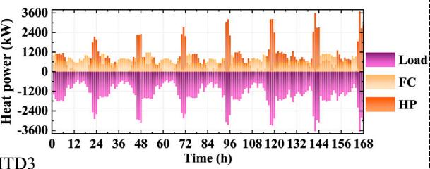

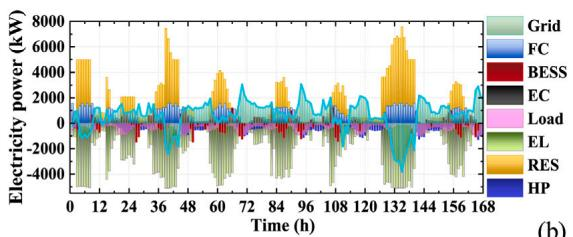  
(b) TD3

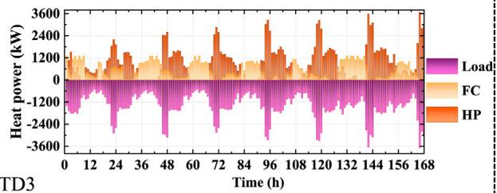

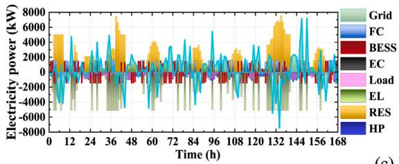

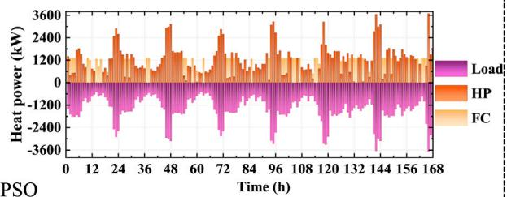

(c) PSO  
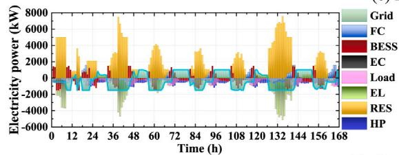  
(d) Gurobi (QP)

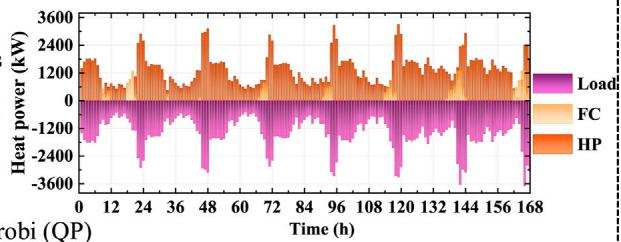  
Fig. 7. Scenario 2: Electricity power and heat power balance optimization results of a typical winter week: (a) GHTD3; (b) TD3; (c) PSO; (d) Gurobi (QP).

Table 4  
H-IES daily average scheduling cost under three scenarios for GHTD3, TD3, PSO and Gurobi (QP).

<table><tr><td></td><td>Algorithm</td><td> $CC$ ($)</td><td> $C^{ET}$ ($)</td><td> $C^{IES}$ ($)</td><td> $C^{CUT}$ ($)</td><td> $C^{CO2}$ ($)</td></tr><tr><td rowspan="4">Scenario 1</td><td>GHTD3</td><td>301.4</td><td>76.3</td><td>214.4</td><td>1.3</td><td>9.5</td></tr><tr><td>TD3</td><td>389.5</td><td>49.1</td><td>328.0</td><td>3.8</td><td>8.6</td></tr><tr><td>PSO</td><td>694.7</td><td>5.1</td><td>636.7</td><td>42.2</td><td>10.7</td></tr><tr><td>Gurobi (QP)</td><td>91.6</td><td>-25.9</td><td>85.7</td><td>30.5</td><td>1.3</td></tr><tr><td rowspan="4">Scenario 2</td><td>GHTD3</td><td>452.2</td><td>75.8</td><td>361.0</td><td>4.5</td><td>11.0</td></tr><tr><td>TD3</td><td>499.1</td><td>64.3</td><td>413.4</td><td>11.5</td><td>9.9</td></tr><tr><td>PSO</td><td>832.3</td><td>9.2</td><td>764.3</td><td>46.7</td><td>12.1</td></tr><tr><td>Gurobi (QP)</td><td>107.4</td><td>-19.4</td><td>101.7</td><td>22.5</td><td>2.6</td></tr><tr><td rowspan="4">Scenario 3</td><td>GHTD3</td><td>411.9</td><td>52.4</td><td>344.8</td><td>6.5</td><td>8.3</td></tr><tr><td>TD3</td><td>375.0</td><td>42.2</td><td>306.7</td><td>20.8</td><td>5.3</td></tr><tr><td>PSO</td><td>454.7</td><td>-36.7</td><td>427.7</td><td>55.3</td><td>8.3</td></tr><tr><td>Gurobi (QP)</td><td>77.4</td><td>-29.7</td><td>74.4</td><td>32.1</td><td>0.5</td></tr></table>

Fig. 10(a) shows how varying � (as a divisor of the 168-hour training horizon) affects cumulative reward. When c lies between 8 and 12, rewards remain steady at approximately −20, indicating robust performance. Reducing � to 3 causes a fourfold drop in reward, while increasing it to 28 induces a 5.5-fold decrease. This behavior can be explained as: a small � forces the low-level controller to chase rapidly changing goals, destabilizing learning. A large � starves it of timely guidance, leading to poor convergence or local optima. Fig. 10(b)ex amines the impact of the reward scaling factor �. Raising � from 0.1 to 0.3, yields a sharp improvement, peaking at −17.59, which highlight the need for sufficient intrinsic feedback to guide fine-grained control. Beyond 0.3, rewards fluctuate as excessive intrinsic weighting induces conflicting objectives. $\mathrm { A t } \ \alpha \ = \ 0 . 7 ,$ rewards stabilize near −40 in Fig. 5(a), mirroring the single-level TD3 outcome, signaling that the lowlevel policy has effectively decoupled from high-level subgoals and is operating under its own TD3-style optimization. These results confirm that � ∈ [8, 12] and � ≈ 0.3 strike the best balance between hierarchical coordination and autonomous low-level learning.

## 6. Conclusions

H-IES scheduling optimization offers an effective solution for coordinating electricity, heat, cooling, and hydrogen coupling. However, it faces challenges including temporal heterogeneity, a contracted feasible decision space, and trade-offs between volatility and robustness. To address these issues, an H-IES architecture is introduced, integrating HSS and BESS. The scheduling task is formalized via two augmented MDPs, an SMDP for long-horizon planning and a GAMDP for short-horizon control. The proposed GHTD3 employs TD3 as internal controllers to coordinate high-level planning with low-level execution, and integrates a historical goal relabeling mechanism to correct experiences drift. Across three typical seasonal scenarios, the GHTD3 is compared with TD3, PSO and Gurobi-based QP baselines. The key findings are as follows:

Scenario 3: Charging and discharging strategies  
Scenario 3: Energy balance results in transitional season  
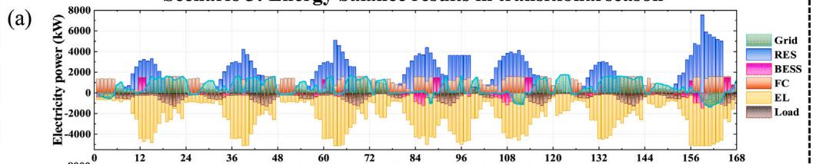

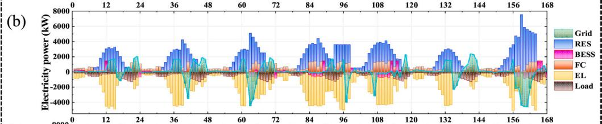

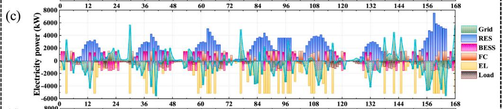

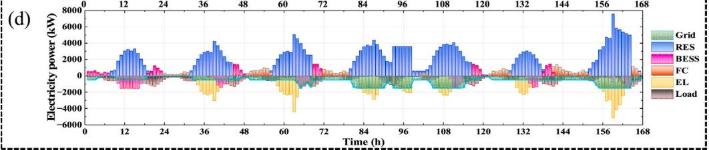  
Fig. 8. Scenario 3: Electricity balance optimization results of a typical transitional season week: (a) GHTD3; (b) TD3; (c) PSO; (d) Gurobi (QP).

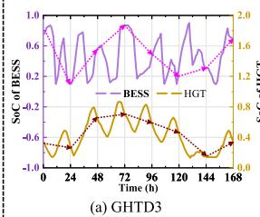

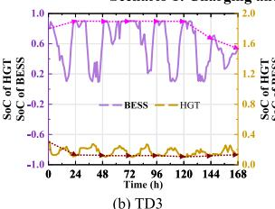

Scenario 1: Charging and discharging strategies  
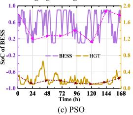

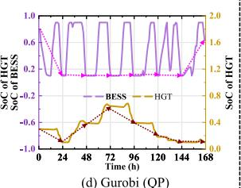  
Scenario 2: Charging and discharging strategies

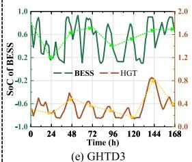

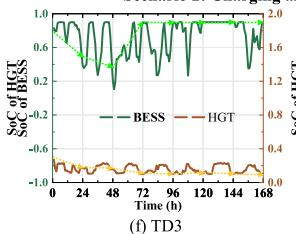

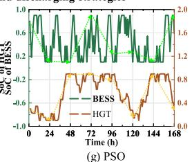

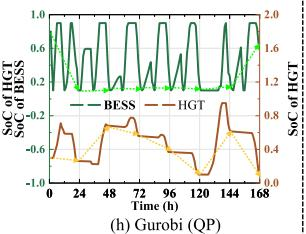

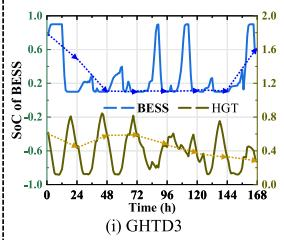

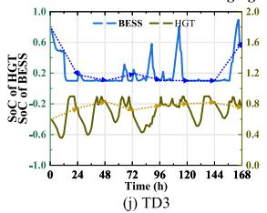

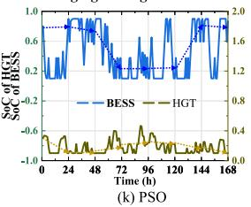

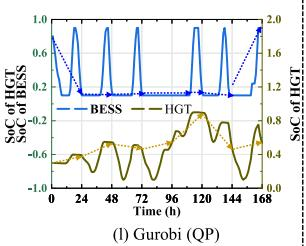  
Fig. 9. The charging and discharging strategies of BESS and HGT over a typical week under three seasonal scenarios: (a–d) Scenario 1(summer); (e–h) Scenario 2 (winter); (i–l) Scenario 3 (transition). Each row compares the proposed GHTD3, TD3, PSO and Gurobi (QP).

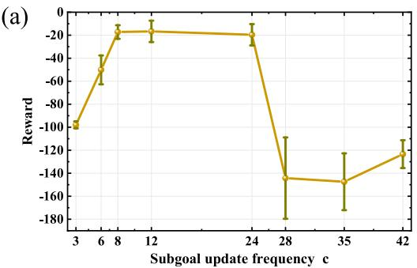

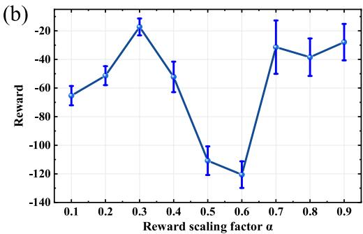  
Fig. 10. Sensitivity analysis results: (a) Subgoal update frequency �; (2) Reward scaling factor �.

(1) Improved convergence: GHTD3 raises cumulative rewards by 37.8%, 27.9%, and 99.6% in three scenarios, respectively, demonstrat ing reliable learning.

(2) Enhanced multi-energy synergy: In the summer and winter seasons, by offsetting FC operation relative to heat or cooling load peaks, FC-generated energy is redirected to supply heat or cooling during lowdemand periods, thereby reducing EC and HP operating costs. GHTD3 cuts the overall system cost by 22.6% compared to TD3 and by 56.6% compared to PSO. Compared to DRL, the QP strategy relies on static, linear scheduling and avoids hydrogen activation, trading flexibility and RES utilization for cost minimization.

(3) Flexible scheduling strategies: Compared with PSO, GHTD3 achieves smooth and stable energy storage operation decisions. Compared with TD3, GHTD3 can proactively discharge storage one day in advance to absorb excess renewable electricity and reduce curtailment by 85.9% through aggressive SoC management, thereby avoiding the ‘‘inaction’’ strategy that TD3 employs to cut costs.

To enhance system reliability under extreme events, future work will incorporate fault injection and risk-sensitive constraints into the DRL training, and construct fault and extreme weather scenarios in the simulation environment to train the agent to learn efficient emergency scheduling strategies.

## CRediT authorship contribution statement

Feifei Cui: Writing – original draft, Visualization, Validation, Methodology, Investigation, Formal analysis. Dou An: Writing – review & editing, Funding acquisition, Conceptualization. Huan Xi: Resources, Project administration, Investigation. Zhigang Ren: Supervision, Resources, Funding acquisition.

## Declaration of competing interest

The authors declare that they have no known competing finan cial interests or personal relationships that could have appeared to influence the work reported in this paper.

## Acknowledgments

This work was supported by the National Key R&D Program of China (No. 2024YFB4206500), the National Natural Science Founda tion of China (No. 62173268, No. 62573344), and the Interdisciplinary Research Team Fund (No. xtr062025001).

## Data availability

All the data have been well presented in the manuscript.

## References

[1] Wang Yao, hui Guo Chi, jie Chen Xi, qiong Jia Li, na Guo Xiao, shan Chen Rui, sheng Zhang Mao, yu Chen Ze, dong Wang Hao. Carbon peak and carbon neutrality in China: Goals, implementation path and prospects. China Geol 2021;4(4):720–46.

[2] International Renewable Energy Agency (IRENA). Renewable capacity statistics 2025. Technical report, Abu Dhabi: International Renewable Energy Agency (IRENA); 2025, Available online.

[3] Le Thanh Tuan, Sharma Prabhakar, Bora Bhaskor Jyoti, Tran Viet Dung, Truong Thanh Hai, Le Huu Cuong, Nguyen Phuoc Quy Phong. Fueling the future: A comprehensive review of hydrogen energy systems and their challenges. Int J Hvdrog Energy 2024:54:791–816.

[4] Song Dongran, Meng Weiqi, Dong Mi, Yang Jian, Wang Junlei, Chen Xiaojiao, Huang Liansheng. A critical survey of integrated energy system: Summaries, methodologies and analysis. Energy Convers Manage 2022;266:115863.

[5] Wang Xiaoyu, Huang Jingjing, Xu Zhanbo, Zhang Chuanlin, Guan Xiaohong. Real-world scale deployment of hydrogen-integrated microgrid: Design and control. IEEE Trans Sustain Energy 2024:15(4):2380–92.

[6] Wang Zhewei, Du Banghua, Li Yang, Xie Changjun, Wang Han, Huang Yunhui, Meng Peipei. Multi-time scale scheduling optimization of integrated energy systems considering seasonal hydrogen utilization and multiple demand responses. Int J Hydrog Energy 2024:67:728–49

[7] Pang Yi, Pan Lei, Zhang Jingmei, Chen Jianwei, Dong Yan, Sun Hexu, Integrated sizing and scheduling of an off-grid integrated energy system for an isolated renewable energy hydrogen refueling station. Appl Energy 2022;323:119573.

[8] Qiu Yibin, Li Qi, Ai Yuxuan, Chen Weirong, Benbouzid Mohamed, Liu Shukui, Gao Fei. Two-stage distributionally robust optimization-based coordinated scheduling of integrated energy system with electricity-hydrogen hybrid energy storage. Prot Control Mod Power Syst 2023;8(2):1–14.

[9] Mullanu Siripond, Chua Caslon, Molnar Andreea, Yavari Ali. Artificial intelligence for hydrogen-enabled integrated energy systems: A systematic review. Int J Hvdrog Energy 2024

[10] Yao Yiming, Li Chunyan, Shao Changzheng, Hu Bo, Xie Kaigui. Efficient operation of integrated electrical-water system for wind power accommodation. IEEE Trans Ind Informat. 2023;19(9):9382–93

[11] Zhang Lizhi, Sun Bo, Li Fan. Triple-layer joint optimization of capacity and operation for integrated energy systems by coordination on multiple timescales. Energy 2024:302:131775.

[12] Das Barun K, Hassan Rakibul, Tushar Mohammad Shahed HK, Zaman Forhad, Hasan Mahmudul, Das Pronob. Techno-economic and environmental assessment of a hybrid renewable energy system using multi-objective genetic algorithm: A case study for remote island in Bangladesh. Energy Convers Manage 2021:230:113823.

[13] Zhang Xiao, Liang Zeyu, Chen Sheng. Optimal low-carbon operation of regional integrated energy systems: A data-driven hybrid stochastic-distributionally robust optimization approach. Sustain Energy Grids Netw. 2023:34:101013

[14] Ma Haoyu, Wang Han. Optimal resilient scheduling strategy for electricity– gas–hydrogen multi-energy microgrids considering emergency islanding. Energy 2025:324:135732

[15] Li Yang, Bu Fanjin, Li Yuanzheng, Long Chao. Optimal scheduling of island integrated energy systems considering multi-uncertainties and hydrothermal simultaneous transmission: A deep reinforcement learning approach. Appl Energy 2023:333:120540

[16] Zhang Yuxian, Han Yi, Liu Deyang, Dong Xiao. Low-carbon economic dispatch of electricity-heat-gas integrated energy systems based on deep reinforcement learningJ Mod Power Syst Clean Energy, 2023:11(6):1827–41

[17] Yi Zonggen, Luo Yusheng, Westover Tyler, Katikaneni Sravya, Ponkiya Binaka, Sah Suba, Mahmud Sadab, Raker David, Javaid Ahmad, Heben Michael J, Khanna Raghav. Deep reinforcement learning based optimization for a tightly coupled nuclear renewable integrated energy system. Appl Energy 2022;328:120113.

[18] Liang Tao, Chai Lulu, Tan Jianxin, Jing Yanwei, Lv Liangnian. Dynamic optimization of an integrated energy system with carbon capture and power-to-gas interconnection: A deep reinforcement learning-based scheduling strategy. Appl Energy 2024;367:123390

[19] Liang Tao, Zhang Xiaochan, Tan Jianxin, Jing Yanwei, Liangnian Lv. Deep reinforcement learning-based optimal scheduling of integrated energy systems fo electricity, heat, and hydrogen storage. Electr Power Syst Res 2024;233:110480.

[20] Dong Weichao, Sun Hexu, Li Zheng, Yang Huifang. Design and optimal schedul ing of forecasting-based campus multi-energy complementary energy system. Energy 2024:309:133088.

[21] Li Yonggang, Su Yaotong, Zhang Yuanjin, Wu Weinong, Xia Lei. Twolayered optimal scheduling under a semi-model architecture of hydro-wind-solar multi-energy systems with hydrogen storage. Energy 2024;313:134115.

[22] Huang ZF, Chen WD, Wan YD, Shao YL, Islam MR, Chua KJ. Techno-economic comparison of different energy storage configurations for renewable energy combined cooling heating and power system. Appl Energy 2024;356:122340.

[23] Li Li, Wang Jing, Zhong Xiaoyi, et al. Jian Lin. Combined multi-objective optimization and agent-based modeling for a 100% renewable island energy system considering power-to-gas technology and extreme weather conditions. Appl Energy 2022;308:118376.

[24] Guan Aobo, Zhou Suyang, Gu Wei, Liu Zhong, Liu Hengmen. A novel dynamic simulation approach for gas-heat-electric coupled system. Appl Energy 2022:315:118999.

[25] Wang Xiaojing, Han Li, Wang Chong, Yu Hongbo, Yu Xiaojiao. A time-scale adap tive dispatching strategy considering the matching of time characteristics and dispatching periods of the integrated energy system. Energy 2023:267:126584.

[26] Zheng Lingwei, Wu Hao, Guo Siqi, Sun Xinyu. Real-time dispatch of an integrated energy system based on multi-stage reinforcement learning with an improved action-choosing strategy. Energy 2023;277:127636.

[27] Cui Feifei, An Dou, Xi Huan. Integrated energy hub dispatch with a multi-mode CAES–BESS hybrid system: An option-based hierarchical reinforcement learning approach. Appl Energy 2024;374:123950.

[28] Scott Fujimoto David Mege. Addressing function approximation error in actor-critic methods. Proc the 35th Int Conf Machine Learn 2018;80:1587–96.

[29] Nachum Ofir, Gu Shixiang (Shane), Lee Honglak, Levine Sergey. Data-efficient hierarchical reinforcement learning. In: Advances in neural information processing systems, vol. 31, Curran Associates, Inc.; 2018.

[30] Wang Zixuan, Xiao Fu, Ran Yi, Li Yanxue, Xu Yang. Scalable energy management approach of residential hybrid energy system using multi-agent deep reinforcement learning. Appl Energy 2024;367:123414.

[31] Liu Xinyi, Wang Zitao, Xu Shuai, Miao Yihe, Xu Jialing, Liu Shanke, Yu Lijun. Performance anal sis of wind-h dro en ener stora e s stem usin composite objective optimization proactive scheduling strategy coordinated with wind power prediction. Energy 2025;321:135416.

[32] Tian Xingtao, Lin Xiaojie, Zhong Wei, Zhou Yi, Cong Feiyun. Optimal dispatch of integrated electricity and heating systems considering the quality-quantity regulation of heating systems to promote renewable energy consumption. Energy 2024:300:131599

[33] Li Li, Fan Shuai, Xiao Jucheng, Zhang Yi, Huang Renke, He Guangyu. Energy management strategy for community prosumers aggregated vpp participation in the ancillary services market based on P2P trading. Appl Energy 2025;384:125472.

[34] Liu Zhi-Feng, Zhao Shi-Xiang, Luo Xing-Fu, Huang Ya-He, Gu Rui-Zheng, Li Ji-Xiang, Li Ling-Ling. Two-layer energy dispatching and collaborative optimization of regional integrated energy system considering stakeholders game and flexible load management. Appl Energy 2025;379:124918.

[35] Zhang Yi, Meng Yan, Fan Shuai, Xiao Jucheng, Li Li, He Guangyu. Multi-time scale customer directrix load-based demand response under renewable energy and customer uncertainties. Appl Energy 2025;383:125334.

l b d h bd l b h d bd l d novel model-free deep reinforcement learning framework for energy management of a PV integrated energy hub. JEEE Trans Power Syst 2023:38(5):4840–52

[37] Farhad Angizeh, Ali Ghofrani, A. Jafari Mohsen. Dataset on hourly load profiles for a set of 24 facilities from industrial. commercial and residential end-use sectors. Mendeley Data 2020;1.