# Multi-agent deep reinforcement learning for efficient multi-timescale bidding of a hybrid power plant in day-ahead and real-time markets

Tomás Ochoa a,∗, Esteban Gil a, Alejandro Angulo a, Carlos Valle b

a Departmento de Ingeniería Eléctrica, Universidad Técnica Federico Santa María, Valparaíso, 2390123, Chile

b Departmento de Ciencia de Datos e Informática, Universidad de Playa Ancha, Valparaíso, 2360001, Chile

## A R T I C L E I N F O

Keywords: Multi-view artificial neural networks Multi-agent deep reinforcement learning Energy management system Solar generation Energy storage Electricity market bidding Multi-timescale electricity markets

## A B S T R A C T

Effective bidding on multiple electricity products under uncertainty would allow a more profitable market participation for hybrid power plants with variable energy resources and storage systems, therefore aiding the decarbonization process. This study deals with the effective bidding of a photovoltaic plant with an energy storage system (PV-ESS) participating in multi-timescale electricity markets by providing energy and ancillary services (AS) products. The energy management system (EMS) aims to maximize the plant’s profits by efficiently bidding in the day-ahead and real-time markets while considering the awarded products’ adequate delivery. EMS’s bidding decisions are usually obtained from traditional mathematical optimization frameworks. However, since the addressed problem is a multi-stage stochastic program, it is often intractable and suffers the curse of dimensionality. This paper presents a novel multi-agent deep reinforcement learning (MADRL) framework for efficient multi-timescale bidding. Two agents based on multi-view artificial neural networks with recurrent layers (MVANNs) are adjusted to map environment observations to actions. Such mappings use as inputs available information related to electricity market products, bidding decisions, solar generation, stored energy, and time representations to bid in both electricity markets. Sustained by a price-taker assumption, the physically and financially constrained EMS’s environment is simulated by employing historical data. A shared cumulative reward function with a finite time horizon is used to adjust both MVANNs’ weights simultaneously during the learning phase. We compare the proposed MADRL framework against scenario-based two-stage robust and stochastic optimization methods. Results are provided for one-year-round market participation of the hybrid plant at a 1-minute resolution. The proposed method achieved statistically significant higher profits, less variable incomes from both electricity markets, and better provision of awarded products by achieving smaller and less variable energy imbalances through time.

## 1. Introduction

The variability and uncertainty of photovoltaic (PV) generation pose many challenges for integrating variable renewable energy sources onto existing electrical grids. Potential adverse effects on reliability and stability of electrical networks could limit their integration, as a higher penetration would increase frequency control requirements [1]. A potential solution to counteract a PV plant’s naturally oscillating power output is to incorporate an energy storage system (ESS), result ing in a hybrid PV-ESS plant with the ability to shift energy injections and consumption through time and even provide frequency control capacity. An adequately controlled PV-ESS plant can provide electric ity products traditionally provided by fossil fuel-based power plants, therefore aiding to decarbonize the electricity sector.

Different electricity products (e.g., energy and capacity for reg ulation) are valued through time in different markets, such as the day-ahead (DA) and real-time (RT) markets. Price signals indirectly report to market stakeholders the shortage or abundance in the supply of specific electricity products. Proper management of a PV-ESS plant would allow a more profitable participation in electricity markets by efficiently deciding on which time and market to allocate the plant’s resources. Furthermore, different studies [2,3] have shown that profits solely from energy arbitrage may be insufficient to recover the totality of the ESS’s capital expenditures. However, these studies show that offering both energy and ancillary service products in different markets can boost their competitiveness.

In the last decade, bidding optimization for hybrid power plants with storage participating in multiple electricity markets has received much attention. In [4], a compressed air energy storage unit optimizes its bidding in the DA and RT markets, offering energy and reserves,

<table><tr><td colspan="2">Nomenclature</td></tr><tr><td> $e_{t}^{s}$ </td><td>ESS&#x27;s stored energy at minute t, MWh</td></tr><tr><td> $\hat{e}^{s}$ </td><td>ESS&#x27;s maximum storage capacity, MWh</td></tr><tr><td> $\check{e}^{s}$ </td><td>ESS&#x27;s minimum storage capacity, MWh</td></tr><tr><td> $\eta^{d}$ </td><td>ESS&#x27;s discharge efficiency, -</td></tr><tr><td> $\eta^{c}$ </td><td>ESS&#x27;s charge efficiency, -</td></tr><tr><td> $p_{t}^{d}$ </td><td>ESS&#x27;s off-terminal discharge power flow at minute t, MW</td></tr><tr><td> $p_{t}^{c}$ </td><td>ESS&#x27;s off-terminal charge power flow at minute t, MW</td></tr><tr><td> $\hat{p}^{s}$ </td><td>ESS&#x27;s off-terminal rated power, MW</td></tr><tr><td> $p_{t}^{\text{pv}}$ </td><td>PV&#x27;s power flow at minute t, MW</td></tr><tr><td> $p_{t}^{g}$ </td><td>PV-ESS&#x27;s power flow to the grid at minute t, MW</td></tr><tr><td> $p_{t}^{r}$ </td><td>PV-ESS&#x27;s control reference signal at minute t, MW</td></tr><tr><td> $\delta_{t}^{+}$ </td><td>PV-ESS&#x27;s under-generation at minute t, MW</td></tr><tr><td> $\delta_{t}^{-}$ </td><td>PV-ESS&#x27;s over-generation at minute t, MW</td></tr><tr><td> $p_{h}^{\text{DA}}$ </td><td>EMS&#x27;s DA energy bid at hour interval h, MW</td></tr><tr><td> $p_{q}^{\text{RT}}$ </td><td>EMS&#x27;s RT energy bid at 15-min interval q, MW</td></tr><tr><td> $p_{h}^{\text{Ru}}$ </td><td>EMS&#x27;s DA capacity for up-regulation bid at hour interval h, MW</td></tr><tr><td> $p_{h}^{\text{Rd}}$ </td><td>EMS&#x27;s DA capacity for down-regulation bid at hour interval h, MW</td></tr><tr><td> $\hat{\alpha}$ </td><td>EMS&#x27;s upper bounds for energy products bids, MW</td></tr><tr><td> $\check{\alpha}$ </td><td>EMS&#x27;s lower bounds for energy products bids, MW</td></tr><tr><td> $\hat{\beta}$ </td><td>EMS&#x27;s upper bounds for capacity for up-regulation product bids, MW</td></tr><tr><td> $\hat{\gamma}$ </td><td>EMS&#x27;s upper bounds for capacity for down-regulation product bids, MW</td></tr><tr><td> $\lambda_{h}^{\text{DA}}$ </td><td>DA energy product price at hour interval h, $/MWh</td></tr><tr><td> $\lambda_{q}^{\text{RT}}$ </td><td>RT energy product price at 15-min interval q, $/MWh</td></tr><tr><td> $\lambda_{h}^{\text{Ru}}$ </td><td>DA capacity for up-regulation product price at hour interval h, $/MWh</td></tr><tr><td> $\lambda_{h}^{\text{Rd}}$ </td><td>DA capacity for down-regulation product price at hour interval h, $/MWh</td></tr><tr><td> $b_{t}^{+}$ </td><td>ISO&#x27;s signal for up-regulation deployment at minute t (scaled), -</td></tr><tr><td> $b_{t}^{-}$ </td><td>ISO&#x27;s signal for down-regulation deployment at minute t (scaled), -</td></tr><tr><td> $\lambda^{\text{imb}}$ </td><td>Imbalance penalization value, $/MWh</td></tr><tr><td> $\Delta^{k}$ </td><td>Conversion factors for k minute-intervals, h</td></tr><tr><td> $a_{t}^{1}$ </td><td>DA-MVANN action at minute t</td></tr><tr><td> $a_{t}^{2}$ </td><td>RT-MVANN action at minute t</td></tr><tr><td> $r_{t}$ </td><td>DA-MVANN and RT-MVANN shared re-ward signal at minute t</td></tr><tr><td> $o_{t}^{1}$ </td><td>DA-MVANN observed state at minute t</td></tr><tr><td> $o_{t}^{2}$ </td><td>RT-MVANN observed state at minute t</td></tr><tr><td> $s_{t}$ </td><td>Environment state at minute t</td></tr></table>

but their deterministic optimization approach ignores the market price uncertainties faced by the plant. Deterministic approaches are often inadequate, as efficiently managing an ESS is a multi-stage stochastic optimization problem. However, multi-stage stochastic formulations are impractical since they are, in general, intractable and suffer the curse of dimensionality using conventional optimization frameworks [5]. Thus, the underlying problem is commonly approximated by two-stage stochastic or robust programming formulations [6–11].

Previous works, such as [6], have used two-stage stochastic pro gramming for the bidding of energy and spinning reserves in the DA market for a hybrid portfolio consisting of thermal and wind generation and compressed air energy storage. The problem maximizes the expected profits while simultaneously handling the risk by adding a Conditional Value at Risk (CVaR) term to the objective function. However, instead of explicitly modeling bidding in the RT market, a penalization is included for DA commitment deviations. Other authors also manage risk by adding a CVaR term into their formulations [7]. Work done in [8] proposes a two-stage scenario-based stochastic model to enable a hybrid power plant (wind-ESS) to participate in simulta neous day-ahead energy, spinning reserve, and frequency regulation markets under different operation strategies. Nevertheless, this work does not address the problem of multi-timescale bidding, as all markets operate once a day. In [9], the authors propose a two-stage robust optimization procedure (non-scenario-based) for a virtual power plant, which establishes confidence bounds for the uncertainty set. Ref. [10] compares risk-neutral and risk-averse strategies employing two-stage scenario-based stochastic-robust programming for market participation in DA and RT markets of a hybrid charging station with a PV system. Usually, robust approaches yield conservative solutions since they are intrinsically designed to be sub-optimal. aiming to maximize the profits for extreme scenarios [12]. A drawback of traditional stochastic optimization approaches is their dependence on the quality of the uncertainty representation. Previous works, such as [11], have put much effort into refining scenario generation processes, aiming to improve the performance of stochastic bidding model approximations. Nevertheless, as the number of variables subject to uncertainty increases, encompassing both temporal and cross-variable dependencies in a two-stage optimization program becomes more complex. Furthermore, two-stage programming methods can hardly reflect the dynamic variations of system conditions. especially for multi-stage problems with a sequential structure [13]. As computational complexity is much higher in multi-stage models, there is a trade-off between two- and multi-stage methods for conventional optimization frameworks. In this context, we propose a machine learning (ML) model capable of han dling the multi-stage decision-making problem by incorporating the sequential decision process under uncertainty into its learning phase.

In this paper, we consider an energy management system (EMS) managing a PV-ESS plant participating in two different electricity markets: (1) the DA market, where bids encompass energy and capacity for up/down-regulation products for the following day, must be submitted daily and many hours before, and have an hourly granularity; and (2) the RT market, where bids encompass energy products for the following hour, must be submitted hourly and one hour before, and have a 15-min granularity. Thus, bidding decisions for each market must be made with different frequencies and lead times, resulting in a multiple timescale problem. Evidence suggests that simultaneously addressing different timescales in dynamic decision-making under uncertainty can avoid time-inconsistent solutions leading to an improper assessment of risk $[ 1 4 , 1 5 ]$ . Moreover, the independent system operator (ISO) calls for the deployment of procured capacity for up/down-regulation at a 1- min resolution. Therefore the plant’s operation must be modeled with a finer granularity. An affine control law is obtained from an explicit model predictive control (MPC) reference-tracking formulation to control the PV-ESS injections to the grid. The reference signal to be tracked derives from the EMS’s bidding decisions, uncertainty realizations in PV generation, and ISO’s requests for up/down-regulation deployment.

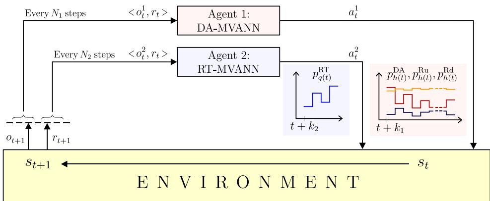  
Fig. 1. Simplified scheme: two agents interacting with their environment on different timescales

Recently, ML techniques have been used for sequential decision making by combining reinforcement learning (RL) and artificial neural networks (ANNs) [16]. Previous works using RL to make sequential bidding in electricity markets have focused on single-agents either operating on a single market or simultaneously bidding to all markets operating on the same timescales [17–19]. In theory, a single agent could be trained to bid in multiple markets at different time-scales using multi-task learning [20], saving computation at inference time. Unfortunately, using a single agent could lead to inferior overall performance, as task objectives can compete [21]. Intuitively, our tasks (bidding in the DA and RT markets) are different enough to deteriorate the generalization performance, as each task handles different input in formation, lead-times, granularity, bidding horizons, and action spaces. Our multi-timescale context can be significantly more challenging than single timescale problems, as the observations of the environment, the rewards, and the actions may have different timescales, resolutions, and lead-times. Multi-agent reinforcement learning (MARL) [22–24] can address problems with real-world complexity by making agents learn through interactions with the environment based on received reward signals. However, only a few MARL papers have focused on multi-timescale decision problems [25–27], and none for this specific application, where we deal with multi-dimensional continuous observation and action spaces and the feasibility set of the RT actions depends on the DA actions, adding complexity not previously tackled in the literature.

In this paper, we propose the use of a multi-agent deep reinforce ment learning (MADRL) [28–30] approach capable of operating on multiple timescales. In the proposed MADRL framework, two agents are trained to make DA and RT bidding decisions sequentially. Fig. 1 shows a simplified scheme of the formulation adopted in our research, illustrating the interaction between two agents based on multi-view ANNs with recurrent layers (MVANNs) and the environment. Two MVANN-based agents make multi-timescale decisions on a daily and hourly basis $( N _ { 1 }$ and $N _ { 2 } )$ with different lead times $( k _ { 1 }$ and $k _ { 2 } )$ based on observations of the environment’s state. Both agents are encouraged to collaborate by a shared reward signal, as usual in a fully cooperative setting [29].

Buffer-rolls are introduced as an experience replay mechanism, containing sufficient information to simulate the PV-ESS controlled operation and the MVANNs’ sequential decision-making during a time window, and also capable of adapting to MVANNs’ current policies over the learning phase by updating its content. To achieve a cooperative behavior between both MVANN-based agents, we propose a shared reward function that depends on the decisions made by the MVANNs within a mini-batch of buffer-rolls, from which we derive weight up dates for both MVANNs. In order to avoid over-exploitation of PV-ESS's resources at the time windows’ end, gradient derivation is done with respect to MVANNs’ outputs only on user-defined time-steps. To ensure the robustness and reliability of the proposed MADRL framework, we keep track of the adopted bidding policies performance during training using a separate validation set. To compare the performance of the proposed method, we implemented robust and stochastic scenario-based two-stage optimization methods.

Thus, this paper aids to fill a gap in the field of ML applications for dynamic decision-making under uncertainty in electric power systems. The paper’s main contribution is the introduction of a novel MADRL framework to derive efficient energy and AS bids for a hybrid power plant participating on electricity markets operating at differ ent timescales. Furthermore, we propose a innovative approach to solve a multi-timescale multi-agent sequential decision-making prob lem, where two MVANN-based agents act cooperatively on multidimensional continuous observation and action spaces, and where the feasibility set of the second agent’s actions depends on the actions of the first one.

The remainder of this paper is organized as follows. Section 2 describes the key features of the sequential decision-making problem being addressed, while Section 3 proposes the MADRL framework for solving the problem. Section 4 presents the case study and provides numerical results. Finally, we report our conclusions in Section 5.

## 2. Background

## 2.1. Market structure

Power grids coordinate a diverse set of energy assets (e.g., generators, loads, and storage devices) to match supply and demand at all times. Wholesale electricity markets, including those operated by CAISO, PJM, MISO, ISO New England, and New York ISO, follow a twosettlement system in which a DA market seeks to commit transactions based on expected system performance. In contrast, the RT market allows for corrections when the system deviates from expected behavior due to forecast errors or contingencies [31]. Market settlements set prices for multiple products and at different times. Locational marginal prices (LMPs) reflect the marginal value of serving an additional unit of energy at a specified node in the transmission system, typically in (\$/MWh). Meanwhile, ancillary service marginal prices (ASMPs) compensate AS awards.

We consider a pay-as-cleared and bid-based auction structure in the electricity market. Market participation is limited to self-schedule bids for energy and AS products, which implies quantity-only bids that the ISO will entirely accept [32]. By submitting self-schedule bids, the market participant expresses his willingness to generate/consume at the pointed quantities regardless of the resulting market prices. Due to the relatively small size of the plant, we adopt a price-taker assumption as in [9,17,19,33]. That is, the bidding behavior of the plant has no capability of altering the market-clearing prices as in strategic bidding contexts [34].

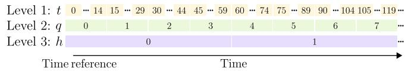  
Fig. 2. Time discretization representation.

We consider that the market participant can submit bids for energy and AS products with an hourly granularity in the DA market and bids for energy products with a 15-min granularity in the RT market. Energy products are expected to be delivered at constant power during the awarded period. We consider the AS products of capacity for up-regulation and down-regulation. The requirement to deploy AS accepted capacity through time is communicated to market participants by a signal sent by the ISO with a 1-min resolution, ranging between zero and the respective awarded capacity. Thus, the market participant must increase/decrease its power injection in response to an up/down regulation deployment signal. To avoid imbalances between actual and programmed generation through time, the market participant must fol low a reference signal according to the time-correspondent awarded DA and RT energy products and the ISO’s deployment signal for up/down regulation. Consequently, the reference signal $p _ { t } ^ { \mathrm r }$ used by the control scheme of the plant (see Sections 2.2 and 2.3), is a result of the adopted bidding policies from both MVANN-based agents, uncertainty realizations of PV generation and ISO’s regulation deployment request.

A suitable time representation is required, as sequential decisions are made for different time-intervals. For this end, a natural representation for time evolution is employed at three time-interval levels, as illustrated in Fig. 2. Bottom to top, level 3 comprises hourly timeintervals $h ,$ level 2 comprises 15-min time-intervals $q ,$ and level 1 comprises 1-min time-intervals �. As depicted in Fig. 2, we employ a time reference to set zero values at each level. To transform power units to energy units at different time-intervals, the conversion factors $\Delta ^ { 1 } , \Delta ^ { 1 5 }$ and $\boldsymbol { \varDelta } ^ { 6 0 }$ are employed, relatives to the duration of each time-interval with respect to an hour:

$$
\varDelta^ {1} = \frac {1}{6 0} \mathrm{h}, \varDelta^ {1 5} = \frac {1}{4} \mathrm{h}, \varDelta^ {6 0} = 1 \mathrm{h}.\tag{1}
$$

To ease notation, elements at lower levels are considered contained in elements at higher levels. Eq. (2) describes this relationship making use of the floor function ⌊�⌋ which gives the largest integer less than or equal to �:

$$
q (t) = \left\lfloor t \frac {\varDelta^ {1}}{\varDelta^ {1 5}} \right\rfloor , h (t) = \left\lfloor t \frac {\varDelta^ {1}}{\varDelta^ {6 0}} \right\rfloor .\tag{2}
$$

Additionally, a 24-h time format followed by a day index on paren thesis is used to refer to a particular moment in time, e.g., 13:57 (�), where � is set to zero for the first day that data is available.

Fig. 3 illustrates the market program considered in this research using the time representation described earlier. Bids for energy and AS products in the DA market must be submitted by 10 a.m. with hourly granularity covering the 24 hour-intervals of the following day. The DA market establishes schedules for energy and capacity for regulation and sets related LMPs and ASMPs. These results are published no later than 1 p.m. on the same day of bids submission. Meantime, in the RT market, bids for energy must be submitted one hour before the start of each trading hour and have 15-min granularity. The RT market establishes binding schedules and LMPs for the four 15-min intervals at each hour. These results are published no later than the ending of each trading hour.

## 2.2. PV-ESS system operation

Alongside the problem of submitting self-scheduling bids to the DA and RT markets, this research deals with the controlled operation of the

PV-ESS system at a 1-min resolution, which is raised as the following MPC [35] reference-tracking problem:

$$
\min _ {p _ {t} ^ {\mathrm{c}}, p _ {t} ^ {\mathrm{d}}} \delta_ {t} ^ {+} + \delta_ {t} ^ {-}\tag{3a}
$$

$$
\mathrm{s.t.} p _ {t} ^ {\mathrm{r}} = p _ {t} ^ {\mathrm{g}} + \delta_ {t} ^ {+} - \delta_ {t} ^ {-}\tag{3b}
$$

$$
p _ {t} ^ {\mathrm{g}} = p _ {t} ^ {\mathrm{pv}} + p _ {t} ^ {\mathrm{d}} - p _ {t} ^ {\mathrm{c}}\tag{3c}
$$

$$
\check {e} ^ {\mathrm{s}} \leq e _ {t - 1} ^ {\mathrm{s}} + \left(\eta^ {\mathrm{c}} p _ {t} ^ {\mathrm{c}} - \frac {p _ {t} ^ {\mathrm{d}}}{\eta^ {\mathrm{d}}}\right) \varDelta^ {1} \leq \hat {e} ^ {\mathrm{s}}\tag{3d}
$$

$$
0 \leq p _ {t} ^ {\mathrm{c}} \leq y ^ {\mathrm{s}} \hat {p} ^ {\mathrm{s}}, 0 \leq p ^ {\mathrm{d}} \leq (1 - y ^ {\mathrm{s}}) \hat {p} ^ {\mathrm{s}}
$$

$$
y ^ {s} \in \{0, 1 \}, \quad \delta_ {t} ^ {+}, \delta_ {t} ^ {-} \geq 0\tag{3e}
$$

(3f)

which aims to minimize the absolute difference $| \delta _ { t } |$ between the reference signal $p _ { t } ^ { \mathrm { r } }$ and the power flow from the hybrid power plant to the power grid $p _ { t } ^ { \mathrm { g } } ,$ as (3a) and (3b) depict. This absolute difference is the power imbalance between actual and requested generation at a 1-min scale and is decomposed into under and over-generation as ${ \delta } _ { t } ^ { + }$ and $\delta _ { t } ^ { - }$ , respectively. Eq. (3c) models the power balance at the PV-ESS plant connected to the grid, as reflected in Fig. 4. Eqs. (3d) and (3e) are concerned with the ESS dynamics, while (3f) defines the domain of the variables. This explicit MPC problem is solved as a function of the variables $p _ { t } ^ { * } = p _ { t } ^ { \mathrm { r } } - p _ { t } ^ { \mathrm { p v } }$ and $e _ { t - 1 } ^ { \mathrm { s } } .$ , giving rise to the following affine control law:

$$
\begin{array}{l} p _ {t} ^ {\mathrm{c}} \left(p _ {t} ^ {*}, e _ {t - 1} ^ {\mathrm{s}}\right) = \mathbb {1} \left(p _ {t} ^ {*} \leq 0\right) \min \left\{- p _ {t} ^ {*}, \frac {\hat {e} ^ {\mathrm{s}} - e _ {t - 1} ^ {\mathrm{s}}}{\eta^ {\mathrm{c}} \Delta^ {1}}, \hat {p} ^ {\mathrm{s}} \right\} \\ p _ {t} ^ {\mathrm{d}} \left(p _ {t} ^ {*}, e _ {t - 1} ^ {\mathrm{s}}\right) = \mathbb {1} \left(p _ {t} ^ {*} > 0\right) \min \left\{\hat {p} _ {t} ^ {*}, \frac {\eta^ {\mathrm{d}} (e _ {t - 1} ^ {\mathrm{s}} - \check {e} ^ {\mathrm{s}})}{\Delta^ {1}}, \hat {p} ^ {\mathrm{s}} \right\} \end{array}\tag{4a}
$$

(4b)

where 1 is the indicator function. This mapping comprises piecewise functions used to drive the operation of the ESS immersed in the hybrid power plant. Following the affine control law derived from MPC’s parametric optimization ensures the hybrid plant’s physical constraints. Fig. 5 illustrates the polyhedral partition sets and corre sponding MPC’s objective values, where circled numbers denote the polyhedral partitions correspondence to (4). The effectiveness of the bidding models partly relies on an accurate representation of the PV-ESS plant’s operation. The affine control law guiding the ESS must be considered by the bidding models to properly simulate the minuteby-minute operation of the hybrid power plant. Eq. (4) and Fig. 5a show that a piece-wise formulation is adequate and accurate for the control model representation. Fig. 5b shows the objective function (3a) convexity and performance, evidencing a perfect reference tracking for zones 1 and 4 .

## 2.3. PV-ESS efficient multi-timescale bidding in the DA and RT markets

The efficient multi-timescale bidding of a hybrid power plant is achieved by effectively scheduling and allocating plant resources in the DA and RT markets throughout time and properly delivering awarded products to the power grid under uncertainty. Notice that the EMS faces price, production, and ISO’s regulation signal uncertainties (similarly to what would happen in real-world applications), as it does not know in advance the realizations of the uncertain variables. By this means the EMS aims to maximize the following stochastic joint-optimization problem:

$$
\begin{array}{r l} & {\max \sum_ {t \in \mathcal {T}} \Big (\tilde {\lambda} _ {h (t)} ^ {\mathrm{DA}} p _ {h (t)} ^ {\mathrm{DA}} + \tilde {\lambda} _ {h (t)} ^ {\mathrm{Ru}} p _ {h (t)} ^ {\mathrm{Ru}} + \tilde {\lambda} _ {h (t)} ^ {\mathrm{Rd}} p _ {h (t)} ^ {\mathrm{Rd}} +} \\ & {\qquad \tilde {\lambda} _ {q (t)} ^ {\mathrm{RT}} p _ {q (t)} ^ {\mathrm{RT}} -} \\ & {\qquad \lambda^ {\mathrm{imb}} \Big | p _ {t} ^ {\mathrm{r}} - \tilde {p} _ {t} ^ {\mathrm{pv}} - p _ {t} ^ {\mathrm{d}} + p _ {t} ^ {\mathrm{c}} \Big | \Big) \varDelta^ {1}} \\ & {\mathrm{s.t.} p _ {t} ^ {\mathrm{r}} = p _ {h (t)} ^ {\mathrm{DA}} + \tilde {b} _ {t} ^ {+} p _ {h (t)} ^ {\mathrm{Ru}} - \tilde {b} _ {t} ^ {-} p _ {h (t)} ^ {\mathrm{Rd}} + p _ {q (t)} ^ {\mathrm{RT}}} \end{array}\tag{5a}
$$

$$
\forall t \in \mathcal {T}\tag{5b}
$$

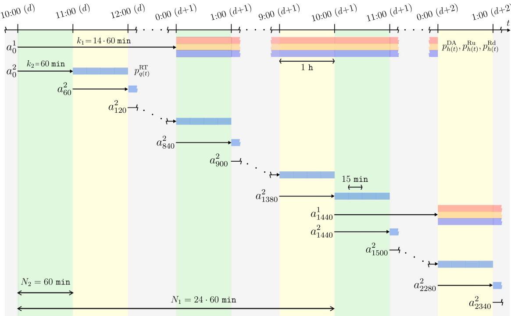

Fig. 3. Multi-agent multi-timescale control sequence.  
  
Fig. 4. Power balance at the PV-ESS plant connected to the grid.

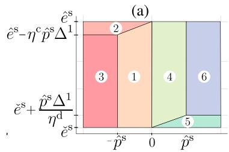

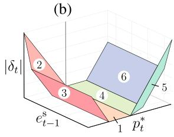  
Fig. 5. Visual representation of parametric optimization results: (a) Affine control law polyhedral sets (b) Explicit MPC’s objective value.

$$
e _ {t} ^ {\mathrm{s}} = e _ {t - 1} ^ {\mathrm{s}} + \left(\eta^ {\mathrm{c}} p _ {t} ^ {\mathrm{c}} - \frac {p _ {t} ^ {\mathrm{d}}}{\eta^ {\mathrm{d}}}\right) \varDelta^ {1}
$$

$$
\forall t \in \mathcal {T}\tag{5c}
$$

$$
\left(p _ {h (t)} ^ {\mathrm{DA}}, p _ {h (t)} ^ {\mathrm{Ru}}, p _ {h (t)} ^ {\mathrm{Rd}}, p _ {q (t)} ^ {\mathrm{RT}}\right) \in \Pi_ {t} ^ {\mathrm{m}}
$$

$$
\forall t \in \mathcal {T} ^ {\prime}\tag{5d}
$$

$$
\left(p _ {h (t)} ^ {\mathrm{DA}}, p _ {h (t)} ^ {\mathrm{Ru}}, p _ {h (t)} ^ {\mathrm{Rd}}, p _ {q (t)} ^ {\mathrm{RT}}\right) \in \Pi_ {t} ^ {\mathrm{b}}\tag{5e}
$$

$$
\forall t \in \mathcal {T}
$$

$$
(4 \mathrm{a}), (4 \mathrm{b})
$$

$$
\forall t \in \mathcal {T}
$$

where the objective function (5a) maximizes the profit considering the DA and RT markets incomes for each specific product over the timeintervals included in the optimization horizon $t ~ \in ~ \tau$ . To keep the hybrid power plant power generation close to the ISO’s request, we incorporate an imbalance regularization mechanism to settle deviations between actual and requested generation with a 1-min resolution at a penalization value $\lambda ^ { \mathrm { i m b } }$ . Since the power plant’s remunerations depend on the market design, an upper bound for imbalance pricing is chosen in this work, i.e., a high price for the imbalances. Parameters that can be subject to uncertainty are noted with the symbol ̃�. Notice that certain price related parameters can be known beforehand for some future periods, according to the market rules detailed in Section 2.1. To keep track of sequentially self-scheduled products in both markets, the control reference signal $p _ { t } ^ { \mathrm r }$ is derived in accordance to the awarded energy products and ISO’s regulation signal at respective 1-min intervals in (5b). The ISO’s requirement to deploy AS accepted capacity for upregulation and down-regulation are constructed using $b _ { t } ^ { + }$ and $b _ { t } ^ { - }$ , whose values correspond, respectively, to the positive and negative parts of a signal $b _ { t }$ (ranging between −1 and 1). Eqs. (4a), (4b), (5b), and (5c) are used to simulate the hybrid power plant operation under uncertainty in accordance to the affine control law discussed in Section 2.2. Set $\boldsymbol { { \cal { I } } } _ { t } ^ { \mathrm { m } }$ in (5d) fixes decision variables for time-intervals $t \in \tau ^ { \prime }$ related to self scheduled products that have been previously submitted to the ISO at the time of solving this problem, in accordance to Section 2.1. Set $\boldsymbol { \varPi } _ { t } ^ { \mathrm { b } }$ imposes domain restrictions to submit reasonable self-schedule bids to markets and avoid degenerate solutions.

$$
\begin{array}{l} \Pi_ {t} ^ {b} = \Big \{\left(p _ {h (t)} ^ {\mathrm{Rup}}, p _ {h (t)} ^ {\mathrm{Rdn}}, p _ {h (t)} ^ {\mathrm{DA}}, p _ {q (t)} ^ {\mathrm{RT}}\right) \in \mathbb {R} ^ {4}: \\ \qquad 0 \leq p _ {h (t)} ^ {\mathrm{Ru}} \leq \hat {\beta},   0 \leq p _ {h (t)} ^ {\mathrm{Rd}} \leq \hat {\gamma}, \\ \qquad \check {\alpha} \leq p _ {h (t)} ^ {\mathrm{DA}} \leq \hat {\alpha},   \text { and }   \check {\alpha} \leq p _ {q (t)} ^ {\mathrm{RT}} + p _ {h (t)} ^ {\mathrm{DA}} \leq \hat {\alpha} \Big \}. \end{array}\tag{6}
$$

A multi-stage stochastic optimization method can be used to approximate this problem, where the EMS in charge of the hybrid power plant can derive its self-schedule bids in the DA and RT markets through a two-stage procedure. In the first stage, the EMS determines its bidding in the DA market for hourly energy and AS products at 10 a.m. each day. Meanwhile, the second stage comprises the self-scheduling of 15- min energy products in the RT market for the hour-ahead period each hour. Since the EMS has to make decisions in the RT market for periods with already procured DA products, decisions made in the first stage affect the decisions in the second stage.

The performance of problem (5) depends on the representation of the system dynamics, controller design, and uncertainty modeling. This problem has been previously approximated by a two-stage formula tion for different energy systems, such as in [4,9]. In this context, the use of MVANN-based agents to make bidding decisions in both markets can turn beneficial because of MVANN’s state-of-the-art ability to fit complex maps and handle uncertainty in time series [36]. When enough data is available, MVANNs can be more computationally effi cient for modeling complex problems than conventional optimization approaches [37]. We propose a MADRL framework with a learning phase driven to maximize (5a) by using a shared reward function that depends on the adopted agents’ policies in a simulated environment. The environment is simulated by employing historical data, and ensuring that the physical and financial constraints of the optimization problem in (5) are met. This is achieved by employing the MPC affine control law (4a)–(4b) and handling MVANNs’ actions in accordance to the market structure.

## 3. Methodology

## 3.1. MADRL for efficient multi-timescale bidding in the DA and RT markets

In order to improve market participation, we introduce an implementation of MADRL for the efficient bidding and operation of a PV-ESS system. ANNs with well-known function approximation properties are employed to learn non-linear mappings to adopt DA and RT cooperative bidding policies as outputs. Two different MVANN-based agents are employed to make bidding decisions for the DA and RT markets, namely DA-MVANN and RT-MVANN as agents 1 and 2, respectively. The inputs of each MVANN-based agent use only currently available information following the market structure discussed in Section 2.1: information related to electricity market products, previously made bidding decisions, PV generation, stored energy, and time representations. For a given time window, we can make bidding decisions from MVANNs following the market program by adjusting agents’ timescales $( N _ { 1 }$ and $N _ { 2 } )$ and lead times $( k _ { 1 }$ and $k _ { 2 } )$ . On the one hand, financial constraints are ensured by handling MVANNs’ outputs, in accordance to (5d) and (5e) (See Section 2.1). On the other hand, physical constraints (i.e. hybrid power plant’s injections and storage evolution) are ensured by (5b), (5c), and following the affine control law (4). Initial conditions are required for simulation purposes, as discussed in Section 3.3.

To adjust both MVANN-based agents’ policies, we require histor ical information for market-clearing prices, ISO’s reference signal for capacity deployment for up/down-regulation (scaled), and PV generation. Considering the price-taker assumption, we can use historical market clearing prices on the environment’s simulation. For practical implementation, in case of lack of historical PV production information, synthetic data could be generated from 1-min irradiance measurements or local weather information, such as in [38].

Note that optimization, bidding submission, and price reception are assumed to be immediate processes in this work, as related timeouts would depend on external factors. A readjustment of the market par ticipant decision timeline would be needed for real-world applications based on available computational resources and practical experience.

## 3.2. MVANNs architectures

The DA-MVANN and RT-MVANN architectures are illustrated in Fig. 6. Giving multi-modal measurements to facilitate extracting readily helpful information to increase ML models performance has become a promising topic, covered by the multi-view representation learning field [39]. Acceptance of multi-view representations for MVANNs’ inputs allows to include further relevant available information for model performance improvement, such as contemporaneous images of the sky to provide MVANNs with extra information to better forecast future photovoltaic generation [40]. In our implementation, each MVANN takes as inputs multiple features, such as time series at different time resolutions corresponding to past, current, and future periods, currently stored energy, and two-dimensional time representations. To deal with the ANNs model complexity and performance trade-off, we use operators $\mu _ { h } / \mu _ { q }$ and $\sigma _ { h } / \sigma _ { q }$ to down-sample time series to 60-min/15-min intervals using the mean and standard deviation for the respective intervals.

Long short-term memory (LSTM) layers are employed in the MVANNS’ architectures due to their ability to capture both long- and short-term patterns, frequent in power systems time-series [41]. Inputs to the second LSTM layer in the DA-MVANN and at the third LSTM layer in the RT-MVANN are related to already made bidding decisions and revealed product prices for future periods. According to the market rules, the DA-MVANN inputs corresponding to future periods (second LSTM layer inputs) are formed considering the DA market information available at 10 a.m. Meanwhile, the RT-MVANN inputs corresponding to future periods (third LSTM layer inputs) consider a range of 12 h, as DA information is revealed at most at 1 p.m. every day. Timeseries containing information for future periods are time-reverted to keep closer information at the end of associated LSTM layers inputs. Outputs from the LSTM layers, bidding decisions made at the RT market for the next four 15-min intervals, currently stored energy, and twodimensional time representations enter a batch normalization layer and then into a dense feed-forward architecture with ���� activation functions. The amount of data to consider from the past in each LSTM layer input are adjustable hyper-parameters $( T _ { 1 } , \ T _ { 2 } ,$ , and $T _ { 3 } ) .$ Furthermore, the number of LSTM cells for each LSTM layer $l ~ ( N _ { L } ^ { l } ) ,$ the number of neurons in each dense layer $l ~ ( N _ { D } ^ { l } )$ , and the number of dense layers, are also adjustable hyper-parameters for each MVANN.

The DA-MVANN output layer consists of 72 neurons related to bid ding decisions for hourly energy and capacity for up/down-regulation products for the following day. Meanwhile, the RT-MVANN output layer consists of 4 neurons related to 15-min energy product bid decisions for the hour-ahead interval. Both output layers dote with tanh() activation functions are MVANN-based agent actions related to each market products for a given time-period denoted by ̄�, whose output domain remains between −1 and 1. Following (6), bidding decisions must be feasible. To transform MVANN-based agent actions to the respective bidding domains, a scaled min–max normalization function $\phi$ transforming a variable � from the domain [ ̌�, ̂�] to [−1, 1] is inverted, obtaining $\phi ^ { - 1 }$ . Thus, we ensure that DA and RT markets bidding constraints (6) are satisfied by transforming agents actions with an invertible function.

$$
\phi (x, \check {c}, \hat {c}) = \frac {2 x - (\hat {c} + \check {c})}{\hat {c} - \check {c}}\tag{7a}
$$

$$
\phi^ {- 1} (x, \check {c}, \hat {c}) = \frac {\check {c} + \hat {c} + x (\hat {c} - \check {c})}{2}.\tag{7b}
$$

## 3.3. Buffer-rolls for data management

To split available data in training, validation, and test sets, infor mation is divided into three time-consecutive sets, as usual in time series manipulation for ML. We use the training set to fit both MVANNs’ weights, which are updated at each training iteration. The validation set is used to check MVANN-based agents’ performance after each training iteration. Once both agents achieve satisfactory results for the validation set, the test set is used to provide an out-of-sample evaluation of the fitted models

We use training and validation buffer-rolls to manage available data. Each buffer-roll element is associated with a day � and contains enough information to simulate sequential MVANNs’ bidding decisions and the PV-ESS’s controlled operation for a horizon of � hours since the start time. For each buffer-roll $d ,$ we set the start time and time reference to 10:00 (�). Therefore, consecutive buffer rolls contain information shifted 24 h in time. Each buffer-roll � requires storing entry information, control information, and initial conditions.

Entry information: Time series information for $\lambda _ { h } ^ { \mathrm { D A } } , \lambda _ { h } ^ { \mathrm { R u } } , \lambda _ { h } ^ { \mathrm { R d } } , \lambda _ { q } ^ { \mathrm { R T } } , p _ { t } ^ { \mathrm { p v } }$ $b _ { t } ,$ and two-dimensional time representations to serve as part of the DA-MVANN’s inputs for each 10 a.m. time-step into the buffer-roll’s horizon � and as part of the RT-MVANN’s inputs for each hour. As preprocess, using only the training set partition, we sum to each time series (excluding time representations) its minimum value plus one, apply a log-transformation (except for $p _ { t } ^ { \mathrm { p v } } )$ , and then apply � using the resultant minimum and maximum values for each variable.

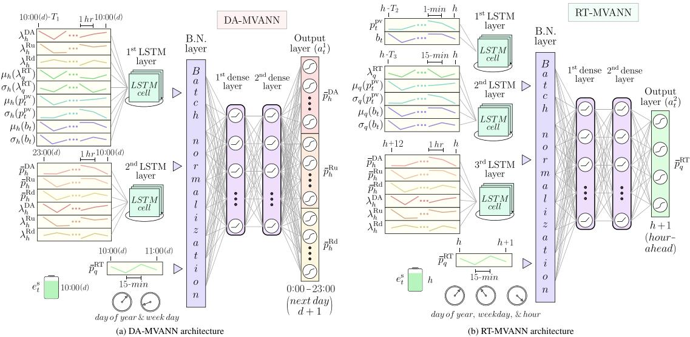  
Fig. 6. Diagrams of the DA-MVANN and RT-MVANN architectures.

Control information: Time series information for $\lambda _ { h } ^ { \mathrm { D A } } , \lambda _ { h } ^ { \mathrm { R u } } , \lambda _ { h } ^ { \mathrm { R d } } , \lambda _ { q } ^ { \mathrm { R T } } .$ $p _ { t } ^ { \mathsf { p v } }$ and $b _ { t }$ to contribute to the simulation of PV-ESS controlled operation and obtain markets payments and penalizations based on bidding decisions for the buffer-roll’s horizon �. Each control time series remain as originally acquired, as their transformation would distort the environment simulation.

Initial conditions: DA market decisions $\bar { p } _ { h } ^ { \mathrm { D A } } , \ \bar { p } _ { h } ^ { \mathrm { R u } }$ and $\bar { p } _ { h } ^ { \mathrm { R d } }$ for hourly intervals from 10:00 (�) until 23:00 (�), RT market decisions $\bar { p } _ { q } ^ { \mathrm { R T } }$ for 15-min intervals from 10:00 (�) until 10:45 (�), and ESS stored energy at 10:00 (�). Initial conditions can serve as inputs for the MVANNs as well as for simulation. When serving for simulation, each time series is transformed using the $\phi ^ { - 1 }$ function and the domain bounds depicted in (6). The buffer-roll’s initial condition values are randomly initialized under a uniform distribution within the respective domain bounds. Note that DA market decisions must be generated before the RT market decisions to ensure (6).

In order to compensate for the MARL non-stationary pathology [29] where agents face a moving target due to agents’ policies evolution through training, we make initial conditions adaptable through an established communication channel between consecutive buffer-rolls. To this end, the hourly horizon � is forced to be more than 24 h. Hence, consecutive buffer-rolls overlay for some periods. We use this feature to establish a one-way communication channel from buffer-roll � to buffer-roll � +1 to update initial conditions iteratively. This update can be done at the end of buffer-roll � time-windows simulation, where DA-MVANN and RT-MVANN’s bidding decisions and ESS’s stored energy are available for the periods to which the initial conditions of buffer-rol � + 1 are linked.

To keep all consecutive buffer-rolls communicated and initial con ditions adaptable for a comprehensive evaluation, communication is available between the last training and first validation buffer-roll. The maximum number of buffer-rolls that can be built depends on the maximum of MVANNs architecture parameters $T _ { 1 } , \ T _ { 2 } ,$ and $T _ { 3 } ,$ the selected horizon $H ,$ and the number of available days on the dataset.

## 3.4. MVANN-based agents learning phase

As mentioned in Section 3.3, for each buffer-roll �, it is possible to simulate � consecutive hours starting at 10:00 (�). We carry out the learning phase by simulating the MVANN-based agents’ bidding decisions and 1-min PV-ESS’s controlled operation in a mini-batch of buffer-rolls at each training iteration. Algorithm 1 depicts this learning phase.

Algorithm 1 Learning phase
Require: Initialize MVANNs' weights (θ,ω)
1: for each training iteration do
2: Randomly sample a mini-batch of buffer-rolls D
3: for h from 0 to H - 1 do
4: if h mod 24 = 0 then
5: Collect DA bids from DA-MVANN
6: end if
7: Collect RT bids from RT-MVANN
8: for t from 60h to 60h + 59 do
9: $p_t^r = p_{h(t)}^{\text{DA}} + b_t^+ p_{h(t)}^{\text{Ru}} - b_t^- p_{h(t)}^{\text{Rd}} + p_{q(t)}^{\text{RT}}$.
10: Execute (4)
11: Update $e_t^s$ by (5c)
12: end for
13: end for
14: Update buffer-rolls d ∈ D + 1 initial conditions
15: Compute $R^d$ for each buffer-roll d ∈ D by (8)
16: Update (θ,ω) by (9a)-(9b)
17: if stop criterion is met then
18: break
19: end if
20: end for

Following Algorithm 1, the learning phase requires initializing the weights of both MVANNs, where θ and ω corresponds to DA- and RT-MVANNs’ weights, respectively. At each training iteration, we simultaneously carry a simulation for a mini-batch of buffer-rolls. In the simulation, we call the MVANNs to make bidding decisions under the market rules, where DA-MVANN and RT-MVANN outputs are transformed by the $\phi ^ { - 1 }$ function in (7b). Data manipulation is required during the learning phase to build the inputs for both MVANNs. For instance, computed bids for an hour-step can be required as MVANNs inputs for a further hour-step. At each hour, the PV-ESS 1-min controlled operation is simulated by using the power reference $p _ { t } ^ { \mathrm r } ,$ , (4), and (5c). Each buffer-roll $d \in \mathcal { D }$ simulation is done independently of each other.

After simulating � hours, initial conditions are updated for the mini-batch of buffer-rolls $d \in \mathcal { D } + 1$ using the communication channel described in Section 3 3 Afterwards the shared reward function for each buffer-roll � is obtained as follows:

$$
\begin{array}{r} r _ {t} ^ {d} = \varDelta^ {1} \big (\lambda_ {h (t)} ^ {\mathrm{DA}} p _ {h (t)} ^ {\mathrm{DA}} + \lambda_ {h (t)} ^ {\mathrm{Ru}} p _ {h (t)} ^ {\mathrm{Ru}} + \lambda_ {h (t)} ^ {\mathrm{Rd}} p _ {h (t)} ^ {\mathrm{Rd}} + \\ \lambda_ {q (t)} ^ {\mathrm{RT}} p _ {q (t)} ^ {\mathrm{RT}} - \lambda^ {\mathrm{imb}} \left| \delta_ {t} \right| \big), \end{array}\tag{8a}
$$

$$
R ^ {d} = \frac {\varDelta^ {1}}{H} \sum_ {t = 0} ^ {\frac {H}{\varDelta^ {1}} - 1} r _ {t} ^ {d},\tag{8b}
$$

where (8a) comes from the objective function depicted in (5a) for each minute � and (8b) is the average reward signal per minute at each buffer-roll $d \in \mathrm { ~ \mathcal ~ D ~ }$ for the simulated time-window, functioning as a cumulative reward function over a finite horizon. Note that DA and RT bidding decisions can come from initial conditions or transformed MVANNs’ outputs.

In order to update both MVANNs’ weights using back-propagation at each training iteration, the gradient of the cumulative shared reward function for a mini-batch of buffer-rolls simulations is calculated with respect to each MVANN’s weights for user-defined time-steps. The gradient for each MVANN can be decomposed as follows:

$$
\nabla_ {\theta} R ^ {\mathcal {D}} \approx \frac {1}{| \mathcal {D} | | \mathcal {H} ^ {\Theta} |} \sum_ {d \in \mathcal {D}} \sum_ {h \in \mathcal {H} ^ {\Theta}} \nabla_ {\Theta_ {h}} R ^ {d} \nabla_ {\theta} \Theta_ {h},\tag{9a}
$$

$$
\nabla_ {\omega} R ^ {\mathcal {D}} \approx \frac {1}{| \mathcal {D} | | \mathcal {H} ^ {\Omega} |} \sum_ {d \in \mathcal {D}} \sum_ {h \in \mathcal {H} ^ {\Omega}} \nabla_ {\Omega_ {h}} R ^ {d} \nabla_ {\omega} \Omega_ {h},\tag{9b}
$$

where $\theta _ { h }$ and $\varOmega _ { h }$ correspond to DA and RT MVANNs’ outputs at hour-step ℎ. The gradient of $R ^ { \mathrm { { 2 } } }$ is derived only with respect to the DA-MVANN and RT-MVANN outputs for user-defined hour-steps contained in the sets $\mathcal { H } ^ { \theta }$ and $\mathcal { H } ^ { \varOmega }$ , respectively. The exclusion of some MVANNs’ outputs to compute the gradient relies on the observation that if the gradient of the reward function is taken over MVANNs bidding decisions for all time-steps, resources at the final time-steps would be fully exploited to maximize rewards (maximize profits), without taking future bidding and operational steps into account. This approach to controlling the MVANNs’ behaviors is similarly present on rolling hori zon optimization frameworks [42], where an adjustable time horizon and decisions stated as resource variables for user-defined steps are included to regularize resource exploitation.

Note that the MVANNs architectures are independent of each other, as no weights are shared between them. Nevertheless, each MVANN in fluences the weight update calculation of the other through the shared reward function in (8), looking to achieve a cooperative behavior as both MVANNs share the same goal. As a communication mechanism between agents, specific inputs for each architecture are related to already made bidding decisions, as discussed in Sections 3.2 and 3.3.

At the moment of computing, the gradients depicted in (9), intertemporal dependencies between variables at different time-steps appear, as we are not relying on a Markov Decision Process assumption [28]. For instance, following (5c) it is possible to discern that variable $e _ { t } ^ { \mathrm { s } }$ at each buffer-roll propagate inter-temporal dependencies on previously made MVANNs’ bidding decisions throughout simulation time-steps, given its relation with (4), and the relation of (4) with (5b). The horizon � must be set with the goal of capturing the impact into the future of bidding decisions made at hour-steps into $\mathcal { H } ^ { \theta }$ and $\mathcal { H } ^ { \varOmega }$ . In our particular context, we consider that bidding decisions for a given day do not have major effects on decisions to be made a month or week ahead, based on the hybrid power plant’s characteristics.

Using mini-batches instead of simulating one buffer-roll � at a time for MVANNs training allows a more accurate representation of the population distribution into the dataset for weights updating. In order to get an exhaustive evaluation at the validation set, validation buffer-rolls must be simulated in the original order of days, running one validation buffer-roll at a time and dismissing the MVANNs’ weights update steps depicted in Algorithm 1. Nevertheless, as this evaluation can be com putationally expensive, a batch simulation is conducted to obtain an approximate evaluation to meet a stop criterion for the MVANNs learning phase. In the case of the test set evaluation, we simulate all hours consecutively, and the already fitted MVANNs make bidding decisions over time by re-arranging and processing the incoming data for each hour to serve as inputs following how the real-world information flow would be. Our proposed MADRL framework can follow the real-world information flow as MVANNs’ architectures were constructed for this end: the test phase considers this information flow. It is unnecessary to calculate reward signals at minute-by-minute PV-ESS simulation in the test set, as its unique purpose is to fit both MVANNs’ weights in the learning phase. The proposed learning framework allows the use of state-of-the-art optimizers for MVANNs’ weights update, such as Adam, RMSprop, and Adadelta [43].

Table 1  
PV-ESS and market interaction parameters.

<table><tr><td> $\hat{p}^{s}$ </td><td> $\hat{e}^{s}$ </td><td> $\hat{e}^{s}$ </td><td> $\eta_{c}$ </td><td> $\eta_{d}$ </td></tr><tr><td>2.5 MW</td><td>0.25 MWh</td><td>2.25 MWh</td><td>0.9 –</td><td>0.95 –</td></tr><tr><td> $\check{\alpha}$ </td><td> $\hat{\alpha}$ </td><td> $\hat{\beta}$ </td><td> $\hat{\gamma}$ </td><td> $\lambda^{\text{imb}}$ </td></tr><tr><td>0 MWh</td><td>6 MWh</td><td>2 MWh</td><td>2 MWh</td><td>200 $/MWh</td></tr></table>

## 4. Case study

## 4.1. Data

Related energy LMPs and capacity for up/down-regulation ASMPs are obtained from California’s ISO Open Access Same-time Information System (OASIS) website for the time range from 6/19/2017 0:00 until 6/28/2020 23:00. Please refer to [31] for a better understanding of CAISO’s market mechanisms. LMPs are obtained for the generation node TOT210S1\_7\_N002 located near the border between Inyo County (California) and Las Vegas (Nevada). ASMPs are obtained for the AS\_CAISO\_EXP region. As stated before, we are using historical market clearing prices on the environment’s simulation due to the price-taker assumption. As regulation signals are not publicly available at CAISO sites, PJM’s traditional regulation signal is used in its stead. PJM’s site [44] counts with a 2 s resolution historical database for the years 2018, 2019, and 2020. This signal is downsampled to a 1-min resolution for our purposes by taking the respective period’s average. We complete missing data for the year 2017 by using the 2018 signal’s time series reversed.

Regarding PV generation, 1-min resolution data for the time range from 6/19/2017 0:00 to 6/28/2020 23:00 are obtained from an existing PV plant named RTC, NV, Baseline. This power plant is located near Las Vegas and approximately 130 km apart from the CAISO’s generation node aforementioned. According to NREL’s specifications, this site rate power is 6 MW and features a 30-degree tilt and two strings. This dataset is publicly available at NREL’s site [45]. Small missing data timeintervals are handled by performing time-interval averages, while more extensive missing data periods (longer than 30 days) at years 2017 and 2018 are patched with data from 2015 and 2016. Fortunately, for the periods at years 2019 and 2020, only small missing data time-intervals are detected. Fig. 7 visualizes this dataset by showing variable values according to the time of the day and respective 5th, 50th, and 95th time-interval quantiles. Because of outliers at the RT energy product LMPs, we clip its values at the top by its quantile 99.9th (training set) only for scenario-generation (for baseline methods) and before pre-processing this time series to serve as entry information for both MVANNs. PV-ESS and market interaction parameters are shown in Table 1.

The dataset is partitioned four times in time-consecutive training, validation, and test sets to evaluate the MADRL framework for a oneyear-round period (360 days). For each of the four partitions, the test set consists of 90 days, and the validation sets correspond to the 30 days before the beginning of each test set. The training sets correspond to all data before the beginning of each validation set. The first partition test set starts at 7/7/2019 00:00.

Table 2  
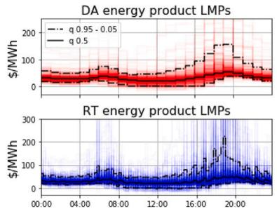

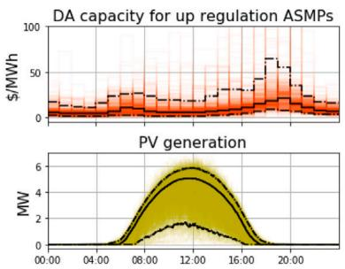  
Fig. 7. Visualization of dataset from 6/19/2017 0:00 to 6/7/2019 23:00 (First training set)

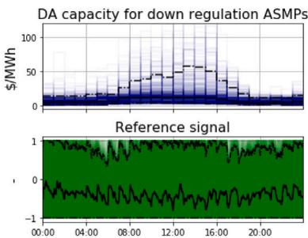

Hyper-parameter values for each dataset partition.

<table><tr><td rowspan="2">MVANN</td><td rowspan="2">Hyper-param.</td><td colspan="4">Dataset partition</td><td rowspan="2">Search space</td></tr><tr><td>1</td><td>2</td><td>3</td><td>4</td></tr><tr><td rowspan="5">DA-MVANN</td><td> $T_1$ </td><td>168</td><td>168</td><td>96</td><td>96</td><td>72, 96, 120, 144, 168, 192</td></tr><tr><td> $N^1_L$ </td><td>18</td><td>45</td><td>25</td><td>21</td><td>10-64</td></tr><tr><td> $N^2_L$ </td><td>20</td><td>32</td><td>14</td><td>63</td><td>10-64</td></tr><tr><td> $N^1_D$ </td><td>93</td><td>84</td><td>88</td><td>44</td><td>40-100</td></tr><tr><td> $N^2_D$ </td><td>-</td><td>48</td><td>-</td><td>22</td><td>20-100</td></tr><tr><td rowspan="7">RT-MVANN</td><td> $T_2$ </td><td>3</td><td>1</td><td>3</td><td>1</td><td>1-3</td></tr><tr><td> $T_3$ </td><td>48</td><td>48</td><td>24</td><td>48</td><td>24, 48, 72</td></tr><tr><td> $N^1_L$ </td><td>52</td><td>60</td><td>59</td><td>58</td><td>10-64</td></tr><tr><td> $N^2_L$ </td><td>22</td><td>15</td><td>20</td><td>40</td><td>10-64</td></tr><tr><td> $N^3_L$ </td><td>44</td><td>16</td><td>18</td><td>20</td><td>10-64</td></tr><tr><td> $N^1_D$ </td><td>93</td><td>92</td><td>84</td><td>53</td><td>40-100</td></tr><tr><td> $N^2_D$ </td><td>84</td><td>21</td><td>-</td><td>91</td><td>20-100</td></tr></table>

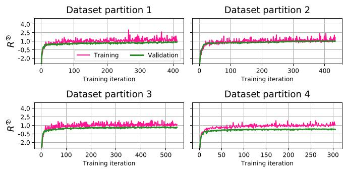  
Fig. 8. Training and validation shared cumulative rewards $( R ^ { \mathcal { D } } )$ versus number of training iterations for selected MVANNs by dataset partition.

## 4.2. MVANNs tuning

Experiments were run on a machine with ST2000DM001-1ER164 disk, Intel (R) Xeon (R) CPU E5-2630 v4 @ 2.2 GHz processor, and an NVIDIA Quadro K620 GPU.

Since the hyper-parameter space is too ample for an exhaustive search, we have performed limited tuning. To select MVANNs hyperparameters and adjust their weights, a random search of 30 hyperparameter samples is carried out using both training and validation sets. We have set the horizon simulation length � to 62 h. $\mathcal { H } ^ { \theta }$ is set only for DA-MVANN outputs at 10:00 (�), meanwhile $\mathcal { H } ^ { \varOmega }$ is set for RT-MVANN outputs between 23:00 (�) and 22:00 $( d + 1 ) _ { \colon }$ , included. We have performed weight update calculation using RMSprop on uniformly sampled mini-batches of 16 training buffer-rolls. To adjust the number of training iterations, an early stopping criterion with 50 iterations patience is used [46], which keeps track of the validation buffer-rolls batch cumulative reward function. Weights are initialized using Glorot uniform’s initialization. The execution time of each training iteration is approximately 35.9 s.

Table 2 shows the selected hyper-parameters for each dataset parti tion with their respective search spaces, and Fig. 8 shows the training (validation) cumulative mini-batch (batch) rewards for selected MVANNs by dataset partition. We can see in Fig. 8 that for the fourth set partition, the validation cumulative batch reward separates from the training cumulative mini-batch reward. This separation could indicate that the training and validation sets do not represent similar population distributions for the last partition. An existing concept-drift in electricity prices due to pandemic effects and more significant PV generation variability due to winter effects in the fourth partition can partly explain this behavior.

## 4.3. Scenario-based robust and stochastic optimization

Scenario-based robust (worst-case) and stochastic optimization methods are employed as baselines for the surrogate two-stage optimization problem stated in (5). For the first and second stage formulation (bidding in the DA and RT market), a horizon || of 62 and 12 h are selected, respectively. Decision variables are stated as recourse variables, with the exemption of the ones required to be submitted to the ISO when solving the problem at each optimization stage, i.e., each variable has an additional dimension � to indicate the scenario to which it is linked. To introduce the presented PV-ESS 1-min explicit control solution stated in $( 4 ) ,$ , it is necessary to include binary variables at each step t and scenario $s ,$ dramatically increasing the computational efforts. To keep computational tractability, binary variables are only included for the first two-hour intervals in the second stage of the model and avoided in the first stage.

## 4.3.1. Scenario generation

An adaptation of k-nearest neighborhood to historical data paths is employed as a scenario-generation technique for both stages, similar to the work done in [47]. This method implies constructing a ranking based on the $L ^ { 2 }$ norm values of vectors, where these vectors consist of the difference between the last � variable measurements and samelength paths created from historical data of the same variable acquired at equivalent time-intervals in previous days. Once this ranking has been constructed, we select the $N _ { s }$ vectors with lower $L ^ { 2 }$ norm values, then the next  measurements that follow the ending of each correspondent path serve as scenarios, where || corresponds to the horizon length of each stage. The last � measurements to be considered to generate each variable scenarios are independent for each stage and hour of the day, as different horizon requirements and variable’s nature calls for different adjustments. For assessing the quality of generated scenarios for each variable, stage, and hour of the day, we employed the energy score [48] metric $E S _ { T } .$ . In the case of equally likely scenarios, the formula is simplified as:

$$
E S _ {T} = \frac {1}{| \mathcal {T} |} \sum_ {t = 1} ^ {| \mathcal {T} |} \Big (\frac {1}{N _ {s}} \sum_ {i = 1} ^ {N _ {s}} | \tilde {\lambda} _ {t} ^ {i} - \lambda_ {t} | - \frac {1}{2 N _ {s} ^ {2}} \sum_ {i = 1} ^ {N _ {s}} \sum_ {j = 1} ^ {N _ {s}} | \tilde {\lambda} _ {t} ^ {i} - \tilde {\lambda} _ {t} ^ {j} | \Big)\tag{10}
$$

where $\tilde { \lambda } _ { t } ^ { i }$ is the variable value for the scenario � and time-interval � and $\lambda _ { t }$ is the real variable value at time-interval t. To adiust the length T of the vectors used to select $N _ { s }$ historical data paths of length $| \tau |$ to serve as scenarios for each variable, hour of the day, and stage, scenarios are generated for each hour-step of the validation set and related ES’s are calculated. We made a grid search with $\textbf { a } T$ hourly equivalent range running from 1 to 193 h. The number of scenarios $N _ { s }$ is set to 10 for both stages.

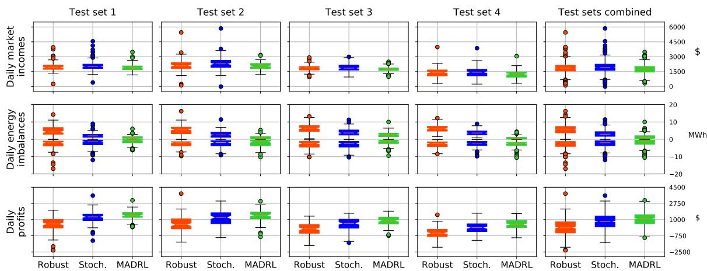  
Fig. 9. Daily market incomes, energy imbalances (positive domain: over-generation — negative domain: under-generation), and profits boxplots per method and for each datase partition.

Unlike the stochastic and robust formulations, which require scenarios to explicitly represent the uncertainty, our proposed MADRL framework directly maps information that would be available in accordance to the real-world environment under the assumptions. Thus, the MADRL framework does not require an intermediate step to explicitly represent the uncertainty by forecasting or scenario generation. In other words, the MVANNs learn this mapping during the learning phase driven directly by the finite cumulative reward function stated in (8b). By this means, it adopts an implicit uncertainty representation within the hidden layers.

## 4.4. Results

This section analyzes the main experimental results by comparing the proposed MADRL framework to scenario-based two-stage robust and stochastic optimization baselines. For a one-year-round period (360 days), the computing time for our proposed method was 0.02 s per hour-step on average, $\mathrm { i . e . , }$ the time for computing the corresponding bidding decision for each hour-step. Meanwhile, the optimization times for the robust and stochastic methods were 10.63 s and 2.83 s per hour-step on average, respectively. Thus, the computing times of the proposed framework were only 0.18% and 0.7% of the robust and stochastic methods’ optimization times.

Fig. 9 shows boxplots for the daily market incomes, energy imbal ances, and profits for the different test sets and methods. While the daily market incomes consist of total payments received by the PV-ESS plant for its participation in the DA and RT markets, the daily energy imbalances consist of the daily sum of over and under-generation at each minute, i.e., $\delta _ { \tau } ^ { - }$ and ${ { \delta } } _ { \tau } ^ { + } .$ . The daily profits comprises both the incomes for each product and the penalizations using the imbalance price $\lambda ^ { \mathrm { i m b } }$ . This factor also serves as a regularization mechanism in (8a) to drive the MVANNs weights’ updating for the MADRL approach and in the objective function (5a) for the robust and stochastic methods.

F-tests and t-tests were performed to assess the statistical signifi cance of the differences in variance and mean, respectively, between the results obtained by MADRL and stochastic and robust methods. Table 3 shows statistics for daily market incomes, imbalance penaliza tions, and profits. The daily market incomes obtained with the proposed MADRL framework have smaller variance than the stochastic and robust implementations (F-test’s p-values of $5 . 6 6 \times 1 0 ^ { - 9 }$ and $6 . 4 5 \times 1 0 ^ { - 5 } )$ , while it shows smaller incomes (t-test’s p-values of $1 . 2 3 \times 1 0 ^ { - 1 9 }$ and $1 . 9 7 \times 1 0 ^ { - 7 } )$

Statistics for daily market incomes, imbalance penalizations, and profits (test sets combined).

<table><tr><td></td><td></td><td>Robust</td><td>Stochastic</td><td>MADRL</td></tr><tr><td rowspan="3">DA energy product ($)</td><td>Mean</td><td>1,789</td><td>2,125</td><td>1,898</td></tr><tr><td>Std.</td><td>1,059</td><td>1,548</td><td>740</td></tr><tr><td>Sum</td><td>642,260</td><td>762,989</td><td>681,227</td></tr><tr><td rowspan="3">Capacity for up-regulation product ($)</td><td>Mean</td><td>321</td><td>347</td><td>168</td></tr><tr><td>Std.</td><td>143</td><td>147</td><td>89</td></tr><tr><td>Sum</td><td>115,128</td><td>124,728</td><td>60,214</td></tr><tr><td rowspan="3">Capacity for down-regulation product ($)</td><td>Mean</td><td>381</td><td>382</td><td>347</td></tr><tr><td>Std.</td><td>233</td><td>235</td><td>208</td></tr><tr><td>Sum</td><td>136,717</td><td>137,044</td><td>124,628</td></tr><tr><td rowspan="3">RT energy product ($)</td><td>Mean</td><td>-647</td><td>-914</td><td>-678</td></tr><tr><td>Std.</td><td>965</td><td>1,421</td><td>376</td></tr><tr><td>Sum</td><td>-232,120</td><td>-328,265</td><td>-243,549</td></tr><tr><td rowspan="3">Daily market incomes ($)</td><td>Mean</td><td>1,844</td><td>1,940</td><td>1,734</td></tr><tr><td>Std.</td><td>598</td><td>662</td><td>488</td></tr><tr><td>Sum</td><td>661,985</td><td>696,496</td><td>622,520</td></tr><tr><td rowspan="3">Imbalance penalizations ($)</td><td>Mean</td><td>1,734</td><td>1,169</td><td>697</td></tr><tr><td>Std.</td><td>631</td><td>582</td><td>477</td></tr><tr><td>Sum</td><td>622,512</td><td>419,641</td><td>250,341</td></tr><tr><td rowspan="3">Daily profits ($)</td><td>Mean</td><td>110</td><td>771</td><td>1,037</td></tr><tr><td>Std.</td><td>861</td><td>875</td><td>684</td></tr><tr><td>Sum</td><td>39,473</td><td>276,854</td><td>372,179</td></tr></table>

Daily under/over-generation and reference tracking performance by method (test sets combined).

<table><tr><td colspan="2"></td><td>Robust</td><td>Stochastic</td><td>MADRL</td></tr><tr><td rowspan="3">Daily under-generation (MWh)</td><td>Mean</td><td>2.95</td><td>2.64</td><td>2.04</td></tr><tr><td>Std.</td><td>2.39</td><td>2.36</td><td>2.04</td></tr><tr><td>Sum</td><td>1,059.07</td><td>947.99</td><td>730.60</td></tr><tr><td rowspan="3">Daily over-generation (MWh)</td><td>Mean</td><td>5.72</td><td>3.20</td><td>1.45</td></tr><tr><td>Std.</td><td>2.67</td><td>2.01</td><td>1.40</td></tr><tr><td>Sum</td><td>2,053.49</td><td>1,150.22</td><td>521.11</td></tr><tr><td colspan="2">Reference-tracking performance (%)</td><td>73.05</td><td>79.13</td><td>86.63</td></tr></table>

The daily energy imbalances show statistically significant smaller variance at over and under-generation for the MVANNs implementation when compared against stochastic and robust approaches (F-test’s pvalues of $7 . 2 4 \times 1 0 ^ { - 1 2 }$ and 1.64 × $1 0 ^ { - 3 2 }$ for over-generation, and 2.78 × $1 0 ^ { - 3 }$ and $1 . 2 \times 1 0 ^ { - 3 }$ for under-generation). Even more, the MVANNs method achieved smaller values for both energy imbalances, with a bias towards under-generation (t-test’s p-values of $2 . 4 8 \times 1 0 ^ { - 1 1 9 }$ and

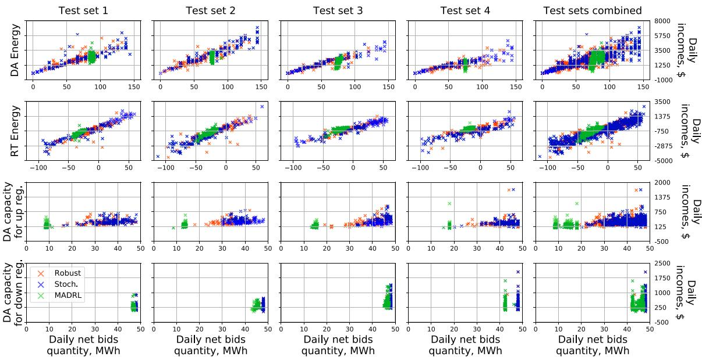  
Fig. 10. Daily incomes versus daily net bid quantity per method for each market product.

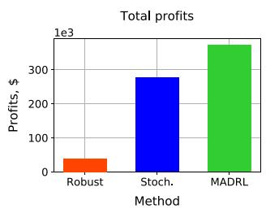

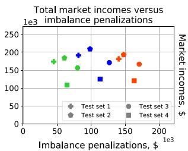  
Fig. 11. Total market incomes and imbalance penalizations: (a) Total profits per method (b) Total market incomes versus imbalance penalizations per method and fo each dataset partition.

$7 . 2 7 \times 1 0 ^ { - 6 6 }$ for over-generation, and $4 . 7 { \times } 1 0 ^ { - 1 7 }$ and $1 . 9 9 \times 1 0 ^ { - 1 3 }$ for undergeneration). Reference-tracking performance consists of the percentage of 1-min steps where the PV-ESS’s power injections to the grid $p _ { \tau } ^ { \mathrm { g } }$ matched the power reference signal $p _ { \tau } ^ { \mathrm { r } } ,$ i.e. $| \delta | \ = \ 0 .$ Results show that while the sum of daily market incomes seems favorable for the baseline methods, they are subject to higher and more dispersed energy imbalances. This behavior, coupled with a more accurate referencetracking performance of the signal generated by the MVANN-based agents, shows that our approach achieved less variability at controlling the PV-ESS power plant than the baseline approaches. Table 4 summarizes under/over-generations shown in Fig. 9 and reference-tracking performance for the one-year-round implementation of each method.

Fig. 11a shows the total profits for the one-year-round market participation for each method, showing that, from this perspective, our proposed MADRL framework achieved superior performance. The daily profits show statistically significant higher mean (t-test’s p-values of $1 . 4 4 \times 1 0 ^ { - 8 0 }$ and $2 . 9 8 \times 1 0 ^ { - 1 9 } )$ and smaller variance (F-test’s pvalues of $6 . 5 3 \times 1 0 ^ { - 6 }$ and $1 . 7 3 \times 1 0 ^ { - 6 } )$ than the robust and stochastic methods, respectively. However, Fig. 11b shows that the proposed MADRL framework achieves this higher performance by trading-off market incomes for a better provision of services, i.e., lower energy imbalances. Also, note that all three methods’ performances follow a similar trend across test sets, evidencing that all methods captured the effects of winter (first and fourth test sets) and coronavirus (third and fourth test sets).

In order to better understand each method’s bidding strategy, Fig. 10 shows each market product daily incomes against daily net self-scheduled bids quantity by method, where the latter refers to the total sum of self-scheduled products for each daily period in (MWh). We observe that the DA-MVANNs and RT-MVANNs derived a different strategy for each dataset partition, as each one concentrates its bids around different values and with different levels of dispersion, where the latter is caused due to each MVANN sensitivity to input values. The proposed MADRL framework achieved statistically significant smaller bids quantity variance for each product, with the exemption of the capacity for down-regulation product. F-test’s p-values of $3 . 3 9 \times 1 0 ^ { - 4 1 }$ and $8 . 3 3 \times 1 0 ^ { - 1 2 }$ (DA energy), $4 . 9 8 \times 1 0 ^ { - 2 2 }$ and $4 . 0 1 \times 1 0 ^ { - 2 0 }$ (up-regulation), $8 . 1 \times 1 0 ^ { - 3 }$ and $1 . 2 5 \times 1 0 ^ { - 2 }$ (down-regulation), and $3 . 4 6 \times 1 0 ^ { - 1 1 1 }$ and $1 . 0 9 \times 1 0 ^ { - 6 2 }$ (RT energy).

We ran two additional one-year-round simulations to evaluate how using storage and participating in AS markets may improve the economic viability of investing in ESS. These simulations consisted of (1) the PV-ESS power plant participating only in the energy markets (i.e., without participating in AS markets), and (2) the PV power plant without storage selling all its injections at the RT market energy price. According to our results, cases 1 and 2 would reduce total market incomes by 61.1% and 67.7%, respectively. Therefore, using an ESS and participating in both energy and AS markets would increase the total market incomes by approximately 460 k\$ in a year.

## 5. Conclusion

This work proposed a MADRL framework to derive efficient bidding strategies to allocate energy and AS products in the DA and RT markets operating with different timescales and lead times, while ensuring a feasible physical and financial operation of the PV-ESS hybrid power plant. Furthermore, we introduced a novel approach to solve a multi-timescale multi-agent sequential decision-making prob lem that achieves competitive results against an implementation of scenario-based two-stage robust and stochastic optimization. Based on the experimental setup, we observe that our MADRL framework shows: (i) higher total profits; (ii) comparable mean values for daily market incomes; (iii) smaller variance for daily market incomes, energy imbal ances, and daily net bid quantities; and (iv) better resource allocation based on reference tracking performance and energy imbalance results. In future work, the performance of the proposed method could be further improved by the inclusion of additional information, the use of different architectures, or a more exhaustive hyper-parameter search. Moreover, although outside the scope of our work, a performance comparison of single versus multiple agents could be relevant from a ML perspective.

A key feature of our approach is its flexibility to adapt to new environments from the points of view of market modeling and the control strategy used in a hybrid power plant with storage. For example, due to the price-taker assumption, the MVANN-based agents considers independence of the external variables regarding the EMS’s bidding decisions. However, this assumption could be relaxed by implementing a market simulator into the MVANNs learning phase to obtain market-clearing prices at computational and complex modeling expenses. Moreover, the proposed implementation could be adapted to other hybrid power plant control methods, as long as sufficient information is available to simulate its operation.

## CRediT authorship contribution statement

Tomás Ochoa: Conceptualization, Methodology, Software, Investi gation, Formal analysis, Writing – original draft, Data curation, Visu alization, Writing – review & editing. Esteban Gil: Conceptualization, Resources, Supervision, Methodology, Writing – original draft, Writing – review & editing. Alejandro Angulo: Conceptualization, Methodol ogy, Writing – original draft, Writing – review & editing. Carlos Valle: Conceptualization, Writing – review & editing.

## Declaration of competing interest

The authors declare that they have no known competing finan cial interests or personal relationships that could have appeared to influence the work reported in this paper.

## Acknowledgments

This work was supported in part by the Chilean National Agency for Research and Development (ANID) through grants 1210625 and FB0008, and by the DPP of Universidad Técnica Federico Santa María, Chile under grants PI-LIR-2020-59 and PIIC-005/2021.

## References

[1] Sinsel SR, Riemke RL, Hoffmann VH. Challenges and solution technologies for the integration of variable renewable energy sources—A review. Renew Energy 2020:145:2271-85.

[2] Heredia FJ, Cuadrado MD, Corchero C. On optimal participation in the electricity markets of wind power plants with battery energy storage systems. Comput Oper Res 2018;96:316–29.

[3] Hashmi MU, Labidi W, Bušić A, Elayoubi S-E, Chahed T. Long-term revenue estimation for battery performing arbitrage and ancillary services. In: 2018 IEEE international conference on communications, control, and computing technologies for smart grids (SmartGridComm). 2018, p. 1–7.

[4] Khatami R, Oikonomou K, Parvania M. Look-ahead optimal participation of compressed air energy storage in dav-ahead and real-time markets. JEEE Trans Sustain Energy 2020:11(2):682–92.

[5] Shapiro A, Nemirovski A. On complexity of stochastic programming problems. In: Continuous optimization: Current trends and modern applications. Boston. MA: Springer US; 2005, p. 111–46.

[6] Akbari E, Hooshmand R-A, Gholipour M, Parastegari M. Stochastic programmingbased optimal bidding of compressed air energy storage with wind and therma generation units in energy and reserve markets. Energy 2019;171:535–46.

[7] Aghaei J, Barani M, Shafie-khah M, Sánchez de la Nieta AA, Catalão JPS. Risk-constrained offering strategy for aggregated hybrid power plant including wind power producer and demand response provider. IEEE Trans Sustain Energy 2016:7(2):513–25

[8] Lak O, Rastegar M, Mohammadi M, Shafiee S, Zareipour H. Risk-constrained stochastic market operation strategies for wind power producers and energy storage systems. Energy 2021:215:119092.

[9] Rahimiyan M, Baringo L. Strategic bidding for a virtual power plant in the day ahead and real-time markets: A price-taker robust optimization approach. IEEE Trans Power Syst 2016:31(4):2676–87

kb b h b b h d h ll h robust energy management of a hybrid charging station integrated with the photovoltaic system. Int J Hvdrogen Energy 2021:46(24):12701-14

[11] Crespo-Vazquez JL, Carrillo C, Diaz-Dorado E, Martinez-Lorenzo JA, Noor-E Alam M. Evaluation of a data driven stochastic approach to optimize the participation of a wind and storage power plant in day-ahead and reserve markets. Energy 2018;156:278–91.

[12] Roos E, den Hertog D. Reducing conservatism in robust optimization. INFORMS J Comput 2020:32(4):1109–27

[13] Han YC, Huang GH, Li CH. An interval-parameter multi-stage stochastic chance constrained mixed integer programming model for inter-basin water resource management systems under uncertainty. In: 2008 fifth international conference on fuzzy systems and knowledge discovery, Vol. 5. 2008, p. 146–53.

[14] Rudloff B, Street A, Valladão DM. Time consistency and risk averse dynamic decision models: Definition, interpretation and practical consequences. European J Oper Res 2014:234(3):743–50.

[15] Brigatto A, Street A, Valladao DM. Assessing the cost of time-inconsistent operation policies in hydrothermal power systems. IEEE Trans Power Syst 2017:32(6):4541–50

[16] Arulkumaran K, Deisenroth MP, Brundage M, Bharath AA. Deep reinforcement learning: A brief survey. IEEE Signal Process Mag 2017;34(6):26–38

[17] Cao D, Hu W, Xu X, Dragičević T, Huang Q, Liu Z, Chen Z, Blaabjerg F. Bidding strategy for trading wind energy and purchasing reserve of wind power producer – A DRL based approach. Int J Electr Power Energy Syst 2020;117:105648.

[18] Chen R, Paschalidis IC, Caramanis MC, Andrianesis P. Learning from past bid to participate strategically in day-ahead electricity markets. IEEE Trans Smart Grid 2019;10(5):5794–806.

[19] Ye Y, Qiu D, Sun M, Papadaskalopoulos D, Strbac G. Deep reinforcement learning for strategic bidding in electricity markets. IEEE Trans Smart Grid 2020;11(2):1343–55.

[20] Zhang Y, Yang Q. A survey on multi-task learning. IEEE Trans Knowl Data Eng 2021:1.

[21] Standley T, Zamir AR, Chen D, Guibas L, Malik J, Savarese S. Which tasks should be learned together in multi-task learning? 2020, arXiv:1905.07553.

[22] Lu R, Li Y-C, Li Y, Jiang J, Ding Y. Multi-agent deep reinforcement learning based demand response for discrete manufacturing systems energy management. Appl Energy 2020;276:115473.

[23] Xi L, Chen J, Huang Y, Xu Y, Liu L, Zhou Y, Li Y. Smart generation control based on multi-agent reinforcement learning with the idea of the time tunnel. Energy 2018;153:977–87.

[24] Wang J, Sun L. Dynamic holding control to avoid bus bunching: A multi-agent deep reinforcement learning framework. Transp Res C 2020;116:102661.

[25] Wu J, Li K, Jia Q-S. Decentralized multi-agent reinforcement learning with multi time scale of decision epochs. In: 2020 59th IEEE conference on decision and control (CDC). 2020. p. 578–84

[26] Shin J. Lee JH. Multi-timescale, multi-period decision-making model develop ment by combining reinforcement learning and mathematical programming. Comput Chem Eng 2019;121:556–73.

[27] Wernz C. Multi-time-scale Markov decision processes for organizational decision-making. EURO J Decis Process 2013:1(3–4):299–324.

[28] Hernandez-Leal P, Kartal B, Taylor ME. A survey and critique of multiagent deep reinforcement learning. Auton Agents Multi-Agent Syst 2019;33(6):750–97.

[29] Gronauer S. Diepold K. Multi-agent deep reinforcement learning: a survey, Artif Intell Rev 2021

[30] Du W, Ding S. A survey on multi-agent deep reinforcement learning: from the perspective of challenges and applications. Artif Intell Rey 2021:54(5SN 1573-7462):3215–38.

[31] Dowling AW. Kumar R. Zavala VM. A multi-scale optimization framework for electricity market participation. Appl Energy 2017;190:147–64.

[32] California Independent System Operator. 2021, [link]. URL https://www.caiso. i id lf h d l b i i k f Feb15\_2018.pdf.

[33] Hu J. Sarker MR. Wang J. Wen F. Liu W. Provision of flexible ramping product by battery energy storage in day-ahead energy and reserve markets. IET Gener Transm Distrib 2018;12:2256–64, (8).

[34] Dimitriadis CN, Tsimopoulos EG, Georgiadis MC. Strategic bidding of an energy storage agent in a joint energy and reserve market under stochastic generation. Energy 2021:123026.

[35] Borrelli F, Bemporad A, Morari M. Predictive control for linear and hybrid systems. Cambridge University Press: 2017.

[36] Goodfellow I, Bengio Y, Courville A. Deep learning. MIT Press; 2016.

[37] Abiodun OI, Jantan A, Omolara AE, Dada KV, Mohamed NA, Arshad H. State-of-the-art in artificial neural network applications: A survey. Heliyon 2018;4(11).

[38] Bright J, Smith C, Taylor P, Crook R. Stochastic generation of synthetic minutely irradiance time series derived from mean hourly weather observation data. Sol Energy 2015;115:229–42.

[39] Zhang R. Nie F. Li X. Wei X. Feature selection with multi-view data: A survev Inf Fusion 2019:50:158–67

[40] Sun Y, Szűcs G, Brandt AR. Solar PV output prediction from video streams using convolutional neural networks. Energy Environ Sci 2018;11:1811–8.

[41] Hochreiter S, Schmidhuber J. Long short-term memory. Neural Comput 1997:9(8):1735–80

[42] Powell WB. Clearing the jungle of stochastic optimization. In: Bridging data and decisions. INFORMS TutORials in Operations Research; 2014, p. 109–37.

[43] Zaheer R, Shaziya H. A study of the optimization algorithms in deep learning. In: 2019 third int. conf. on inventive systems and control (ICISC). 2019, p. 536–9.

[44] Pennsylvania-New Jersey-Maryland Interconnection. 2021, [link]. URL https: //www.pjm.com/markets-and-operations/ancillary-services.aspx.

[45] Sengupta M, Xie Y, Lopez A, Habte A, Maclaurin G, Shelby J. The national solar radiation data base (NSRDB). Renew Sustain Energy Rev 2018;89:51–60.

[46] Bengio Y. Practical recommendations for gradient-based training of deep architectures. In: Neural networks: Tricks of the trade. Springer; 2012, p. 437–78.

[47] Raseman WJ, Rajagopalan B, Kasprzyk JR, Kleiber W. Nearest neighbor time series bootstrap for generating influent water quality scenarios. Stoch Environ Res Risk Assess 2020;34(1):23–31.

[48] Sari D, Lee Y, Ryan S, Woodruff D. Statistical metrics for assessing the quality of wind power scenarios for stochastic unit commitment. Wind Energy 2015;19(5):873–93.