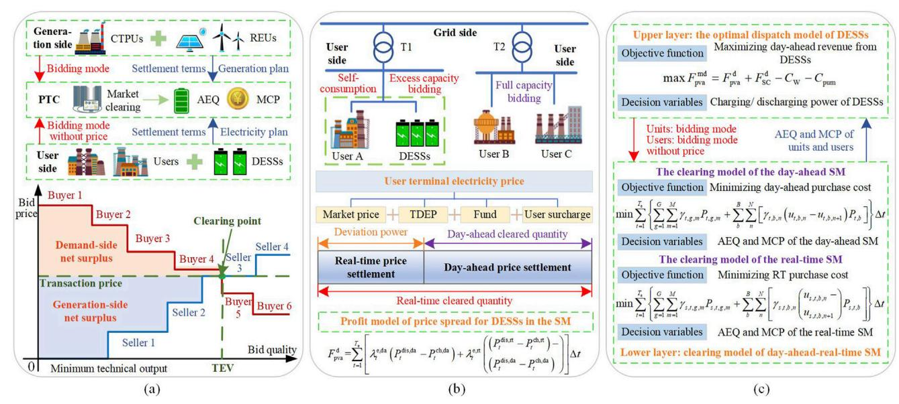
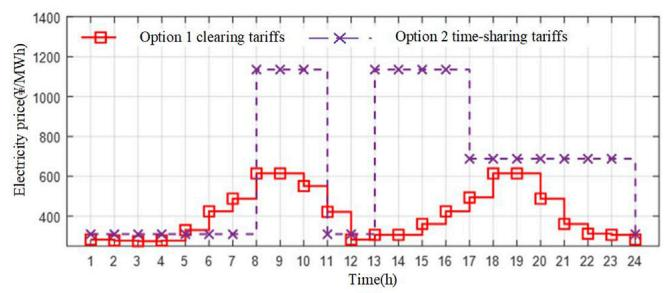
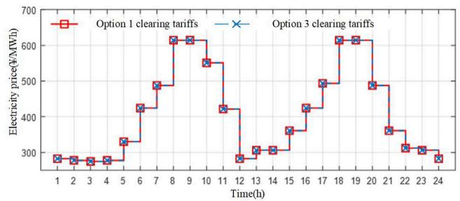
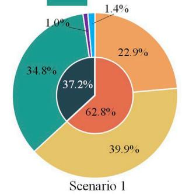
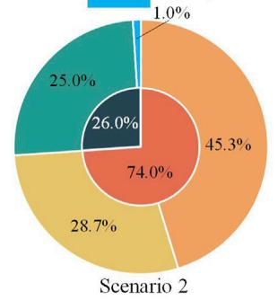
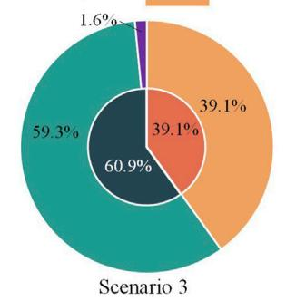
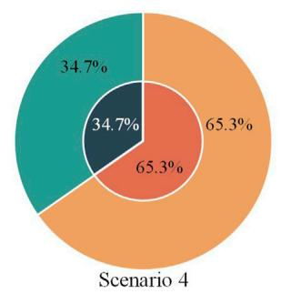

Check for updates

## OPEN ACCESS

EDITED BY Hui Hou, Wuhan University of Technology, China

REVIEWED BY Xi Lu, Southeast University, China Kaiping Qu, China University of Mining and Technology, China Jian Chen, Shandong University, China

\*CORRESPONDENCE Shiyu Hong, 1219704974@qq.com

RECEIVED 11 July 2024 ACCEPTED 21 August 2024 PUBLISHED 13 September 2024

## CITATION

Pei Z, Fang J, Zhang Z, Chen J, Hong S and Peng Z (2024) Optimal price-taker bidding strategy of distributed energy storage systems in the electricity spot market. Front Energ Res 12:1463286. doi: 10.3389/fenrg.2024.1463286

## COPYRIGHT

© 2024 Pei, Fang, Zhang, Chen, Hong and Peng. This is an open-access article distributed under the terms of the Creative Commons Attribution License (CC BY). The use, distribution or reproduction in other forums is permitted, provided the original author(s) and the copyright owner(s) are credited and that the original publication in this journal is cited, in accordance with accepted academic practice. No use, distribution or reproduction is permitted which does not comply with these terms.

# Optimal price-taker bidding strategy of distributed energy storage systems in the electricity spot market

Zhigang Pei1, Jun Fang1, Zhiyuan Zhang1, Jiaming Chen1, Shiyu Hong2\* and Zhihui Peng2

1Shaoxing Power Supply Company, State Grid Zhejiang Electric Power Co., Ltd., Shaoxing, China, 2College of Electrical and Information Engineering, Hunan University, Changsha, China

KEYWORDS

bidding mode, energy storage, market clearing, renewable energy, spot market

## 1 Introduction

Under the influence of recent power system reforms, the spot market (SM) (Song et al., 2019; Li et al., 2023; Jiang et al., 2022) can fully restore the commodity attributes of electricity, effectively facilitate price discovery (Figuerola-Ferretti and Gonzalo, 2010; Kou et al., 2021), and optimize the resource allocation (Jiang et al., 2022; Alzhouri et al., 2020). As an emerging flexible resource in the power market, distributed energy storage systems (DESSs) play the dual roles of generation and consumption (Kalantar-Neyestanaki and Cherkaoui, 2021; Li et al., 2021), thereby complicating the market dynamics for energy storage users. Currently, large-scale energy storage systems mainly operate independently in the SM, both on the generation (Gao et al., 2021; Gu and Sioshansi, 2022) and grid sides (Jiang et al., 2020; Abdelghany et al., 2024). However, there are few studies on the smallscale user-side DESSs, which participate in SM transactions (Wang et al., 2024; Scheller et al., 2020; Sun et al., 2022; He and Zhang, 2021), and their cooperative operational mechanisms and profit models have remained underdeveloped. Therefore, an operational price-taker bidding strategy of the DESSs, combined with users that participate in the SM, has been proposed in the present study. This model combines the DESS and users, which ensures the access conditions for the DESS to participate in the SM, and at the same time, the whole can be directly dispatched by the dispatching organization. This allows the DESS to fully utilize its regulating capacity and smooth out the uncertainty and volatility of the users’ electricity consumption, in addition to allowing the users to adjust their time of use to reduce the cost of electricity through this approach. A novel approach has been provided to enhance the profitability and reduce the payback period of DESSs.

This paper is divided into two parts: 1) A clearing model for DESS joint users to participate in the electricity spot market (ESM) has been constructed while concurrently developing a profit model for price-taker DESSs based on price spread. 2) A two-layer bid quantity model for DESS joint users to participate in the SM has been proposed, where the optimal trading strategy has been devised to maximize the daily revenue ofthe DESSs in the upper layer, while the clearing model guides the bid quantity strategy of the upper-layer DESSs through market price signals.

## 2 Clearing model of the electricity spot market for DESSs and user aggregators

The clearing process in the ESM involves the power trading center (PTC) maximizing social welfare or minimizing system purchasing costs by collecting bidding data from buyers (such as users and sellers), including conventional thermal power units (CTPUs) and renewable energy units (REUs), to obtain the generation plan of the generation side on the operation day, the clearing power of the user side, and the marginal clearing tariffs required for settlement before the day of settlement (Wei et al., 2021; Wang and Ai, 2023). Allocated electricity quantities (AEQs) for both buyers and sellers will be obtained, and the marginal clearing price (MCP) can be determined (Figure 1A). In the ESM, the intersection between the offer curve of the user demand and the generated offer curve of the unit generation is the market clearing point. The power and price that correspond to this point are the traded electricity volume (TEV) and transaction price (He and Zhang, 2021; Wang et al., 2022). Furthermore, social welfare is the sum ofthe net surplus on the generation and user sides, namely, the area of the shaded part in Figure 1A.

In this paper, the objective function of the security-constrained unit commitment (SCUC) model, which considers DESS participation in the SM, aims to maximize social welfare, including user-side purchasing costs, operational costs ofREUs, and operational and start-up costs of CTPUs, which is shown in Equation 1. Equations 2–4 are the interpretation of the characters in Equation 1.

$$
\max \sum_ {t = 1} ^ {T _ {\mathrm{e}}} \left[ \begin{array}{l} \sum_ {j = 1} ^ {J _ {\mathrm{w}}} \sum_ {k = 1} ^ {K} \gamma_ {t, j, k} P _ {t, j, k} - \sum_ {g = 1} ^ {G} \sum_ {m = 1} ^ {M} \gamma_ {t, g, m} P _ {t, g, m} - \sum_ {b} ^ {B} \sum_ {n} ^ {N} \left[ \gamma_ {t, b, n} (u _ {t, b, n} - u _ {t, b, n + 1}) P _ {t, b} \right] \\ - \sum_ {g = 1} ^ {G} \left[ u _ {t, g} (1 - u _ {t - 1, g}) + u _ {t - 1, g} (1 - u _ {t, g}) \right] C _ {g} ^ {\mathrm{s}} \end{array} \right]\tag{\(\Delta t,\}
$$

(1)

$$
\gamma_ {t, g, m} = \left\{ \begin{array}{l l} a _ {g} \Big (P _ {t, g, m} ^ {\max} + P _ {t, g, m} ^ {\min} \Big) + b _ {g} & P _ {t, g, m} ^ {\min} \geq P _ {g} ^ {\min}, P _ {t, g, m} ^ {\max} \leq P _ {g} ^ {\max} \\ 0 & P _ {t, g, m} ^ {\min} <   P _ {g} ^ {\min}, P _ {t, g, m} ^ {\max} > P _ {g} ^ {\max}, \end{array} \right.\tag{2}
$$

$$
\gamma_ {t, b, n} = \frac {d (1 + d) ^ {N _ {\mathrm{b}}} C _ {b , \text {nec}}}{(1 + d) ^ {N _ {\mathrm{b}}} - 1} \frac {E _ {b} ^ {\text {dal}}}{E _ {b} ^ {\text {yel}}} \frac {1}{E _ {b} ^ {\text {das}}} \kappa_ {t, b, n},\tag{3}
$$

$$
P _ {t, b} = \sum_ {n = 1} ^ {N} \alpha_ {t, b, n} P _ {t, b, n} ^ {\max},\tag{4}
$$

where $\gamma _ { t , j , k }$ is the charging bid of user j in segment k during the time period t; $P _ { t , j , k }$ is the declared charging power; $\gamma _ { t , g , m }$ is the generation price declared by the CTPU g in segment m for the time period t; $P _ { t , g , m }$ is the winning generation power; $\gamma _ { t , b , n }$ is the generation tariff declared by new energy b in segment n for the time period t; $u _ { t , b , n }$ is the binary variable if the declared output has been called; $P _ { t , b }$ is the output ofthe REU b in the time period $t ; u _ { t , g }$ is the binary variable of the startup and shutdown for unit $g$ in the time period t; $C _ { g } ^ { s }$ is the startup cost of the CTPU g; $P _ { t , g , m } ^ { \operatorname* { m a x } }$ and $P _ { t , q , m } ^ { \operatorname* { m i n } }$ are the upper and lower limits of the output power, respectively; $P _ { g } ^ { \mathrm { m a x } }$ and $P _ { g } ^ { \operatorname* { m i n } }$ are the maximum and minimum technical outputs, respectively, of the CTPU $g ; a _ { g }$ and $b _ { g }$ are the cost coefficients; $N _ { b }$ is the equipment life span of the REU b; $C _ { b , \mathrm { n e c } }$ is the initial investment cost of the REU b; $E _ { b } ^ { \mathrm { y e l } }$ is the annual electricity generation in medium- and long-term forecasts; $E _ { b } ^ { \mathrm { d a l } }$ is the daily generation capacity in medium- and longterm forecasts; $E _ { b } ^ { \mathrm { d a s } }$ is the daily generation capacity in a short-term forecast; $\kappa _ { t , b , n }$ is the fixed cost-sharing coefficient of the REU b for the time period t in the nth segment, which is related to market supply and demand, and is estimated based on historical data on supply and demand in the electricity spot market; $\alpha _ { t , b , n }$ is the declared output proportion in the nth segment; and $P _ { t , b , n } ^ { \operatorname* { m a x } }$ is the upper limit.

Additionally, to ensure the safe and stable operation of the system, it is necessary to consider the operational constraints of CTPUs Equations 5–13, the operational constraint of REUs Equation 14, the bidding segment constraints of NEUs Equations 15–17, and the system power balance constraints Equations 18, 19, as detailed below:

$$
u _ {t, g} P _ {g} ^ {\mathrm{min}} \leq P _ {t, g} \leq u _ {t, g} P _ {g} ^ {\mathrm{max}},\tag{5}
$$

$$
P _ {t, g} = \sum_ {m = 1} ^ {M} P _ {t, g, m},\tag{6}
$$

$$
P _ {g, m} ^ {\mathrm{min}} \leq P _ {t, g, m} \leq P _ {g, m} ^ {\mathrm{max}},
$$

$$
P _ {t, g} - P _ {t - 1, g} \leq P _ {g} ^ {\mathrm{RP}},\tag{7}
$$

$$
T _ {t, g} ^ {\mathrm{U}} - \left(u _ {t - 1, g} - u _ {t, g}\right) T _ {g} ^ {\mathrm{U}} \geq 0,\tag{8}
$$

(9)

$$
T _ {t, g} ^ {\mathrm{D}} - \left(u _ {t, g} - u _ {t - 1, g}\right) T _ {g} ^ {\mathrm{D}} \geq 0,\tag{10}
$$

$$
T _ {t, g} ^ {\mathrm{U}} = \sum_ {\tau = t - T _ {g} ^ {\mathrm{U}}} ^ {t - 1} u _ {\tau , g},\tag{11}
$$

$$
T _ {t, g} ^ {\mathrm{D}} = \sum_ {\tau = t - T _ {g} ^ {\mathrm{D}}} ^ {t - 1} \Big (1 - u _ {\tau , g} \Big),\tag{12}
$$

$$
\sum_ {g = 1} ^ {G} \left(u _ {t, g} P _ {g} ^ {\max}\right) + \sum_ {b = 1} ^ {B} P _ {t, b} ^ {\max} \geq \left(1 + r ^ {S R}\right) P _ {t} ^ {\text {load}},\tag{13}
$$

$$
0 \leq P _ {t, b} \leq P _ {t, b} ^ {\max},
$$

$$
0 \leq \alpha_ {t, b, n} \leq 1,\tag{14}
$$

(15)

$$
\alpha_ {t, b, n} \leq u _ {t, b, n},\tag{16}
$$

$$
u _ {t, b, n + 1} \leq \alpha_ {t, b, n},\tag{17}
$$

$$
\sum_ {g = 1} ^ {G} P _ {t, g} + \sum_ {b = 1} ^ {B} P _ {t, b} = P _ {t} ^ {\mathrm{load}},\tag{18}
$$

$$
P _ {t} ^ {\text {load}} = \sum_ {j = 1} ^ {J _ {\mathrm{u}}} \sum_ {k = 1} ^ {K} P _ {t, j, k} = \sum_ {j = 1} ^ {J _ {\mathrm{u}} - 1} \sum_ {k = 1} ^ {K} P _ {t, j, k} + \sum_ {k = 1} ^ {K} P _ {t, k} ^ {\mathrm{u}} + P _ {t} ^ {\mathrm{ch}} - P _ {t} ^ {\mathrm{dis}},\tag{19}
$$

where $P _ { g } ^ { \mathrm { R P } }$ is the climbing capacity in adjacent time periods; $T _ { t , q } ^ { \mathrm { U } }$ and $T _ { t , g } ^ { \mathrm { D } }$ are the start-up and shutdown times, respectively, of unit $\overset { \cdot } { g } ; T _ { g } ^ { \mathrm { U } }$ and $T _ { g } ^ { \mathrm { D } }$ are the required minimum start-up and shutdown times, respectively; $P _ { t , b } ^ { \operatorname* { m a x } }$ is the maximum generation output of the NEU b; $r ^ { S R }$ is the planned standby ratio of the system; $u _ { t , b , n }$ is the binary variable ifthe declared output is invoked; $P _ { t } ^ { \mathrm { l o a d } }$ is the load power; $P _ { t , k } ^ { \mathrm { u } }$ is the power demand of all customized power users in the kth segment of the time period t; and $P _ { t } ^ { \mathrm { c h } }$ and $P _ { t } ^ { \mathrm { d i s } }$ s are the charging and discharging power, respectively, of the DESS.

After that, the security-constrained economic dispatch (SCED) model (Zhang M. et al., 2023; Tang et al., 2022) also needs to be centrally optimized to obtain the day-ahead AEQ and MCP for the operating day. Therefore, the model is specified as shown in Equation 20:

$$
\max \sum_{t = 1}^{T_{e}}\Bigg[\sum_{j = 1}^{J_{u}}\sum_{k = 1}^{K}\gamma_{t,j,k}P_{t,j,k}- \sum_{g = 1m = 1}^{G}\sum_{n}^{M}\gamma_{t,g,m}P_{t,g,m} - \sum_{b}^{B}\sum_{n}^{N}\Big[\gamma_{t,b,n}\big(u_{t,b,n} - u_{t,b,n + 1}\big)P_{t,b}\Big]\Bigg] \Delta t\\ s.t. (5) - (8), (13) - (19)\tag{20}
$$

  
FIGURE 1 Transaction framework of the DESS participation in the SM for the price-taker bidding mode: (A) Schematic diagram of the system structure and clearing rules of the bilateral electricity spot market. (B) Schematic diagram of the dual settlement mechanism. (C) Framework diagram of the two tier model.

## 3 Profit model for spread trading of DESSs in the electricity spot market

For the ESM, users settle the power price according to the “dayahead benchmark, real-time difference” principle (Ding and Tan, 2022). The power price consists of two components: the day-ahead market, which determines the power price, and the deviation power price, which is determined by the real-time market. The day-ahead market-clearing power tariff is calculated as the product of the dayahead user clearing quantity in the day-ahead electricity energy market and the day-ahead marginal clearing price, and the same applies to the deviation power tariff for real-time market settlement. This dual settlement mechanism is illustrated in Figure 1B.

Currently, most researchers claim that the terminal electricity price for the user includes the market prices of electricity, transmission and distribution electricity prices (TDEPs), government funds, and user surcharges (Ding and Tan, 2022). In the context of the SM environment, the commodity nature of electrical energy implies that its market price is primarily determined by supply-and-demand dynamics (Jiang et al., 2022). Therefore, the above-presented market price for electricity is the market clearing price. It is calculated by using the PTC, which is based on the bidding information that is reported by the supply and demand participants rather than being based on the final settlement price for end-users. Therefore, the spot spread arbitrage model for DESS considering TDEPs is shown in Equation 21.

$$
\begin{array}{r} F _ {\mathrm{pva}} ^ {\mathrm{d}} = \sum_ {t = 1} ^ {T _ {\mathrm{e}}} \Big [ \lambda_ {t} ^ {\mathrm{e,da}} \Big (P _ {t} ^ {\mathrm{dis,da}} - P _ {t} ^ {\mathrm{ch,da}} \Big) + \lambda_ {t} ^ {\mathrm{e,rt}} \Big (\Big (P _ {t} ^ {\mathrm{dis,rt}} - P _ {t} ^ {\mathrm{ch,rt}} \Big) \\ - \Big (P _ {t} ^ {\mathrm{dis,da}} - P _ {t} ^ {\mathrm{ch,da}} \Big) \big) ] \Delta t, \end{array}\tag{21}
$$

where $F _ { \mathrm { p v a } } ^ { \mathrm { d } }$ is the integrated daily revenue of the DESS in the SM, including both the day-ahead and real-time market returns; $\lambda _ { t } ^ { \mathrm { e , d a } }$ and $\lambda _ { t } ^ { \mathrm { e , r t } }$ are the nodal clearing prices in the day-ahead and real-time SM, respectively; $P _ { t } ^ { \mathrm { c h , d a } }$ and $P _ { t } ^ { \mathrm { d i s , d a } }$ are the charging and discharging powers, respectively, of the DESS in the day-ahead SM; and $P _ { t } ^ { \mathrm { d i s , r t } }$ and $P _ { t } ^ { \mathrm { c h , r t } }$ are the charging and discharging powers, respectively, in the real-time SM.

## 4 Optimal two-stage bidding strategy of the spot market for pricetaker DESSs

In the process of electricity spot trading, the decision-making of each market subject’s quotation needs to consider the reaction of the PTC, and the PTC is also subject to the limitations of the information declared by each market subject in the clearing of the SM. Therefore, the optimal charging and discharging problem of the DESS participating in the SM is a two-stage optimization problem. Its model framework is presented in Figure 1C. For the upper layer, the DESS optimizes its bidding strategy with the objective of maximizing the revenue in the dayahead and real-time SM. Moreover, due to the deviation between the renewable energy output and the actual power consumption of users in the real-time market, in addition to the power reported in the day ahead market (Li et al., 2023; Shamsi and Cuffe, 2021; Zhang C. et al., 2023), it is necessary to introduce an error penalty mechanism to penalize the parties with larger errors in the real-time market. Additionally, the customized power services (CPSs) provided by the DESS and the corresponding default costs are considered in the day-ahead power energy gain. Therefore, the objective function of the upper level is shown in Equation 22. Equation 23–Equation 26 are the interpretation of the characters in Equation 22.

$$
\max F _ {\mathrm{pva}} ^ {\mathrm{md}} = F _ {\mathrm{pva}} ^ {\mathrm{d}} + F _ {\mathrm{sc}} ^ {\mathrm{d}} - C _ {\mathrm{W}} - C _ {\mathrm{pum}},\tag{22}
$$

$$
F _ {\mathrm{SC}} ^ {\mathrm{d}} = \sum_ {h = 1} ^ {H} \left[ \lambda_ {h} ^ {\mathrm{SC}} \cdot \sum_ {t = 1} ^ {T _ {e}} \sum_ {k = 1} ^ {K} \left(P _ {t, k} ^ {\mathrm{u}} \Delta t\right) \right],\tag{23}
$$

$$
C _ {\mathrm{W}} = \sum_ {h = 1} ^ {H} W _ {h} \varsigma_ {h} \cdot \sum_ {x <   h} \rho_ {h},\tag{24}
$$

$$
C _ {\mathrm{pum}} = \sum_ {t = 1} ^ {T _ {\mathrm{e}}} \sum_ {s} \rho_ {s} \left(\frac {C _ {s , t} ^ {\mathrm{pun}}}{J _ {\mathrm{u}}} \frac {P _ {s , t} ^ {\mathrm{dis}} + P _ {s , t} ^ {\mathrm{ch}}}{P _ {s , t} ^ {\mathrm{dis}} + P _ {s , t} ^ {\mathrm{ch}} + P _ {s , t} ^ {\mathrm{u}}}\right) \Delta t,\tag{25}
$$

$$
C _ {s, t} ^ {\text { pun }} = \left\{ \begin{array}{l l} \lambda_ {s, t} ^ {\text { e,rt }} \left(\sum_ {j = 1} ^ {J _ {\text { u }}} \left| \Delta L _ {s, t, j} \right| + \sum_ {b = 1} ^ {B} \left| \Delta G _ {s, t, b} \right|\right), & \sum_ {j = 1} ^ {J _ {\text { u }}} \left| \Delta L _ {s, t, j} \right| > \sum_ {b = 1} ^ {B} \left| \Delta G _ {s, t, b} \right| \\ 0, & \sum_ {j = 1} ^ {J _ {\text { u }}} \left| \Delta L _ {s, t, j} \right| <   \sum_ {b = 1} ^ {B} \left| \Delta G _ {s, t, b} \right| \\ 0. 5 \lambda_ {s, t} ^ {\text { e,rt }} \left(\sum_ {j = 1} ^ {J _ {\text { u }}} \left| \Delta L _ {s, t, j} \right| + \sum_ {b = 1} ^ {B} \left| \Delta G _ {s, t, b} \right|\right), & \sum_ {j = 1} ^ {J ^ {\text { u }}} \left| \Delta L _ {s, t, j} \right| = \sum_ {b = 1} ^ {B} \left| \Delta G _ {s, t, b} \right| \end{array} , \right.\tag{26}
$$

where $F _ { \mathrm { p v a } } ^ { \mathrm { m d } }$ is the total revenue of the DESS in the day-ahead–realtime spot energy market; $F _ { \mathrm { S C } } ^ { \mathrm { d } }$ is the revenue of the power quality control $( \mathrm { P Q C } ) ; C _ { \mathrm { W } }$ is the default cost of the PQC; $C _ { \mathrm { p u m } }$ is the cost of the deviation penalties of the real-time market; $\lambda _ { h } ^ { \mathrm { S C } }$ is the unit price of the PQC in level h; $W _ { h }$ is the compensation cost that is agreed between the DESS and user for a level h PQC; $\varsigma _ { h }$ indicates that the user selects the hth level ofPQC; $\sum _ { x < h } \rho _ { h }$ is the probability ofthe DESS

default for the level h PQC; $\rho _ { s }$ is the probability of the new energy output and user bidding scenario s; $C _ { s , t } ^ { \bar { \operatorname { p u n } } }$ is the penalty charge on the user side of the real-time market for scenario s and the time t; $P _ { s , t } ^ { \mathrm { c h } }$ and $P _ { s , t } ^ { \mathrm { d i s } }$ represent the charging power and discharging power, respectively, of the DESS; $P _ { s , t } ^ { \mathrm { u } }$ is the power demand of all customized power users; $\lambda _ { s , t } ^ { \mathrm { e , r t } }$ is the clearing tariff of the real-time market; and $\Delta L _ { s , t , j }$ is the load forecasting error for user j in scenario s in the time period t. $\Delta G _ { s , t , b }$ is the forecast error of the new energy source b in scenario s in the time period t.

The constraints of the upper-layer model mainly include the capacity occupation constraints Equations 27, 28 for the user CPSs and various physical constraints Equations 29–35 for the operation of DESS, as follows:

$$
P ^ {\mathrm{ch,max}} \leq P _ {\mathrm{fv}},\tag{27}
$$

$$
P ^ {\mathrm{dis,max}} \leq P _ {\mathrm{fv}},\tag{28}
$$

$$
0 \leq P _ {t} ^ {\mathrm{ch}} \leq \alpha_ {t} ^ {\mathrm{ESS,ch}} P ^ {\mathrm{ch,max}},\tag{29}
$$

$$
0 \leq P _ {t} ^ {\text { dis }} \leq \alpha_ {t} ^ {\text { ESS,dis }} P ^ {\text { dis,max }},\tag{30}
$$

$$
\alpha_ {t} ^ {\mathrm{ESS,ch}} + \alpha_ {t} ^ {\mathrm{ESS,dis}} \leq 1,\tag{31}
$$

$$
S O C ^ {\min} \leq S O C _ {t} \leq S O C ^ {\max},\tag{32}
$$

$$
S O C _ {t} = S O C _ {t - 1} + \left(\eta^ {\mathrm{ch}} P _ {t - 1} ^ {\mathrm{ch}} - \frac {P _ {t - 1} ^ {\mathrm{dis}}}{\eta^ {\mathrm{dis}}}\right) \Delta t / E,\tag{33}
$$

$$
\mathrm{SOC} _ {0} = \mathrm{SOC} _ {T _ {\mathrm{e}}},\tag{34}
$$

$$
\frac {1}{2} \sum_ {t = 1} ^ {T _ {\mathrm{e}}} \left| \alpha_ {t} ^ {\mathrm{ESS,ch}} - \alpha_ {t - 1} ^ {\mathrm{ESS,ch}} \right| \leq K ^ {\max},\tag{35}
$$

where $P _ { \mathrm { f v } }$ is the capacity of the DESS converter, used for the management of voltage dips; $P _ { t } ^ { \mathrm { c h , m a x } }$ and $P _ { t } ^ { \mathrm { d i s , m a x } }$ are the maximum charging and discharging power, respectively; $\alpha _ { t } ^ { \mathrm { E S S , c h } }$ and $\alpha _ { t } ^ { \mathrm { E S S , d i s } }$ are the binary variables of charging and discharging, respectively, in the time period t; $\eta ^ { \mathrm { c h } }$ and $\eta ^ { \mathrm { d i s } }$ are the charging and discharging efficiencies, respectively; $S O C ^ { m i n }$ and $S O C ^ { m a x }$ are the lower and upper limits, respectively, of the state of charge (SOC); SOC denotes the SOC in the time period t; E is the rated capacity; and $K ^ { m a x }$ is the maximum time of charging and discharging.

The lower layer simultaneously simulates the clearing processes of the day-ahead and real-time ESM, and its objective function is to minimize the costs of the power purchase in the market clearing. Assuming that the start-up mix ofall units in the day ahead has been determined, the calculation process of the lower-layer model is as follows: first, the generation plan of each unit in the day-ahead and real-time markets and the nodal clearing prices are determined through the SCED model, and then, the results of the clearing processes of the two markets are passed to the upper layer to guide the bid quantity strategy of the upper-layer DESS through market price signals. Therefore, the day-ahead and real-time SCED models are shown in Equation 36 and Equation 37, respectively.

$$
\min F _ {\mathrm{SCED}} ^ {\mathrm{da}} = \sum_ {t = 1} ^ {T _ {\mathrm{c}}} \left[ \sum_ {g = 1} ^ {G} \sum_ {m = 1} ^ {M} \gamma_ {t, g, m} P _ {t, g, m} + \sum_ {b} ^ {B} \sum_ {n} ^ {N} \left[ \gamma_ {t, b, n} (u _ {t, b, n} - u _ {t, b, n + 1}) P _ {t, b} \right] \right] \Delta t, s. t. (5) - (8), (1 3) - (1 9)\tag{36}
$$

$$
\min F _ {\mathrm{SCED}, s} ^ {\mathrm{rt}} = \sum_ {t = 1} ^ {T _ {\mathrm{c}}} \left[ \sum_ {g = 1 m = 1} ^ {G} \sum_ {m = 1} ^ {M} \gamma_ {s, t, g, m} P _ {s, t, g, m} + \sum_ {b} ^ {B} \sum_ {n} ^ {N} \left[ \gamma_ {s, t, b, n} \left(u _ {s, t, b, n} - u _ {s, t, b, n + 1}\right) P _ {s, t, b} \right] \right] \Delta t.
$$

$$
s. t. (5) - (8), (1 3) - (1 9)\tag{37}
$$

In the objective function of the above SCED models, there are nonlinear terms for the multiplication of binary variables with continuous variables, and the big M method (Wu and Zhu, 2024; Han et al., 2023; Hassan and Dvorkin, 2018) is adopted to linearize these nonlinear terms. Finally, the market clearing results obtained from the day-ahead and real-time spot market SCED models, which are linearized in the lower layer, are transmitted to the upper layer model to guide the DESS in formulating its bidding strategy. In addition, the two layers of the linearized model are solved alternately and iteratively to determine the optimal charging and discharging strategies for the DESS to participate in the electricity spot market.

$$
5 \text { Case   study }
$$

To validate the proposed model, the SM in an eastern province of China serves as an example, and four comparison scenarios are established: Scenario 1 is the model proposed in the present study; Scenario 2 is the situation where the DESS utilizes the spare capacity to charge and discharge in accordance with the time-of-use price, which is based on the PQC; Scenario 3 considers the full participation capacity of the DESS in the SM; and Scenario 4 explores the charging and discharging of the DESS capacity according to the time-of-use price. The optimal charging and discharging strategies for the DESS to participate in the SM are solved using the CPLEX commercial solver in the MATLAB software platform, and the results of these scenarios are presented in Figure 2.

As shown in Figure 2, compared to Scenario 2, the valley hour price of the SM clearing tariff in Scenario 1 is lower than that of the time-of-day tariff in Scenario 2, but the peak hour price of the spot clearing is much smaller than that of the time-of-day tariff. At the same time, the maximum price spread of 339.74 ¥/MWh in Scenario 1 is significantly smaller than that of 825.7 ¥/MWh in Scenario 2. This indicates that the DESS generates higher revenue with a timeof-use price strategy compared to the participation in the SM. Compared with Scenario 3, the reuse operation strategy of DESSs in Scenario 1 reduces the power trading gain by 0.54%, but the total energy storage gain increases by 173.05%, which is due to the fact that the DESS can only obtain energy gain between 0.1 and 0.9 of the charge state, which limits the increase in the power trading gain in Scenario 3. Therefore, the market clearing prices in scenarios 1 and 3 are identical.

(a)  

  
(b)

(c)  

  
FIGURE 2 Comparison of results of the DESS participation in the SM for different scenarios: (A) Comparison of trading prices for the DESS power unde Scenarios 1 and 2. (B) Comparison of clearing prices for spot electric energy market under Scenarios 1 and 3. (C) The various cost and benefit diagrams of the DESS under different scenarios.

## 6 Conclusion

In the present study, a two-layer bid quantity model for the DESS joint users to participate in the SM has been proposed. The purpose of this model is to obtain an optimal charging/discharging strategy for the price-taker DESSs. The following conclusions have been drawn: 1) compared to the existing single operational mode of the DESSs, the proposed multiplexing operational strategy for the participation of DESSs in the ESM can effectively improve the daily revenue by a factor larger than 1.7. 2) In scenarios where the peakto-valley spread of time-of-use electricity pricing exceeds the maximum peak-to-valley spread of the market clearing price, DESSs can offer customized power services to users in generating a value-added income, thereby enhancing the economic feasibility of participating in the ESM.

## Author contributions

ZgP: writing–original draft and writing–review and editing. JF: conceptualization and writing–review and editing. ZZ: formal analysis and writing–review and editing. JC: formal analysis and writing–review and editing. SH: data curation and writing–review and editing. ZhP: data curation and writing–review and editing.

## Funding

The author(s) declare that no financial support was received for the research, authorship, and/or publication of this article.

## Conflict of interest

Authors ZgP, JF, ZZ, and JC were employed by Shaoxing Power Supply Company State Grid Zhejiang Electric Power Co., Ltd.

The remaining authors declare that the research was conducted in the absence of any commercial or financial relationships that could be construed as a potential conflict of interest.

## Publisher’s note

All claims expressed in this article are solely those of the authors and do not necessarily represent those of their affiliated

## References

Abdelghany, M. B., Zhou, D., Fei, G., and Gao, F. (2024). Optimal multi-layer economical schedule for coordinated multiple mode operation of wind–solar microgrids with hybrid energy storage systems. J. Power Sources 591, 233844. doi:10.1016/j.jpowsour.2023.233844

Alzhouri, F., Melhem, S. B., Agarwal, A., Daraghmeh, M., Liu, Y., and Younis, S. (2020). Dynamic resource management for cloud spot markets. IEEE Access 8, 122838–122847. doi:10.1109/ACCESS.2020.3007469

Ding, W., and Tan, Z. (2022). Research on settlement mechanism of bilateral power market considering unbalanced capital treatment. Electr. Power Constr. doi:10.12204/j issn,1000-7229.2022,07.002

Figuerola-Ferretti, I., and Gonzalo, J. (2010). Modelling and measuring price discovery in commodity markets. J. Econ. 158, 95–107. doi:10.1016/j.jeconom.2010. 03.013

Gao, X., Ma, H., Chan, K. W., Xia, S., and Zhu, Z. (2021). A learning-based bidding approach for PV-attached BESS power plants. Front. Energy Res. 9. doi:10.3389/fenrg 2021.750796

Gu, W., and Sioshansi, R. (2022). Market equilibria with energy storage as flexibilit resources. IEEE Open Access J. Power Energy 9, 584–597. doi:10.1109/OAJPE.2022.3217973

Han, X., Shen, J., and Cheng, C. (2023). Market bidding method for the interprovincial delivery of cascaded hydroelectric plants in day-ahead markets considering settlement rules. Front. Energy Res. 11. doi:10.3389/fenrg.2023.1271934

Hassan, A., and Dvorkin, Y. (2018). Energy storage siting and sizing in coordinated distribution and transmission systems. IEEE Trans. Sustain. Energy 9, 1692–1701 doi:10.1109/TSTE.2018.2809580

He, L., and Zhang, J. (2021). A community sharing market with PV and energy storage: an adaptive bidding-based double-side auction mechanism. IEEE Trans. Smart Grid 12. 2450-2461,doi:10.1109/TSG 2020 3042190

Jiang, X., Liu, M., Wang, T., Chen, G., and Liu, D. (2020). Bidding strategy for gridside energy storage power stations to participate in the spot joint market. Power Syst. Technol. doi:10.13335/j.1000-3673.pst.2020.1574

Jiang, K., Wang, P., Wang, J., and Liu, N. (2022). Reserve cost allocation mechanism in renewable portfolio standard-constrained spot market. IEEE Trans. Sustain. Energy 13. 56-66 doi:10.1109/TSTE 2021.3103853

Kalantar-Neyestanaki, M., and Cherkaoui, R. (2021). Coordinating distributed energy resources and utility-scale battery energy storage system for power flexibility provision under uncertainty. IEEE Trans. Sustain. Energy 12, 1853–1863. doi:10.1109/TSTE.2021. 3068630

Kou, Y., Liu, Y., and Guo, L. (2021). Ideas on construction of electricity retail market under spot market mode. Power Svst. Technol, doi:10.13335/i,1000-3673,pst,2021.039

Li, X., Wang, L., Yan, N., and Ma, R. (2021). Cooperative dispatch of distributed energy storage in distribution network with PV generation systems. IEEE Trans. Appl. Supercond. 31, 1–4. doi:10.1109/TASC.2021.3117750

organizations, or those of the publisher, the editors, and the reviewers. Any product that may be evaluated in this article, or claim that may be made by its manufacturer, is not guaranteed or endorsed by the publisher.

Li, G., Yang, J., Wu, F., Zhu, X., Ke, S., and Li, Y. (2023). A market framework for a 100% renewable energy penetration spot market. IEEE Trans. Sustain. Energy 14, 1569–1584. doi:10.1109/TSTE.2023.3239415

Scheller, F., Burkhardt, R., Schwarzeit, R., McKenna, R., and Bruckner, T. (2020). Competition between simultaneous demand-side flexibility options: the case of community electricity storage systems. Appl. Energy 269, 114969. doi:10.1016/j apenergy.2020.114969

Shamsi, M., and Cuffe, P. (2021). A prediction market trading strategy to hedge financial risks of wind power producers in electricity markets. IEEE Trans. Power Syst 36, 4513-4523. doi:10.1109/TPWRS.2021.3064277

Song, M., Amelin, M., Wang, X., and Saleem, A. (2019). Planning and operation models for EV sharing community in spot and balancing market. IEEE Trans. Smart Grid 10, 6248–6258. doi:10.1109/TSG.2019.2900085

Sun, W., Liu, W., Xiang, W., and Zhang, J. (2022). Generalized energy storage allocation strategies for load aggregator in hierarchical electricity markets. J. Mod. Power Syst. Clean Energy 10, 1021–1031. doi:10.35833/MPCE.2020.000737

Tang, C., Zhang, L., Deng, H., and Xiao, Y. (2022). Multi-period equilibrium analysis method for electricity market considering risk management. Automation Electr. Power Syst. doi:10.7500/AEPS20211010004

Wang, Y., and Ai, X. (2023). Design of incentive mechanism for electricity spot market considering source and load uncertainty. IET Conf. Proc. doi:10.1049/icp.2023.1599

Wang, M., Song, Y., Sui, B., Wu, H., Zhu, J., Jing, Z., et al. (2022). Comparative study of pricing mechanisms and settlement methods in electricity spot energy market based on multi-agent simulation. Energy Rep. 8, 1172–1182. doi:10.1016/j.egyr.2022.02.078

Wang, Y., Huang, W., Chen, H., Yu, Z., Hu, L., and Huang, Y. (2024). Optimal scheduling strategy for virtual power plants with aggregated user-side distributed energy storage and photovoltaics based on CVaR-distributionally robust optimization J. Energy Storage 86, 110770. doi:10.1016/j.est.2024.110770

Wei, L., Feng, Y., Fang, J., Ai, X., and Wen, J. (2021). Impact of renewable energy integration on market-clearing results in spot market environment. J. Shanghai Jiao Tong Univ. doi:10.16183/j.cnki.jsjtu.2021.329

Wu, Q., and Zhu, X. (2024). Optimal bidding strategy of a wind power producer in Chinese spot market considering green certificate trading. Environ. Sci. Pollut. Res. 31, 13426–13441. doi:10.1007/s11356-024-31965-3

Zhang, M., Wang, H., and Gao, Y. (2023a). Security constrained economic dispatch: considering contractual performance ability evaluating of power producers using TOPSIS method in spot market environment. Energy Rep. 9, 343–352. doi:10.1016/j. egyr.2023.04.323

Zhang, C., Liu, Q., Zhou, B., Chung, C. Y., Li, J., Zhu, L., et al. (2023b). A central limit theorem-based method for dc and ac power flow analysis under interval uncertainty of renewable power generation. IEEE Trans. Sustain. Energy 14, 563–575. doi:10.1109/ TSTE.2022.3220567