# Pricing Strategy for Regional Integrated Energy System Considering Privacy Based on Deep Reinforcement Learning

Xiong Wu, Member, IEEE, Bingwen Liu, Member, CSEE, Shengqi Yuan, Member, IEEE, Binrui Cao, Ziyu Zhang, and Yanhong Hu

Abstract—With deregulation of the energy market, the pricing strategy of energy sellers in a regional integrated energy system (RIES) can affect the interests of all participants in the market and the operation of the system. This paper proposes a pricing strategy for integrated energy service providers in RIES based on a deep reinforcement learning (DRL) algorithm considering privacy protection. The transaction process between the integrated energy service provider (IESP) and user aggregators (UAs) in RIES is modeled as a Stackelberg game. IESP serves as the leader in making retail prices, and different UAs serve as followers in optimizing their energy consumption strategies. Considering UAs’ strategies are temporally coupled, a Markov decision process (MDP) is designed differently from existing studies. Case studies demonstrate that the proposed method is accurate and stable when solving a Stackelberg equilibrium without privacy leakage. The obtained pricing strategy avoids unreasonable pricing and guarantees the revenue of IESP and the energy demand of UAs.

Index Terms—Deep reinforcement learning, Markov decision process, pricing strategy, regional integrated energy system, Stackelberg game.

## I. INTRODUCTION

N integrated energy system (IES) can effectively improve resource utilization efficiency and meet the comprehensive demands of different users for electric energy, natural gas, heat, etc. [1], and is an effective way to achieve energy revolution and emission reduction [2]. Meanwhile, mutual coupling of multiple energies poses new challenges for the planning, operation and management of the IES. A typical scenario of IES is a regional integrated energy system (RIES), which exists in cities, towns and industrial parks. As the owner of a RIES, integrated energy service provider (IESP) is responsible for purchasing, producing and selling various types of energy, with the goal of maximizing its own profits. The user aggregator (UA) is responsible for aggregating specific users, purchasing energy from IESP and performing demand-side management. Its goal is often to minimize energy purchase costs or maximize utility functions. In an IES, issues involving transaction or pricing strategies not only affect operation of the system, but also lead to interest conflicts between different entities.

In order to better elucidate the interaction mechanism between market participants, different methods are increasingly introduced into this field. Reference [3] described transaction and management strategies in RIES as four types of sub-problem and established a two-layer optimization model. Karush-Kuhn-Tucker (KKT) conditions are employed to convert the problem into a mixed-integer linear programming problem. Energy trading strategies of RIES considering energy cascade utilization theory were proposed in [4], and the proposed non-convex bilevel model was transformed into a singlelayer optimization problem. Results showed the strategies significantly improved energy utilization efficiency. Reference [5] used game theory to better formulate the market circumstance and strategies among participants. The game of one-leader and multiple-followers was also modeled as a bilevel model. Multiagent interaction and bounded-rational consumers were fully considered in reference [6]. However, all these references solve the problem through a centralized optimization algorithm with full information of consumers. In reality, consumers do not often disclose their private information, and it hinders practical application of centralized algorithms.

Therefore, some studies focus on applying distributed optimization algorithms to solve such problems. References [7] and [8] described the overall process of distributed computing for convex equilibrium models. For more complex models, heuristic algorithms such as particle swarm algorithm and genetic algorithm have stronger applicability. Reference [9] studied comprehensive demand response in the regional energy market, and particle swarm algorithm is used to solve the problem distributedly. A distributed method for solving price incentive signals was designed in reference [10], and energy sharing of virtual power plants is realized. By embedding quadratic programming into the genetic algorithm, reference [11] realized the distributed solution of a Stackelberg equilibrium. An alternating optimization method that combines ADMM and MIQP is adopted to solve the distributed transaction of multiple microgrids in reference [12]. A trilevel model was formed in reference [13], and the strategy of the top leader was solved by a genetic algorithm. However, heuristic algorithms rely on an objective function to find a feasible solution and cannot predict the degree of deviation between the feasible solution and the optimal solution, and computational efficiency for large-scale problems is low. In comparison, reinforcement learning has a more rigorous mathematical foundation. It uses the Markov decision process (MDP) to model the studied problem. The optimal strategy can be obtained by solving the Bellman optimal equation with an algorithm based on model, or a model-free machine learning algorithm. In recent years, with the breakthrough of deep neural networks (DNN) in the field of artificial intelligence, deep reinforcement learning (DRL) algorithms using DNN for function approximation have been widely used. Application of DRL showed advantages in power system optimization, grid operation, demand-side management, power markets [14], [15], etc. The study of references [16]–[18] showed that, compared with robust optimization, stochastic programming or other methods, DRL has better performance in dealing with uncertainties in modern power systems. Reference [19] adopts a data-driven MPC-ADP method to solve the optimal control problem well. By adopting the model-free DRL algorithms, the work in references [10], [20], [21] avoids dependence on an accurate model of the problem, and a trained agent can also adapt to other similar scenarios. Research in references [22]– [24] shows that DRL algorithms are able to protect user privacy.

References [25] and [26] have similar ideas to this paper. They both transform the Stackelberg game into an MDP and use DRL algorithms to solve it. However, in the games they studied, the follower strategies are decoupled in time. Optimal strategy of followers in reference [25] is only related to the retail price given by the agent at the current moment, and the model proposed in reference [26] also avoids time coupling. This actually creates conditions for ensuring Markov property. In fact, it is difficult to avoid time coupling in actual leader-follower game problems, such as followers’ equipment operation constraints and demand response constraints in the problem concerned in this work. Once followers’ strategies have temporal coupling, it is not feasible to adopt a similar MDP design scheme, because this coupling destroys Markov properties. In order to apply DRL to solve a bi-level model of distribution network management, a decision-window-based MDP was modeled in reference [27], but this method is not suitable for a finite Markov decision process. Therefore, in response to the studied problem, a new MDP design scheme is proposed in this paper, which enables the DRL algorithm to solve the Stackelberg game with temporal coupling while considering the privacy of followers.

To sum up, the main contributions of this paper are:

1) The interaction mechanism between the integrated energy service provider (IESP) and multiple user aggregators (UAs) in a regional integrated energy system (RIES) is modeled in detail. A modified penalty function is applied to improve the demand response capability and ensure the interests of UAs.

2) The pricing strategy problem is modeled as a Stackelberg game composed of one leader and multiple followers, and there is a unique Stackelberg equilibrium in mathematics proved.

3) The Stackelberg game is transformed into an MDP and solved by DRL algorithm. The proposed MDP is suitable for solving the Stackelberg game where the follower strategies are temporally coupled. Additionally, this model creates a completely observable environment for agents under the premise of privacy protection.

The rest of the paper is organized as follows: The structure of RIES and modeling of each of the entities are proposed in Section II. The one leader and multiple followers Stackelberg game is formulated in Section III. Then the design and solution method of MDP is introduced. A case study is presented in Section IV. Finally, conclusions are drawn in Section V.

## II. PROBLEM FORMULATION

In this section, the structure of RIES and a researched problem are described in detail, and then a model of each entity of the system is formulated.

## A. System Structure

In this work, one IESP and multiple UAs compose a RIES, whose structure is shown in Fig. 1. In this system, IESP determines retail energy prices and supplies electricity, natural gas and heat to UAs, while each UA adjusts its energy purchase amount based on retail prices. All entities pursue maximizing their own interests.

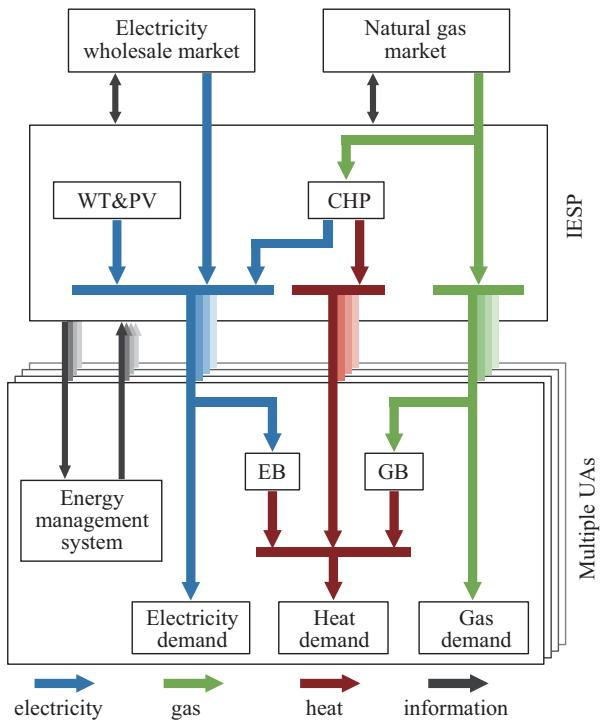  
Fig. 1. The structure of the regional integrated energy system.

For IESP, electricity and natural gas are purchased from the whole sale energy market market, and a combined heat and power (CHP) unit is used to generate heat and electricity. Renewable electricity generated by wind turbines (WTs) and photovoltaic (PV) units owned by IESP is also a resource of electricity. In this work, the IESP is assumed to be a price-taker in the wholesale market. Surplus electricity can be sold to the wholesale market when the transaction between IESP and UAs is completed, but this part of revenue is independent of the problem studied in this paper to avoid problem degradation.

For each UA, it independently purchases electricity, natural gas, and heat from IESP. An energy management system (EMS) is installed to adjust its energy consumption strategies according to the retail prices. Besides, considering the heat production capacity of IESP is limited by the CHP unit, some small-size electric boilers (EBs) and gas boilers (GBs) might be used for flexible supply of heat demand.

## B. Model of IESP

The retail price of electricity, natural gas and heat is determined by IESP, and then the energy purchase of each UA is fed back to IESP. Based on all information IESP obtains, energy procurement from the whole sale energy market and the operating status of CHP unit are determined.

## 1) Objective Function

The objective of IESP is to maximize profit of energy sales throughout the day, as shown in (1). It consists of two components. The first component represents revenue from sales of energy, and the second component represents the cost of energy purchase.

$$
\begin{array}{l} \max C _ {\text {IESP}} (\boldsymbol {x}) = \\ \underbrace {\sum_ {t = 1} ^ {T} \left(\lambda_ {t} ^ {\text {se}} \sum_ {i = 1} ^ {N} D _ {t , i} ^ {\text {e}} + \lambda_ {t} ^ {\text {sg}} \sum_ {i = 1} ^ {N} D _ {t , i} ^ {\text {g}} + \lambda_ {t} ^ {\text {sh}} \sum_ {i = 1} ^ {N} D _ {t , i} ^ {\text {h}}\right)} _ {\text {revenue}} \\ - \underbrace {\sum_ {t = 1} ^ {T} \left(\lambda_ {t} ^ {\text {be}} E _ {t} ^ {\text {e}} + \lambda_ {t} ^ {\text {bg}} E _ {t} ^ {\text {g}}\right)} _ {\text {cost}} \\ \boldsymbol {x} _ {\text {IESP}} = \{\lambda_ {t} ^ {\text {se}}, \lambda_ {t} ^ {\text {sg}}, \lambda_ {t} ^ {\text {sh}} \} \end{array}\tag{1}
$$

where $C _ { \mathrm { I E S P } } ( \pmb { x } )$ represents the objective function of IESP; $T$ indicates the number of time slots in a day; N indicates the number of UAs in RIES; t is the index of time slots; i is the index of UAs; $\lambda _ { t } ^ { \mathrm { s e } } , \lambda _ { t } ^ { \mathrm { s g } } , \lambda _ { t } ^ { \mathrm { s h } }$ are the retail prices of electricity, natural gas, and heat at time slot, respectively; $D _ { t , i } ^ { \mathrm { e } } , D _ { t , i } ^ { \mathrm { g } } , D _ { t , i } ^ { \mathrm { h } }$ are the amount of electricity, gas, and heat purchased by UA at time slot respectively; $\lambda _ { t } ^ { \mathrm { { \bar { b } e } } } , \lambda _ { t } ^ { \mathrm { { b g } } }$ are the purchase prices of electricity and gas from the wholesale market at time slot respectively; $E _ { t } ^ { \mathrm { e } } , E _ { t } ^ { \mathrm { g } }$ are the amount of electricity and heat purchased by IESP at time slot t respectively. If $P _ { t } ^ { \mathrm { e } }$ determined by (2) is non-negative, $E _ { t } ^ { \mathrm { e } }$ is equal to $P _ { t } ^ { \mathrm { e } }$ , otherwise, $E _ { t } ^ { \mathrm { e } }$ is zero; $E _ { t } ^ { \mathrm { g } }$ is defined as non-negative.

## 2) Constraints

The supply and demand balance for each type of energy must be met by IESP. Energy supply is given on the left side of (2)–(4), while energy demand is on the right side:

$$
P _ {t} ^ {\mathrm{e}} + P _ {t} ^ {\mathrm{wt}} + P _ {t} ^ {\mathrm{pv}} + p _ {t} ^ {\mathrm{chp,e}} = \sum_ {i = 1} ^ {N} D _ {t, i} ^ {\mathrm{e}} \quad t \in [ 1, T ]\tag{2}
$$

$$
E _ {t} ^ {\mathrm{g}} = p _ {t} ^ {\mathrm{chp,g}} + \sum_ {i = 1} ^ {N} D _ {t, i} ^ {\mathrm{g}} t \in [ 1, T ]\tag{3}
$$

$$
p _ {t} ^ {\mathrm{chp,h}} = \sum_ {i = 1} ^ {N} D _ {t, i} ^ {\mathrm{h}} t \in [ 1, T ]\tag{4}
$$

where $P _ { t } ^ { \mathrm { e } }$ represents additional electricity demand, IESP needs to purchase electricity if $P _ { t } ^ { \mathrm { e } }$ is positive, otherwise electricity in IESP is sufficient; $P _ { t } ^ { \mathrm { w t } } , P _ { t } ^ { \mathrm { p v } }$ are the power output of WT and PV units, respectively; $\dot { P } _ { t } ^ { \mathrm { c h p , e } }$ represents electric power produced by CHP unit at time slot t; $\bar { p _ { t } ^ { \mathrm { c h p , g } } }$ represents natural gas consumption of the CHP unit in the form of power; $p _ { t } ^ { \mathrm { c h p , h } }$ represents heat power output of the CHP unit.

Operation constraints of the CHP unit operation are formulated as (5)–(8). The relationship between the output electric power and the natural gas consumption is described in (5). Equation (6) limits electric power production. Equation (7) reflects the proportional relationship between output heat power and output electric power. Equation (8) imposes the ramp rate on the unit.

$$
P _ {t} ^ {\mathrm{chp,g}} = \left\{ \begin{array}{l l} a _ {2} \left(P _ {t} ^ {\mathrm{chp,e}}\right) ^ {2} + a _ {1} P _ {t} ^ {\mathrm{chp,e}} + a _ {0}, & P _ {t} ^ {\mathrm{chp,e}} > 0 \\ 0, & P _ {t} ^ {\mathrm{chp,e}} = 0 \end{array} \right.
$$

$$
t \in [ 1, T ]\tag{5}
$$

$$
0 \leq P _ {t} ^ {\mathrm{chp,e}} \leq P _ {\max} ^ {\mathrm{chp,e}} t \in [ 1, T ]\tag{6}
$$

$$
p _ {t} ^ {\mathrm{chp,h}} = \rho^ {\mathrm{e2h}} P _ {t} ^ {\mathrm{chp,e}} t \in [ 1, T ]\tag{7}
$$

$$
- P _ {\mathrm{rate}} ^ {\mathrm{chp,e}} \leq P _ {t} ^ {\mathrm{chp,e}} - P _ {t - 1} ^ {\mathrm{chp,e}} \leq P _ {\mathrm{rate}} ^ {\mathrm{chp,e}}
$$

$$
- P _ {\text {rate}} ^ {\text {chp,e}} \leq P _ {1} ^ {\text {chp,e}} - P _ {T} ^ {\text {chp,e}} \leq P _ {\text {rate}} ^ {\text {chp,e}} \quad t \in [ 2, T ]\tag{8}
$$

where $a _ { 0 } , a _ { 1 } , a _ { 2 }$ indicate the gas-to-electricity conversion coefficients of the CHP unit; $\rho ^ { \mathrm { e 2 h } }$ indicates the heat-electricity ratio of the CHP unit; $P _ { \mathrm { r a t e } } ^ { \mathrm { c h p , e } }$ is the maximum ramp rate of the CHP unit.

Constraints (9)–(10) make sure that retail prices of electricity and natural gas are higher than wholesale market prices, and lower than a certain upper limit. In (11), the heat retail price is also limited in a reasonable bound.

$$
\lambda_ {t} ^ {\mathrm{be}} \leq \lambda_ {t} ^ {\mathrm{se}} \leq \lambda_ {\mathrm{max}} ^ {\mathrm{se}} t \in [ 1, T ]\tag{9}
$$

$$
\lambda_ {t} ^ {\mathrm{bg}} \leq \lambda_ {t} ^ {\mathrm{sg}} \leq \lambda_ {\mathrm{max}} ^ {\mathrm{sg}} t \in [ 1, T ]\tag{10}
$$

$$
\lambda_ {\mathrm{min}} ^ {\mathrm{sh}} \leq \lambda_ {t} ^ {\mathrm{sh}} \leq \lambda_ {\mathrm{max}} ^ {\mathrm{sh}} t \in [ 1, T ]\tag{11}
$$

where ${ \lambda } _ { \mathrm { m a x } } ^ { \mathrm { s e } } , { \lambda } _ { \mathrm { m a x } } ^ { \mathrm { s g } } , { \lambda } _ { \mathrm { m a x } } ^ { \mathrm { s h } }$ indicate the upper bounds of the retail prices; $\lambda _ { \mathrm { m i n } } ^ { \mathrm { s h } }$ indicates the lower bound of the heat retail price.

## C. Model of UA

UAs use EMS to adjust load reduction amounts and power output of EB and GB at any time slot according to retail prices from IESP. Different UAs represent the energy demand and consumption habits of different consumers, but they could still be described in the same model. Therefore, this section does not use the index i to distinguish different UAs for simplicity.

## 1) Dissatisfaction Penalty Function

Consumers in UA always expect their energy demands can be met directly. Load reduction or using EB and GB to generate heat will lead to dissatisfaction. To model it, a dissatisfaction penalty function is introduced and is shown in (12).

$$
w = \alpha W ^ {2} + \beta W\tag{12}
$$

where α and $\beta$ are penalty coefficients; W represents any variables that lead to dissatisfaction penalty.

For a dissatisfaction penalty brought by EB and GB, penalty coefficients can be invariable. However, for the dissatisfaction penalty brought by load reduction, impact of retail prices on the penalty coefficients needs further consideration. α and $\beta$ are variable coefficients that change with retail prices, as shown in (13).

$$
\left\{ \begin{array}{l} \alpha = \alpha_ {0} \mu^ {2} \\ \beta = \beta_ {0} \mu \\ \mu = 1 - k \frac {\lambda_ {t} ^ {s} - \lambda_ {0}}{\lambda_ {0}} \text {   and   } 0 <   \mu \leq 1 \end{array} \right.\tag{13}
$$

where $\alpha _ { 0 }$ and $\beta _ { 0 }$ indicate initial penalty coefficients; $\lambda _ { 0 }$ is a reference price; k indicates consumer sensitivity to price change.

Introduction of variable coefficients enables the dissatisfaction penalty to adapt to retail price. If the actual price far exceeds the reference price, the penalty coefficient will decrease and load reduction will increase. If these two prices are similar, penalty coefficients will increase to restrict load reduction. This can effectively improve the price response ability of UA and avoid overpricing.

## 2) Objective Function

The objective of UA is to minimize its energy consumption cost throughout the day, as indicated in (14). It consists of two components. The first component represents the cost of energy purchased from IESP, and the second component represents the penalty caused by load reduction and usage of EB and GB.

$$
\begin{array}{l} \min C _ {\mathrm{UA}} (\boldsymbol {x}) = \underbrace {\sum_ {t = 1} ^ {T} \left(\lambda_ {t} ^ {\mathrm{se}} D _ {t} ^ {\mathrm{e}} + \lambda_ {t} ^ {\mathrm{sg}} D _ {t} ^ {\mathrm{g}} + \lambda_ {t} ^ {\mathrm{sh}} D _ {t} ^ {\mathrm{h}}\right)} _ {\text {cost}} \\ \qquad + \underbrace {\sum_ {t = 1} ^ {T} \left(w _ {t} ^ {\mathrm{e}} + w _ {t} ^ {\mathrm{g}} + w _ {t} ^ {\mathrm{h}} + w _ {t} ^ {\mathrm{ex}}\right)} _ {\text {penalty}} \\ w _ {t} ^ {\mathrm{e}} = \alpha^ {\mathrm{e}} \Delta D _ {t} ^ {\mathrm{e2}} + \beta^ {\mathrm{e}} \Delta D _ {t} ^ {\mathrm{e}} \\ w _ {t} ^ {\mathrm{g}} = \alpha^ {\mathrm{g}} \Delta D _ {t} ^ {\mathrm{g2}} + \beta^ {\mathrm{g}} \Delta D _ {t} ^ {\mathrm{g}} \\ w _ {t} ^ {\mathrm{h}} = \alpha^ {\mathrm{h}} \Delta D _ {t} ^ {\mathrm{h2}} + \beta^ {\mathrm{h}} \Delta D _ {t} ^ {\mathrm{h}} \\ w _ {t} ^ {\mathrm{ex}} = \alpha^ {\mathrm{E}} P _ {t} ^ {\mathrm{eb2}} + \beta^ {\mathrm{E}} P _ {t} ^ {\mathrm{eb}} + \alpha^ {\mathrm{G}} P _ {t} ^ {\mathrm{gb2}} + \beta^ {\mathrm{G}} P _ {t} ^ {\mathrm{gb}} \\ \boldsymbol {x} _ {\text {IESP}} = \left\{\Delta D _ {t} ^ {\mathrm{e}}, \Delta D _ {t} ^ {\mathrm{g}}, \Delta D _ {t} ^ {\mathrm{h}}, P _ {t} ^ {\text {eb}}, P _ {t} ^ {\text {gb}} \right\} \end{array}\tag{14}
$$

where $w _ { t } ^ { \mathrm { e } } , w _ { t } ^ { \mathrm { g } }$ and $w _ { t } ^ { \mathrm { h } }$ are penalty for load reduction formulated by $( 1 2 ) \mathrm { - } ( 1 3 ) ; w _ { t } ^ { \mathrm { e x } }$ indicates penalty for satisfying heat load with EB and GB, $\alpha ^ { \mathrm { E } } , \beta ^ { \mathrm { E } } , \dot { \alpha } ^ { \mathrm { G } }$ and $\beta ^ { \mathrm { G } }$ are constants; decision variables $\Delta D _ { t } ^ { \mathrm { e } } , \Delta D _ { t } ^ { \mathrm { g } } , \Delta D _ { t } ^ { \mathrm { h } }$ are the amounts of three kinds of load reduction at time slot $t ;$ decision variables $P _ { t } ^ { \mathrm { e b } } , P _ { t } ^ { \mathrm { g b } }$ are the power output of EB and GB at time slot t, respectively.

## 3) Constraints

Actual demand associated with the adjustable energy demand is shown in (15)–(17):

$$
D _ {t} ^ {\mathrm{e}} = D _ {t} ^ {\mathrm{init,e}} - \Delta D _ {t} ^ {\mathrm{e}} + P _ {t} ^ {\mathrm{eb}} t \in [ 1, T ]\tag{15}
$$

$$
D _ {t} ^ {\mathrm{g}} = D _ {t} ^ {\mathrm{init,g}} - \Delta D _ {t} ^ {\mathrm{g}} + P _ {t} ^ {\mathrm{gb}} t \in [ 1, T ]\tag{16}
$$

$$
D _ {t} ^ {\mathrm{h}} = D _ {t} ^ {\mathrm{init,h}} - \Delta D _ {t} ^ {\mathrm{h}} - \eta^ {\mathrm{eb}} P _ {t} ^ {\mathrm{eb}} - \eta^ {\mathrm{gb}} P _ {t} ^ {\mathrm{gb}} t \in [ 1, T ]\tag{17}
$$

where $D _ { t } ^ { \mathrm { i n i t , e } } D _ { t } ^ { \mathrm { i n i t , g } }$ and $D _ { t } ^ { \mathrm { i n i t , h } }$ represent UA’s initial electricity, natural gas, and heat demands; $\eta ^ { \mathrm { { e b } } }$ and $\eta ^ { \mathrm { g b } }$ represent conversion efficiencies of EB and GB.

Constraints of the EB operation include upper and lower bound constraint of power in (18) and the ramp rate constraint in (19).

$$
\begin{array}{r} 0 \leq P _ {t} ^ {\mathrm{eb}} \leq P _ {\max} ^ {\mathrm{eb}} t \in [ 1, T ] \\ - P _ {\text {rate}} ^ {\mathrm{eb}} \leq P _ {t} ^ {\mathrm{eb}} - P _ {t - 1} ^ {\mathrm{eb}} \leq P _ {\text {rate}} ^ {\mathrm{eb}} \\ - P _ {\text {rate}} ^ {\mathrm{eb}} \leq P _ {1} ^ {\mathrm{eb}} - P _ {T} ^ {\mathrm{eb}} \leq P _ {\text {rate}} ^ {\mathrm{eb}} t \in [ 2, T ] \end{array}\tag{18}
$$

(19)

where $P _ { \mathrm { m a x } } ^ { \mathrm { e b } }$ represents the maximum power consumed by EB; $P _ { \mathrm { r a t e } } ^ { \mathrm { e b } }$ represents the maximum ramp rate of EB.

The constraints of GB are similar to those of EB which is shown in (20)–(21):

$$
\begin{array}{r l} & 0 \leq P _ {t} ^ {\mathrm{gb}} \leq P _ {\max} ^ {\mathrm{gb}} t \in [ 1, T ] \\ & - P _ {\text {rate}} ^ {\mathrm{gb}} \leq P _ {t} ^ {\mathrm{gb}} - P _ {t - 1} ^ {\mathrm{gb}} \leq P _ {\text {rate}} ^ {\mathrm{gb}} \\ & - P _ {\text {rate}} ^ {\mathrm{gb}} \leq P _ {1} ^ {\mathrm{gb}} - P _ {T} ^ {\mathrm{gb}} \leq P _ {\text {rate}} ^ {\mathrm{gb}} t \in [ 2, T ] \end{array}\tag{20}
$$

(21)

where $P _ { \mathrm { m a x } } ^ { \mathrm { g b } }$ represents the maximum power consumed by GB; $P _ { \mathrm { r a t e } } ^ { \mathrm { g b } }$ represents the maximum ramp rate of GB.

Amounts of load reduction $\Delta D _ { t } ^ { \mathrm { e } } , \Delta D _ { t } ^ { \mathrm { g } } , \Delta D _ { t } ^ { \mathrm { h } }$ must meet the constraints (22)–(23):

$$
\begin{array}{l} 0 \leq \Delta D _ {t} ^ {\mathrm{e}} \leq \Delta D _ {t, \max} ^ {\mathrm{e}} \\ 0 \leq \Delta D _ {t} ^ {\mathrm{g}} \leq \Delta D _ {t, \max} ^ {\mathrm{g}} \\ 0 \leq \Delta D _ {t} ^ {\mathrm{h}} \leq \Delta D _ {t, \max} ^ {\mathrm{h}} \\ \sum_ {t = 1} ^ {T} \Delta D _ {t} ^ {\mathrm{e}} \leq D _ {\text {sum}} ^ {\mathrm{e}} \\ \sum_ {t = 1} ^ {T} \Delta D _ {t} ^ {\mathrm{g}} \leq D _ {\text {sum}} ^ {\mathrm{g}} \\ \sum_ {t = 1} ^ {T} \Delta D _ {t} ^ {\mathrm{h}} \leq D _ {\text {sum}} ^ {\mathrm{h}} \end{array}\tag{22}
$$

(23)

where $\Delta D _ { t , \operatorname* { m a x } } ^ { \mathrm { e } } , \Delta D _ { t , \operatorname* { m a x } } ^ { \mathrm { g } } , \Delta D _ { t , \operatorname* { m a x } } ^ { \mathrm { h } }$ represent the maximum of load reduction; $D _ { \mathrm { s u m } } ^ { \mathrm { e } } , D _ { \mathrm { s u m } } ^ { \mathrm { g } } , D _ { \mathrm { s u m } } ^ { \mathrm { h } }$ represent the maximum reduction throughout the day.

## III. THE FORMATION AND SOLUTION OFSTACKELBERG GAME

## A. Formation of Stackelberg Game

According to the description of RIES in Section II, IESP first quotes to UAs, and then each UA reacts to minimizes its own costs based on given retail prices and feeds the optimization results back to IESP. This energy transaction process conforms to the Stackelberg game with a masterslave hierarchical structure. IESP is considered as the leader, and different UAs are considered as followers, which can be expressed as:

$$
\begin{array}{c} G = \{M; \pi_ {\text { IESP }}; \{\pi_ {\text { UA1 }}, \dots , \pi_ {\text { UAN }} \}; C _ {\text { IESP }}; \\ \{C _ {\text { UA1 }}, \dots , C _ {\text { UAN }} \} \} \end{array}\tag{24}
$$

The game is composed of three following parts.

1) Competitors: One IESP and N UAs. The set of competitors is expressed as $M = \{ { \mathrm { I E S P } } , \{ { \mathrm { U A 1 } } , \cdots , { \mathrm { U A } } N \} \}$

2) Strategy: The strategies of IESP are the retail prices of electricity, natural gas, and heat for 24 hours, which is expressed as $\begin{array} { r c l } { \pi _ { \mathrm { I E S P } } } & { = } & { \left( \lambda _ { t } ^ { \mathrm { s e } } , \lambda _ { t } ^ { \mathrm { s g } } , \lambda _ { t } ^ { \mathrm { s h } } \right) } \end{array}$ . A strategy of one UA is load reductions of electricity, gas, and heat, and the power production of EB and GB, which is expressed as $\pi _ { \mathrm { U A } i } = \left( \Delta D _ { t , i } ^ { \mathrm { e } } , \Delta D _ { t , i } ^ { \mathrm { g } } , \Delta D _ { t , i } ^ { \mathrm { h } } , P _ { t , i } ^ { \mathrm { e b } } , P _ { t , i } ^ { \mathrm { g b } } \right)$

3) Payment: The payment of each competitor is the objective function defined in Section II.

If all followers make the optimal response according to the leader’s strategy, and the leader also accepts this response, the game reaches Stackelberg equilibrium. There is a unique equilibrium in this Stackelberg game. This theory and its proof are shown in Appendix A.

## B. Solution of the Game

During the actual transaction, in order to protect the privacy of consumers, UAs do not share detailed data with IESP, which makes it difficult to solve the proposed model. Deep reinforcement learning (DRL) algorithm is able to solve the best-acting strategy through interaction between the agent and the environment without knowing the detailed model of the environment. Therefore, a Markov decision process (MDP) is proposed to model the Stackelberg game, and a DRL algorithm is adopted to solve the game equilibrium under the premise of protecting UAs’ private data.

For a general MDP design scheme, the agent determines the decision variables of the IESP at each time slot by observing the environment, and its goal is to maximize $C _ { \mathrm { I E S P } } ( { \pmb x } )$ . As a part of the environment, UA solves its optimal strategy based on the action value and transmits the necessary information to IESP. IESP calculates the state and reward as an environment at current time slot based on prices and UA strategies and feeds them back to the agent as rewards. If this scheme is used in the model in this work, the time coupling constraints (19), (21) and (23) would destroy (25) which describes the Markov property of MDP. That is because the follower’s optimal strategy at the current time slot is related to the action value at other time slots.

$$
p (s ^ {\prime}, r | s, a) = \operatorname * {P r} [ s _ {t + 1} = s ^ {\prime}, r _ {t + 1} = r | s _ {t} = s, a _ {t} = a ]\tag{25}
$$

In other words, for the Stackelberg game with time coupling at the follower side, there is a problem that needs to be solved: the strategies of the IESP are solved by the agent step by step and rely on the UAs in the environment to give feedback every time, while the strategy of UA depends on the complete strategy from IESP and is solved at one time through the optimization.

The MDP proposed in this work can solve the abovementioned contradiction without destroying the Markov property. Specifically, a set of IESP strategies is given in advance, and an agent adjusts its strategy step by step based on initial strategies, with the goal of maximizing the profit increase of IESP. This MDP contains the following four elements:

1) State: Description of the environment observed by an agent of IESP. Some environment information of IESP is completely observable, such as CHP unit status and energy purchase prices, while information of UAs in the environment is commonly restricted.

According to the previous conclusion, when the retail prices are determined, each UA has a unique optimal strategy. Using this mapping relationship, the states of UAs can be described by retail prices which are completely observable to IESP agents.

Therefore, a multi-dimensional state vector is defined as (26):

$$
s _ {t} = \left\{t, \{\lambda_ {1} ^ {\mathrm{se}}, \dots , \lambda_ {T} ^ {\mathrm{se}} \}, \{\lambda_ {1} ^ {\mathrm{sg}}, \dots , \lambda_ {T} ^ {\mathrm{sg}} \}, \{\lambda_ {1} ^ {\mathrm{sh}}, \dots , \lambda_ {T} ^ {\mathrm{sh}} \} \right\}\tag{26}
$$

where t represents all state characteristics associated with time, including power of WT and PV units, whole sale energy price, etc.; retail prices of all time slots for each energy are also included in the state vector, which characterize the corresponding states of UAs when any IESP strategy is selected.

This state vector makes the environment completely observable to the IESP without violating any UAs’ privacy.

2) Action: action of the agent is defined as a 3-dimensional action vector ${ \pmb a } _ { t } = \left\{ \lambda _ { t } ^ { \mathrm { s e } } , \lambda _ { t } ^ { \mathrm { s g } } , \lambda _ { t } ^ { \mathrm { s h } } \right\}$ , which includes the decision variables of the IESP.

3) Reward: To ensure the target of the agent is consistent with the objective function of IESP, the immediate reward is defined as (27).

$$
\left\{ \begin{array}{l} r _ {1} = C _ {\text { IESP }} (\boldsymbol {x} _ {1}) - C _ {\text { IESP }} (\boldsymbol {x} _ {\text { init }}) \\ \quad \vdots \\ r _ {t} = C _ {\text { IESP }} (\boldsymbol {x} _ {t}) - C _ {\text { IESP }} (\boldsymbol {x} _ {t - 1}) \\ \quad \vdots \\ r _ {T} = C _ {\text { IESP }} (\boldsymbol {x} _ {T}) - C _ {\text { IESP }} (\boldsymbol {x} _ {T - 1}) \end{array} \right.\tag{27}
$$

where $\mathbf { \Delta } _ { \mathbf { \mathcal { X } } _ { t } }$ indicates the IESP strategies after the agent selects an action at time slot $t ; x _ { \mathrm { i n i t } }$ is the initial strategy.

Therefore, the total reward of IESP $R _ { \mathrm { T R } }$ is expressed as (28):

$$
R _ {\mathrm{TR}} = r _ {1} + \dots + r _ {t} + \dots + r _ {T} = C _ {\mathrm{IESP}} (\pmb {x} _ {T}) - C _ {\mathrm{IESP}} (\pmb {x} _ {\mathrm{init}})\tag{28}
$$

since the Stackelberg game is proven to have a unique equilibrium, $C _ { \mathrm { I E S P } } ( { \pmb x } )$ will converge to the equilibrium no matter how the initial strategy of IESP is.

4) State transition: First, the environment is changed by $a _ { t } ;$ then retail prices at t time slot in $s _ { t + 1 }$ will be replaced by the values of $a _ { t }$ and t increases; after that the environment calculates the immediate reward $r _ { t } . ~ s _ { t + 1 }$ and $r _ { t }$ are completely dependent on $s _ { t }$ and $a _ { t } ,$ , the Markov property in (25) is strictly satisfied.

The overall diagram of the proposed MDP is shown in Fig. 2. It is worth noting that although the $s _ { t }$ does not need to obtain information directly from UAs, IESP still needs some information of UAs to calculate $C _ { \mathrm { I E S P } } ( { \pmb x } )$ included in $r _ { t } .$ The information includes total daily demand of each energy $\begin{array} { r } { D E ^ { \mathrm { e } } = \sum _ { t = 1 } ^ { T } D _ { t , i } ^ { \mathrm { e } } , D E ^ { \mathrm { g } } = \sum _ { t = 1 } ^ { T } \dot { D } _ { t , i } ^ { \mathrm { g } } , D E ^ { \mathrm { h } } = \sum _ { t = 1 } ^ { T } D _ { t , i } ^ { \mathrm { h } } } \end{array}$ and the heat demand for each time slot $D _ { t , i } ^ { \mathrm { h } } \in [ 1 , T ]$

(a)  
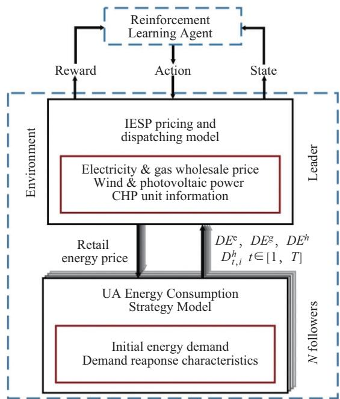  
Fig. 2. The overall diagram of the proposed MDP.

Each UA only feedbacks part of the optimal strategies based on the current pricing strategies instead of specific function, parameters or complete strategies. This method avoids leakage of privacy.

## C. Proximal Policy Optimization Algorithm

There are a variety of DRL algorithms that could solve the proposed problem, of which policy gradient method is a crucial branch. Proximal policy optimization (PPO) algorithm [28], as a policy gradient method, is more scalable, data efficient and robust. Meanwhile, PPO is an actor-critic framework method which makes it seek optimal action in continuous spaces. In this paper, PPO is employed to solve the Stackelberg game. The pseudo-code of the PPO algorithm is shown in Algorithm 1.

## IV. CASE STUDIES

## A. Data and Simulation Setting

In this case, three UAs with different energy demands and consumption characteristics trade with IESP. The renewable electricity power generated by IESP is shown in Fig. 3. The wholesale market prices for electricity and natural gas are shown in Fig. 4. $D E ^ { \mathrm { e } } , D E ^ { \mathrm { g } } , D E ^ { \mathrm { h } } , D _ { t . i } ^ { \mathrm { h } } \ t \in [ 1 , T ]$

The lower price limits of electricity and natural gas are the same as the market wholesale price. The lower price limit of heat is based on the smaller value of electricity and natural gas prices in each time slot plus a little lost cost. Upper price limits are 2 times lower price limits. Initial prices of IESP are set to the lower limits of price, and the action values of the agent are actually a multiple of the initial price at each time slot. Energy demands of three UAs are shown in Fig. 5. Operating parameters of CHP, EB and GB units and parameters reflecting the characteristics of UAs are detailed in Appendix B.

```txt
Algorithm 1: Proximal Policy Optimization
1 Initialize an old actor network, a new actor network and a critic network.
2 for episode = 1, 2, … do
3 Initialize the environment.
4 for t = 1, 2, …, T do
5 Interact with the environment with policy πθ′, and form the trajectory {s₁, a₁, r₁, …, sₜ, aₜ, rₜ}.
6 Calculate future reward exception based on Bellman equation:
Vθ′(sₜ, aₜ) = r(sₜ, aₜ) + γVθ′(sₜ₊₁, aₜ₊₁)
7 Calculate advantage estimates based on the current value function Vcritic(sₜ₊₁):
Aθ′(sₜ, aₜ) = Vθ′(sₜ, aₜ) - Vcritic(sₜ₊₁)
8 Update the new actor network Vθ′:
min (Pθ(sₜ, aₜ)/Pθ′(sₜ, aₜ)) Aθ′(sₜ, aₜ),
9 clip (Pθ(sₜ, aₜ)/Pθ′(sₜ, aₜ), 1 − ε, 1 + ε) Aθ′(sₜ, aₜ))
10 Update the old actor network by using
11 end
12 end
```

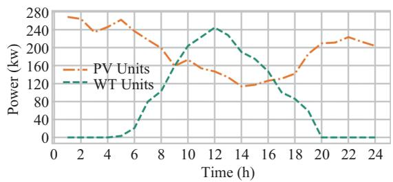  
Fig. 3. Power of WT and PV units in IESP.

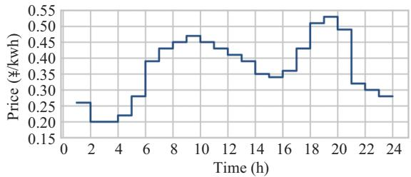

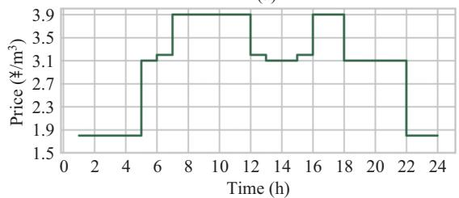  
(b)  
Fig. 4. Market wholesale prices for electricity and natural gas. (a) Electricity Wholesale Price (b) Natural Gas Wholesale Price.

For PPO, the actor learning rate is 0.00035 and the critic learning rate is 0.0015. Reward discount factor $\gamma = 1$ . Epsilon clip is 0.2. More detailed parameters of PPO algorithm and neural networks are shown in Appendix B.

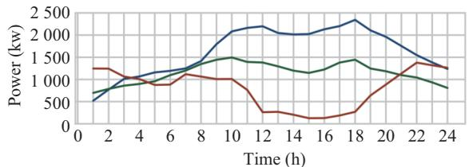

(a)  
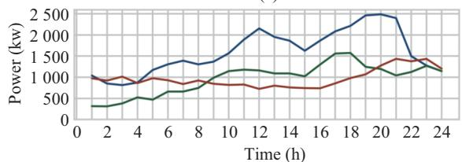  
(b)

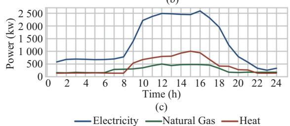  
Fig. 5. Energy demands of three UAs. (a) UA-1 Energy Demands. (b) UA-2 Energy Demands. (c) UA-3 Energy Demands.

## B. Simulation Results

## 1) Convergence Curve

The solving process of IESP and 3 UAs is shown in Fig. 6. The proposed solution method has good convergent performance; solving process converged at about 2000 episodes. The convergence trend of the leader and its followers is different. The increasing curve corresponding to the left axis in Fig. 6. represents the reward of the agent, which is consistent with $C _ { \mathrm { I E S P } } ( { \pmb x } )$ . Three decreasing curves corresponding to the right axis represent negative $C _ { \mathrm { U A } } ( { \pmb x } )$ of three UAs, which reflects the gaming process among competitors. When the Stackelberg equilibrium is reached, none of competitors could get more benefits through an independent change of strategy. $R _ { \mathrm { T R } }$ of IESP is ¥25,833.70 and $C _ { \mathrm { I E S P } } ( \pmb { x } _ { \mathrm { i n i t } } )$ is ¥5,000.54, so the profit of IESP is about ¥30,834.24. Energy consumption costs of the three UAs are respectively, ¥35,174.57, ¥35,344.08 and ¥21,566.66. As the game progresses, the proportion of dissatisfaction penalty in the total cost of UA is decreasing, and the proportion of load reduction is decreasing. Take the result of episode 1621 as an example and the detailed comparison is shown in Table CI in Appendix C. Although with adjustment of prices, the revenue of IESP and the cost of energy consumption of UAs are increasing, UAs can still feed dissatisfaction back to the revenue of IESP by adjusting load reductions. Energy demands of UAs can be guaranteed.

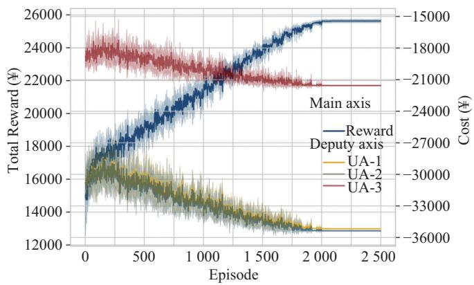  
Fig. 6. The solution process of competitors (with 6 random seeds).

## 2) Strategies for IESP and UAs

Pricing strategies of IESP are shown in Fig. 7. The action values of the agent are actually equal to the multiples of the retail prices compared to the lower limit of the prices. The consumption strategies of UA-1 are shown in Fig. 8, and the strategies of UA-2 and UA-3 are shown in Fig. C1 and Fig. C2 in Appendix C due to length limitations.

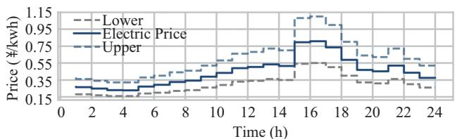

(a)  
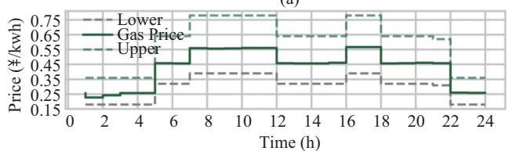  
(b)

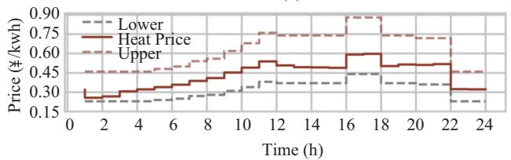  
(c)  
Fig. 7. Retail prices determined by IESP. (a) Retail electric price. (b) Retail gas price. (c) Retail heat price.

As shown in Fig. 8, electricity, natural gas or heat load is reduced when the corresponding retail price becomes higher. Meanwhile, the pricing strategy of IESP is more conservative avoiding massive loss of load. The heat load reduction ratio of UA-1 is lower than that of electricity and natural gas load due to its more negative demand response characteristic (a larger penalty coefficient). Comparison of Figs. 7 and 8 reveals that when the retail price of heat is higher than the retail price of electricity or natural gas, parts of EB or GB will participate in heat production.

For the same pricing strategies, different UAs have different consumption characteristics. For example, UA-3, which has the majority of industrial users, has the lowest electric load reduction ratio (14.22%), while the heat load reduction ratio is the highest (31.20%). This is directly related to the initial penalty coefficients $\alpha _ { 0 }$ and $\beta _ { 0 }$ preset by the UAs.

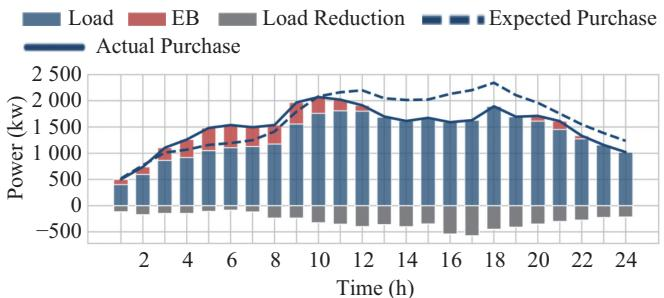

(a)  
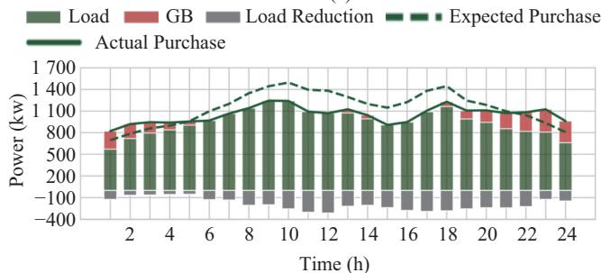

(b)  
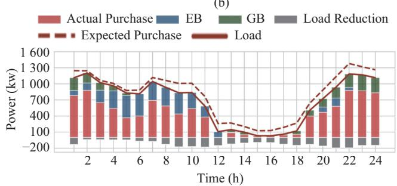  
(c)  
Fig. 8. Energy consumption strategies of UA-1. (a) Electricity consumption. (b) Gas consumption. (c) Heat consumption.

## C. Stability Evaluation of Simulation Results

To verifying the uniqueness of the results and the stability of the proposed method, this section evaluates from three aspects: random seed, price range, and initial quotation.

## 1) Different Random Number Seeds

The random number seed in DRL affects the final training result of the agent, which represents the equilibrium solution in this research. The solution process of 6 random seeds has been reflected in Fig. 6, and 6 sets of pricing strategies are shown in Fig. 9.

Pricing strategies with different seeds are basically the same while there are still some subtle differences in some periods. Take the heat price in time slot 2 as an example, the difference reached ¥0.062. There are many explanations for this difference. First, the agent with different seeds finally converges on a different $R _ { \mathrm { T R } } .$ Second, for pursuing its own interests action noise when IESP selects its optimal result may result in differences. Finally, due to the pricing strategies being related to $\mathrm { U A s } '$ response during the game, if the $\mathrm { U A s } '$ load reduction ratio keeps a low level in certain periods, changes in prices do not have a significant effect on $R _ { \mathrm { T R } }$ of agent. These reasons cause price deviation to be large in certain time slots, such as electric price in time slot 6, gas price in time slot 2 to 8 and heat price in time slot 2 to 6. However, the impact of these deviations on the $\mathrm { I E S P } \mathrm { s }$ profit or $\mathrm { U A s } '$ consumption cost is actually less than 0.94%.

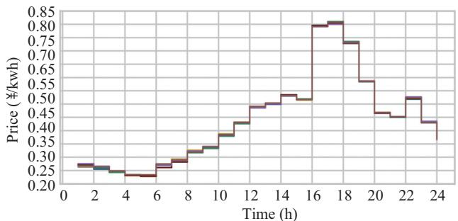

(a)  
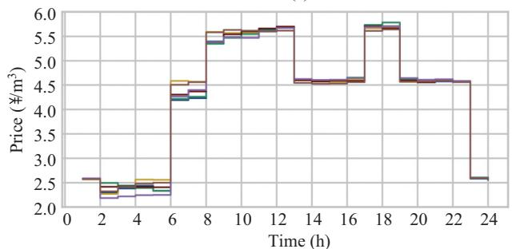

(b)  
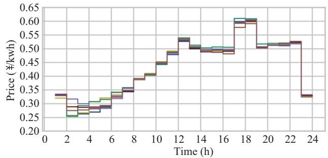  
(c)  
Fig. 9. Retail prices with six random seeds. (a) Electric Price (b) Natural Gas Price (c) Heat Price.

## 2) Influence of Different Price Ranges

Different price ranges represent different action spaces of the agent. The other two different price upper limits are set in this case, one is set at 1.8 times the lower price limit of each time slot, and the other is set at a constant. As shown in Fig. 10, different action spaces have little effect on the best action strategies of the agent.

## 3) Influence of Different Initial Prices

According to previous theoretical arguments, different initial prices actually only change the initial state of the environment where the agent is located, and do not affect the solution of the game problem. To verify it, another two sets of initial prices are randomly set in the same price range for calculation. The reward curves of the agent are shown in Fig. 11.

The result using initial prices set 1 is the simulation result mentioned above, where the profit of IESP is ¥30,834.24. When using initial price set $2 , R _ { \mathrm { T R } }$ is about ¥15,178.30, and $C _ { \mathrm { I E S P } } ( \pmb { x } _ { \mathrm { i n i t } } )$ is ¥15,643.29. So, the profit of IESP is about ¥30,821.59. When using initial price set 3, $R _ { \mathrm { T R } }$ is about ¥18,960.55, and $C _ { \mathrm { I E S P } } ( \pmb { x } _ { \mathrm { i n i t } } )$ is 11867.78 ¥. So, the profit of IESP is about ¥30,828.33. Small differences among these results verifies the accuracy and reliability of the proposed method.

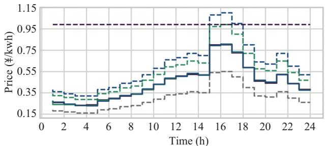

(a)  
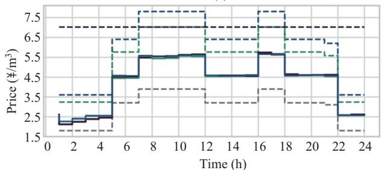  
(b)

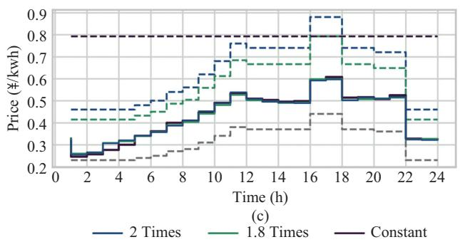  
Fig. 10. Retail prices with different price upper limits. (a) Electric Price (b) Natural Gas Price (c) Heat Price.

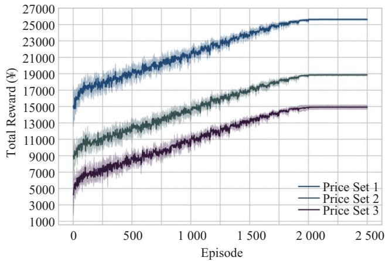  
Fig. 11. Reward curves in different initial states.

## D. Comparison of MDP Design Schemes

A design scheme of MDP in similar research work is discussed in Section III. According to this scheme, the state vector is defined as $s _ { t } = \{ t , \lambda _ { t } ^ { \mathrm { b e } } , \bar { \lambda } _ { t } ^ { \mathrm { b g } } , P _ { t } ^ { \mathrm { w t } } + P _ { t } ^ { \mathrm { p v } } \}$ and the reward $r _ { t }$ is equal to the profit of IESP at time slot. Total rewards of agents with two MDP design schemes are shown in Fig. 12. Using the optimal strategies obtained by the cited MDP, the profit of IESP is calculated as ¥28,693.41. Although $R _ { \mathrm { T R } }$ is lower by using the proposed MDP, after adding the initial profit $C _ { \mathrm { I E S P } } ( \pmb { x } _ { \mathrm { i n i t } } )$ the profit of IESP is about 7.46% more than the cited method. Comparison of UAs’ consumption results is shown in Table I. UAs reduce more load, and the proportion of penalty cost is higher. Compared with the proposed method, the cited method has gaps in terms of leaders and followers, and the Stackelberg equilibrium cannot be reached. Additionally, it is obvious the proposed method displays a more stable convergent process by using proposed MDP.

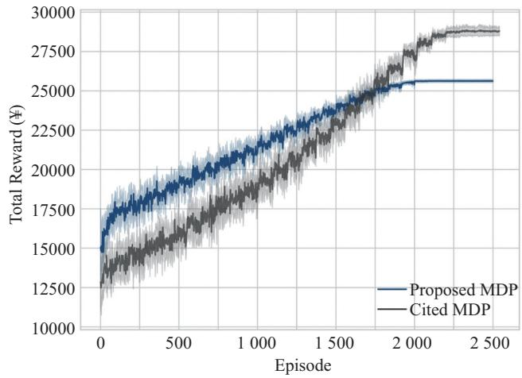  
Fig. 12. Reward curves with different design schemes.

TABLE I  
COMPARISON OF UAS’ CONSUMPTION RESULTS

<table><tr><td rowspan="2">UA</td><td rowspan="2">Result</td><td rowspan="2">Total cost(¥)</td><td rowspan="2">Penalty(¥)</td><td colspan="3">Load reduction ratio (%)</td></tr><tr><td>Electricity</td><td>Natural Gas</td><td>Heat</td></tr><tr><td rowspan="2">1</td><td>Proposed</td><td>35174.6</td><td>3667.7</td><td>17.53</td><td>16.90</td><td>15.15</td></tr><tr><td>Cited</td><td>35158.4</td><td>3803.5</td><td>18.06</td><td>17.98</td><td>15.76</td></tr><tr><td rowspan="2">2</td><td>Proposed</td><td>35344.1</td><td>3562.0</td><td>15.79</td><td>19.36</td><td>14.49</td></tr><tr><td>Cited</td><td>35260.5</td><td>3649.1</td><td>16.26</td><td>20.59</td><td>15.14</td></tr><tr><td rowspan="2">3</td><td>Proposed</td><td>21566.7</td><td>2329.9</td><td>14.22</td><td>17.85</td><td>31.20</td></tr><tr><td>Cited</td><td>21491.1</td><td>2458.4</td><td>16.72</td><td>18.99</td><td>32.87</td></tr></table>

Due to the Markov property not being satisfied, applying the cited MDP could not make IESP obtain higher benefits. With the proposed MDP, the environment is completely observable to the agent and this scheme does not affect the privacy of UAs. While the state of UAs is not observed by the agent with the cited scheme, the feedback of the environment is uncertain to the agent. This uncertainty could lead to more unstable training and reduce $R _ { \mathrm { T R } }$ of the agent.

## E. Effect of the Proposed Penalty Function

A price sensitivity coefficient k is introduced into the proposed penalty function. In order to show its effect on the equilibrium solution, k = 0.3, 1.4 and 1.8 are set. Electricity pricing strategies are shown in Fig. 13. (natural gas and heat pricing strategies are shown in Appendix D). Corresponding energy consumption information of UAs is summarized in Table II.

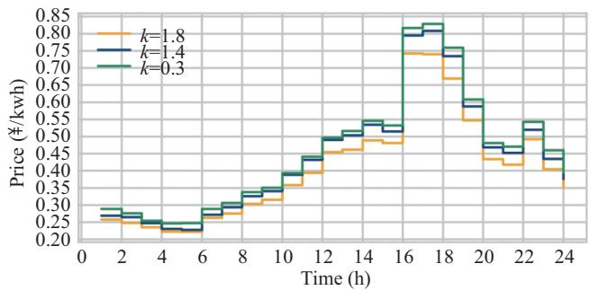  
Fig. 13. Electricity pricing strategies with different k.

TABLE II  
UAS’ ENERGY CONSUMPTION INFORMATION

<table><tr><td rowspan="2">UA</td><td rowspan="2">k</td><td colspan="3">Load Reduction Ratio</td></tr><tr><td>Electricity</td><td>Natural Gas</td><td>Heat</td></tr><tr><td rowspan="4">1</td><td>1.8</td><td>17.95%</td><td>20.88%</td><td>15.50%</td></tr><tr><td>1.4</td><td>17.53%</td><td>16.90%</td><td>15.15%</td></tr><tr><td>0.3</td><td>3.01%</td><td>3.32%</td><td>3.92%</td></tr><tr><td>0.0*</td><td>20.81%</td><td>23.09%</td><td>24.26%</td></tr><tr><td rowspan="4">2</td><td>1.8</td><td>16.24%</td><td>23.91%</td><td>14.84%</td></tr><tr><td>1.4</td><td>15.79%</td><td>19.36%</td><td>14.49%</td></tr><tr><td>0.3</td><td>2.67</td><td>3.73%</td><td>3.72%</td></tr><tr><td>0.0*</td><td>18.89%</td><td>26.37%</td><td>26.45%</td></tr><tr><td rowspan="4">3</td><td>1.8</td><td>15.17%</td><td>22.05%</td><td>31.60%</td></tr><tr><td>1.4</td><td>14.22%</td><td>17.85%</td><td>31.20%</td></tr><tr><td>0.3</td><td>2.55%</td><td>3.44%</td><td>8.58%</td></tr><tr><td>0.0*</td><td>19.28%</td><td>24.31%</td><td>52.42%</td></tr></table>

<sup>∗</sup>Indicate initial penalty coefficients are adjusted.

It can be seen that if a UA is more price sensitive and sets a lager price sensitivity coefficient k, it will reduce more load, while retail prices will be lower. Conversely, if a smaller price sensitivity coefficient k is set, it can avoid reducing a lot of load, while it needs to accept higher retail prices.

In particular, when k = 0, the penalty function degenerates to a general form. In order to compare the difference between the proposed penalty function and the traditional, this paper appropriately reduces the penalty coefficient when $k \ = \ 0 .$ and it is shown the cost of three UAs purchasing energy is similar to that when $k ~ = ~ 1 . 4$ , which is about ¥82098. These results show that using the proposed penalty function, three UAs spend almost the same money to meet more load demand. Meanwhile the profit of IESP has also increased from ¥29851.64 to ¥30,834.24.

When a general penalty function is applied, UAs can only receive lower prices by decreasing penalty coefficients and significantly reducing the load. However, substantial load reduction obviously does not meet actual needs. The proposed method actually provides variable penalty coefficients, which dynamically reflect the characteristics of UAs in the process of a Stackelberg game and ensure the interests of all competitors.

## F. Computing Performance

The impact of the increase in the number of UAs on calculation time is further studied. Case studies have been carried out on computers with 8-core 2.90 GHz Intel(R) Core (TM) i7-10700 CPU and 16 GB of RAM, and strategies of different UAs are solved in parallel. Detailed results are shown in Table III.

TABLE III  
CALCULATION TIME FOR DIFFERENT NUMBER OF UAS

<table><tr><td>Number of UA</td><td>Cumulative time for PPO (s)</td><td>Cumulative time for lower model (s)</td><td>Total Time (s)</td></tr><tr><td>1</td><td>200.20</td><td>254.36</td><td>454.56</td></tr><tr><td>2</td><td>202.95</td><td>252.53</td><td>455.47</td></tr><tr><td>3</td><td>204.04</td><td>250.65</td><td>454.69</td></tr><tr><td>4</td><td>207.26</td><td>250.18</td><td>457.45</td></tr><tr><td>5</td><td>207.72</td><td>252.66</td><td>460.37</td></tr></table>

Since UAs’ strategies can be processed in parallel, the cumulative time for lower model is not affected by the number of UAs. Moreover, an increase in the number of UAs does not significantly increase the amount of calculation of the upper model, and the cumulative time for PPO only increases slightly.

## V. CONCLUSION

In this paper, the problem of pricing strategies of IESP in RIES is studied. Interaction between the transaction entities is formulated by establishing a Stackelberg game of IESP and multiple UAs. This game is described as an MDP and solved by PPO algorithm. The proposed method ensures agent’s complete observability of the environment without revealing the UAs’ private information. Case studies show the proposed MDP avoids destruction of Markov property by temporal coupling constraints and makes the agent converge to the unique Stackelberg equilibrium more stably. The adopted penalty function better considers consumer dissatisfaction, the simulation results avoid unreasonable pricing and guarantee the revenue of IESP and the energy demand of UAs. Results also show this method is feasible and practical to apply DRL to solve such game problems.

## APPENDIX

## A. Proof of Stackelberg Equilibrium

## 1) Theorem

There is a unique Stackelberg equilibrium for the game if the following conditions are satisfied [10]:

a. The feasible strategy space of leader and followers are all non-empty, compact and convex Euclidean space.

b. When the leader’s strategy is determined, there is a unique optimal solution for every follower.

c. When the strategies of all followers are determined, the leader has a unique optimal solution.

## 2) Proof

Condition a: According to the model, the feasible strategy space of leader is satisfied with (9)–(11), and the feasible strategy space of UA is satisfied with (18)–(24). The feasible strategy space of each competitor is non-empty, compact and convex Euclidean space.

Condition b: Assuming the leader’s strategy is given, find the first-order partial derivatives of $\Delta D _ { t } ^ { \mathrm { e } } , \Delta D _ { t } ^ { \mathrm { g } } , \Delta D _ { t } ^ { \mathrm { h } } , P _ { t } ^ { \mathrm { e b } }$ and

$P _ { t } ^ { \mathrm { g b } }$ in (14), and then set them to equal zero as (A1).

$$
\left\{ \begin{array}{l} \frac {\partial C _ {\mathrm{UA}}}{\partial \Delta D _ {t} ^ {\mathrm{e}}} = 2 \alpha^ {\mathrm{e}} \Delta D _ {t} ^ {\mathrm{e}} + \beta^ {\mathrm{e}} - \lambda_ {t} ^ {\mathrm{se}} \\ \frac {\partial C _ {\mathrm{UA}}}{\partial \Delta D _ {t} ^ {\mathrm{g}}} = 2 \alpha^ {\mathrm{g}} \Delta D _ {t} ^ {\mathrm{g}} + \beta^ {\mathrm{g}} - \lambda_ {t} ^ {\mathrm{sg}} \\ \frac {\partial C _ {\mathrm{UA}}}{\partial \Delta D _ {t} ^ {\mathrm{h}}} = + 2 \alpha^ {\mathrm{h}} \Delta D _ {t} ^ {\mathrm{h}} + \beta^ {\mathrm{h}} \lambda_ {t} ^ {\mathrm{sh}} \\ \frac {\partial C _ {\mathrm{UA}}}{\partial P _ {t} ^ {\mathrm{eb}}} = \lambda_ {t} ^ {\mathrm{se}} - \lambda_ {t} ^ {\mathrm{sh}} \eta^ {\mathrm{eb}} + 2 \alpha^ {\mathrm{E}} P _ {t} ^ {\mathrm{eb}} + \beta^ {\mathrm{E}} \\ \frac {\partial C _ {\mathrm{UA}}}{\partial P _ {t} ^ {\mathrm{gb}}} = \lambda_ {t} ^ {\mathrm{sg}} - \lambda_ {t} ^ {\mathrm{sh}} \eta^ {\mathrm{gb}} + 2 \alpha^ {\mathrm{G}} P _ {t} ^ {\mathrm{gb}} + \beta^ {\mathrm{G}} \end{array} \right.
$$

$$
\Rightarrow \left\{ \begin{array}{l l} \Delta D _ {t} ^ {\mathrm{e*}} = \frac {\lambda_ {t} ^ {\mathrm{se}} - \beta^ {\mathrm{e}}}{2 \alpha^ {\mathrm{e}}} \\ \Delta D _ {t} ^ {\mathrm{g*}} = \frac {\lambda_ {t} ^ {\mathrm{sg}} - \beta^ {\mathrm{g}}}{2 \alpha^ {\mathrm{g}}} \\ \Delta D _ {t} ^ {\mathrm{h*}} = \frac {\lambda_ {t} ^ {\mathrm{sh}} - \beta_ {\mathrm{h}}}{2 \alpha^ {\mathrm{h}}} \\ P _ {t} ^ {\mathrm{eb*}} = \frac {\lambda_ {t} ^ {\mathrm{sh}} \eta^ {\mathrm{eb}} - \lambda_ {t} ^ {\mathrm{se}} - \beta^ {\mathrm{E}}}{2 \alpha^ {\mathrm{E}}} \\ P _ {t} ^ {\mathrm{gb*}} = \frac {\lambda_ {t} ^ {\mathrm{sh}} \eta^ {\mathrm{gb}} - \lambda_ {t} ^ {\mathrm{sg}} - \beta^ {\mathrm{G}}}{2 \alpha^ {\mathrm{G}}} \end{array} \right.\tag{A1}
$$

Find the second-order partial derivative:

$$
\left\{ \begin{array}{l} \frac {\partial^ {2} C _ {\mathrm{UA}}}{\partial \Delta D _ {t} ^ {\mathrm{e2}}} = 2 \alpha_ {\mathrm{e}}, \frac {\partial^ {2} C _ {\mathrm{UA}}}{\partial \Delta D _ {t} ^ {\mathrm{g2}}} = 2 \alpha_ {\mathrm{g}}, \frac {\partial^ {2} C _ {\mathrm{UA}}}{\partial \Delta D _ {t} ^ {\mathrm{h2}}} = 2 \alpha_ {\mathrm{h}}, \\ \frac {\partial^ {2} C _ {\mathrm{UA}}}{\partial P _ {t} ^ {\mathrm{eb2}}} = 2 \alpha_ {\mathrm{E}}, \frac {\partial^ {2} C _ {\mathrm{UA}}}{\partial P _ {t} ^ {\mathrm{gb2}}} = 2 \alpha_ {\mathrm{G}} \end{array} \right.\tag{A2}
$$

C<sub>IESP</sub>(x) =

$$
\begin{array}{l} \sum_ {t = 1} ^ {T} \left(\left(\lambda_ {t} ^ {\mathrm{se}} - \lambda_ {t} ^ {\mathrm{be}}\right) \sum_ {i = 1} ^ {N} \left(D _ {t, i} ^ {\mathrm{init,e}} - \frac {\lambda_ {t} ^ {\mathrm{se}} - \beta_ {i} ^ {\mathrm{e}}}{2 \alpha_ {i} ^ {\mathrm{e}}} + \right. \right. \\ \left. \frac {\lambda_ {t} ^ {\mathrm{sh}} \eta_ {i} ^ {\mathrm{eb}} - \lambda_ {t} ^ {\mathrm{se}} - \beta_ {i} ^ {\mathrm{E}}}{2 \alpha_ {i} ^ {\mathrm{E}}}\right) + \left(\lambda_ {t} ^ {\mathrm{sg}} - \lambda_ {t} ^ {\mathrm{bg}}\right) \sum_ {i = 1} ^ {N} \left(D _ {t, i} ^ {\mathrm{init,g}} \right. \\ \left. - \frac {\lambda_ {t} ^ {\mathrm{sg}} - \beta_ {i} ^ {\mathrm{g}}}{2 \alpha_ {i} ^ {\mathrm{g}}} + \frac {\lambda_ {t} ^ {\mathrm{sh}} \eta_ {i} ^ {\mathrm{gb}} - \lambda_ {t} ^ {\mathrm{sg}} - \beta_ {i} ^ {\mathrm{G}}}{2 \alpha_ {i} ^ {\mathrm{G}}}\right) \\ + \lambda_ {t} ^ {\mathrm{sh}} \sum_ {i = 1} ^ {N} \left(D _ {t, i} ^ {\mathrm{init,h}} - \frac {\lambda_ {t} ^ {\mathrm{sh}} - \beta_ {i} ^ {\mathrm{h}}}{2 \alpha_ {i} ^ {\mathrm{h}}} - \eta_ {i} ^ {\mathrm{eb}} \frac {\lambda_ {t} ^ {\mathrm{sh}} \eta_ {i} ^ {\mathrm{eb}} - \lambda_ {t} ^ {\mathrm{se}} - \beta_ {i} ^ {\mathrm{E}}}{2 \alpha_ {i} ^ {\mathrm{E}}} \right. \\ \left. - \eta_ {i} ^ {\mathrm{gb}} \frac {\lambda_ {t} ^ {\mathrm{sh}} \eta_ {i} ^ {\mathrm{gb}} - \lambda_ {t} ^ {\mathrm{sg}} - \beta_ {i} ^ {\mathrm{G}}}{2 \alpha_ {i} ^ {\mathrm{G}}}\right) + \left(\lambda_ {t} ^ {\mathrm{be}} - \lambda_ {t} ^ {\mathrm{bg}} a _ {1}\right) P _ {t} ^ {\mathrm{chp,e}} \\ \left. - \lambda_ {t} ^ {\mathrm{bg}} a _ {2} \left(P _ {t} ^ {\mathrm{chp,e}}\right) ^ {2} + \lambda_ {t} ^ {\mathrm{be}} \left(p _ {t} ^ {\mathrm{wt}} + p _ {t} ^ {\mathrm{pv}}\right) - \lambda_ {t} ^ {\mathrm{bg}} a _ {0}\right) \end{array}\tag{A3}
$$

Due to $\alpha _ { \mathrm { e } } , \alpha _ { \mathrm { g } } , \alpha _ { \mathrm { h } } , \alpha _ { \mathrm { E } }$ and α in (12)–(13) are positive, $\{ \Delta D _ { t } ^ { \mathrm { e * } } , \Delta D _ { t } ^ { \mathrm { g * } } , \bar { \Delta } D _ { t } ^ { \mathrm { h * } } , P _ { t } ^ { \mathrm { e b * } } , P _ { t } ^ { \mathrm { g b * } } \}$ is the unique minimum point of (14). When the leader’s strategy changes, an extreme value can be the boundary of the feasible strategy space, but condition b is still met.

Condition c: Assuming all the followers’ strategies are given, $\{ \Delta D _ { t } ^ { \mathrm { e * } } , \Delta D _ { t } ^ { \mathrm { g * } } , \Delta \bar { D } _ { t } ^ { \mathrm { h * } } , P _ { t } ^ { \mathrm { e b * } } , P _ { t } ^ { \mathrm { g b * } } \}$ is expressed into (1) to get (A3). Penalty coefficients in (A3) vary with $\lambda _ { t } ^ { \mathrm { s e } }$ $\lambda _ { t } ^ { \mathrm { s g } } , \lambda _ { t } ^ { \mathrm { s h } }$ . For simplification, a more general form is proven: When all penalty coefficients take any positive value, there is always a unique maximum for (A3).

The first-order partial derivative of (A3) is expressed as (A4).

$$
\begin{array}{r} \frac {\partial C _ {\mathrm{IESP}}}{\partial \lambda_ {t} ^ {\mathrm{se}}} = - \lambda_ {t} ^ {\mathrm{se}} \sum_ {i = 1} ^ {N} \left(\frac {1}{\alpha_ {i} ^ {\mathrm{e}}} + \frac {1}{\alpha_ {i} ^ {\mathrm{E}}}\right) + \lambda_ {t} ^ {\mathrm{sh}} \sum_ {i = 1} ^ {N} \frac {\eta_ {i} ^ {\mathrm{eb}}}{\alpha_ {i} ^ {\mathrm{E}}} \\ + \sum_ {i = 1} ^ {N} \left(D _ {t, i} ^ {\mathrm{init,e}} + \frac {\beta_ {e , i}}{2 \alpha_ {i} ^ {\mathrm{e}}} - \frac {\beta_ {E , i}}{2 \alpha_ {i} ^ {\mathrm{E}}}\right) \\ \frac {\partial C _ {\mathrm{IESP}}}{\partial \lambda_ {t} ^ {\mathrm{sg}}} = - \lambda_ {t} ^ {\mathrm{sg}} \sum_ {i = 1} ^ {N} \left(\frac {1}{\alpha_ {i} ^ {\mathrm{g}}} + \frac {1}{\alpha_ {i} ^ {\mathrm{G}}}\right) + \lambda_ {t} ^ {\mathrm{sh}} \sum_ {i = 1} ^ {N} \frac {\eta_ {i} ^ {\mathrm{gb}}}{\alpha_ {i} ^ {\mathrm{G}}} \end{array}
$$

$$
\begin{array}{r l} & + \sum_ {i = 1} ^ {N} \left(D _ {t, i} ^ {\mathrm{init,g}} + \frac {\beta_ {i} ^ {\mathrm{g}}}{2 \alpha_ {i} ^ {\mathrm{g}}} - \frac {\beta_ {i} ^ {\mathrm{G}}}{2 \alpha_ {i} ^ {\mathrm{G}}}\right) \\ \frac {\partial C _ {\mathrm{IESP}}}{\partial \lambda_ {t} ^ {\mathrm{sh}}} = & - \lambda_ {t} ^ {\mathrm{sh}} \sum_ {i = 1} ^ {N} \left(\frac {1}{\alpha_ {i} ^ {\mathrm{h}}} + \frac {\eta_ {i} ^ {\mathrm{eb2}}}{\alpha_ {i} ^ {\mathrm{E}}} + \frac {\eta_ {i} ^ {\mathrm{gb2}}}{\alpha_ {i} ^ {\mathrm{G}}}\right) + \lambda_ {t} ^ {\mathrm{se}} \sum_ {i = 1} ^ {N} \frac {\eta_ {i} ^ {\mathrm{eb}}}{\alpha_ {i} ^ {\mathrm{E}}} \\ & + \lambda_ {t} ^ {\mathrm{sg}} \sum_ {i = 1} ^ {N} \frac {\eta_ {i} ^ {\mathrm{gb}}}{\alpha_ {i} ^ {\mathrm{G}}} + \sum_ {i = 1} ^ {N} \binom {D _ {t, i} ^ {\mathrm{init,h}} + \frac {\beta_ {i} ^ {\mathrm{h}}}{2 \alpha_ {i} ^ {\mathrm{h}}} +} {\frac {\eta_ {i} ^ {\mathrm{eb}} \beta_ {i} ^ {\mathrm{E}}}{2 \alpha_ {i} ^ {\mathrm{E}}} + \frac {\eta_ {i} ^ {\mathrm{gb}} \beta_ {i} ^ {\mathrm{G}}}{2 \alpha_ {i} ^ {\mathrm{G}}}} \\ \frac {\partial C _ {\mathrm{IESP}}}{\partial P _ {t} ^ {\mathrm{chp,e}}} = & P _ {t} ^ {\mathrm{chp,e}} \left(- 2 a _ {2} \lambda_ {t} ^ {\mathrm{bg}}\right) + \lambda_ {t} ^ {\mathrm{be}} - \lambda_ {t} ^ {\mathrm{bg}} a _ {1} \end{array} \tag {A4}
$$

There is a unique extreme for (A3). Then, find the secondorder partial derivative to get the Hessian matrix:

$$
\left[ \begin{array}{c c c c} - \sum_ {i = 1} ^ {N} \left(\frac {1}{\alpha_ {i} ^ {\mathrm{e}}} + \frac {1}{\alpha_ {i} ^ {\mathrm{E}}}\right) & 0 & \sum_ {i = 1} ^ {N} \frac {\eta_ {i} ^ {\mathrm{eb}}}{\alpha_ {i} ^ {\mathrm{E}}} & 0 \\ 0 & - \sum_ {i = 1} ^ {N} \left(\frac {1}{\alpha_ {i} ^ {\mathrm{g}}} + \frac {1}{\alpha_ {i} ^ {\mathrm{G}}}\right) & \sum_ {i = 1} ^ {N} \frac {\eta_ {i} ^ {\mathrm{gb}}}{\alpha_ {i} ^ {\mathrm{G}}} & 0 \\ \sum_ {i = 1} ^ {N} \frac {\eta_ {i} ^ {\mathrm{eb}}}{\alpha_ {i} ^ {\mathrm{E}}} & \sum_ {i = 1} ^ {N} \frac {\eta_ {i} ^ {\mathrm{gb}}}{\alpha_ {i} ^ {\mathrm{G}}} & - \sum_ {i = 1} ^ {N} \left(\frac {1}{\alpha_ {i} ^ {\mathrm{h}}} + \frac {\eta_ {i} ^ {\mathrm{eb2}}}{\alpha_ {i} ^ {\mathrm{E}}} + \frac {\eta_ {i} ^ {\mathrm{gb2}}}{\alpha_ {i} ^ {\mathrm{G}}}\right) & 0 \\ 0 & 0 & 0 & - 2 a _ {2} \lambda_ {t} ^ {\mathrm{bg}} \end{array} \right]\tag{A5}
$$

The following equations prove the Hessian matrix is a negative definite matrix:

$$
\left\{ \begin{array}{l} \boldsymbol {\Delta} _ {1} = \left| - \sum_ {i = 1} ^ {N} \left(\frac {1}{\alpha_ {i} ^ {\mathrm{e}}} + \frac {1}{\alpha_ {i} ^ {\mathrm{E}}}\right) \right| <   0 \\ \boldsymbol {\Delta} _ {2} = \sum_ {i = 1} ^ {N} \left(\frac {1}{\alpha_ {i} ^ {\mathrm{e}}} + \frac {1}{\alpha_ {i} ^ {\mathrm{E}}}\right) \sum_ {i = 1} ^ {N} \left(\frac {1}{\alpha_ {i} ^ {\mathrm{g}}} + \frac {1}{\alpha_ {i} ^ {\mathrm{G}}}\right) > 0 \end{array} \right.\tag{A6}
$$

The third-order sequential principal minor is formulated as (A7), which consists of (i) and (ii). It is easy to prove that (A8) holds, then (i) and (ii) are always negative. So $\Delta _ { 3 } < 0$ and $\Delta _ { 4 } > 0$ . Therefore, the Hessian matrix is negative definite and (A3) has a unique maximum.

$$
\begin{array}{l} \boldsymbol {\Delta} _ {3} = \underbrace {\sum_ {i = 1} ^ {N} \left(\frac {1}{\alpha_ {i} ^ {\mathrm{g}}} + \frac {1}{\alpha_ {i} ^ {\mathrm{G}}}\right) \left[ - \sum_ {i = 1} ^ {N} \left(\frac {1}{\alpha_ {i} ^ {\mathrm{e}}} + \frac {1}{\alpha_ {i} ^ {\mathrm{E}}}\right) \sum_ {i = 1} ^ {N} \frac {\eta_ {i} ^ {\mathrm{eb2}}}{\alpha_ {i} ^ {\mathrm{E}}} + \left(\sum_ {i = 1} ^ {N} \frac {\eta_ {i} ^ {\mathrm{eb}}}{\alpha_ {i} ^ {\mathrm{E}}}\right) ^ {2} \right]} _ {\text {(i)}} \\ + \underbrace {\sum_ {i = 1} ^ {N} \left(\frac {1}{\alpha_ {i} ^ {\mathrm{e}}} + \frac {1}{\alpha_ {i} ^ {\mathrm{E}}}\right) \left[ - \sum_ {i = 1} ^ {N} \left(\frac {1}{\alpha_ {i} ^ {\mathrm{g}}} + \frac {1}{\alpha_ {i} ^ {\mathrm{G}}}\right) \sum_ {i = 1} ^ {N} \frac {\eta_ {i} ^ {\mathrm{gb2}}}{\alpha_ {i} ^ {\mathrm{G}}} + \left(\sum_ {i = 1} ^ {N} \frac {\eta_ {i} ^ {\mathrm{gb}}}{\alpha_ {i} ^ {\mathrm{G}}}\right) ^ {2} \right]} _ {\text {(ii)}} \end{array}\tag{A7}
$$

$$
\sum_ {i = 1} ^ {N} \frac {1}{a _ {i}} \sum_ {i = 1} ^ {N} \frac {b _ {i} ^ {2}}{a _ {i}} > \left(\sum_ {i = 1} ^ {N} \frac {b _ {i}}{a _ {i}}\right) ^ {2} a _ {i}, b _ {i} \in \boldsymbol {R}, \text {   and   } a _ {i} a _ {j} > 0 (\forall i \neq j)\tag{A8}
$$

In summary, since the proposed game model fulfils the three conditions in theory, the Stackelberg equilibrium exists and is unique.

## B. Main Parameters in the Case

The maximum heat power output by CHP unit $P _ { \mathrm { m a x } } ^ { \mathrm { c h p , h } }$ is 2000 MW, and its ramp rate is not less than 0.5% per minute. Other parameters are set to: $a _ { 0 } = 1 8 , a _ { 1 } = 0 . 2 5 , a _ { 2 } = 0 . 0 0 0 4 7$ and $\rho ^ { \mathrm { { e 2 h } } } = 5 $

The privacy parameters of three UAs and the operating parameters of EB and GB units are shown in Table BI.

For neural networks, there are three layers in both critic and actor networks, the size of each layer is 256, 256 and

TABLE BI  
CALCULATION TIME FOR DIFFERENT NUMBER OF UAS

<table><tr><td>Parameter</td><td>UA-1</td><td>UA-2</td><td>UA-3</td></tr><tr><td> $\Delta D_{\text{max}}^{\text{e}}$  (MW)</td><td>1500</td><td>1200</td><td>600</td></tr><tr><td> $\Delta D_{\text{max}}^{\text{g}}$  (MW)</td><td>1500</td><td>1000</td><td>150</td></tr><tr><td> $\Delta D_{\text{max}}^{\text{h}}$  (MW)</td><td>800</td><td>1000</td><td>370</td></tr><tr><td> $P_{\text{max}}^{\text{eb}}$  (MW)</td><td>510</td><td>720</td><td>450</td></tr><tr><td> $P_{\text{max}}^{\text{eb}}$  (MW)</td><td>490</td><td>530</td><td>400</td></tr><tr><td> $\eta^{\text{eb}}, \eta^{\text{gb}}$ </td><td>0.96, 0.94</td><td>0.97, 0.96</td><td>0.96, 0.95</td></tr><tr><td> $\alpha_{0}^{\text{e}}, \beta_{0}^{\text{e}}$ </td><td> $5.8 \times 10^{-3}$ , 0.027</td><td> $6.5 \times 10^{-3}$ , 0.040</td><td> $7.7 \times 10^{-3}$ , 0.038</td></tr><tr><td> $\alpha_{0}^{\text{g}}, \beta_{0}^{\text{g}}$ </td><td> $7.2 \times 10^{-3}$ , 0.031</td><td> $7.0 \times 10^{-3}$ , 0.026</td><td> $7.5 \times 10^{-3}$ , 0.025</td></tr><tr><td> $\alpha_{0}^{\text{h}}, \beta_{0}^{\text{h}}$ </td><td> $8.4 \times 10^{-3}$ , 0.025</td><td> $7.2 \times 10^{-3}$ , 0.036</td><td> $7.2 \times 10^{-3}$ , 0.020</td></tr><tr><td> $\alpha^{\text{E}}, \beta^{\text{E}}$ </td><td> $6.0 \times 10^{-5}$ ,  $1.0 \times 10^{-4}$ </td><td> $5.5 \times 10^{-5}$ ,  $1.0 \times 10^{-4}$ </td><td> $6.1 \times 10^{-5}$ ,  $1.5 \times 10^{-4}$ </td></tr><tr><td> $\alpha^{\text{G}}, \beta^{\text{G}}$ </td><td> $6.0 \times 10^{-5}$ ,  $1.0 \times 10^{-4}$ </td><td> $5.8 \times 10^{-5}$ ,  $1.0 \times 10^{-4}$ </td><td> $6.0 \times 10^{-5}$ ,  $1.5 \times 10^{-4}$ </td></tr><tr><td> $k$ </td><td>1.4</td><td>1.4</td><td>1.4</td></tr><tr><td> $P_{\text{rate}}^{\text{eb}}, P_{\text{rate}}^{\text{gb}}$  (MW)</td><td>100, 50</td><td>100, 50</td><td>100, 50</td></tr></table>

128, respectively. For the hyperparameters of PPO algorithm, the replay buffer is set as $2 ^ { 1 1 }$ , the batch size is 256 and the reuse times is 8.

## C. Simulation Results

The energy consumption strategies of UA-2 and UA-3 are shown in Fig. C1 and Fig. C2.

Comparison of the example results and Stackelberg equilibrium is shown in Table CI.

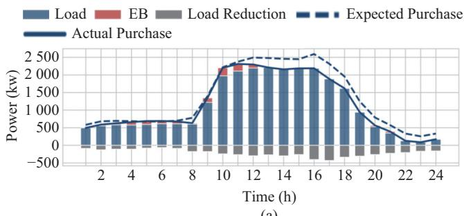  
(a)

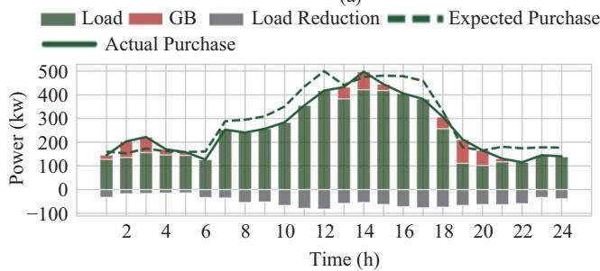  
(b)

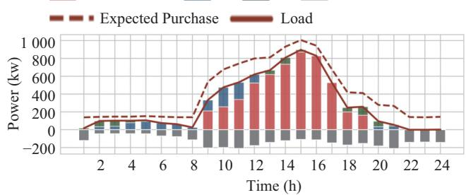  
(c)  
Fig. C1. Energy consumption strategies of UA-2. (a) Electricity consumption. (b) Gas consumption. (c) Heat consumption.

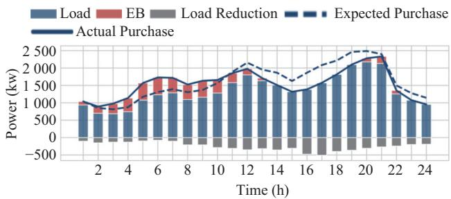  
(a)

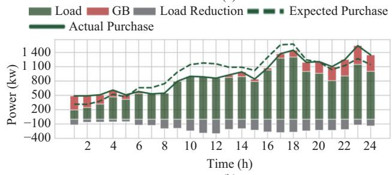  
(b)

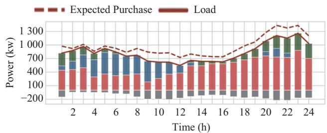  
(c)  
Fig. C2. Energy consumption strategies of UA-3. (a) Electricity consumption. (b) Gas consumption. (c) Heat consumption.

TABLE CI  
COMPARISON OF UAS’ CONSUMPTION RESULTS

<table><tr><td rowspan="2">UA</td><td rowspan="2">Result</td><td rowspan="2">Total Cost (¥)</td><td rowspan="2">Penalty (¥)</td><td colspan="2">Load reduction ratio (%)</td><td rowspan="2">Heat</td></tr><tr><td>Electricity</td><td>Natural gas</td></tr><tr><td rowspan="2">1</td><td> $a^*$ </td><td>35174.6</td><td>3667.7</td><td>17.53</td><td>16.90</td><td>15.15</td></tr><tr><td> $b^*$ </td><td>34516.5</td><td>4258.3</td><td>19.88</td><td>21.18</td><td>19.50</td></tr><tr><td rowspan="2">2</td><td> $a^*$ </td><td>35344.1</td><td>3562.0</td><td>15.79</td><td>19.36</td><td>14.49</td></tr><tr><td> $b^*$ </td><td>34637.2</td><td>4390.5</td><td>17.92</td><td>24.25</td><td>21.07</td></tr><tr><td rowspan="2">3</td><td> $a^*$ </td><td>21566.7</td><td>2329.9</td><td>14.22</td><td>17.85</td><td>31.20</td></tr><tr><td> $b^*$ </td><td>20987.4</td><td>2868.9</td><td>19.41</td><td>22.37</td><td>45.05</td></tr></table>

<sup>∗</sup>a represents the results of Stackelberg equilibrium;  
b represents the example result of 1621 episode when seed = 3.

## D. Effect of the Proposed Penalty Function

Natural gas and heat pricing strategies with different k are shown in Fig. D1 and Fig. D2.

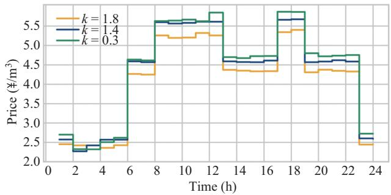  
Fig. D1. Natural gas pricing strategies with different k.

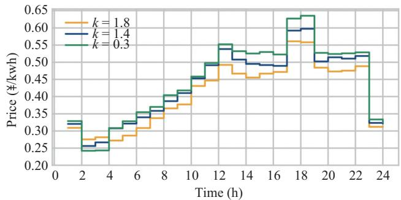  
Fig. D2. Heat pricing strategies with different k.

## REFERENCES

[1] X. Zhu, J. Yang, Y. Liu, C. Liu, B. Miao, and L. Chen, “Optimal scheduling method for a regional integrated energy system considering joint virtual energy storage,” IEEE Access, vol. 7, pp. 138260–138272, Sep. 2019, doi: 10.1109/ACCESS.2019.2942198.

[2] Y. Xiang, M. Q. Fang, J. Y. Liu, P. L. Zeng, P. Xue and G. Wu, “Distributed dispatch of multiple energy systems considering carbon trading,” CSEE Journal of Power and Energy Systems, vol. 9, no. 2, pp. 459–469, Mar. 2023, doi: 10.17775/CSEEJPES.2021.09050.

[3] Y. Z. Wang, C. W. Jiang, F. S. Wen, Y. S. Xue, F. Chen, L. J. Zhang, and X. Yuan, “Energy trading and management strategies in a regional integrated energy system with multiple energy carriers and renewableenergy generation,” Journal of Energy Engineering, vol. 147, no. 1, pp. 04020076, Feb. 2021, doi: 10.1061/(ASCE)EY.1943-7897.0000726.

[4] B. Miao, J. Y. Lin, H. Li, C. Liu, B. Li, X. Zhu, and J. Yang, “Day-ahead energy trading strategy of regional integrated energy system considering energy cascade utilization,” IEEE Access, vol. 8, pp. 138021–138035, Jul. 2020, doi: 10.1109/ACCESS.2020.3007224

[5] M. Alipour, K. Zare, and H. Seyedi, “A multi-follower bilevel stochastic programming approach for energy management of combined heat and power micro-grids,” Energy, vol. 149, pp. 135–146, Apr. 2018, doi: 10 .1016/j.energy.2018.02.013.

[6] Y. Z. Wang, K. Y. Pang, F. S. Wen, Y. S. Xue, Y. K. Sun, and M. J. Gao, “Regional energy pricing and management strategies for promoting userside energy transition,” Automation of Electric Power Systems, vol. 44, no. 16, pp. 21–29, Aug. 2020, doi: 10.7500/AEPS20200327001.

[7] Q. Peng et al., “Hybrid energy sharing mechanism for integrated energy systems based on the Stackelberg game,” CSEE Journal of Power and Energy Systems, vol. 7, no. 5, pp. 911–921, Sep. 2021, doi: 10.17775/C SEEJPES.2020.06500.

[8] M. M. Yu and S. H. Hong, “Incentive-based demand response considering hierarchical electricity market: a Stackelberg game approach,” Applied Energy, vol. 203, pp. 267–279, Oct. 2017, doi: 10.1016/j.apen ergy.2017.06.010.

[9] Q. Lu, S. K. Lu, and Y. J. Leng, “A Nash-Stackelberg game approach in¨ regional energy market considering users’ integrated demand response,” Energy, vol. 175, pp. 456–470, May 2019, doi: 10.1016/j.energy.2019. 03.079.

[10] Y. Kuang, X. L. Wang, J. X. Wang, Q. Peng, H. Y. Zhao, and X. F. Wang, “Virtual power plant energy sharing mechanism based on Stackelberg game,” Power System Technology, vol. 44, no. 12, pp. 4556–4564, Dec. 2020, doi: 10.13335/j.1000-3673.pst.2020.0683.

[11] L. Dong, M. T. Li, J. J. H, S. Chen, T. Zhang, X. Y. Wang, and T. J. Pu, “Hierarchical game approach for optimization of regional integrated energy system clusters considering bounded rationality,” CSEE Journal of Power and Energy Systems, vol. 10, no. 1, pp. 302–313, Jan. 2024.

[12] Z. Wang, L. H. Wang, Z. M. Li, X. G. Cheng, and Q. Q. Li, “Optimal distributed transaction of multiple microgrids in grid-connected and islanded modes considering unit commitment scheme,” International Journal of Electrical Power & Energy Systems, vol. 132, pp. 107146, Nov. 2021, doi: 10.1016/j.ijepes.2021.107146.

[13] H. Y. Wang, C. H. Zhang, K. Li, S. Liu, S. Z. Li, and Y. Wang, “Distributed coordinative transaction of a community integrated energy system based on a tri-level game model,” Applied Energy, vol. 295, pp. 116972, Aug. 2021, doi: 10.1016/j.apenergy.2021.116972.

[14] A. T. D. Perera and P. Kamalaruban, “Applications of reinforcement learning in energy systems,” Renewable and Sustainable Energy Reviews, vol. 137, pp. 110618, Mar. 2021, doi: 10.1016/j.rser.2020.110618.

[15] D. Cao, W. H. Hu, J. B. Zhao, G. Z. Zhang, B. Zhang, Z. Liu, Z. Chen, and F. Blaabjerg, “Reinforcement learning and its applications in modern power and energy systems: a review,” Journal ofModern Power Systems and Clean Energy, vol. 8, no. 6, pp. 1029–1042, Nov. 2020, doi: 10.35833/MPCE.2020.000552.

[16] C. Y. Guo, X. Wang, Y. Z. Zheng, and F. Zhang, “Real-time optimal energy management of microgrid with uncertainties based on deep reinforcement learning,” Energy, vol. 238, pp. 121873, Jan. 2022, doi: 10.1016/j.energy.2021.121873.

[17] Y. Li, C. L. Wang, G. Q. Li, J. L. Wang, D. B. Zhao, and C. Chen, “Improving operational flexibility of integrated energy system with uncertain renewable generations considering thermal inertia of buildings,” Energy Conversion and Management, vol. 207, pp. 112526, Mar. 2020, doi: 10.1016/j.enconman.2020.112526.

[18] V. H. Bui, A. Hussain, and H. M. Kim, “Double deep Q-learningbased distributed operation of battery energy storage system considering uncertainties,” IEEE Transactions on Smart Grid, vol. 11, no. 1, pp. 457– 469, Jun. 2020, doi: 10.1109/TSG.2019.2924025.

[19] Z. M. Li, L. Wu, Y. Xu, S. Moazeni, and Z. Tang, “Multi-stage real-time operation of a multi-energy microgrid with electrical and thermal energy storage assets: a data-driven MPC-ADP approach,” IEEE Transactions on Smart Grid, vol. 13, no. 1, pp. 213–226, Jan. 2022, doi: 10.1109/TS G.2021.3119972.

[20] D. Cao, J. B. Zhao, W. H. Hu, F. Ding, Q. Huang, Z. Chen, and F. Blaabjerg. (2020, Jun.). Model-free voltage regulation of unbalanced distribution network based on surrogate model and deep reinforcement learning. [Online]. Available: https://arxiv.org/abs/2006.13992.

[21] H. P. Li, Z. Q. Wan, and H. B. He, “Real-time residential demand response,” IEEE Transactions on Smart Grid, vol. 11, no. 5, pp. 4144– 4154, Sep. 2020, doi: 10.1109/TSG.2020.2978061.

[22] S. Lee and D. H. Choi, “Dynamic pricing and energy management for profit maximization in multiple smart electric vehicle charging stations: a privacy-preserving deep reinforcement learning approach,” Applied Energy, vol. 304, pp. 117754, Dec. 2021, doi: 10.1016/j.apenergy.202 1.117754.

[23] Y. Du and F. X. Li, “Intelligent multi-microgrid energy management based on deep neural network and model-free reinforcement learning,” IEEE Transactions on Smart Grid, vol. 11, no. 2, pp. 1066–1076, Mar. 2020, doi: 10.1109/TSG.2019.2930299.

[24] Z. M. Qin, D. Liu, H. C. Hua, and J. W. Cao, “Privacy preserving load control of residential microgrid via deep reinforcement learning,” IEEE Transactions on Smart Grid, vol. 12, no. 5, pp. 4079–4089, Sep. 2021, doi: 10.1109/TSG.2021.3088290.

[25] Y. F. Zhang, Q. Ai, and Z. Y. Li, “Intelligent demand response resource trading using deep reinforcement learning,” CSEE Journal of Power and Energy Systems, vol. 10, no. 6, pp. 2621–2630, Nov. 2024, doi: 10.177 75/CSEEJPES.2020.05540.

[26] Y. T. Wang, Z. Yang, L. Dong, S. W. Huang, and W. Zhou, “Energy management of integrated energy system based on stackelberg game and deep reinforcement learning,” in Proceedings of 2020 IEEE 4th Conference on Energy Internet and Energy System Integration (EI2), 2020, pp. 2645–2651, doi: 10.1109/EI250167.2020.9346692.

[27] Q. Z. Zhang, K. Dehghanpour, Z. Y. Wang, and Q. H. Huang, “A learning-based power management method for networked microgrids under incomplete information,” IEEE Transactions on Smart Grid, vol. 11, no. 2, pp. 1193–1204, Mar. 2020, doi: 10.1109/TSG.2019.2933502.

[28] J. Schulman, F. Wolski, P. Dhariwal, A. Radford, and O. Klimov. (2017, Aug.). Proximal policy optimization algorithms. [Online]. Available: https://arxiv.org/abs/1707.06347.


Xiong Wu received the B.S. degree in Electrical Engineering from Zhejiang University, Hangzhou, China, in 2009, and the M.S. and Ph.D. degrees from the School of Electrical Engineering, Xi’an Jiaotong University, Xi’an, China, in 2012 and 2016, respectively, where he is currently an Associate Professor. His research interests are microgrid operation and planning, power market, and power system optimization.


Bingwen Liu received the B.S. degree in Electrical Engineering from North China Electric Power University, Beijing, China, in 2020. He is currently pursuing the M.S. degree in Electrical Engineering with the School of Electrical Engineering, Xi’an Jiaotong University, Xi’an, China. His research interests are integrated energy system and power system optimization.

Shengqi Yuan received the B.S. degree in Electrical Engineering from North China Electric Power University, China, in 2020, and currently pursuing M.S. degrees from the School of Electrical Engineering, Xi’an Jiaotong University, Xi’an, China. His research interests includes power system operation and planning, microgrid optimization, and electric vehicles operation.

Binrui Cao received the B.S. degree in Electrical Engineering and Automation from Wuhan University, Wuhan, china, in 2021. He is currently purchasing the Ph.D. degree in Electrical Engineering with Xi’an Jiaotong University. His research interests are microgrid operation and planning, and power system optimization.

Ziyu Zhang received the B.S. degree in Electrical Engineering from Wuhan University, Wuhan, China, in 2018. He is currently working toward the M.S. degree with the Department of Electrical Engineering, Xi’an Jiaotong University, Xi’an, China. His research interests include the coordinated operation and analysis in integrated energy systems.

Yanhong Hu received the B.S. degree in Electrical Engineering from Southeast University, Nanjing, China, in 2017. She is currently working toward the M.S. degree with the Department of Electrical Engineering, Xi’an Jiaotong University, Xi’an, China. Her research interests include optimal scheduling and day ahead bidding of aggregated electric vehicles.