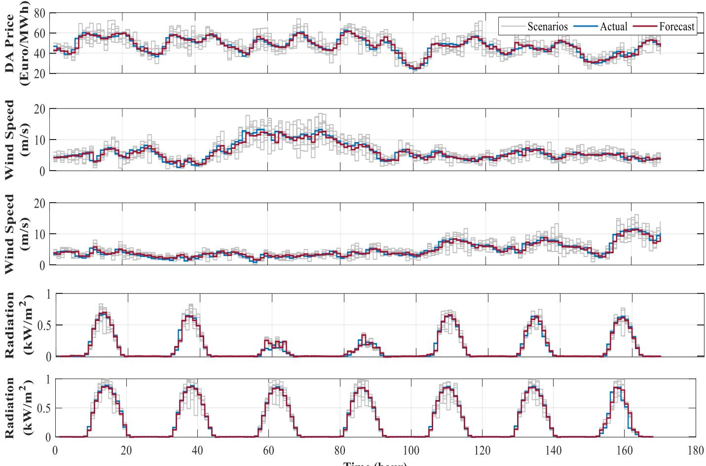
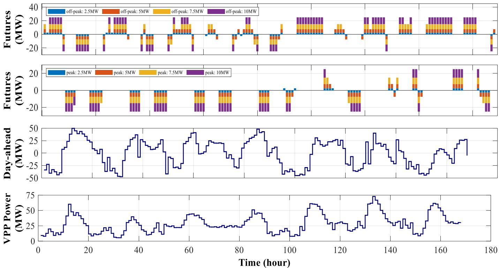

# Virtual power plant participation in day-ahead and futures markets using a deep learning approach

Farzin Ghasemi Olanlari Electrical Engineering Department K.N. Toosi University of Technology Tehran, Iran Email: f\_ghasemi@email.kntu.ac.ir

Mohammad Fazel Dehghanniri Electrical Engineering Department K.N. Toosi University of Technology Tehran, Iran Email: f.dehghanniri@email.kntu.ac.ir

Turaj Amraee Electrical Engineering Department K.N. Toosi University of Technology Tehran, Iran Email: amraee@kntu.ac.ir

Abstract—This paper models a virtual power plant (VPP) with high-penetration of distributed energy resources (DERs) to participate in the day ahead (DA) and futures markets and bilateral contracts with the aim of maximizing its profit. A twostage stochastic optimization problem is developed that in the first stage, the VPP operator participates in the futures market and signs bilateral contracts. The VPP will participate in the DA market and supply its electrical loads in the second stage. The uncertainty parameters of the problem, including the DA market price, wind speed, and solar radiation, are first forecasted using the Long Short Term Memory (LSTM) neural network. Then the scenario generation and reduction method is used to cover the uncertainties in the predicted data. The problem has been simulated in three different cases, which indicate a significant increase in the profit of the VPP.

## NOMENCLATURE

Keywords—Virtual power plant, futures market, bilateral contracts, LSTM neural network

Parameters $C a p ^ { D E R }$ Capacity of each DER (MW) $L C O E ^ { D E R }$ Levelized cost of energy (€/��ℎ) $L o a d _ { t , s }$ VPP electrical load (MW) ��,��� maximum volume that can be sold in the bilateral contract (MW) $P _ { c , k } ^ { D X , m a x }$ maximum tradable power in each block of futures market contracts (MW) $T C _ { c , t }$ a binary matrix of which zero elements force futures market contract c not to be selected $\lambda ^ { B L }$ Sale price of bilateral contracts (€/MWh) $\lambda _ { c , k } ^ { D X , s e l l / b u y }$ Energy price of selling/buying block in futures market (€/��ℎ) $\lambda _ { \mathrm { { s } } } ^ { D A }$ Day ahead (DA) market price (€/��ℎ) $\lambda _ { \mathrm { { c } } } ^ { \mathrm { { } } }$ Retail rate of electricity (€/��ℎ) $\pi _ { s }$ Probability of each scenario $\Delta t$ Duration of time period (one hour) $T$ Horizon time (7 days or 168 hours) $a , b$ DG/ESS cost coefficients (€/��ℎ), (€/ℎ)

$$
P ^ {B L}
$$

$$
P _ {c, k, t} ^ {D X, s e l l / b u y}
$$

$$
P _ {s} ^ {D A}
$$

$$
P _ {t s} ^ {D E R}
$$

$$
P _ {t, s} ^ {V P P}
$$

Power of bilateral contract (MW) Power bought/sold in futures market (MW)

$$
P _ {t, s} ^ {e s s, d c h / c h}
$$

$$
u _ {t, s} ^ {d g}
$$

$$
u _ {c, k, t} ^ {D X, s e l l / b u y}
$$

Power traded in DA market (MW) Power of DER units (MW) Equivalent power of VPP (MW) Discharging/charging power of ESS (MW)

���,��ℎ/�ℎ � $x ^ { B L }$ ���

Binary variable, 1 if ESS is discharging/charging otherwise is 0 Percentage of distribution network load that the VPP is willing to supply. Binary variable, 1 if DER is chosen to participate in markets otherwise is 0

## I. INTRODUCTION

Increasing the penetration of DERs in the distribution network can participate in supplying the growing electric demand and reduce air pollution. DERs, especially renewable power plants, due to their unpredictable power generation, cause fluctuations in the distribution network, which threatens the safe operation of this network. Furthermore, due to DERs small scale capacity, these resources cannot participate in the wholesale electricity markets, which makes them lose significant profits. To address these challenges, DERs must be integrated and optimally scheduled. The concept of VPP is one of the practical solutions for managing and planning these resources. The VPP optimally schedules DERs and participates in electricity markets as a highcapacity power plant. In addition to the DA market, the VPP can participate in other markets such as the futures market and sell electricity through bilateral contracts [1]. According to futures market contracts, electricity is traded at today's prices and generated or delivered in the future. This market's contract period varies from one week to one year. To mitigate the risk of DA market price fluctuations, the VPP participates in the futures market. The VPP also earns profit from the price difference between these two markets [2]. In bilateral contracts, the seller and the buyer agree to trade a certain amount of electric power at a fixed price [3]. In the following, we will review some previous research works related to the VPP operation and scheduling.

In [4], a multi-stage model is formulated for VPP scheduling. The VPP is responsible for optimizing the power exchanged between micro-grids and participating in the DA market. In [5] a stochastic bi-level VPP framework is proposed, in which the profit of the VPP is maximized in the first level, and the cost of electric vehicle (EV) drivers is minimized in the second level. The VPP operator participates in the DA and spinning reserve markets using the EVs. In [6], a risk constrained two-stage problem is modeled in the context of a VPP. The VPP attempts to increase its profit by participating in the DA, real-time (RT), and spinning reserve markets. Each of these research works models the VPP's participation in several electricity markets, but none of them models the VPP's participation in the futures market or bilateral contracts.

In [3], a commercial VPP (CVPP) is proposed to participate in the DA, and futures markets using a two stage model. In [3], the possibility of signing bilateral contracts by a VPP is considered. Authors in [7] have developed a longterm stochastic problem in the context of a VPP. In [7], the VPP increases its profit by participating in futures market auctions. Technical aspect of the VPP, which includes the supply of its loads, has not been investigated.

As there are several uncertain parameters in VPP problems, modeling these parameters is essential. There are several approaches for dealing with the uncertainty of these parameters, such as the point estimate method (PEM) [8], robust optimization [9], and scenario generation [10]. To cover uncertainties, each of these methods requires forecasted data. As a result, it is necessary to forecast the future trends using actual historical data and then cover the uncertainty with this forecasted data.

According to the aforementioned research gaps, the contributions of this article are as follows:

Modeling a commercial and technical VPP in a stochastic two-stage problem over one week with the ability to participate in the DA and futures markets and bilateral contracts.

 Use an LSTM neural network to predict future data and a scenario generation and reduction method to cover uncertainties.

To bring simulation results closer to reality, use actual data from Spanish electricity markets and meteorological data from a Texas Brownfield station.

## II. VPP FRAMEWORK

In this paper, a VPP including wind power plant (WPP), photovoltaic (PV), distributed generation (DG), energy storage systems (ESS), flexible load (FL), and non-flexible loads is developed and VPP has two units from each element. Due to the high penetration of DERs, the capacity of the VPP is more than its electricity demand. Therefore, the VPP operator decides to devote part of its power to bilateral contracts and use the rest to participate in the DA and futures markets as a price-taker. In the first stage, the VPP operato selects a number of its DERs to participate in the futures market and bilateral contracts based on the Levelized Cost of Energy (LCOE). In the second stage, the VPP operator participates in the DA market. At this stage, the VPP is also supplying its load with DERs that have not been selected to participate in the markets.

## III. UNCERTAINTY MODELING

The DA market price, electrical load, wind speed, and solar radiation are among the uncertainty parameters considered in this paper. To forecast the data, the LSTM neural network is utilized due to its memory and ability to solve the gradient vanishing problem; this neural network is one of the deep recurrent neural networks (RNN) with a high ability to forecast time series [11]. First, the LSTM neural network is used to predict the actual data from 2018 to 2020. After obtaining the forecasted data for each uncertainty parameter, the scenario generation method is used. The generated scenarios are combined and reduced using the Backward method [12]. It should be noted that the VPP's electrical load data were not forecasted due to a lack of historical data, but the scenario generation and reduction method was applied to them.

## IV. FORMULATION

The proposed problem, along with its constraints, is formulated as follows.

$$
\left[ \left(R ^ {B L} + R ^ {D X} - B ^ {D G} - B ^ {W P P} - B ^ {P V} - B ^ {E S S} - B ^ {F L}\right) \right]\tag{1}
$$

$$
\max \left| + \left(\sum_ {s} \pi_ {s} \times \left(R _ {s} ^ {D A} + R _ {s} ^ {R e t a i l} - C _ {s} ^ {D G} - C _ {s} ^ {E S S}\right)\right) \right.
$$

$$
R ^ {B L} = P ^ {B L} \times \lambda^ {B L} \times T\tag{2}
$$

$$
R ^ {D X} = \sum_ {c} \sum_ {k} \sum_ {t} \left(P _ {c, k, t} ^ {D X, s e l l} \times \lambda_ {c, k} ^ {D X, s e l l} - P _ {c, k, t} ^ {D X, b u y}\right)\tag{3}
$$

$$
\left. \times \lambda_ {c, k} ^ {D X, b u y}\right) \times \Delta t
$$

$$
B ^ {D E R} = \sum_ {D E R} x ^ {D E R} \times C a p ^ {D E R} \times L C O E ^ {D E R} \times T,\tag{4}
$$

$$
D E R = \overline {{\{D G , W P P , P V , E S S , F L \}}}
$$

$$
R _ {s} ^ {D A} = \sum_ {t} P _ {s} ^ {D A} \times \lambda_ {s} ^ {D A} \times \Delta t\tag{5}
$$

$$
R _ {s} ^ {R e t a i l} = \sum_ {t} L o a d _ {t, s} \times \lambda_ {s} ^ {R e t a i l} \times \Delta t\tag{6}
$$

$$
C _ {s} ^ {D G} = \sum_ {d g} \sum_ {t} ^ {t} a ^ {d g} \times P _ {t, s} ^ {D G} + b ^ {d g} \times (x ^ {d g} + u _ {t, s} ^ {d g})\tag{7}
$$

$$
C _ {s} ^ {E S S} = \sum_ {e s s} ^ {a g} \sum_ {t} ^ {t} a ^ {e s s} \times \left(P _ {t, s} ^ {e s s, d c h} + P _ {t, s} ^ {e s s, c h}\right) + b ^ {e s s}\tag{8}
$$

$$
\times \left(u _ {t. s} ^ {e s s, d c h} + u _ {t. s} ^ {e s s, c h}\right)
$$

Equations (1)−(8) are related to the problem's objective function. The main objective function is given in (1). The first part of the objective function is related to the first stage's decision variables, and the second part is related to the second stage's decision variables. In the first part of this objective function, the VPP operator signs its futures market and bilateral contracts. This part is scenario-independent and does not change when the values of the uncertainty parameters are changed. The variables in this part are the profit gained from bilateral contracts, the profit from the futures market, and the cost of capacity renting of DERs, respectively. The second part of (1) gives the decision variables depending on the scenarios. The variables of (1) are the profit of the DA market, the retail profit of the VPP, the operating cost of DGs, and the degradation cost of ESS, respectively. The formulation of each objective function variable is given in (2)−(8). Equation (3) represents the amount of profit earned from futures market contracts. The futures market has two types of contracts: peak and off-peak, and participants can sign contracts at specific times. Each contract in this market includes four price blocks, which in the case of buying/selling electricity, can change in an ascending/descending manner with a rate of 2 percent compared to the previous block. Each of these blocks has a specific electrical power. This paper considers the values of 2.5, 5, 7.5, and 10 MW for blocks 1 to 4, respectively. Equation (4) represents the capacity renting cost of all DERs together.

$$
\begin{array}{r l} & P _ {t, s} ^ {V P P} = \sum_ {w p p} x ^ {w p p} \times P _ {t, s} ^ {w p p} + \sum_ {p v} x ^ {p v} \times P _ {t, s} ^ {p v} \\ & \qquad + \sum_ {e s s} x ^ {e s s} \times P _ {t, s} ^ {e s s} + \sum_ {d g} x ^ {d g} \times P _ {t, s} ^ {d g} \\ & \qquad + \sum_ {f l} x ^ {f l} \times P _ {t, s} ^ {f l} \\ & P _ {t, s} ^ {V P P} - P ^ {B L} = P _ {t, s} ^ {D A} + \sum_ {c} \sum_ {k} \left(P _ {c, k, t} ^ {D X, s e l l} - P _ {c, k, t} ^ {D X, b u y}\right) \end{array}\tag{9}
$$

(10)

  
Fig. 1. Actual data, forecasted data and generated scenarios for uncertain parameters.

$$
\sum_ {w p p} (1 - x ^ {w p p}) \times P _ {t, s} ^ {w p p} + \sum_ {p v} (1 - x ^ {p v}) \times P _ {t, s} ^ {p v}\tag{11}
$$

$$
\begin{array}{r l} & + \sum_ {e s s} (1 - x ^ {e s s}) \times P _ {t, s} ^ {e s s} \\ & + \sum_ {d g} (1 - x ^ {d g}) \times P _ {t, s} ^ {d g} \\ & + \sum_ {f l} (1 - x ^ {f l}) \times P _ {t, s} ^ {f l} = L o a d _ {t, s} \end{array}
$$

$$
P _ {t, s} ^ {e s s} = P _ {t, s} ^ {e s s, d c h} - P _ {t, s} ^ {e s s, c h}\tag{12}
$$

$$
P ^ {B L} = x ^ {B L} \times P ^ {B L, m a x}\tag{13}
$$

$$
P ^ {B L} \leq \sum_ {w p p} x ^ {w p p} \times C a p ^ {w p p} + \sum_ {p v} x ^ {p v} \times C a p ^ {p v}\tag{14}
$$

$$
\begin{array}{l} + \sum_ {e s s} x ^ {e s s} \times C a p ^ {e s s} \\ + \sum_ {d g} x ^ {d g} \times C a p ^ {d g} \\ + \sum_ {f l} x ^ {f l} \times C a p ^ {f l} \end{array}
$$

$$
P _ {c, k, t} ^ {D X, s e l l} = u _ {c, k, t} ^ {D X, s e l l} \times P _ {c, k} ^ {D X, m a x}\tag{15}
$$

$$
P _ {c, k, t} ^ {D X, b u y} = u _ {c, k, t} ^ {D X, b u y} \times P _ {c, k} ^ {D X, b u y}\tag{16}
$$

$$
u _ {c, k, t} ^ {D X, s e l l} \leq T C _ {c, t}\tag{17}
$$

$$
u _ {c, k, t} ^ {D X, b u y} \leq T C _ {c, t}
$$

$$
u _ {c, k, t} ^ {D X, s e l l} + u _ {c, k, t} ^ {D X, b u y} \leq 1\tag{18}
$$

(19)

Equations (9)−(11) are related to the problem's constraints. Equation (9) determines the VPP's capacity to participate in the aforementioned markets. According to (10), the amount of power of a VPP minus the amount of power required for bilateral contracts must equal the amount of power exchanged in the DA and futures markets. Equation (11) also shows that units not chosen to participate in the electricity market must supply the VPP's electrical load. According to (12), the ESS output power equals the discharged power minus the charging power. Equations (13) and (14) are related to bilateral contracts. In (13), the VPP decides how much it will supply the load through a bilateral contract. Equation (14) also demonstrates that the amount of bilateral contracts cannot exceed the total capacity of VPP units. Equations (15) to (19) relate to the futures market. Equations (15) and (16) determine the sale/bought power in each contract. Equations (17) and (18) demonstrate that each peak and the off-peak contract can sell or buy at specific hours. Equation (19) shows that a VPP cannot sign a sell or buy the contract simultaneously.

TABLE I. The simulation results include the amount of power in bilateral contract, DERs candidate to participate in the markets, and overall profit of the VPP.

<table><tr><td rowspan="2">Cases</td><td rowspan="2"> $P^{BL}$ (MW)</td><td colspan="10">DER candidates</td><td rowspan="2">VPP net Profit(€)</td></tr><tr><td>WPP1</td><td>WPP2</td><td>PV1</td><td>PV2</td><td>ESS1</td><td>ESS2</td><td>DG1</td><td>DG2</td><td>FL1</td><td>FL2</td></tr><tr><td>1</td><td>-</td><td>√</td><td>√</td><td></td><td></td><td></td><td></td><td>√</td><td>√</td><td>√</td><td>√</td><td>43971.9</td></tr><tr><td>2</td><td>38.1</td><td>√</td><td>√</td><td>√</td><td>√</td><td></td><td></td><td>√</td><td>√</td><td>√</td><td>√</td><td>87347.9</td></tr><tr><td>3</td><td>28</td><td>√</td><td>√</td><td>√</td><td>√</td><td></td><td></td><td></td><td>√</td><td></td><td></td><td>320776.4</td></tr></table>

  
Fig. 2. VPP power exchange in futures and day-ahead electricity markets and amount of power generated by VPP's DERs.

Other DERs constraints such as DGs, ESS, and FL, are discussed in [3], [13]. Also, the constraints related to linearization of multiplication of binary variables in nonnegative continuous variables are given in [14].

## V. NUMERICAL RESULTS

## A. Data

This article uses the DA market price in the Spanish electricity market [15]. In Texas, Brownfield Station data were also used for climatic information, including wind speed and solar radiation [16]. This hourly data is extracted from 2018 to 2020 and is given to the LSTM network for training. Finally, the data for the 49th week of 2020 (November 30 to December 6) for the DA market price, the 39th week (September 21-27), and the 49th of the same year for wind speed and solar radiation were chosen. It should be noted that the selection of weeks was done randomly. The futures market's reference price (first block) in peak and off-peak contracts is derived from the Spanish electricity market [15]. It should be noted that the buying and selling prices in the first block are assumed to be equal. Also, time intervals including hour 9 am to 12 am and 18 pm to 22 pm are designated as peak hours for peak contracts, and similarly, other hours are assigned to off-peak contracts. According to [17], the retail price of electricity in Spain is 202.4 €/MWh, while the energy price in bilateral contracts is 50 €/MWh. Toronto Electric Load from November 30 to December 6 has been used as a VPP load. It should be noted that due to the fit of the problem structure, its value has been scaled down as 1:1000. The LCOE of DERs is derived from [7], [18], and technical information of these units is derived from [3], [7]. The normal, Weibull, normal, and beta distribution functions are used to generate scenarios for electrical demand, wind speed, the DA market price, and solar radiation, respectively.

## B. Results

26280 data are collected and given to the LSTM neural network to forecast each uncertainty parameter. Training, validation, and test data account for 80, 10, and 10 percent of the total data, respectively. All data are normalized to their mean and standard deviation. Data from the previous 48 hours is used as input to forecast each hour of output. The mentioned neural network has one layer with 100 neurons. The Mini-batch technique is used to increase the speed of training, and L2 Regularization is used to prevent overfitting. TABLE III gives the error indicators for each of the uncertainty parameters. Fig. 1 also depicts the forecast results besides the actual data. Then, using the forecasted values, many scenarios are generated for each of the uncertainty parameters, and finally, these scenarios are reduced to 7 scenarios, and the most probable scenario is displayed as the output of the problem. The simulated problem is a mixedinteger linear programming (MILP) problem modeled in

TABLE II. Simulation results include DA market revenue, futures market contracts, bilateral contract revenue, retail revenue and DERs capacity renting cost.

<table><tr><td rowspan="2">Cases</td><td rowspan="2">DA revenue (€)</td><td colspan="2">Futures contracts (€)</td><td rowspan="2">Bilateral contract (€)</td><td rowspan="2">Retail revenue (€)</td><td rowspan="2">DERs capacity renting (€)</td></tr><tr><td>Off-peak</td><td>Peak</td></tr><tr><td>1</td><td>245098.9</td><td>-</td><td>-</td><td>-</td><td>-</td><td>-169547.3</td></tr><tr><td>2</td><td>25577</td><td>39564.5</td><td>-39455.1</td><td>320040</td><td>-</td><td>-226759.7</td></tr><tr><td>3</td><td>25698.9</td><td>39788.7</td><td>-39690.1</td><td>235200</td><td>262771.2</td><td>-181352.6</td></tr></table>

GAMS software and solved using CPLEX. The simulation is run on a system with 8GB of RAM and a 2.4 GHz CPU.

TABLE III. Error indicators of parameters with uncertainty in LSTM neural network

<table><tr><td>Error index</td><td>Market Price (€/MWh)</td><td>Wind speed (m/s)</td><td>Solar radiation (kW/m2)</td></tr><tr><td>RMSE</td><td>2.4771</td><td>0.9070</td><td>0.0359</td></tr><tr><td>MAE</td><td>1.7810</td><td>0.6613</td><td>0.0157</td></tr><tr><td>MAAPE</td><td>0.0593</td><td>0.1597</td><td>0.9188</td></tr></table>

\* RMSE = Root Mean Squared Error, MAE = Mean Absolute Error,  
MAAPE = Mean Arctangent Absolute Percentage Error

Three different cases were considered to examine the impact of the VPP in various electricity markets. The commercial VPP only participates in the DA market in the first case. In the second case, the commercial VPP participates in the futures market and bilateral contracts in addition to the DA market. In the third case, the VPP participates in various electricity markets and supplies electricity to its customers. TABLE I gives the results of these three cases. As reported in TABLE I, the total profit of the VPP in the second case is increased by approximately 98.6 percent compared to the first case, which shows the importance of power exchange in different electricity markets and taking advantage of the price difference in these markets. Furthermore, in the third case, compared to the second case, the VPP profit increased by approximately 267.2 percent, which shows the importance of supplying power to consumers due to the high retail price. TABLE I lists the DERs chosen to participate in the electricity markets. In the first case, DERs with lower LCOE are selected. In the second case, more units have chosen to participate in DA and future markets and bilateral contracts. In the third case, since the VPP operator's priority is to supply its electrical loads, it selects some units to supply them. As shown in TABLE I, dg1, fl1, and fl2 units were selected for supplying the load due to their high flexibility in generating electrical power. It should be noted that the LCOE and operating costs of the dg1 unit are higher than those of the dg2 unit. As a result, this unit was not chosen to participate in the electricity markets. Due to the high LCOE of ESS, they were not chosen to participate in the electricity markets in any of the cases. Furthermore, in the third case, the VPP provides about 56% of the distribution network load using a bilateral contract, which is less than the second case, considering that the load of the VPP is more important than the load of the distribution network. TABLE II contains more detailed information on VPP profits.

Fig. 2 depicts the results of power exchange with electricity markets and the amount of VPP generation. In the first three diagrams of Fig. 2, the positive value is equal to the amount of power sold, and the negative value is equal to the amount of power purchased from the market. The last diagram in Fig. 2 shows the amount of power generated per hour by the VPP's DERs. According to this figure, the VPP can buy power during the hours of 1 to 7 and 48 to 56 when the DA market price is low and sell power during the hours of 33 to 37 and 81 to 86 when the DA market price is high. Most of the time, the VPP appears as the seller in futures market off-peak contracts (1 to 7 and 95 to 104 hours). The reason for this is that the DA market price is lower than the futures market price during these hours, and as a result, the VPP sells its power in this market. Similarly, in the futures market peak contracts, the VPP acts as a power buyer for the most hours (33 to 36 and 81 to 84). At 12 o'clock, the VPP will generate approximately 60 MW and purchase 17.5 MW from the futures market, while the bilateral contract requires the VPP to supply 28 MW. The VPP sells the remaining power in the DA market due to its high price. Also, during other hours of the week, it is observed that the VPP buys power from one of the electricity markets and sells it in another market. In fact, the VPP uses the price difference between the two markets and increases its profit.

## VI. CONCLUSION

A two-stage stochastic optimization problem was modeled, including a commercial and technical VPP with high penetration of DERs. In addition to supplying its loads, the VPP operator intends to participate in the DA and futures market and bilateral contracts. To cover the uncertainties, first, the actual data of the uncertainty parameters are collected, and then these data are forecasted using the LSTM neural network. Then, the scenario generation and reduction method were performed on the forecasted data. The simulation results were evaluated in 3 different cases. These results show that the VPP increases its profit by about 98.6 percent by participating in futures market and bilateral contracts compared to the situation in the DA market only. The VPP operator will also increase its profit by 267.2 percent by supplying electricity to its consumers compared to the situation in which it participates only in the mentioned electricity markets. The participation of VPP in other electricity markets such as the reserve and real-time (RT) markets and considering the transmission network's constraints are considered as future research on this issue.

## REFERENCES

[1] N. Naval and J. M. Yusta, “Virtual power plant models and electricity markets - A review,” Renew. Sustain. Energy Rev., vol. 149, p. 111393, 2021, doi: 10.1016/j.rser.2021.111393.

[2] A. J. Conejo, R. García-Bertrand, M. Carrión, Á. Caballero, and A. de Andrés, “Optimal involvement in futures markets of a power producer,” IEEE Trans. Power Syst., vol. 23, no. 2, pp. 703–711, 2008, doi: 10.1109/TPWRS.2008.919245.

[3] M. Shabanzadeh, M. K. Sheikh-El-Eslami, and M. R. Haghifam, “A medium-term coalition-forming model of heterogeneous DERs for a commercial virtual power plant,” Appl. Energy, vol. 169, pp. 663–681, 2016, doi: 10.1016/j.apenergy.2016.02.058.

[4] F. Sheidaei and A. Ahmarinejad, “Multi-stage stochastic framework for energy management of virtual power plants considering electric vehicles and demand response programs,” Int. J. Electr. Power Energy Syst., vol. 120, p. 106047, Sep. 2020, doi: 10.1016/j.ijepes.2020.106047.

[5] H. Rashidizadeh-Kermani, M. Vahedipour-Dahraie, M. Shafie-khah, and P. Siano, “A stochastic short-term scheduling of virtual power plants with electric vehicles under competitive markets,” Int. J. Electr. Power Energy Syst., vol. 124, p. 106343, Jan. 2021, doi: 10.1016/j.ijepes.2020.106343.

[6] M. Vahedipour-Dahraie, H. Rashidizadeh-Kermani, M. Shafie-Khah, and J. P. S. Catalão, “Risk-Averse Optimal Energy and Reserve Scheduling for Virtual Power Plants Incorporating Demand Response Programs,” IEEE Trans. Smart Grid, vol. 12, no. 2, pp. 1405–1415, Mar. 2021, doi: 10.1109/TSG.2020.3026971.

[7] M. Jafari and A. Akbari Foroud, “A medium/long-term auction-based coalition-forming model for a virtual power plant based on stochastic programming,” Int. J. Electr. Power Energy Syst., vol. 118, no. September 2019, p. 105784, 2020, doi: 10.1016/j.ijepes.2019.105784.

[8] S. Naghdalian, T. Amraee, S. Kamali, and F. Capitanescu, “Stochastic Network-Constrained Unit Commitment to Determine Flexible Ramp Reserve for Handling Wind Power and Demand Uncertainties,” IEEE Trans. Ind. Informatics, vol. 16, no. 7, pp. 4580–4591, 2020, doi: 10.1109/TIL2019.2944234

[9] Z. Tan et al., “Dispatching optimization model of gas-electricity virtual power plant considering uncertainty based on robust stochastic optimization theory,” J. Clean. Prod., vol. 247, p. 119106, Feb. 2020, doi: 10.1016/j.jclepro.2019.119106.

[10] S. Hadayeghparast, A. SoltaniNejad Farsangi, and H. Shayanfar, “Dayahead stochastic multi-objective economic/emission operational scheduling of a large scale virtual power plant,” Energy, vol. 172, pp. 630–646, Apr. 2019, doi: 10.1016/j.energy.2019.01.143.

[11] A. Sagheer and M. Kotb, “Time series forecasting of petroleum production using deep LSTM recurrent networks,” Neurocomputing, vol. 323, pp. 203–213, Jan. 2019, doi: 10.1016/j.neucom.2018.09.082.

[12] Y. Xu, Z. Y. Dong, R. Zhang, and D. J. Hill, "Multi-Timescale Coordinated Voltage/Var Control of High Renewable-Penetrated Distribution Systems,” IEEE Trans. Power Syst., vol. 32, no. 6, pp. 4398–4408, 2017, doi: 10.1109/TPWRS.2017.2669343.

[13] A. G. Zamani, A. Zakariazadeh, and S. Jadid, “Day-ahead resource scheduling of a renewable energy based virtual power plant,” Appl. Energy, vol. 169, pp. 324–340, 2016, doi: 10.1016/j.apenergy.2016.02.011.

[14] “Linearization of the product of two variables - Prof. Leandro C. Coelho, Ph.D.” https://www.leandro-coelho.com/linearizationproduct-variables/ (accessed Dec. 10, 2021).

[15] “OMIP.” https://www.omip.pt/en/ (accessed Dec. 11, 2021).

[16] Institute National Wind, “West Texas Mesonet,” Institute National Wind, 2018. http://rain.ttu.edu/tech/1-output/mesonet.php (accessed Dec. 11, 2021).

[17] Statista, “Electricity prices by country 2020,” Statista.com, 2021. https://www.statista.com/statistics/263492/electricity-prices-inselected-countries/ (accessed Dec. 11, 2021).

[18] EIA, “Levelized Cost and Levelized Avoided Cost of New Generation Resources,” Annu. Energy Outlook 2019, no. February 2019, p. 25, 2019, [Online]. Available: http://www.eia.gov/forecasts/aeo/pdf/electricity generation.pdf