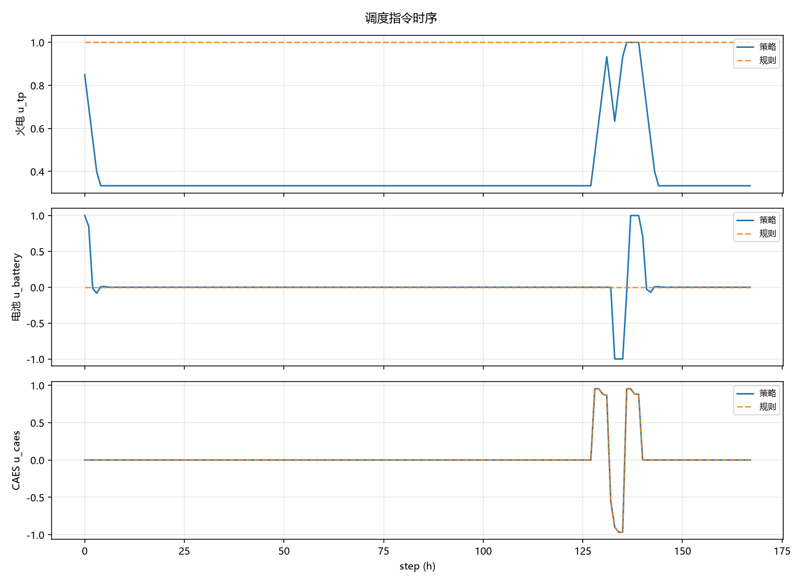
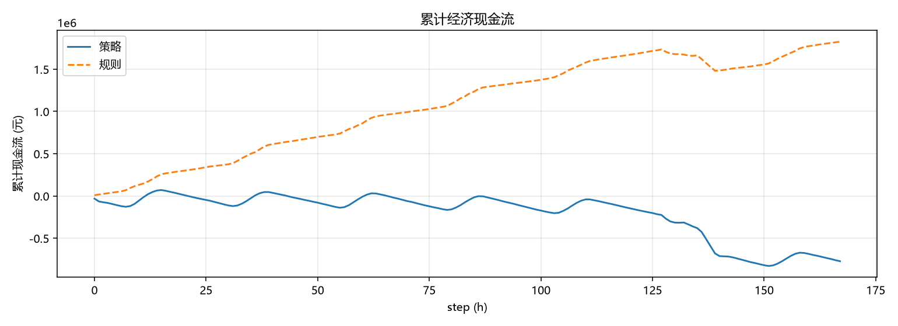
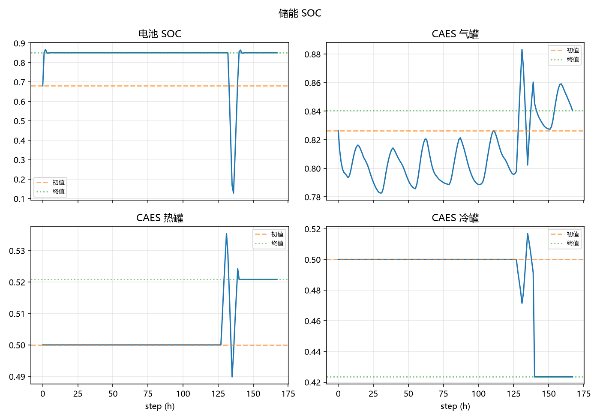

# 策略评估报告 · `fs_hsac_smoke`

- 算法 / 运行：`fs_hsac_v2`
- 状态：`completed`
- 有效训练步：`20`

## 1. 收益摘要（元）

| 对象 | 累计现金流 (元) | episode 奖励 |
|------|-----------------|-------------|
| 训练策略 | -772,017.44 | 100.91291641299281 |
| 规则基线 | 1,826,024.93 | 67.65149455062348 |
| 策略 − 规则 | -2,598,042.37 | — |

> 现金流取自 FMU `economic_cashflow_total`（评估窗口末值或窗口增量合计）。正值表示净收益。

## 2. 现金流分项

| 分项 | 策略 (元) | 规则 (元) |
|------|-----------|-----------|
| battery | -18,930.97 | 0.00 |
| caes | 17,025.00 | 17,025.00 |
| grid | -14,281,404.74 | -5,484,293.47 |
| load | 18,763,645.49 | 18,763,645.49 |
| pv | -1,296,581.09 | -1,296,581.09 |
| thermal | -3,862,000.12 | -10,080,000.00 |
| wind | -93,771.00 | -93,771.00 |

## 3. 运行质量

- 弃电能量：策略 `0.0` MWh，规则 `0.0` MWh
- 缺供能量：策略 `0.0` MWh，规则 `0.0` MWh
- 非法/失败步（策略）：forbidden=`0`，invalid=`0`
- GiveSafe 提案拒绝率：`0.0`

## 4. 策略行为摘要（评估窗口）

- 火电负荷率：均值 `0.383`，范围 `[0.333, 1.000]`
- 电池：充电 `20` h，放电 `12` h，待机 `136` h
- CAES：充电 `8` h，放电 `4` h，待机 `156` h

## 5. 图示

### 调度指令

### 累计现金流

### 储能 SOC

## 6. 原始产物

- [`summary.json`](../summary.json)
- [`trajectories/eval.csv`](../trajectories/eval.csv)
- [`trajectories/rule.csv`](../trajectories/rule.csv)
