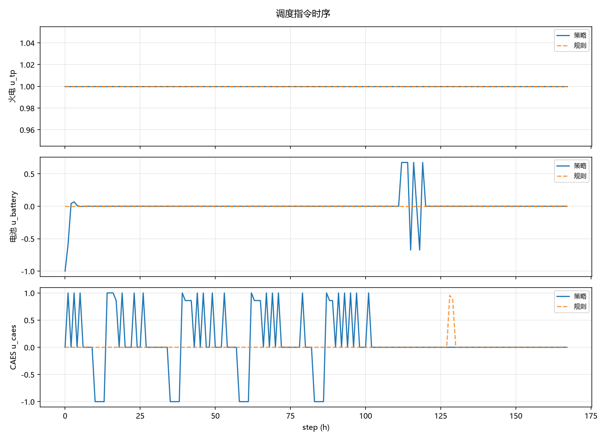
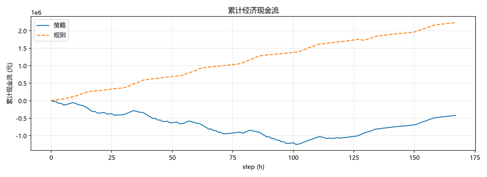
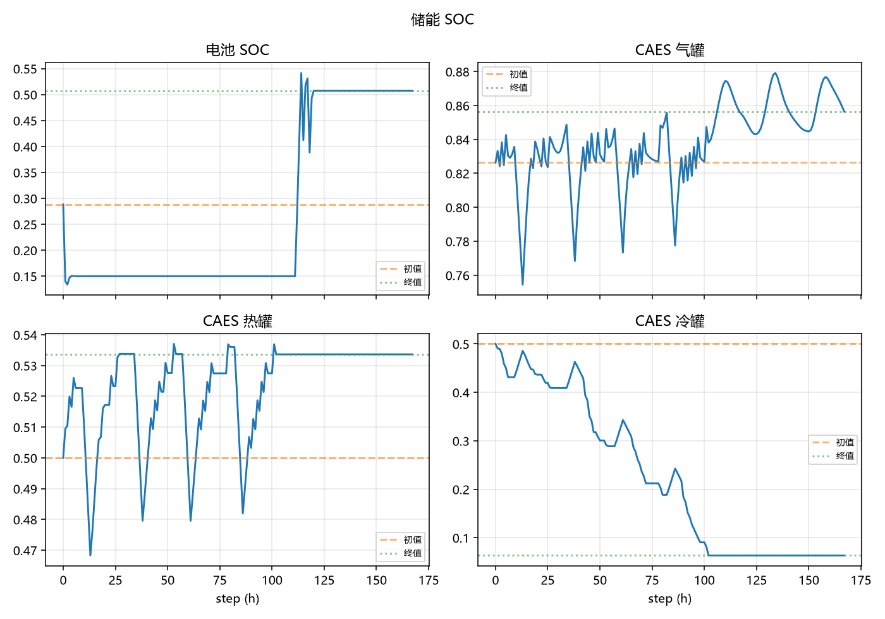

# 策略评估报告 · `givesafe_sac_15k_20260804`

- 算法 / 运行：`hybrid_givesafe_sac`
- 状态：`completed`
- 有效训练步：`15000`

## 1. 收益摘要（元）

| 对象 | 累计现金流 (元) | episode 奖励 |
|------|-----------------|-------------|
| 训练策略 | -420,893.49 | 64.65172515759852 |
| 规则基线 | 2,232,151.87 | 67.47903658558717 |
| 策略 − 规则 | -2,653,045.36 | — |

> 现金流取自 FMU `economic_cashflow_total`（评估窗口末值或窗口增量合计）。正值表示净收益。

## 2. 现金流分项

| 分项 | 策略 (元) | 规则 (元) |
|------|-----------|-----------|
| battery | -47,716.70 | 0.00 |
| caes | 22,200.00 | 55,065.00 |
| grid | -7,690,373.95 | -5,117,910.29 |
| load | 18,763,795.63 | 18,763,795.63 |
| pv | -1,297,513.60 | -1,297,513.60 |
| thermal | -10,080,000.00 | -10,080,000.00 |
| wind | -91,284.87 | -91,284.87 |

## 3. 运行质量

- 弃电能量：策略 `6.556510925292971e-13` MWh，规则 `0.0` MWh
- 缺供能量：策略 `0.0` MWh，规则 `0.0` MWh
- 非法/失败步（策略）：forbidden=`0`，invalid=`0`
- GiveSafe 提案拒绝率：`0.05314520139234212`

## 4. 策略行为摘要（评估窗口）

- 火电负荷率：均值 `1.000`，范围 `[1.000, 1.000]`
- 电池：充电 `11` h，放电 `8` h，待机 `149` h
- CAES：充电 `34` h，放电 `16` h，待机 `118` h

## 5. 图示

### 调度指令

### 累计现金流

### 储能 SOC

## 6. 原始产物

- [`summary.json`](../summary.json)
- [`trajectories/eval.csv`](../trajectories/eval.csv)
- [`trajectories/rule.csv`](../trajectories/rule.csv)
